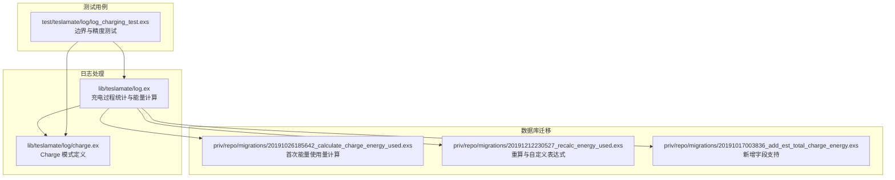
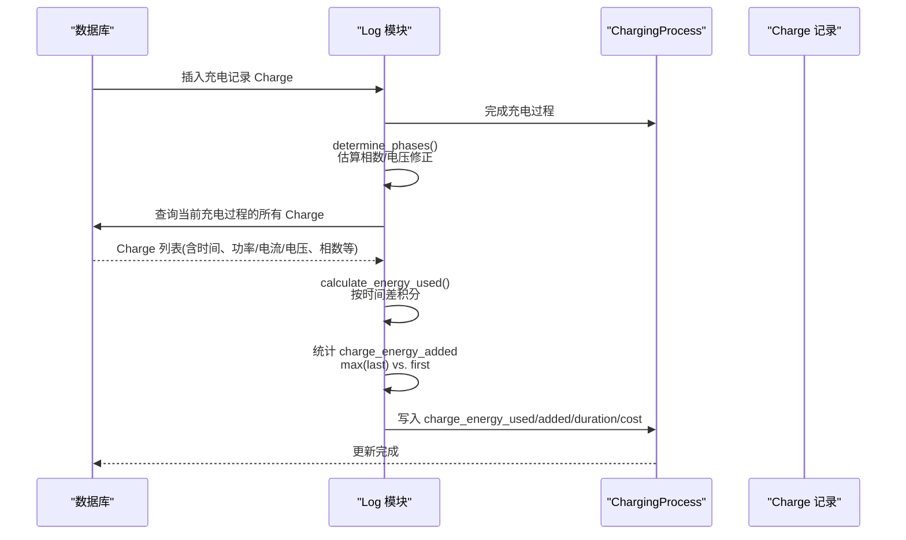
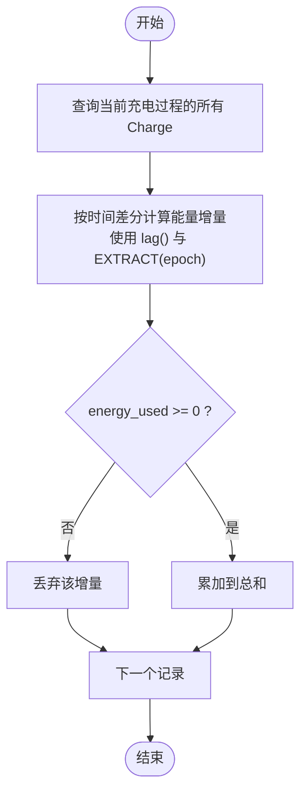
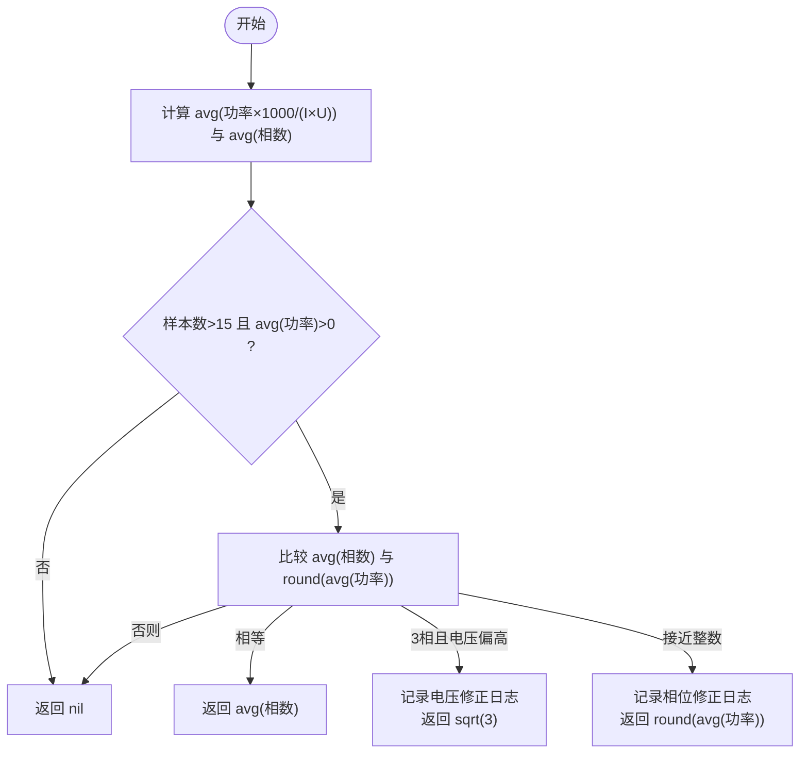
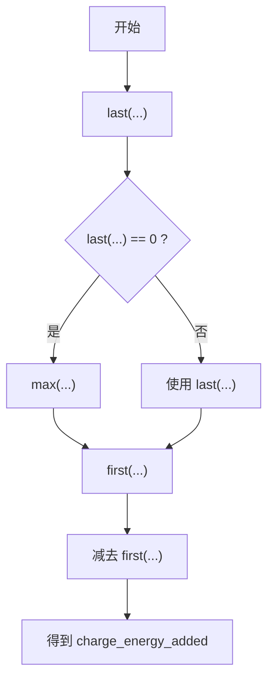
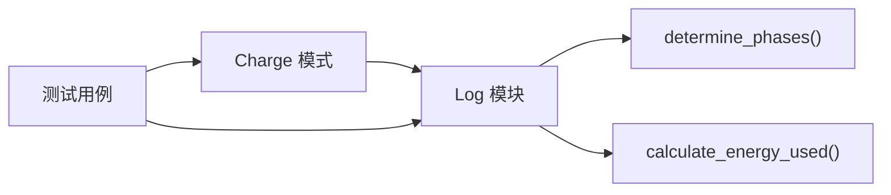

# 数据精度与边界情况处理

<cite>
**本文引用的文件**
- [log.ex](file://lib/teslamate/log.ex)
- [charge.ex](file://lib/teslamate/log/charge.ex)
- [calculate_charge_energy_used.exs](file://priv/repo/migrations/20191026185642_calculate_charge_energy_used.exs)
- [recalc_energy_used.exs](file://priv/repo/migrations/20191212230527_recalc_energy_used.exs)
- [add_est_total_charge_energy.exs](file://priv/repo/migrations/20191017003836_add_est_total_charge_energy.exs)
- [log_charging_test.exs](file://test/teslamate/log/log_charging_test.exs)
</cite>

## 目录
1. [简介](#简介)
2. [项目结构](#项目结构)
3. [核心组件](#核心组件)
4. [架构总览](#架构总览)
5. [详细组件分析](#详细组件分析)
6. [依赖关系分析](#依赖关系分析)
7. [性能考虑](#性能考虑)
8. [故障排查指南](#故障排查指南)
9. [结论](#结论)

## 简介
本文件围绕“能量消耗计算中的数据精度影响因素与边界情况处理”展开，重点覆盖以下方面：
- 采样频率与时间间隔：低频采样导致的时间步长变化如何通过 lag() 与 EXTRACT(epoch) 精确建模，避免积分误差。
- 不规则时间间隔：网络延迟、数据丢失等导致的时间戳不连续，如何通过窗口函数与时间差分实现稳健积分。
- 缺失与异常字段：对 charger_phases 字段缺失、异常相位数据的容错策略；对 charge_energy_added 的不一致采用 max 与 last 的策略。
- 过滤噪声与异常：通过 charge_energy_used > 0 的阈值过滤测量噪声与负功率异常值。
- 财务计算精度：Decimal.from_float 在财务计算中的重要性，以及系统如何在多处使用 Decimal 类型确保无损累积。

## 项目结构
本主题涉及的核心代码位于日志处理模块与充电过程统计逻辑中，并辅以数据库迁移脚本与测试用例验证边界行为。

图表来源
- [log.ex](file://lib/teslamate/log.ex#L445-L541)
- [charge.ex](file://lib/teslamate/log/charge.ex#L1-L68)
- [calculate_charge_energy_used.exs](file://priv/repo/migrations/20191026185642_calculate_charge_energy_used.exs#L73-L101)
- [recalc_energy_used.exs](file://priv/repo/migrations/20191212230527_recalc_energy_used.exs#L1-L59)
- [add_est_total_charge_energy.exs](file://priv/repo/migrations/20191017003836_add_est_total_charge_energy.exs#L1-L11)
- [log_charging_test.exs](file://test/teslamate/log/log_charging_test.exs#L807-L999)

章节来源
- [log.ex](file://lib/teslamate/log.ex#L445-L541)
- [charge.ex](file://lib/teslamate/log/charge.ex#L1-L68)
- [calculate_charge_energy_used.exs](file://priv/repo/migrations/20191026185642_calculate_charge_energy_used.exs#L73-L101)
- [recalc_energy_used.exs](file://priv/repo/migrations/20191212230527_recalc_energy_used.exs#L1-L59)
- [add_est_total_charge_energy.exs](file://priv/repo/migrations/20191017003836_add_est_total_charge_energy.exs#L1-L11)
- [log_charging_test.exs](file://test/teslamate/log/log_charging_test.exs#L807-L999)

## 核心组件
- 充电过程统计与能量使用量计算：在完成充电过程时，系统会基于每条充电记录的时间差与功率/电流电压关系进行积分，得到 charge_energy_used，并同时计算 charge_energy_added。
- 相位与电压校正：当 charger_phases 缺失或异常时，系统通过平均功率与电流电压比估算相数，并在必要时进行电压修正（如三相到单相）。
- 边界与精度控制：对 charge_energy_added 的不一致采用 max 与 last 的策略；对 charge_energy_used 使用 energy_used >= 0 的阈值过滤噪声与异常；财务计算统一使用 Decimal 类型。

章节来源
- [log.ex](file://lib/teslamate/log.ex#L445-L541)
- [charge.ex](file://lib/teslamate/log/charge.ex#L1-L68)
- [log_charging_test.exs](file://test/teslamate/log/log_charging_test.exs#L267-L466)

## 架构总览
下图展示了从插入充电记录到最终统计出能量使用量与添加量的关键流程，以及关键的精度与边界处理点。

图表来源
- [log.ex](file://lib/teslamate/log.ex#L445-L541)
- [charge.ex](file://lib/teslamate/log/charge.ex#L1-L68)

## 详细组件分析

### 能量使用量计算与时间间隔处理
- 时间差分与积分：使用 lag() 获取前一条记录的时间，再通过 EXTRACT(epoch FROM (?)) 计算秒级差值，除以 3600 得到小时增量，乘以瞬时功率/电流电压组合，最后对所有增量求和得到 charge_energy_used。
- 低频采样与不规则间隔：由于 lag() 与窗口函数按时间排序，即使采样频率较低或存在时间戳跳跃，也能正确计算相邻记录之间的时间差并积分，从而降低积分误差。
- 过滤噪声与异常：仅保留 energy_used >= 0 的项求和，有效剔除测量噪声或负功率异常值带来的错误累积。

图表来源
- [log.ex](file://lib/teslamate/log.ex#L517-L541)
- [calculate_charge_energy_used.exs](file://priv/repo/migrations/20191026185642_calculate_charge_energy_used.exs#L73-L101)

章节来源
- [log.ex](file://lib/teslamate/log.ex#L517-L541)
- [calculate_charge_energy_used.exs](file://priv/repo/migrations/20191026185642_calculate_charge_energy_used.exs#L73-L101)

### 相位与电压校正策略
- 相位估计：当 charger_phases 缺失或为 0 时，系统通过 avg(功率×1000/(电流×电压)) 估算相数；若结果接近整数且样本足够，则采用四舍五入；若为 3 相但测得电压偏高（例如 220V），则按 sqrt(3) 进行电压修正。
- 电压修正：当 r==3 且 abs(p/sqrt(r)-1)<=0.1 时，记录电压修正日志并采用 sqrt(r) 对相数进行调整。
- 日志与容错：在相位估计失败或无法确定时返回 nil，避免错误推断。

图表来源
- [log.ex](file://lib/teslamate/log.ex#L543-L580)

章节来源
- [log.ex](file://lib/teslamate/log.ex#L543-L580)

### charge_energy_added 的不一致处理与过滤
- 不一致处理策略：采用 coalesce(nullif(last(...)), max(...)) - first(...) 的组合，优先使用 last(...)（最新值），若 last(...) 为 0 则回退到 max(...)（最大值），再减去 first(...)（起始值）。这能有效应对数据流中出现的重复或零值导致的不一致。
- 负值与空值过滤：在写入 ChargingProcess 时，对 charge_energy_added 做空值与负值检查，避免无效数据进入统计。
- 测试验证：测试用例明确覆盖了“当 last 为 0 时回退到 max”的场景，确保统计稳定。

图表来源
- [log.ex](file://lib/teslamate/log.ex#L470-L479)
- [log_charging_test.exs](file://test/teslamate/log/log_charging_test.exs#L267-L346)

章节来源
- [log.ex](file://lib/teslamate/log.ex#L470-L479)
- [log_charging_test.exs](file://test/teslamate/log/log_charging_test.exs#L267-L346)

### 缺失 charger_phases 与异常相位数据的容错
- 缺失相位：当 charger_phases 为 nil 时，直接使用 charger_power 作为瞬时功率进行积分，避免因缺相导致的计算错误。
- 异常相位：通过 determine_phases() 的多条件判断与日志输出，自动识别并修正异常相位与电压，保证积分公式的一致性。
- 测试覆盖：测试用例包含 phases_nil、phase_correction_2_to_1、phase_correction_2_to_3、voltage_correction 等多种场景，验证系统在不同相位与电压配置下的稳定性。

章节来源
- [log.ex](file://lib/teslamate/log.ex#L517-L541)
- [log.ex](file://lib/teslamate/log.ex#L543-L580)
- [log_charging_test.exs](file://test/teslamate/log/log_charging_test.exs#L807-L999)

### charge_energy_used > 0 的过滤条件
- 过滤目的：剔除测量噪声、负功率异常值或极小波动，确保积分结果稳定可靠。
- 实现位置：在聚合阶段对 energy_used >= 0 进行过滤后再求和。

章节来源
- [log.ex](file://lib/teslamate/log.ex#L536-L541)
- [calculate_charge_energy_used.exs](file://priv/repo/migrations/20191026185642_calculate_charge_energy_used.exs#L91-L99)

### Decimal.from_float 在财务计算中的重要性
- 财务一致性：在成本计算中，系统优先使用 Decimal 类型进行累加与乘法，避免浮点误差累积，确保最终金额的准确性。
- 多处使用 Decimal：测试用例中大量断言使用 Decimal.from_float(...)，表明系统在统计与成本计算中广泛采用 Decimal，保障财务数值的精确性。

章节来源
- [log.ex](file://lib/teslamate/log.ex#L582-L630)
- [log_charging_test.exs](file://test/teslamate/log/log_charging_test.exs#L411-L466)

## 依赖关系分析
- Log 模块依赖 Charge 模式定义的字段（时间、功率、电流、电压、相数等）进行计算。
- determine_phases() 依赖数据库聚合查询，结合 avg、count 等统计指标进行相位与电压校正。
- calculate_energy_used() 依赖窗口函数 lag() 与 EXTRACT(epoch) 实现时间差分积分。
- 测试用例依赖 fixtures 提供的极端与边界数据，验证上述策略的有效性。

图表来源
- [log.ex](file://lib/teslamate/log.ex#L445-L541)
- [charge.ex](file://lib/teslamate/log/charge.ex#L1-L68)
- [log_charging_test.exs](file://test/teslamate/log/log_charging_test.exs#L807-L999)

章节来源
- [log.ex](file://lib/teslamate/log.ex#L445-L541)
- [charge.ex](file://lib/teslamate/log/charge.ex#L1-L68)
- [log_charging_test.exs](file://test/teslamate/log/log_charging_test.exs#L807-L999)

## 性能考虑
- 时间窗口与排序：lag() 与 over(order_by: date) 的使用要求对充电记录按时间排序，建议在数据库层面建立合适索引以提升窗口函数性能。
- 聚合与过滤：先按时间差分计算增量，再进行 energy_used >= 0 的过滤，减少不必要的聚合开销。
- Decimal 累加：在财务计算中使用 Decimal 可避免浮点误差累积，但需注意 Decimal 的构造与运算成本，尽量在关键路径上复用中间结果。

## 故障排查指南
- 采样频率过低导致积分误差：检查 lag() 与 EXTRACT(epoch) 的时间差是否合理，确认数据库中时间戳连续性；可通过增加采样频率或在应用层进行插值（不在本系统范围内）。
- 数据丢失或网络延迟：利用 lag() 与窗口函数天然支持不连续时间序列，无需额外补偿；若出现异常长的时间间隔，应检查上游数据质量。
- 相位/电压异常：查看 determine_phases() 的日志输出，确认是否触发了电压修正或相位修正；必要时手动核对 charger_phases 与电压值。
- charge_energy_added 不一致：确认 last(...) 是否为 0 导致回退到 max(...)；检查数据流中是否存在重复或零值。
- 负功率或噪声：确认 energy_used >= 0 的过滤是否生效；若仍出现异常，检查上游传感器或通信链路。

章节来源
- [log.ex](file://lib/teslamate/log.ex#L517-L580)
- [log_charging_test.exs](file://test/teslamate/log/log_charging_test.exs#L855-L895)

## 结论
本系统通过 lag() 与 EXTRACT(epoch) 的时间差分机制，结合 determine_phases() 的相位与电压校正策略，实现了对低频采样与不规则时间间隔的稳健处理；通过 charge_energy_added 的 max/last 回退策略与 energy_used >= 0 的过滤，有效提升了统计的鲁棒性；在财务计算中广泛采用 Decimal 类型，确保了数值精度与一致性。测试用例覆盖了多种边界场景，验证了系统的容错能力与稳定性。