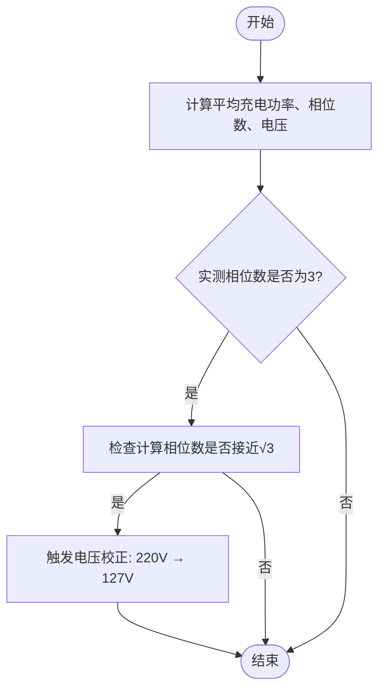
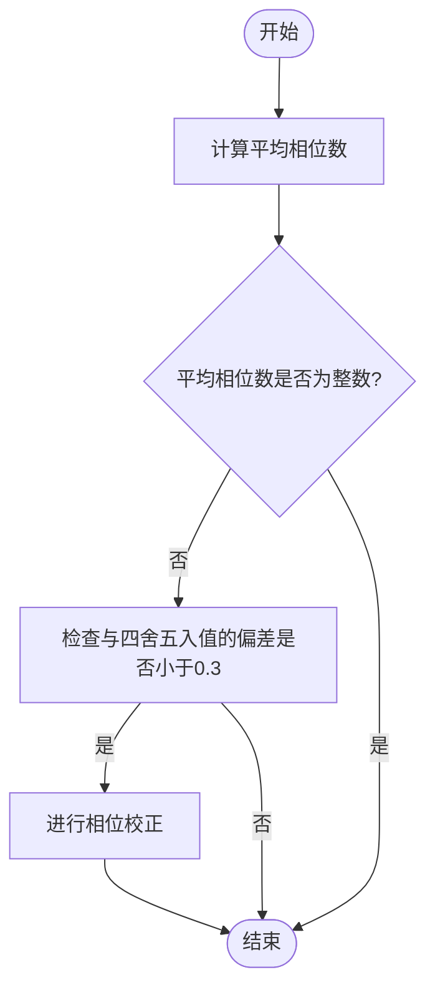

# 相位检测与校正机制

<cite>
**本文档引用文件**   
- [determine_phases.exs](file://priv/repo/migrations/20191212230527_recalc_energy_used.exs#L199-L235)
- [charge.ex](file://lib/teslamate/log/charge.ex#L1-L68)
- [log_charging_test.exs](file://test/teslamate/log/log_charging_test.exs#L807-L1546)
- [charge-details.json](file://grafana/dashboards/internal/charge-details.json#L1883-L1887)
</cite>

## 目录
1. [相位检测与校正逻辑](#相位检测与校正逻辑)
2. [三相电源电压校正机制](#三相电源电压校正机制)
3. [相位数非整数时的校正机制](#相位数非整数时的校正机制)
4. [日志输出与实际应用](#日志输出与实际应用)
5. [样本量阈值与降级处理](#样本量阈值与降级处理)

## 相位检测与校正逻辑

`determine_phases`函数通过计算平均充电功率、相位数、电压和记录数量来判断电源类型。该函数首先从数据库中查询充电记录，计算平均充电功率（charger_power）、平均相位数（charger_phases）、平均电压（charger_voltage）和记录数量（count）。这些值用于后续的相位检测与校正逻辑。

**Section sources**
- [determine_phases.exs](file://priv/repo/migrations/20191212230527_recalc_energy_used.exs#L199-L235)

## 三相电源电压校正机制

当实测相位数为3但计算相位数接近√3时，系统会触发电压校正（220V→127V）。这一机制基于三相电源的数学原理，即在三相平衡系统中，线电压与相电压的关系为线电压 = √3 × 相电压。当系统检测到平均相位数接近√3时，说明实际电压可能为127V而非220V，因此会进行电压校正。

**Diagram sources**
- [determine_phases.exs](file://priv/repo/migrations/20191212230527_recalc_energy_used.exs#L199-L235)

**Section sources**
- [determine_phases.exs](file://priv/repo/migrations/20191212230527_recalc_energy_used.exs#L199-L235)

## 相位数非整数时的校正机制

当平均相位数非整数且与四舍五入值偏差小于0.3时，系统会进行相位校正（如2→3或2→1）。这一机制用于处理相位数测量误差或不稳定的情况。例如，当平均相位数为2.2时，系统会将其校正为2；当平均相位数为2.8时，系统会将其校正为3。

**Diagram sources**
- [determine_phases.exs](file://priv/repo/migrations/20191212230527_recalc_energy_used.exs#L199-L235)

**Section sources**
- [determine_phases.exs](file://priv/repo/migrations/20191212230527_recalc_energy_used.exs#L199-L235)

## 日志输出与实际应用

结合测试用例中的phase_correction_2_to_3和voltage_correction_220_to_127_p1场景，Logger.info日志输出的触发条件和实际应用价值得以体现。当系统检测到需要进行相位或电压校正时，会通过Logger.info输出相应的日志信息，帮助用户了解系统状态和校正过程。

**Section sources**
- [log_charging_test.exs](file://test/teslamate/log/log_charging_test.exs#L807-L1546)

## 样本量阈值与降级处理

n > 15的样本量阈值对检测准确性的保障作用显著。当样本量不足时，系统会返回nil，采取降级处理策略。这一机制确保了在数据不足的情况下，系统不会做出错误的相位判断，从而保证了整体系统的稳定性和可靠性。

**Section sources**
- [determine_phases.exs](file://priv/repo/migrations/20191212230527_recalc_energy_used.exs#L199-L235)