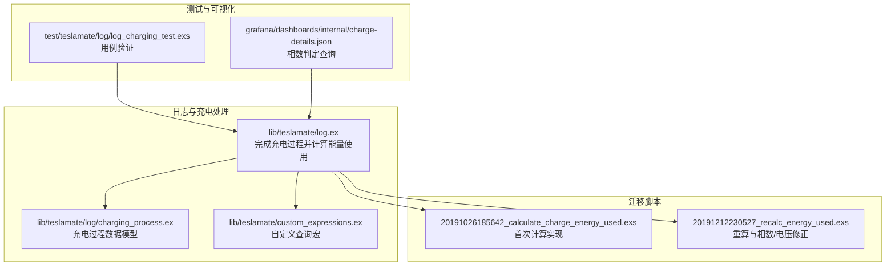
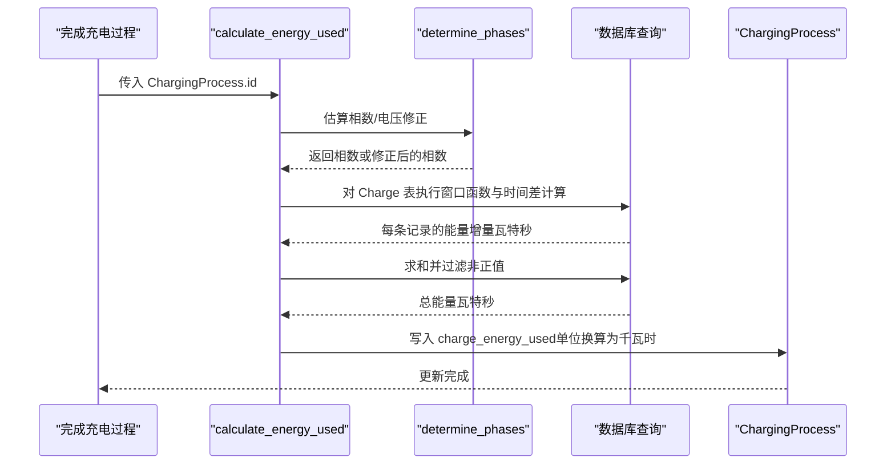
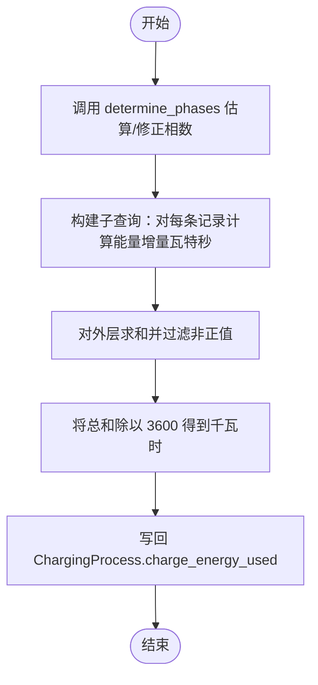
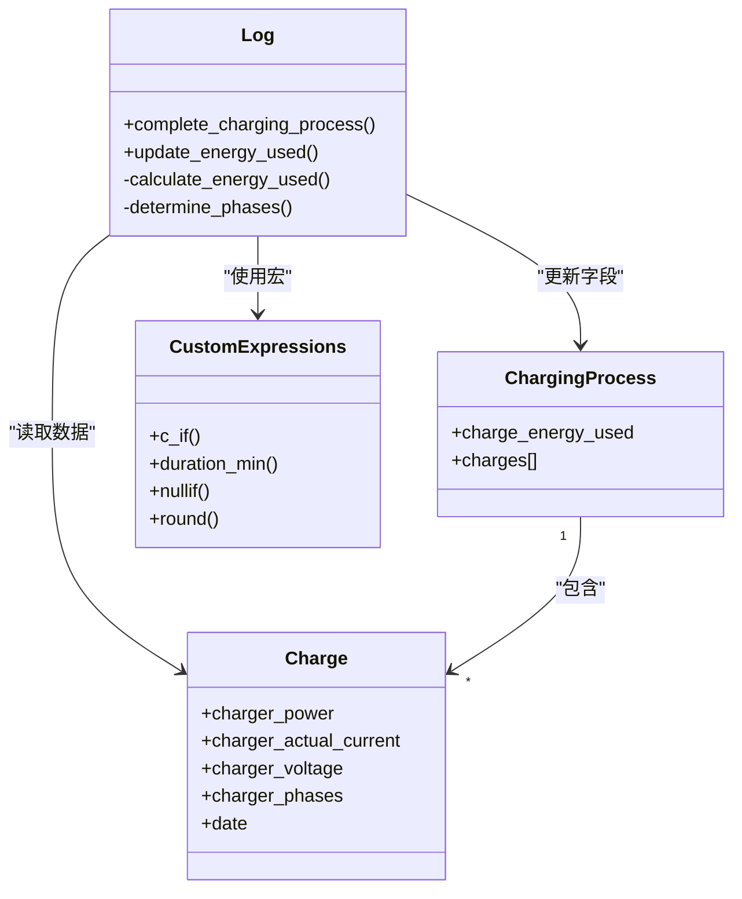

# 能量消耗计算

<cite>
**本文引用的文件**
- [lib/teslamate/log.ex](file://lib/teslamate/log.ex)
- [lib/teslamate/log/charging_process.ex](file://lib/teslamate/log/charging_process.ex)
- [lib/teslamate/custom_expressions.ex](file://lib/teslamate/custom_expressions.ex)
- [priv/repo/migrations/20191026185642_calculate_charge_energy_used.exs](file://priv/repo/migrations/20191026185642_calculate_charge_energy_used.exs)
- [priv/repo/migrations/20191212230527_recalc_energy_used.exs](file://priv/repo/migrations/20191212230527_recalc_energy_used.exs)
- [test/teslamate/log/log_charging_test.exs](file://test/teslamate/log/log_charging_test.exs)
- [grafana/dashboards/internal/charge-details.json](file://grafana/dashboards/internal/charge-details.json)
</cite>

## 目录
1. [简介](#简介)
2. [项目结构与定位](#项目结构与定位)
3. [核心组件](#核心组件)
4. [架构总览](#架构总览)
5. [详细组件分析](#详细组件分析)
6. [依赖关系分析](#依赖关系分析)
7. [性能与精度考量](#性能与精度考量)
8. [故障排查指南](#故障排查指南)
9. [结论](#结论)

## 简介
本文件围绕“充电能量消耗”计算展开，系统性解析 charge_energy_used 的计算算法与实现细节，覆盖以下要点：
- 基于 ChargerPower、charger_actual_current、charger_voltage 和 charger_phases 的能量积分计算方法
- 单相与三相电源在公式上的差异与自动识别策略
- SQL 片段 EXTRACT(epoch FROM (?)) 的作用与 lag() 窗口函数如何计算相邻采样点的时间间隔
- calculate_energy_used 函数的实现流程、边界条件处理（空值、负值）
- 单位换算（瓦特秒到千瓦时）与精度影响因素（采样频率、网络延迟）

## 项目结构与定位
- 计算逻辑集中在日志模块的充电处理流程中，涉及 Ecto 查询、窗口函数与自定义表达式宏。
- 数据模型由 ChargingProcess 与 Charge 表构成，charge_energy_used 字段最终写入 ChargingProcess。
- 测试用例覆盖电压修正、相数修正、坏连接与数据间隙等典型场景，确保算法鲁棒性。

图表来源
- [lib/teslamate/log.ex](file://lib/teslamate/log.ex#L492-L541)
- [lib/teslamate/log/charging_process.ex](file://lib/teslamate/log/charging_process.ex#L1-L61)
- [lib/teslamate/custom_expressions.ex](file://lib/teslamate/custom_expressions.ex#L1-L36)
- [priv/repo/migrations/20191026185642_calculate_charge_energy_used.exs](file://priv/repo/migrations/20191026185642_calculate_charge_energy_used.exs#L73-L101)
- [priv/repo/migrations/20191212230527_recalc_energy_used.exs](file://priv/repo/migrations/20191212230527_recalc_energy_used.exs#L166-L235)
- [test/teslamate/log/log_charging_test.exs](file://test/teslamate/log/log_charging_test.exs#L837-L853)
- [grafana/dashboards/internal/charge-details.json](file://grafana/dashboards/internal/charge-details.json#L1883-L1903)

章节来源
- [lib/teslamate/log.ex](file://lib/teslamate/log.ex#L492-L541)
- [lib/teslamate/log/charging_process.ex](file://lib/teslamate/log/charging_process.ex#L1-L61)
- [lib/teslamate/custom_expressions.ex](file://lib/teslamate/custom_expressions.ex#L1-L36)
- [priv/repo/migrations/20191026185642_calculate_charge_energy_used.exs](file://priv/repo/migrations/20191026185642_calculate_charge_energy_used.exs#L73-L101)
- [priv/repo/migrations/20191212230527_recalc_energy_used.exs](file://priv/repo/migrations/20191212230527_recalc_energy_used.exs#L166-L235)
- [test/teslamate/log/log_charging_test.exs](file://test/teslamate/log/log_charging_test.exs#L837-L853)
- [grafana/dashboards/internal/charge-details.json](file://grafana/dashboards/internal/charge-details.json#L1883-L1903)

## 核心组件
- calculate_energy_used：对单个充电过程进行能量积分，返回 charge_energy_used（单位为千瓦时）
- determine_phases：基于电流、电压与功率估算相数，并在必要时进行电压修正与相数修正
- 自定义表达式宏：提供 c_if、duration_min、nullif、round 等，用于 Ecto 查询中的条件分支与数值处理
- 数据模型：ChargingProcess（包含 charge_energy_used）、Charge（包含 charger_*、date 等）

章节来源
- [lib/teslamate/log.ex](file://lib/teslamate/log.ex#L517-L541)
- [lib/teslamate/log.ex](file://lib/teslamate/log.ex#L543-L580)
- [lib/teslamate/custom_expressions.ex](file://lib/teslamate/custom_expressions.ex#L1-L36)
- [lib/teslamate/log/charging_process.ex](file://lib/teslamate/log/charging_process.ex#L1-L61)

## 架构总览
下图展示了从采集数据到最终统计字段写入的关键路径，以及相数/电压修正在其中的位置。

图表来源
- [lib/teslamate/log.ex](file://lib/teslamate/log.ex#L492-L541)
- [lib/teslamate/log.ex](file://lib/teslamate/log.ex#L517-L541)
- [lib/teslamate/log.ex](file://lib/teslamate/log.ex#L543-L580)

## 详细组件分析

### 能量计算算法与公式
- 基本思路：对每个采样点，以功率或三相功率近似作为瞬时功率，乘以相邻采样点之间的时间差，得到能量增量（单位为瓦特秒），再对所有增量求和。
- 公式差异（单相 vs 三相）：
  - 单相：使用 charger_power（瓦）
  - 三相：使用 charger_actual_current × charger_voltage × phases（瓦）
- 单位换算：将瓦特秒累积值除以 3600 得到单位为“千瓦时”的结果。

章节来源
- [lib/teslamate/log.ex](file://lib/teslamate/log.ex#L517-L541)
- [priv/repo/migrations/20191026185642_calculate_charge_energy_used.exs](file://priv/repo/migrations/20191026185642_calculate_charge_energy_used.exs#L73-L101)

### 时间间隔与窗口函数
- 使用 lag() 窗口函数按时间排序获取前一条记录的日期，二者之差即为相邻采样点的时间间隔（秒）。
- EXTRACT(epoch FROM (?)) 将时间差转换为秒数（PostgreSQL 的 epoch 以秒计）。
- 该时间差随后与功率相乘，得到能量增量（瓦特秒）。

章节来源
- [lib/teslamate/log.ex](file://lib/teslamate/log.ex#L529-L532)
- [lib/teslamate/custom_expressions.ex](file://lib/teslamate/custom_expressions.ex#L15-L23)

### 相数与电压修正策略
- 相数估算：通过 avg(charger_power × 1000 / nullif(charger_actual_current × charger_voltage, 0)) 近似相数，结合平均相数与样本数量进行阈值筛选。
- 电压修正：当检测到 3 相网络但电压偏低（例如 127V/220V），根据 abs(p / sqrt(r) - 1) ≤ 0.1 的规则进行电压修正。
- 相数修正：当 avg(charger_phases) 与估算相数存在小偏差（abs(round(p) - p) ≤ 0.3）时进行四舍五入修正。
- 仅当样本数足够大（n > 15）且估算相数为正时才启用修正。

章节来源
- [lib/teslamate/log.ex](file://lib/teslamate/log.ex#L543-L580)
- [priv/repo/migrations/20191212230527_recalc_energy_used.exs](file://priv/repo/migrations/20191212230527_recalc_energy_used.exs#L199-L235)
- [grafana/dashboards/internal/charge-details.json](file://grafana/dashboards/internal/charge-details.json#L1883-L1903)

### calculate_energy_used 的实现流程
- 步骤一：调用 determine_phases 获取相数或修正后的相数。
- 步骤二：构造子查询，对每条 Charge 记录：
  - 若未提供相数，则直接使用 charger_power；否则使用三相功率近似。
  - 乘以时间间隔（秒），得到能量增量（瓦特秒）。
- 步骤三：对外层查询求和，仅保留能量增量 ≥ 0 的项。
- 步骤四：将总和（瓦特秒）除以 3600，得到单位为“千瓦时”的 charge_energy_used 并写回 ChargingProcess。

图表来源
- [lib/teslamate/log.ex](file://lib/teslamate/log.ex#L517-L541)
- [lib/teslamate/log.ex](file://lib/teslamate/log.ex#L543-L580)

章节来源
- [lib/teslamate/log.ex](file://lib/teslamate/log.ex#L517-L541)
- [lib/teslamate/log.ex](file://lib/teslamate/log.ex#L543-L580)

### 边界条件与数据质量处理
- 空值与缺失：当 charger_phases 为空时，采用 charger_power 直接作为功率近似，避免除零与类型不匹配。
- 负值过滤：仅对能量增量 ≥ 0 的项求和，排除异常或噪声导致的负值。
- 数据间隙与坏连接：测试用例覆盖了相数缺失、采样时间被人为偏移等情形，算法仍能稳定输出合理结果。
- 电压/相数修正：在样本充足且满足阈值条件下进行修正，减少因电网或设备状态导致的误差。

章节来源
- [lib/teslamate/log.ex](file://lib/teslamate/log.ex#L517-L541)
- [lib/teslamate/log.ex](file://lib/teslamate/log.ex#L543-L580)
- [test/teslamate/log/log_charging_test.exs](file://test/teslamate/log/log_charging_test.exs#L837-L853)
- [test/teslamate/log/log_charging_test.exs](file://test/teslamate/log/log_charging_test.exs#L855-L895)

### 单位换算与精度影响
- 单位换算：瓦特秒 ÷ 3600 = 千瓦时。
- 精度来源：
  - 采样频率：越高的采样频率意味着更短的时间间隔，积分更接近连续曲线，结果更精确。
  - 网络延迟与数据到达顺序：若时间戳存在抖动或延迟，可能导致相邻时间差不稳定；通过 lag() 与窗口排序可缓解，但仍建议尽量保证时间戳的单调性。
  - 电压/相数修正：在三相网络中，若电压偏低或相数估计偏差较大，修正后能显著提升能量积分的准确性。

章节来源
- [lib/teslamate/log.ex](file://lib/teslamate/log.ex#L529-L532)
- [lib/teslamate/log.ex](file://lib/teslamate/log.ex#L543-L580)
- [test/teslamate/log/log_charging_test.exs](file://test/teslamate/log/log_charging_test.exs#L837-L853)

## 依赖关系分析
- calculate_energy_used 依赖 determine_phases 提供相数或修正后的相数。
- determine_phases 依赖 Charge 表的 charger_* 字段与样本统计。
- 自定义表达式宏 c_if、duration_min、nullif、round 在查询中被广泛使用，提升表达力与可读性。
- 数据模型 ChargingProcess 与 Charge 之间的外键关联确保计算范围限定在单个充电过程内。

图表来源
- [lib/teslamate/log.ex](file://lib/teslamate/log.ex#L492-L541)
- [lib/teslamate/log/charging_process.ex](file://lib/teslamate/log/charging_process.ex#L1-L61)
- [lib/teslamate/custom_expressions.ex](file://lib/teslamate/custom_expressions.ex#L1-L36)

章节来源
- [lib/teslamate/log.ex](file://lib/teslamate/log.ex#L492-L541)
- [lib/teslamate/log/charging_process.ex](file://lib/teslamate/log/charging_process.ex#L1-L61)
- [lib/teslamate/custom_expressions.ex](file://lib/teslamate/custom_expressions.ex#L1-L36)

## 性能与精度考量
- 性能：窗口函数与子查询在大数据集上可能带来开销，建议：
  - 保持 Charge 表按 date 排序索引完善，以优化 lag()/over() 的性能。
  - 控制单次计算的数据范围（按充电过程分组）。
- 精度：
  - 采样频率越高，时间间隔越小，积分越逼近真实功积。
  - 电压/相数修正在三相场景尤为重要，可显著降低系统误差。
  - 对异常值（负能量增量）进行过滤，避免噪声放大。

[本节为通用指导，无需列出具体文件来源]

## 故障排查指南
- 现象：charge_energy_used 为 nil 或异常低
  - 可能原因：样本不足（n ≤ 15）、估算相数为负或空、时间戳异常导致 lag() 结果异常。
  - 处理建议：检查 determine_phases 的样本统计与阈值；确认时间戳顺序与完整性。
- 现象：电压/相数修正日志频繁出现
  - 可能原因：三相网络电压偏低或相数估计偏差较大。
  - 处理建议：确认现场供电条件与设备状态；关注修正日志提示。
- 现象：测试用例中电压/相数修正场景结果异常
  - 可能原因：测试数据构造中存在时间戳偏移或相数缺失。
  - 处理建议：参考测试用例中的 fixture 构造方式，确保时间戳与相数字段的合理性。

章节来源
- [lib/teslamate/log.ex](file://lib/teslamate/log.ex#L543-L580)
- [test/teslamate/log/log_charging_test.exs](file://test/teslamate/log/log_charging_test.exs#L837-L853)
- [test/teslamate/log/log_charging_test.exs](file://test/teslamate/log/log_charging_test.exs#L855-L895)

## 结论
- charge_energy_used 的计算以“功率 × 时间间隔”的离散积分为核心，通过 determine_phases 实现对单相/三相与电压偏差的自适应修正。
- EXTRACT(epoch FROM (?)) 与 lag() 窗口函数共同提供了准确的时间间隔计算；c_if 等宏增强了查询表达能力。
- 在高采样频率与良好时间戳质量的前提下，算法能获得较高精度；同时通过过滤负值与阈值控制，提升了鲁棒性。
- 建议在生产环境中持续监控相数/电压修正日志，结合测试用例覆盖典型边界场景，确保长期稳定性。