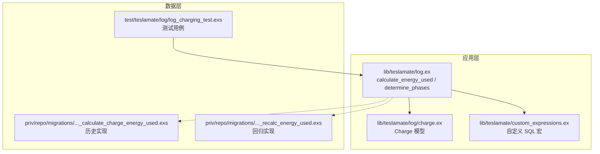
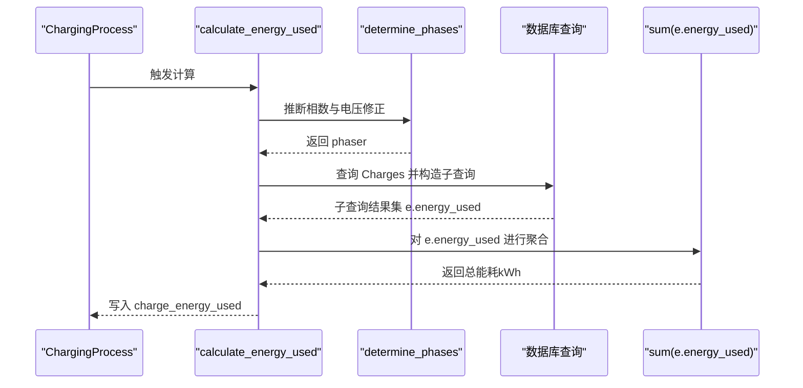
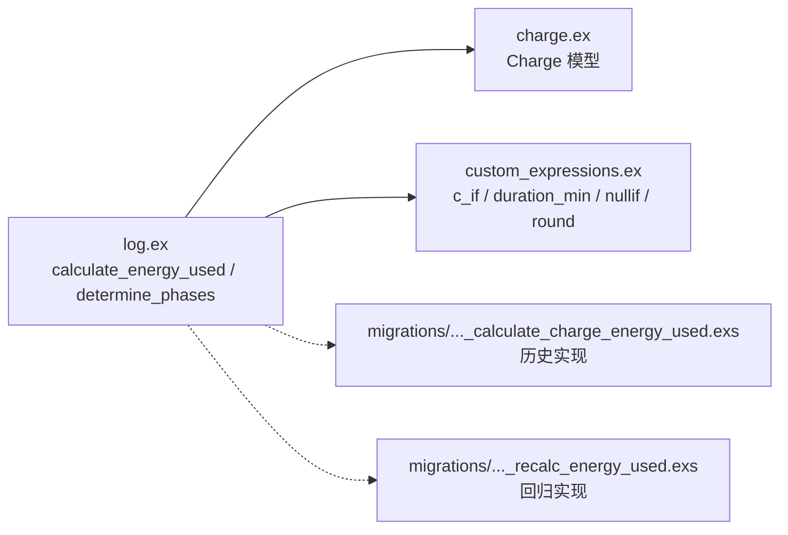

# 能量消耗计算算法

<cite>
**本文引用的文件**
- [lib/teslamate/log.ex](file://lib/teslamate/log.ex)
- [lib/teslamate/log/charge.ex](file://lib/teslamate/log/charge.ex)
- [lib/teslamate/custom_expressions.ex](file://lib/teslamate/custom_expressions.ex)
- [priv/repo/migrations/20191026185642_calculate_charge_energy_used.exs](file://priv/repo/migrations/20191026185642_calculate_charge_energy_used.exs)
- [priv/repo/migrations/20191212230527_recalc_energy_used.exs](file://priv/repo/migrations/20191212230527_recalc_energy_used.exs)
- [test/teslamate/log/log_charging_test.exs](file://test/teslamate/log/log_charging_test.exs)
</cite>

## 目录
1. [引言](#引言)
2. [项目结构](#项目结构)
3. [核心组件](#核心组件)
4. [架构总览](#架构总览)
5. [详细组件分析](#详细组件分析)
6. [依赖关系分析](#依赖关系分析)
7. [性能考量](#性能考量)
8. [故障排查指南](#故障排查指南)
9. [结论](#结论)

## 引言
本文件围绕“能量消耗计算算法”展开，聚焦于计算单次充电过程中的总能耗（单位：千瓦时，kWh）的方法论与实现细节。核心目标包括：
- 解释 calculate_energy_used 函数如何基于 charger_power 或 charger_actual_current、charger_voltage 和 phaser 的组合计算每个充电间隔的瞬时功率；
- 说明如何通过 EXTRACT(epoch FROM (?)) 获取相邻记录之间的时间差（秒），并将其转换为小时后累加得到总能耗；
- 讨论当 charger_phases 为空时采用 charger_power 的降级策略；
- 解释 determine_phases 如何通过统计推断相数与电压修正，以及 lag() 窗口函数在时间间隔计算中的作用；
- 结合测试用例展示 SQL 片段的能量计算公式数学表达；
- 总结 sum(e.energy_used) 聚合操作的执行流程与过滤机制（负值与空值处理）。

## 项目结构
与能量消耗计算直接相关的模块与迁移文件如下：
- 计算入口与相位推断：lib/teslamate/log.ex
- 数据模型：lib/teslamate/log/charge.ex
- 自定义 SQL 表达式宏：lib/teslamate/custom_expressions.ex
- 历史迁移（旧版实现）：priv/repo/migrations/20191026185642_calculate_charge_energy_used.exs
- 回归与更新迁移（新版实现）：priv/repo/migrations/20191212230527_recalc_energy_used.exs
- 单元测试与场景覆盖：test/teslamate/log/log_charging_test.exs

图表来源
- [lib/teslamate/log.ex](file://lib/teslamate/log.ex#L517-L580)
- [lib/teslamate/log/charge.ex](file://lib/teslamate/log/charge.ex#L1-L68)
- [lib/teslamate/custom_expressions.ex](file://lib/teslamate/custom_expressions.ex#L1-L37)
- [priv/repo/migrations/20191026185642_calculate_charge_energy_used.exs](file://priv/repo/migrations/20191026185642_calculate_charge_energy_used.exs#L73-L101)
- [priv/repo/migrations/20191212230527_recalc_energy_used.exs](file://priv/repo/migrations/20191212230527_recalc_energy_used.exs#L155-L197)
- [test/teslamate/log/log_charging_test.exs](file://test/teslamate/log/log_charging_test.exs#L807-L897)

章节来源
- [lib/teslamate/log.ex](file://lib/teslamate/log.ex#L517-L580)
- [lib/teslamate/log/charge.ex](file://lib/teslamate/log/charge.ex#L1-L68)
- [lib/teslamate/custom_expressions.ex](file://lib/teslamate/custom_expressions.ex#L1-L37)
- [priv/repo/migrations/20191026185642_calculate_charge_energy_used.exs](file://priv/repo/migrations/20191026185642_calculate_charge_energy_used.exs#L73-L101)
- [priv/repo/migrations/20191212230527_recalc_energy_used.exs](file://priv/repo/migrations/20191212230527_recalc_energy_used.exs#L155-L197)
- [test/teslamate/log/log_charging_test.exs](file://test/teslamate/log/log_charging_test.exs#L807-L897)

## 核心组件
- calculate_energy_used：对单个充电过程（ChargingProcess）内的所有充电记录（Charge）进行能量计算与汇总。
- determine_phases：根据当前充电过程的历史数据推断实际相数（phaser），并在必要时进行电压修正与相位修正。
- Charge 模型：承载每次采样的时间戳、功率、电流、电压、相数等字段，作为计算输入。
- 自定义 SQL 宏：提供 CASE WHEN 条件表达式与 EXTRACT(epoch FROM (?)) 等 SQL 片段，用于查询构建。

章节来源
- [lib/teslamate/log.ex](file://lib/teslamate/log.ex#L517-L580)
- [lib/teslamate/log/charge.ex](file://lib/teslamate/log/charge.ex#L1-L68)
- [lib/teslamate/custom_expressions.ex](file://lib/teslamate/custom_expressions.ex#L1-L37)

## 架构总览
下图展示了从充电记录到总能耗的端到端流程，包括相位推断、瞬时功率计算、时间间隔提取与累加。

图表来源
- [lib/teslamate/log.ex](file://lib/teslamate/log.ex#L517-L580)

## 详细组件分析

### calculate_energy_used 实现逻辑
- 输入：一个 ChargingProcess 的 id。
- 步骤：
  1) determine_phases 推断该过程的相数 phaser（可能包含电压修正与相位修正）。
  2) 针对该 ChargingProcess 下的所有 Charge 记录：
     - 若 charger_phases 为空，则使用 charger_power 作为瞬时功率（降级策略）。
     - 否则使用瞬时功率公式：I × V × phaser / 1000（单位：kW）。
     - 使用 lag() 窗口函数按时间排序获取相邻记录的时间差 Δt（秒），再除以 3600 得到小时数。
     - 将瞬时功率乘以 Δt/3600 得到本次间隔的能量增量（kWh）。
  3) 对每个充电间隔的能量增量进行求和，得到总能耗（kWh）。
  4) 过滤掉非正值（e.energy_used >= 0），避免异常数据影响总和。

SQL 片段的数学表达（来自源码注释与实现）：
- 瞬时功率 P(t)：
  - 当 phaser 为空：P(t) = charger_power(t)
  - 当 phaser 不为空：P(t) = charger_actual_current(t) × charger_voltage(t) × phaser / 1000
- 时间差 Δt（秒）：Δt = EXTRACT(epoch FROM (date(t) - lag(date)(order_by: date)))
- 能量增量 ΔE(t)：ΔE(t) = P(t) × (Δt / 3600)
- 总能耗 E_total：E_total = Σ ΔE(t)，其中 ΔE(t) ≥ 0

章节来源
- [lib/teslamate/log.ex](file://lib/teslamate/log.ex#L517-L541)

### determine_phases 相位推断与电压修正
- 统计指标：
  - 平均功率比：avg(charger_power × 1000 / nullif(charger_actual_current × charger_voltage, 0))
  - 平均相数：avg(charger_phases)
  - 平均电压：avg(charger_voltage)
  - 计数：count()
- 判定规则：
  - 当样本数量足够大且平均功率比大于零时：
    - 若平均相数等于其四舍五入值，则直接采用该相数；
    - 若原相数为 3 且满足特定比例关系，则进行电压修正（将电压除以 sqrt(3)）并返回修正后的相数；
    - 若平均功率比与相数存在较小偏差，则进行相位修正（四舍五入）；
    - 否则返回空（不启用相位推断）。
- 日志记录：在发生电压或相位修正时输出日志，便于追踪。

章节来源
- [lib/teslamate/log.ex](file://lib/teslamate/log.ex#L543-L579)

### lag() 窗口函数与时间间隔计算
- lag(c.date) 按时间升序获取上一条记录的日期；
- c.date - lag(c.date) 得到相邻记录的时间差；
- EXTRACT(epoch FROM (?)) 将时间差转换为秒；
- 除以 3600 得到小时，用于将功率（kW）转换为能量（kWh）。

章节来源
- [lib/teslamate/log.ex](file://lib/teslamate/log.ex#L517-L541)

### sum(e.energy_used) 聚合流程与过滤
- 先对每个充电间隔的能量增量进行求和；
- 在聚合阶段仅保留非负值（e.energy_used >= 0），避免负值导致的误差；
- 返回总能耗（kWh）。

章节来源
- [lib/teslamate/log.ex](file://lib/teslamate/log.ex#L536-L541)

### 降级策略：当 charger_phases 为空时使用 charger_power
- 若无法确定相数或相数为空，则直接使用 charger_power 作为瞬时功率；
- 这种做法在某些场景（如数据缺失或连接问题）下仍能保证能量计算的连续性。

章节来源
- [lib/teslamate/log.ex](file://lib/teslamate/log.ex#L517-L541)

### 测试用例与场景覆盖
- 电压修正场景：验证从 220V 到 127V 的电压修正对能量计算的影响；
- 相位修正场景：验证从 2 相到 3 相、从 2 相到 1 相的相位修正；
- 数据缺失与坏连接场景：验证当 charger_phases 为空时的降级策略；
- 数据间隙场景：验证时间戳被人为延后时的处理能力。

章节来源
- [test/teslamate/log/log_charging_test.exs](file://test/teslamate/log/log_charging_test.exs#L837-L897)
- [test/teslamate/log/log_charging_test.exs](file://test/teslamate/log/log_charging_test.exs#L855-L868)
- [test/teslamate/log/log_charging_test.exs](file://test/teslamate/log/log_charging_test.exs#L870-L895)

## 依赖关系分析
- calculate_energy_used 依赖 determine_phases 提供的 phaser；
- determine_phases 依赖 Charge 表中的字段（charger_power、charger_actual_current、charger_voltage、charger_phases）；
- 计算过程使用自定义 SQL 宏（c_if）与 EXTRACT(epoch FROM (?))；
- 历史迁移与回归迁移提供了不同版本的实现思路与兼容路径。

图表来源
- [lib/teslamate/log.ex](file://lib/teslamate/log.ex#L517-L580)
- [lib/teslamate/log/charge.ex](file://lib/teslamate/log/charge.ex#L1-L68)
- [lib/teslamate/custom_expressions.ex](file://lib/teslamate/custom_expressions.ex#L1-L37)
- [priv/repo/migrations/20191026185642_calculate_charge_energy_used.exs](file://priv/repo/migrations/20191026185642_calculate_charge_energy_used.exs#L73-L101)
- [priv/repo/migrations/20191212230527_recalc_energy_used.exs](file://priv/repo/migrations/20191212230527_recalc_energy_used.exs#L155-L197)

## 性能考量
- 窗口函数 lag() 与 over(order_by: date) 会按时间排序扫描数据，建议在 charges.date 上建立索引以提升查询效率（项目中已有相关索引迁移）。
- determine_phases 使用 avg、count 等聚合函数，数据量较大时应确保分组与过滤条件合理，避免全表扫描。
- 过滤 e.energy_used >= 0 的聚合可减少无效累加，降低后续处理成本。

章节来源
- [priv/repo/migrations/20190415192200_add_address_to_charging_process.exs](file://priv/repo/migrations/20190415192200_add_address_to_charging_process.exs#L1-L9)
- [priv/repo/migrations/20190416125429_add_indexes_on_dates.exs](file://priv/repo/migrations/20190416125429_add_indexes_on_dates.exs#L1-L8)

## 故障排查指南
- 现象：总能耗为 nil 或异常低
  - 可能原因：充电过程无有效记录、时间戳缺失或顺序异常、charger_phases 始终为空导致仅使用 charger_power；
  - 处理建议：检查 Charge 数据完整性与时间序列连续性；确认 determine_phases 是否返回了 phaser。
- 现象：电压或相位修正日志频繁出现
  - 可能原因：外部电源电压不稳定或相数切换；
  - 处理建议：关注日志输出，确认修正是否符合预期。
- 现象：聚合结果为 0
  - 可能原因：所有 ΔE(t) 均为负值被过滤；
  - 处理建议：检查瞬时功率与时间差计算是否正确，确认 lag() 排序与 EXTRACT(epoch FROM (?)) 的使用。

章节来源
- [lib/teslamate/log.ex](file://lib/teslamate/log.ex#L517-L580)
- [test/teslamate/log/log_charging_test.exs](file://test/teslamate/log/log_charging_test.exs#L837-L897)

## 结论
calculate_energy_used 通过“瞬时功率 × 时间间隔”的方式，将离散的充电记录转换为连续的能量累积。其核心优势在于：
- 在 charger_phases 缺失时使用 charger_power 的稳健降级策略；
- 通过 determine_phases 动态推断相数与电压修正，提升计算精度；
- 使用 lag() 与 EXTRACT(epoch FROM (?)) 精确计算相邻记录的时间差；
- 通过 sum(e.energy_used) 与非负过滤确保结果稳定可靠。

该算法在多种边界场景（坏连接、数据缺失、电压/相位变化）下均有测试覆盖，具备良好的鲁棒性与可维护性。