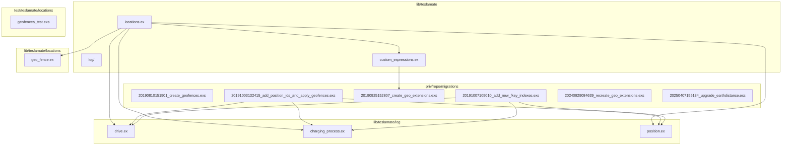
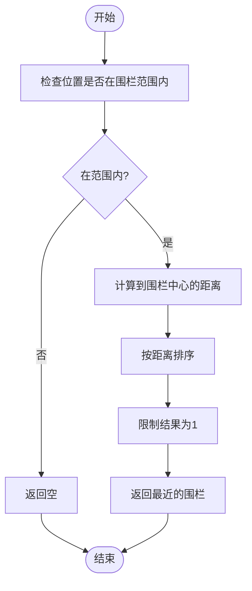
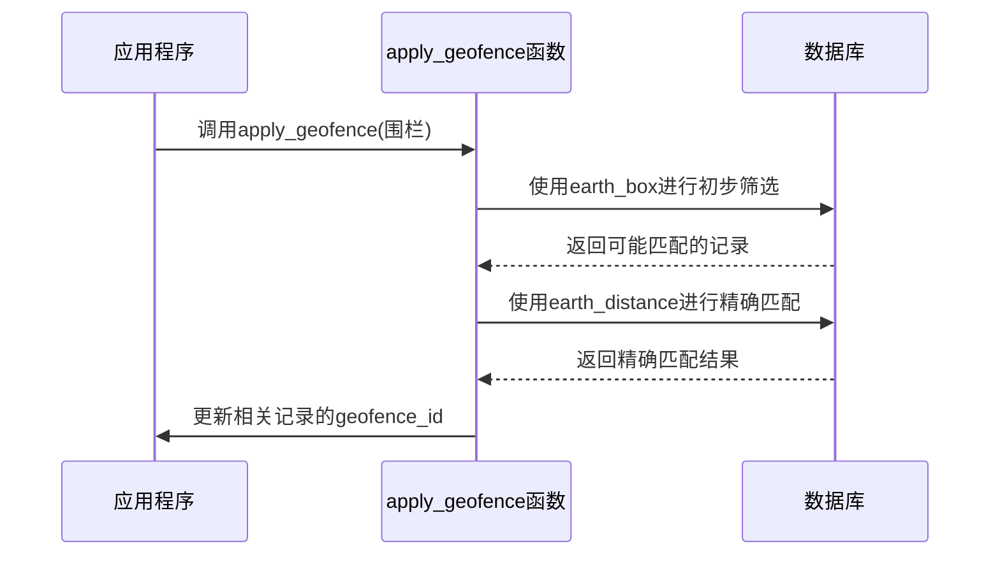
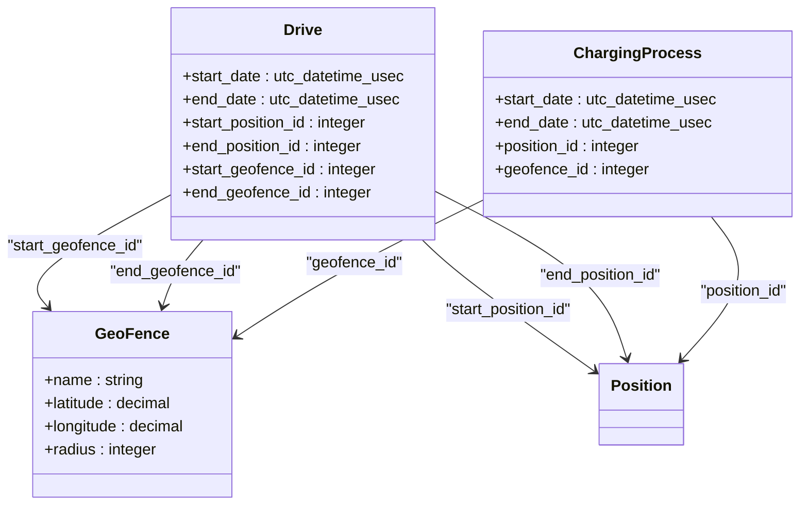
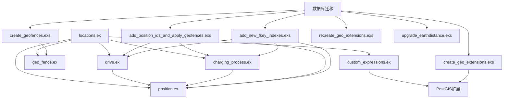

# 位置匹配算法

<cite>
**本文档中引用的文件**   
- [locations.ex](file://lib/teslamate/locations.ex)
- [geo_fence.ex](file://lib/teslamate/locations/geo_fence.ex)
- [drive.ex](file://lib/teslamate/log/drive.ex)
- [charging_process.ex](file://lib/teslamate/log/charging_process.ex)
- [position.ex](file://lib/teslamate/log/position.ex)
- [custom_expressions.ex](file://lib/teslamate/custom_expressions.ex)
- [20190810151901_create_geofences.exs](file://priv/repo/migrations/20190810151901_create_geofences.exs)
- [20191003132415_add_position_ids_and_apply_geofences.exs](file://priv/repo/migrations/20191003132415_add_position_ids_and_apply_geofences.exs)
- [20190925152807_create_geo_extensions.exs](file://priv/repo/migrations/20190925152807_create_geo_extensions.exs)
- [20191007105010_add_new_fkey_indexes.exs](file://priv/repo/migrations/20191007105010_add_new_fkey_indexes.exs)
- [20240929084639_recreate_geo_extensions.exs](file://priv/repo/migrations/20240929084639_recreate_geo_extensions.exs)
- [20250407155134_upgrade_earthdistance.exs](file://priv/repo/migrations/20250407155134_upgrade_earthdistance.exs)
- [geofences_test.exs](file://test/teslamate/locations/geofences_test.exs)
</cite>

## 目录
1. [项目结构](#项目结构)
2. [核心组件](#核心组件)
3. [位置匹配算法详解](#位置匹配算法详解)
4. [数据库查询优化策略](#数据库查询优化策略)
5. [地理围栏与实体的自动关联机制](#地理围栏与实体的自动关联机制)
6. [依赖分析](#依赖分析)

## 项目结构

**图示来源**
- [locations.ex](file://lib/teslamate/locations.ex)
- [geo_fence.ex](file://lib/teslamate/locations/geo_fence.ex)
- [drive.ex](file://lib/teslamate/log/drive.ex)
- [charging_process.ex](file://lib/teslamate/log/charging_process.ex)
- [position.ex](file://lib/teslamate/log/position.ex)
- [custom_expressions.ex](file://lib/teslamate/custom_expressions.ex)
- [20190810151901_create_geofences.exs](file://priv/repo/migrations/20190810151901_create_geofences.exs)
- [20191003132415_add_position_ids_and_apply_geofences.exs](file://priv/repo/migrations/20191003132415_add_position_ids_and_apply_geofences.exs)
- [20190925152807_create_geo_extensions.exs](file://priv/repo/migrations/20190925152807_create_geo_extensions.exs)
- [20191007105010_add_new_fkey_indexes.exs](file://priv/repo/migrations/20191007105010_add_new_fkey_indexes.exs)
- [20240929084639_recreate_geo_extensions.exs](file://priv/repo/migrations/20240929084639_recreate_geo_extensions.exs)
- [20250407155134_upgrade_earthdistance.exs](file://priv/repo/migrations/20250407155134_upgrade_earthdistance.exs)

**节来源**
- [locations.ex](file://lib/teslamate/locations.ex)
- [geo_fence.ex](file://lib/teslamate/locations/geo_fence.ex)
- [drive.ex](file://lib/teslamate/log/drive.ex)
- [charging_process.ex](file://lib/teslamate/log/charging_process.ex)
- [position.ex](file://lib/teslamate/log/position.ex)
- [custom_expressions.ex](file://lib/teslamate/custom_expressions.ex)
- [20190810151901_create_geofences.exs](file://priv/repo/migrations/20190810151901_create_geofences.exs)
- [20191003132415_add_position_ids_and_apply_geofences.exs](file://priv/repo/migrations/20191003132415_add_position_ids_and_apply_geofences.exs)

## 核心组件

本系统的核心组件包括地理围栏（GeoFence）、驾驶记录（Drive）、充电过程（ChargingProcess）和位置记录（Position）。这些组件通过地理位置数据相互关联，实现了车辆位置与地理围栏的智能匹配。

**节来源**
- [geo_fence.ex](file://lib/teslamate/locations/geo_fence.ex)
- [drive.ex](file://lib/teslamate/log/drive.ex)
- [charging_process.ex](file://lib/teslamate/log/charging_process.ex)
- [position.ex](file://lib/teslamate/log/position.ex)

## 位置匹配算法详解

位置匹配算法的核心是`find_geofence`函数，该函数使用PostGIS地理函数来确定车辆位置是否在某个地理围栏内。算法首先通过`within_geofence?`宏检查位置点是否在围栏范围内，然后按距离排序，返回最近匹配的围栏。

**图示来源**
- [locations.ex](file://lib/teslamate/locations.ex#L173-L179)
- [custom_expressions.ex](file://lib/teslamate/custom_expressions.ex#L37-L78)

**节来源**
- [locations.ex](file://lib/teslamate/locations.ex#L173-L179)
- [custom_expressions.ex](file://lib/teslamate/custom_expressions.ex#L37-L78)

## 数据库查询优化策略

系统使用`apply_geofence`函数中的`earth_box`和`earth_distance`数据库查询优化策略来提升大规模位置数据的匹配效率。通过空间索引，系统能够快速筛选出可能匹配的围栏，然后进行精确的距离计算。

**图示来源**
- [locations.ex](file://lib/teslamate/locations.ex#L128-L157)
- [custom_expressions.ex](file://lib/teslamate/custom_expressions.ex#L37-L92)

**节来源**
- [locations.ex](file://lib/teslamate/locations.ex#L128-L157)
- [custom_expressions.ex](file://lib/teslamate/custom_expressions.ex#L37-L92)

## 地理围栏与实体的自动关联机制

系统通过`Driving`和`ChargingProcess`实体的`start_geofence_id`和`end_geofence_id`字段实现自动关联机制。当创建或更新地理围栏时，系统会自动将驾驶起点和终点智能匹配到相应的地理围栏。

**图示来源**
- [drive.ex](file://lib/teslamate/log/drive.ex)
- [charging_process.ex](file://lib/teslamate/log/charging_process.ex)
- [geo_fence.ex](file://lib/teslamate/locations/geo_fence.ex)
- [position.ex](file://lib/teslamate/log/position.ex)

**节来源**
- [drive.ex](file://lib/teslamate/log/drive.ex)
- [charging_process.ex](file://lib/teslamate/log/charging_process.ex)
- [geo_fence.ex](file://lib/teslamate/locations/geo_fence.ex)

## 依赖分析

**图示来源**
- [locations.ex](file://lib/teslamate/locations.ex)
- [custom_expressions.ex](file://lib/teslamate/custom_expressions.ex)
- [geo_fence.ex](file://lib/teslamate/locations/geo_fence.ex)
- [drive.ex](file://lib/teslamate/log/drive.ex)
- [charging_process.ex](file://lib/teslamate/log/charging_process.ex)
- [position.ex](file://lib/teslamate/log/position.ex)
- [20190810151901_create_geofences.exs](file://priv/repo/migrations/20190810151901_create_geofences.exs)
- [20191003132415_add_position_ids_and_apply_geofences.exs](file://priv/repo/migrations/20191003132415_add_position_ids_and_apply_geofences.exs)
- [20190925152807_create_geo_extensions.exs](file://priv/repo/migrations/20190925152807_create_geo_extensions.exs)
- [20191007105010_add_new_fkey_indexes.exs](file://priv/repo/migrations/20191007105010_add_new_fkey_indexes.exs)
- [20240929084639_recreate_geo_extensions.exs](file://priv/repo/migrations/20240929084639_recreate_geo_extensions.exs)
- [20250407155134_upgrade_earthdistance.exs](file://priv/repo/migrations/20250407155134_upgrade_earthdistance.exs)

**节来源**
- [locations.ex](file://lib/teslamate/locations.ex)
- [custom_expressions.ex](file://lib/teslamate/custom_expressions.ex)
- [geo_fence.ex](file://lib/teslamate/locations/geo_fence.ex)
- [drive.ex](file://lib/teslamate/log/drive.ex)
- [charging_process.ex](file://lib/teslamate/log/charging_process.ex)
- [position.ex](file://lib/teslamate/log/position.ex)
- [20190810151901_create_geofences.exs](file://priv/repo/migrations/20190810151901_create_geofences.exs)
- [20191003132415_add_position_ids_and_apply_geofences.exs](file://priv/repo/migrations/20191003132415_add_position_ids_and_apply_geofences.exs)
- [20190925152807_create_geo_extensions.exs](file://priv/repo/migrations/20190925152807_create_geo_extensions.exs)
- [20191007105010_add_new_fkey_indexes.exs](file://priv/repo/migrations/20191007105010_add_new_fkey_indexes.exs)
- [20240929084639_recreate_geo_extensions.exs](file://priv/repo/migrations/20240929084639_recreate_geo_extensions.exs)
- [20250407155134_upgrade_earthdistance.exs](file://priv/repo/migrations/20250407155134_upgrade_earthdistance.exs)