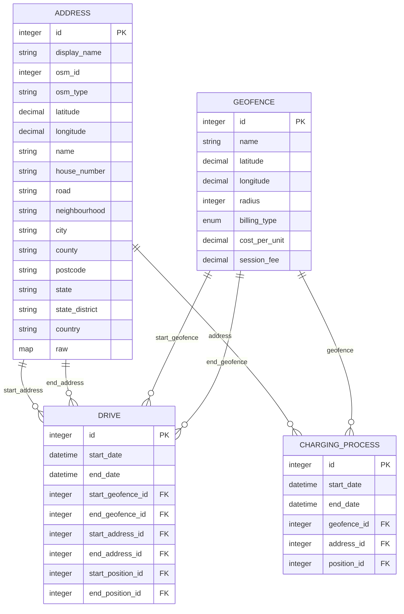

# 地址关联与反向解析

<cite>
**本文档中引用的文件**  
- [address.ex](file://lib/teslamate/locations/address.ex)
- [geo_fence.ex](file://lib/teslamate/locations/geo_fence.ex)
- [geocoder.ex](file://lib/teslamate/locations/geocoder.ex)
- [locations.ex](file://lib/teslamate/locations.ex)
- [drive.ex](file://lib/teslamate/log/drive.ex)
- [charging_process.ex](file://lib/teslamate/log/charging_process.ex)
</cite>

## 目录
1. [引言](#引言)
2. [地址缓存与去重机制](#地址缓存与去重机制)
3. [反向地理编码流程](#反向地理编码流程)
4. [批量地址更新策略](#批量地址更新策略)
5. [地址数据合并机制](#地址数据合并机制)
6. [地址与地理围栏的协同工作模式](#地址与地理围栏的协同工作模式)

## 引言
本文档详细说明了TeslaMate系统中地理围栏与地址系统的集成机制。重点描述了`find_address`函数如何通过OSM ID和类型实现地址缓存与去重，解释了`Geocoder.reverse_lookup`调用OpenStreetMap API进行经纬度反向解析的流程，以及`refresh_addresses`批量更新地址信息的策略。同时阐述了`merge_addresses`函数如何高效合并地址数据，处理地址不匹配的警告场景，并说明了地址与地理围栏的协同工作模式。

## 地址缓存与去重机制

系统通过`find_address`函数实现地址缓存与去重机制。当车辆位置发生变化时，系统会调用此函数来获取当前位置的地址信息。该函数首先通过OSM（OpenStreetMap）ID和类型进行查找，如果在数据库中已存在对应记录，则直接返回缓存的地址信息，避免重复查询外部API。

该机制的核心在于使用`osm_id`和`osm_type`作为唯一标识符，通过`unique_constraint`约束确保地址数据的唯一性。当查询到新的地址信息时，系统会检查数据库中是否已存在相同`osm_id`和`osm_type`的记录，如果存在则返回现有记录，否则创建新记录并保存。

**Section sources**
- [locations.ex](file://lib/teslamate/locations.ex#L35-L47)
- [address.ex](file://lib/teslamate/locations/address.ex#L55-L56)

## 反向地理编码流程

`Geocoder.reverse_lookup`函数负责调用OpenStreetMap的Nominatim API进行经纬度反向解析。该函数向`https://nominatim.openstreetmap.org`发送HTTP请求，将经纬度坐标转换为详细的地址信息。

请求参数包括：
- `format: :jsonv2`：指定返回JSON格式的详细地址信息
- `addressdetails: 1`：包含详细的地址组成部分
- `extratags: 1`：包含额外的标签信息
- `namedetails: 1`：包含名称的详细信息
- `zoom: 19`：指定高精度的缩放级别

系统会根据用户的语言设置（`GlobalSettings.language`）设置`Accept-Language`请求头，以获取相应语言的地址信息。API返回的原始数据会被解析并映射到内部的地址结构中，包括城市、国家、道路等信息。

**Section sources**
- [geocoder.ex](file://lib/teslamate/locations/geocoder.ex#L15-L30)
- [geocoder.ex](file://lib/teslamate/locations/geocoder.ex#L134-L145)

## 批量地址更新策略

`refresh_addresses`函数实现了批量更新地址信息的策略。该函数会获取数据库中所有地址记录，并将其分组为每组50个地址进行批量处理。

为了遵守OpenStreetMap API的使用限制，系统在处理每组地址之间会暂停1.5秒（`Process.sleep(1500)`）。这种间隔策略确保了不会对API服务器造成过大压力，同时也保证了数据更新的效率。

批量更新过程中，系统会调用`Geocoder.details`函数，通过`/lookup`端点一次性查询多个地址的详细信息。对于无法匹配的地址，系统会记录警告信息但不会中断整个更新过程，确保了系统的健壮性。

**Section sources**
- [locations.ex](file://lib/teslamate/locations.ex#L50-L108)
- [geocoder.ex](file://lib/teslamate/locations/geocoder.ex#L32-L64)

## 地址数据合并机制

`merge_addresses`函数负责高效合并地址数据。该函数采用Map数据结构作为中间存储，以`{osm_type, osm_id}`作为键，将数据库中的地址记录与API查询结果进行匹配和合并。

合并过程分为两个阶段：
1. 首先将所有数据库中的地址记录转换为Map，键为`{type, id}`，值为`{address, nil}`
2. 然后遍历API返回的地址信息，使用`Map.update!`函数更新对应键的值，将nil替换为API返回的地址属性

这种算法的时间复杂度为O(n+m)，其中n是数据库地址数量，m是API返回地址数量，实现了高效的地址数据合并。对于地址不匹配的情况，系统会记录警告信息，提示`osm_id`或`osm_type`发生变化，便于后续排查和处理。

**Section sources**
- [locations.ex](file://lib/teslamate/locations.ex#L115-L126)
- [locations.ex](file://lib/teslamate/locations.ex#L97-L103)

## 地址与地理围栏的协同工作模式

系统实现了地址与地理围栏的协同工作模式，当车辆进入围栏区域时，系统会优先使用围栏名称而非原始地址信息进行数据标注。

这种协同工作通过以下机制实现：
- 在`Drive`和`ChargingProcess`数据模型中，同时包含`start_address`/`end_address`和`start_geofence`/`end_geofence`外键
- 当车辆位置与地理围栏重叠时，系统会自动将`geofence_id`关联到相应的行程或充电记录
- 在数据显示时，优先显示地理围栏名称，提供更直观的位置标识

地理围栏的匹配基于空间查询，使用PostgreSQL的earthdistance扩展计算地球表面距离。系统会查找距离车辆位置最近且在半径范围内的地理围栏，并按距离排序，确保最精确的匹配结果。

**Diagram sources**
- [address.ex](file://lib/teslamate/locations/address.ex#L5-L24)
- [geo_fence.ex](file://lib/teslamate/locations/geo_fence.ex#L6-L17)
- [drive.ex](file://lib/teslamate/log/drive.ex#L8-L39)
- [charging_process.ex](file://lib/teslamate/log/charging_process.ex#L8-L29)

**Section sources**
- [locations.ex](file://lib/teslamate/locations.ex#L128-L157)
- [drive.ex](file://lib/teslamate/log/drive.ex#L27-L34)
- [charging_process.ex](file://lib/teslamate/log/charging_process.ex#L23-L26)