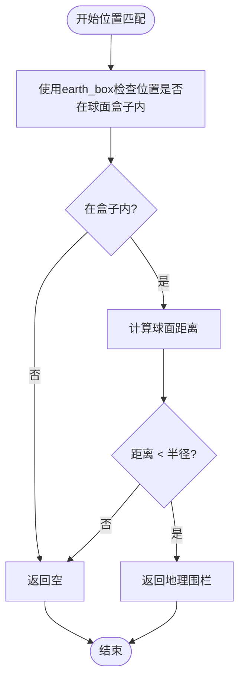
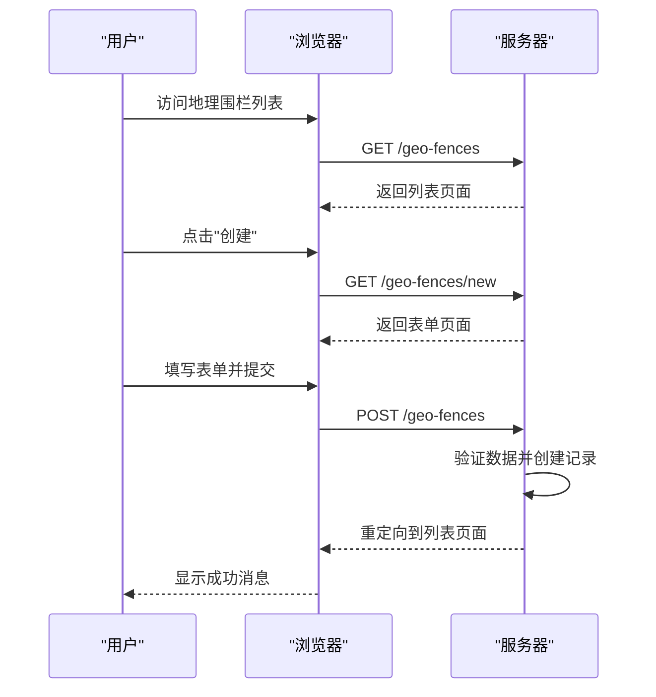

# 地理围栏

<cite>
**本文档中引用的文件**  
- [geo_fence.ex](file://lib/teslamate/locations/geo_fence.ex)
- [geofences_test.exs](file://test/teslamate/locations/geofences_test.exs)
- [locations.ex](file://lib/teslamate/locations.ex)
- [geocoder.ex](file://lib/teslamate/locations/geocoder.ex)
- [address.ex](file://lib/teslamate/locations/address.ex)
- [drive.ex](file://lib/teslamate/log/drive.ex)
- [form.ex](file://lib/teslamate_web/live/geofence_live/form.ex)
- [index.ex](file://lib/teslamate_web/live/geofence_live/index.ex)
- [form.html.heex](file://lib/teslamate_web/live/geofence_live/form.html.heex)
- [index.html.heex](file://lib/teslamate_web/live/geofence_live/index.html.heex)
- [create_geofences.exs](file://priv/repo/migrations/20190810151901_create_geofences.exs)
- [add_geofence_id_to_addresses.exs](file://priv/repo/migrations/20190925182253_add_geofence_id_to_addresses.exs)
- [custom_expressions.ex](file://lib/teslamate/custom_expressions.ex)
</cite>

## 目录
1. [简介](#简介)
2. [数据模型](#数据模型)
3. [位置匹配算法](#位置匹配算法)
4. [驾驶起点与终点的自动关联](#驾驶起点与终点的自动关联)
5. [地址反向解析集成](#地址反向解析集成)
6. [Web界面操作](#web界面操作)
7. [测试用例与精度控制](#测试用例与精度控制)
8. [性能优化策略](#性能优化策略)

## 简介
地理围栏功能是TeslaMate系统中的核心位置管理组件，用于定义车辆活动的地理区域。该功能支持创建、管理和匹配地理围栏，能够自动将车辆的驾驶起点和终点关联到最近的地理围栏，并支持充电成本计算等高级功能。系统通过精确的位置匹配算法实现车辆进出区域的检测，并提供直观的Web界面进行管理操作。

## 数据模型
地理围栏数据模型定义了地理围栏的核心属性和约束条件。`GeoFence`结构体包含以下字段：

- **名称 (name)**: 地理围栏的标识名称，字符串类型，必填字段，创建时会自动去除首尾空白字符
- **纬度 (latitude)**: 地理围栏中心点的纬度坐标，十进制类型，必填字段
- **经度 (longitude)**: 地理围栏中心点的经度坐标，十进制类型，必填字段
- **半径 (radius)**: 地理围栏的半径，整数类型，必填字段，取值范围为1-4999米
- **计费类型 (billing_type)**: 充电计费方式，枚举类型，可选值为`:per_kwh`（按电量计费）或`:per_minute`（按时间计费）
- **单位成本 (cost_per_unit)**: 每单位（kWh或分钟）的充电成本，十进制类型
- **会话费 (session_fee)**: 每次充电的固定费用，十进制类型，必须大于等于0

数据库迁移文件`20190810151901_create_geofences.exs`最初定义了地理围栏表结构，后续通过`20190925182253_add_geofence_id_to_addresses.exs`进行了结构优化，将地理围栏与地址的关联关系从单向引用改为更灵活的双向关系。

**Section sources**
- [geo_fence.ex](file://lib/teslamate/locations/geo_fence.ex#L6-L16)
- [create_geofences.exs](file://priv/repo/migrations/20190810151901_create_geofences.exs#L5-L9)

## 位置匹配算法
地理位置匹配算法是地理围栏功能的核心，负责判断车辆位置是否在某个地理围栏范围内。系统采用PostgreSQL的earthdistance扩展进行精确的距离计算。

### 匹配逻辑
位置匹配通过`within_geofence?`宏实现，该宏定义在`custom_expressions.ex`文件中。匹配逻辑包含两个条件：
1. 使用`earth_box`函数创建一个以地理围栏中心点为圆心、半径为指定值的球面盒子
2. 使用`@>`操作符检查目标位置是否在该盒子内
3. 使用`earth_distance`函数计算两点间的实际球面距离，确保距离小于地理围栏半径

这种双重检查机制既利用了空间索引的高效性，又保证了距离计算的准确性。

### 进出区域检测
系统通过`find_geofence/1`函数实现进出区域检测。该函数接收一个包含经纬度的点，返回距离最近且包含该点的地理围栏。查询时按距离升序排序并限制返回数量为1，确保返回最精确的匹配结果。

当存在重叠的地理围栏时，系统会返回距离最近的那个。测试用例验证了多个重叠地理围栏的正确处理，确保在复杂地理环境下仍能准确匹配。

**Diagram sources**
- [custom_expressions.ex](file://lib/teslamate/custom_expressions.ex#L37-L57)
- [locations.ex](file://lib/teslamate/locations.ex#L173-L180)

**Section sources**
- [custom_expressions.ex](file://lib/teslamate/custom_expressions.ex#L37-L92)
- [locations.ex](file://lib/teslamate/locations.ex#L173-L180)
- [geofences_test.exs](file://test/teslamate/locations/geofences_test.exs#L128-L142)

## 驾驶起点与终点的自动关联
系统能够自动将驾驶记录的起点和终点关联到最近的地理围栏。这一功能通过`apply_geofence`函数实现，该函数在创建、更新或删除地理围栏时被调用。

### 关联机制
`apply_geofence`函数执行三个UPDATE操作，分别更新驾驶记录的起点、终点和充电记录的地理围栏关联：
1. 对于驾驶起点：查找与驾驶记录的`start_position`关联的位置，并检查该位置是否在地理围栏范围内
2. 对于驾驶终点：查找与驾驶记录的`end_position`关联的位置，并检查该位置是否在地理围栏范围内
3. 对于充电记录：查找与充电过程关联的位置，并检查该位置是否在地理围栏范围内

更新操作使用子查询，优先选择距离最近的地理围栏。当更新地理围栏时，系统会先排除当前正在更新的地理围栏，重新计算所有相关记录的关联，然后再应用新的关联规则。

### 事务处理
所有地理围栏的创建、更新和删除操作都在数据库事务中执行，确保数据一致性：
- 创建地理围栏时，先插入地理围栏记录，然后应用关联规则
- 更新地理围栏时，先移除旧的关联，更新地理围栏记录，再应用新的关联规则
- 删除地理围栏时，先移除所有关联，然后删除地理围栏记录

这种事务性处理确保了在操作失败时能够回滚到一致状态。

**Section sources**
- [locations.ex](file://lib/teslamate/locations.ex#L128-L159)
- [locations.ex](file://lib/teslamate/locations.ex#L182-L214)
- [drive.ex](file://lib/teslamate/log/drive.ex#L33-L34)

## 地址反向解析集成
地理围栏功能与地址反向解析服务深度集成，使用OpenStreetMap的Nominatim服务将经纬度坐标转换为可读的地址信息。

### 反向解析实现
`Geocoder`模块封装了与Nominatim API的交互：
- 使用Tesla HTTP客户端库进行网络请求
- 设置适当的User-Agent头标识客户端
- 支持多语言响应
- 包含详细的错误处理机制

反向解析请求包含以下参数：
- `format: :jsonv2` - 请求JSON v2格式的响应
- `addressdetails: 1` - 包含详细的地址信息
- `extratags: 1` - 包含额外的标签信息
- `namedetails: 1` - 包含名称的详细信息
- `zoom: 19` - 设置高缩放级别以获得更精确的结果

### 地址数据模型
`Address`结构体存储反向解析结果，包含丰富的地址属性：
- 城市、县、国家等行政区域信息
- 街道名称和门牌号
- 邻里和行政区划
- OpenStreetMap ID和类型
- 原始API响应数据

系统通过`find_address`函数管理地址缓存，避免重复的API调用。如果在数据库中找到匹配的地址记录，则直接返回；否则进行反向解析并创建新的地址记录。

**Section sources**
- [geocoder.ex](file://lib/teslamate/locations/geocoder.ex#L1-L186)
- [address.ex](file://lib/teslamate/locations/address.ex#L5-L22)
- [locations.ex](file://lib/teslamate/locations.ex#L35-L48)

## Web界面操作
系统提供直观的Web界面用于地理围栏的增删改查操作，基于Phoenix LiveView技术实现响应式交互。

### 列表界面
地理围栏列表界面(`index.ex`)显示所有已创建的地理围栏，包含以下功能：
- 按名称排序显示地理围栏
- 显示中心点坐标和半径
- 提供"创建"按钮跳转到创建表单
- 每条记录包含编辑和删除操作按钮

界面根据用户的单位设置（公里/英里）自动转换半径显示单位。

### 表单界面
地理围栏表单界面(`form.ex`)支持创建和编辑操作，包含以下特性：
- 内嵌地图组件，允许用户通过点击地图设置中心点
- 实时验证输入数据
- 自动保存功能
- 模态对话框提示

当修改地理围栏的计费信息或位置时，系统会检查是否存在未计算成本的充电记录，并弹出确认对话框询问是否回溯计算历史充电成本。

**Diagram sources**
- [index.ex](file://lib/teslamate_web/live/geofence_live/index.ex#L1-L39)
- [form.ex](file://lib/teslamate_web/live/geofence_live/form.ex#L1-L191)
- [index.html.heex](file://lib/teslamate_web/live/geofence_live/index.html.heex#L1-L73)
- [form.html.heex](file://lib/teslamate_web/live/geofence_live/form.html.heex#L1-L182)

**Section sources**
- [index.ex](file://lib/teslamate_web/live/geofence_live/index.ex#L1-L39)
- [form.ex](file://lib/teslamate_web/live/geofence_live/form.ex#L1-L191)

## 测试用例与精度控制
系统包含全面的测试用例，确保地理围栏功能的准确性和可靠性。

### 核心功能测试
测试用例覆盖了地理围栏的所有核心功能：
- **创建测试**: 验证有效数据创建地理围栏，检查所有字段的正确存储
- **查询测试**: 验证能够正确返回所有地理围栏或指定ID的地理围栏
- **更新测试**: 验证能够正确更新地理围栏属性
- **删除测试**: 验证能够成功删除地理围栏并从数据库中移除

### 位置匹配测试
位置匹配算法经过严格测试，包括：
- **精确匹配**: 验证中心点和边界点的正确匹配
- **边界测试**: 验证刚好在半径边界上的点是否被正确识别
- **外部点测试**: 验证远离地理围栏的点返回空结果
- **重叠处理**: 验证多个重叠地理围栏时返回距离最近的那个

测试用例使用纽约市的多个重叠地理围栏来验证复杂场景下的正确性，确保系统在实际使用中能够准确处理城市环境中的复杂地理关系。

**Section sources**
- [geofences_test.exs](file://test/teslamate/locations/geofences_test.exs#L35-L224)
- [geofences_test.exs](file://test/teslamate/locations/geofences_test.exs#L226-L282)

## 性能优化策略
系统采用多种策略优化地理围栏功能的性能，确保在大量数据下的高效运行。

### 数据库优化
- **空间索引**: 利用PostgreSQL的earthdistance扩展和GiST索引，加速地理位置查询
- **批量处理**: 在刷新地址信息时，将地址记录分批处理，避免单次查询过大
- **连接池**: 使用Ecto的连接池管理数据库连接，提高并发性能

### 算法优化
- **双重检查**: 先使用`earth_box`进行快速筛选，再使用`earth_distance`进行精确计算
- **距离排序**: 在查询时按距离排序，确保返回最接近的地理围栏
- **事务批处理**: 将多个更新操作合并到单个事务中执行

### API调用优化
- **缓存机制**: 缓存反向解析结果，避免重复的API调用
- **请求节流**: 在批量刷新地址时，每批请求后暂停1.5秒，遵守Nominatim的使用政策
- **错误处理**: 包含完善的错误处理机制，防止API调用失败影响系统稳定性

这些优化策略确保了地理围栏功能在实际使用中的高性能和可靠性，即使在处理大量车辆和地理位置数据时也能保持良好的响应速度。

**Section sources**
- [locations.ex](file://lib/teslamate/locations.ex#L50-L108)
- [custom_expressions.ex](file://lib/teslamate/custom_expressions.ex#L37-L92)
- [locations.ex](file://lib/teslamate/locations.ex#L128-L159)