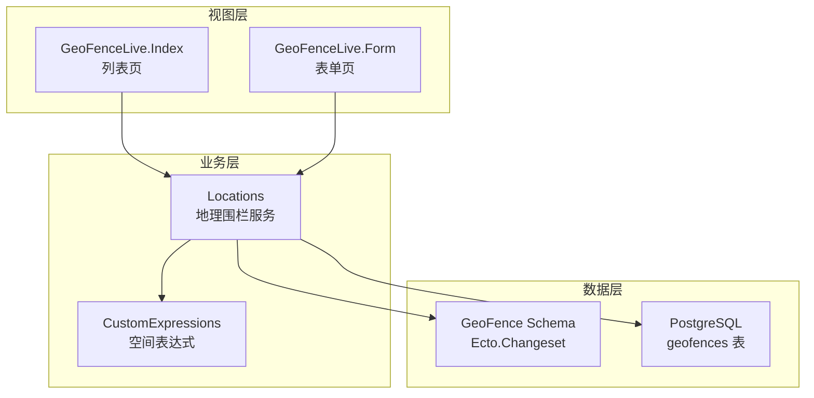
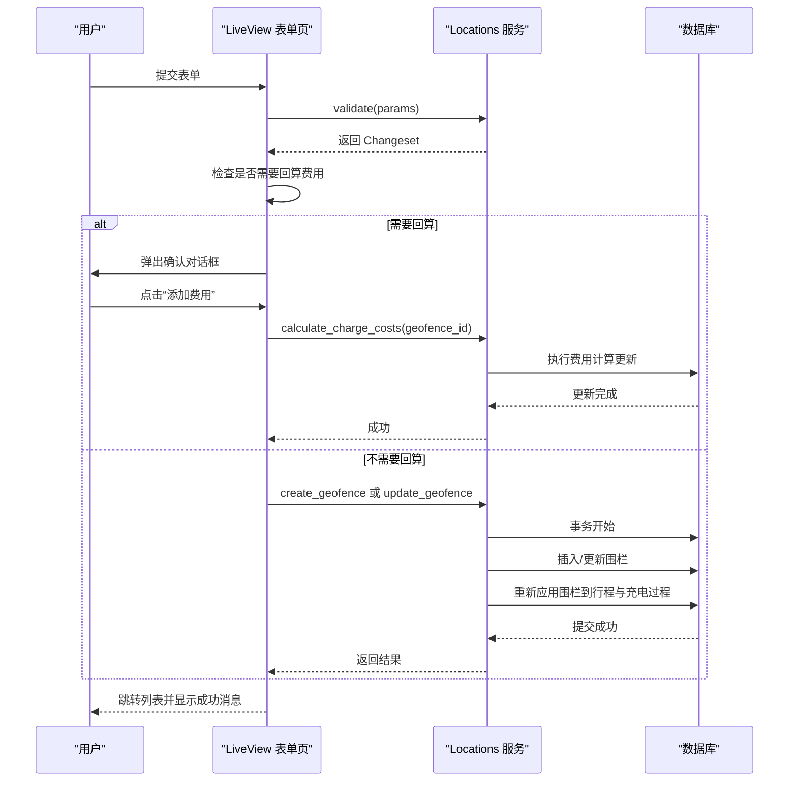
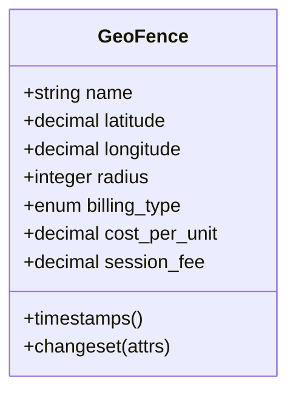
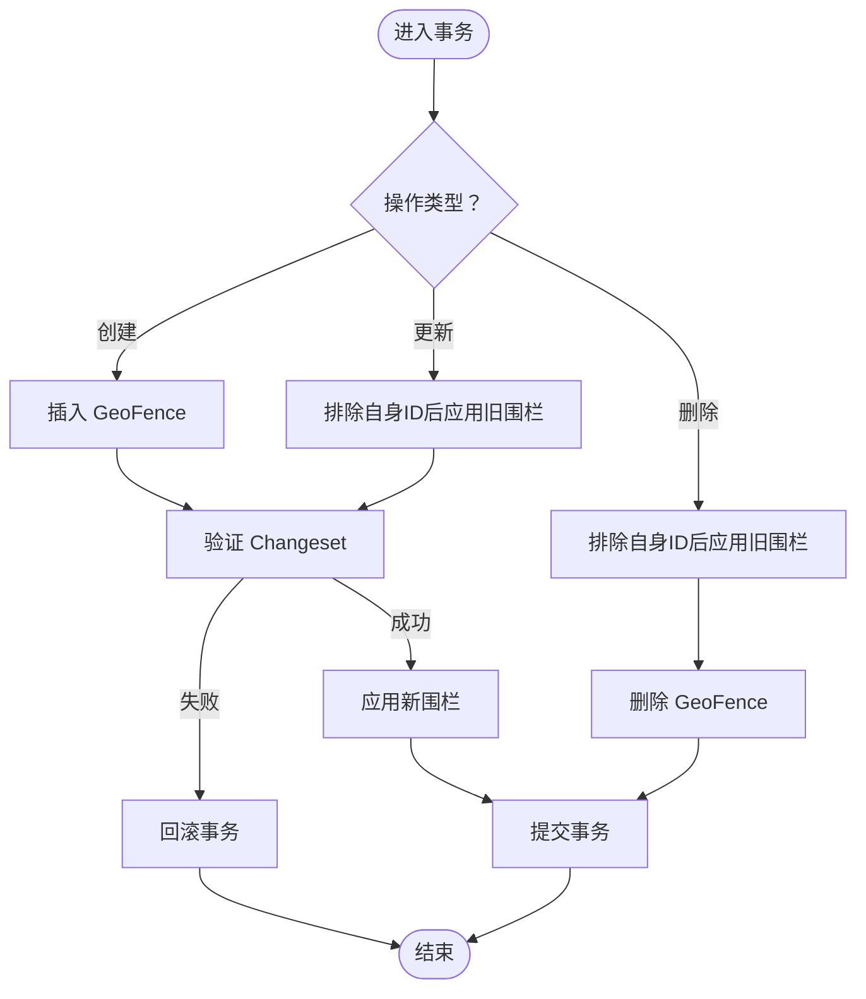
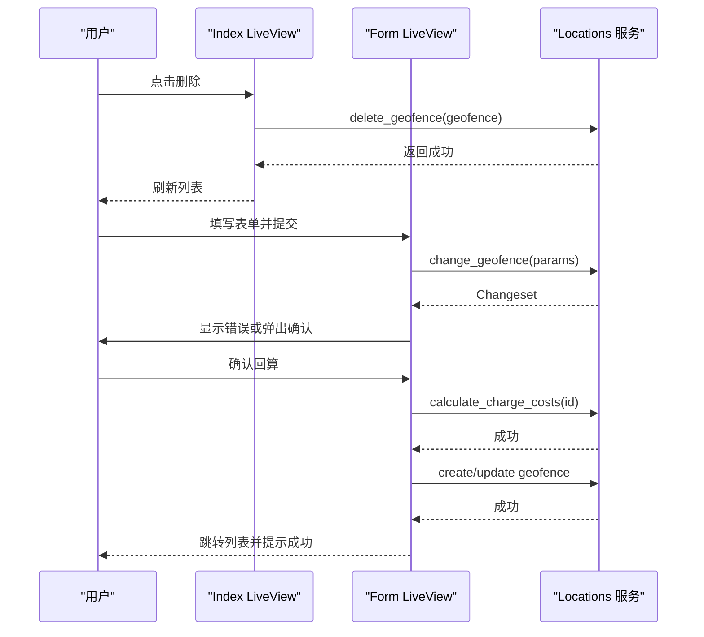
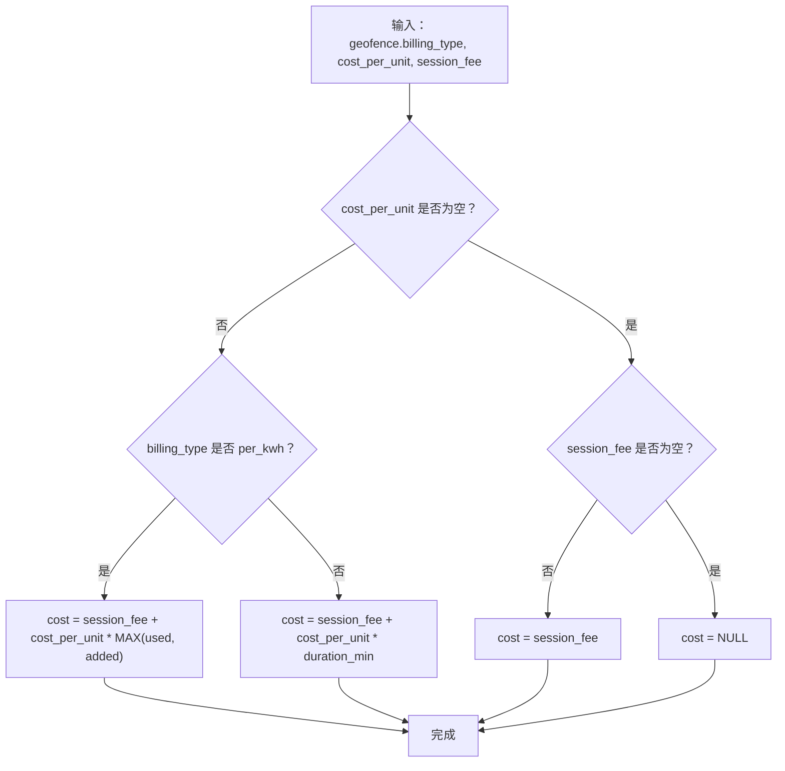
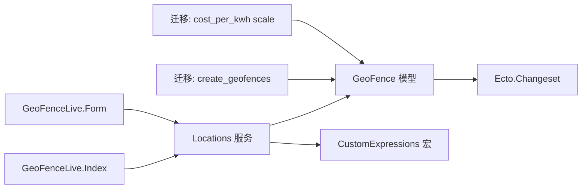

# 地理围栏管理

<cite>
**本文引用的文件**
- [lib/teslamate/locations/geo_fence.ex](file://lib/teslamate/locations/geo_fence.ex)
- [lib/teslamate/locations.ex](file://lib/teslamate/locations.ex)
- [lib/teslamate/custom_expressions.ex](file://lib/teslamate/custom_expressions.ex)
- [lib/teslamate_web/live/geofence_live/index.ex](file://lib/teslamate_web/live/geofence_live/index.ex)
- [lib/teslamate_web/live/geofence_live/form.ex](file://lib/teslamate_web/live/geofence_live/form.ex)
- [lib/teslamate_web/live/geofence_live/index.html.heex](file://lib/teslamate_web/live/geofence_live/index.html.heex)
- [lib/teslamate_web/live/geofence_live/form.html.heex](file://lib/teslamate_web/live/geofence_live/form.html.heex)
- [test/teslamate/locations/geofences_test.exs](file://test/teslamate/locations/geofences_test.exs)
- [test/teslamate_web/live/geofence_live_test.exs](file://test/teslamate_web/live/geofence_live_test.exs)
- [test/teslamate/log/log_charging_test.exs](file://test/teslamate/log/log_charging_test.exs)
- [priv/repo/migrations/20190810151901_create_geofences.exs](file://priv/repo/migrations/20190810151901_create_geofences.exs)
- [priv/repo/migrations/20200212001245_location_based_charge_cost_increase_scale.exs](file://priv/repo/migrations/20200212001245_location_based_charge_cost_increase_scale.exs)
</cite>

## 目录
1. [简介](#简介)
2. [项目结构](#项目结构)
3. [核心组件](#核心组件)
4. [架构总览](#架构总览)
5. [详细组件分析](#详细组件分析)
6. [依赖关系分析](#依赖关系分析)
7. [性能考量](#性能考量)
8. [故障排查指南](#故障排查指南)
9. [结论](#结论)
10. [附录](#附录)

## 简介
本章节面向通过Web界面进行地理围栏（GeoFence）的增删改查操作，系统性说明：
- GeoFence数据模型字段含义与约束
- 变更集（Changeset）验证规则
- create/update/delete事务处理与数据一致性保障
- Web Live视图与后端服务的交互流程
- 计费类型的计算逻辑与费用字段校验

## 项目结构
地理围栏功能由以下层次组成：
- 数据层：Ecto Schema定义GeoFence模型与验证规则；提供查询与事务方法
- 业务层：封装创建、更新、删除、查找、计费计算等核心逻辑
- 视图层：Phoenix LiveView页面负责列表与表单交互，支持实时地图与错误提示
- 测试层：覆盖验证规则、事务一致性、重叠区域处理、计费计算等场景

图表来源
- [lib/teslamate_web/live/geofence_live/index.ex](file://lib/teslamate_web/live/geofence_live/index.ex#L1-L39)
- [lib/teslamate_web/live/geofence_live/form.ex](file://lib/teslamate_web/live/geofence_live/form.ex#L1-L191)
- [lib/teslamate/locations.ex](file://lib/teslamate/locations.ex#L100-L257)
- [lib/teslamate/locations/geo_fence.ex](file://lib/teslamate/locations/geo_fence.ex#L1-L37)
- [lib/teslamate/custom_expressions.ex](file://lib/teslamate/custom_expressions.ex#L37-L92)

章节来源
- [lib/teslamate_web/live/geofence_live/index.ex](file://lib/teslamate_web/live/geofence_live/index.ex#L1-L39)
- [lib/teslamate_web/live/geofence_live/form.ex](file://lib/teslamate_web/live/geofence_live/form.ex#L1-L191)
- [lib/teslamate/locations.ex](file://lib/teslamate/locations.ex#L100-L257)
- [lib/teslamate/locations/geo_fence.ex](file://lib/teslamate/locations/geo_fence.ex#L1-L37)
- [lib/teslamate/custom_expressions.ex](file://lib/teslamate/custom_expressions.ex#L37-L92)

## 核心组件
- GeoFence数据模型与验证规则
  - 字段：名称、纬度、经度、半径、计费类型、每单位成本、会话费用
  - 验证：名称必填、经纬度必填、半径范围限制（>0且<5000）、会话费用非负
  - 名称自动去除空白
- 业务服务Locations
  - 列表、获取、查找最近围栏
  - 创建/更新/删除：均在事务中执行，并对相关行程与充电过程重新应用围栏归属
  - 计数未计费充电过程、按计费类型计算充电费用
- 视图层Live组件
  - 列表页：展示围栏、支持删除事件
  - 表单页：实时验证、保存、费用回算确认弹窗

章节来源
- [lib/teslamate/locations/geo_fence.ex](file://lib/teslamate/locations/geo_fence.ex#L1-L37)
- [lib/teslamate/locations.ex](file://lib/teslamate/locations.ex#L160-L257)
- [lib/teslamate_web/live/geofence_live/index.ex](file://lib/teslamate_web/live/geofence_live/index.ex#L1-L39)
- [lib/teslamate_web/live/geofence_live/form.ex](file://lib/teslamate_web/live/geofence_live/form.ex#L1-L191)

## 架构总览
地理围栏管理采用“视图层-业务层-数据层”的分层设计，关键交互如下：
- 用户在列表页发起删除操作，Live组件调用业务层方法并刷新列表
- 在表单页提交时，先进行Changeset验证，再根据是否涉及计费字段变更决定是否弹出“回算费用”确认框
- 业务层在事务中完成创建/更新/删除，并通过空间表达式重新计算行程与充电过程的围栏归属

图表来源
- [lib/teslamate_web/live/geofence_live/form.ex](file://lib/teslamate_web/live/geofence_live/form.ex#L50-L191)
- [lib/teslamate/locations.ex](file://lib/teslamate/locations.ex#L182-L214)
- [lib/teslamate/locations.ex](file://lib/teslamate/locations.ex#L231-L255)

## 详细组件分析

### GeoFence数据模型与验证规则
- 字段说明
  - 名称：字符串，必填，提交前自动去除空白
  - 纬度/经度：十进制数值，必填
  - 半径：整数，必须大于0且小于5000米
  - 计费类型：枚举，可选值为按kWh或按分钟
  - 每单位成本：十进制，可为空
  - 会话费用：十进制，可为空且必须非负
- 验证规则
  - 必填字段：名称、纬度、经度、半径
  - 数值范围：半径>0且<5000；会话费用≥0
  - 名称去空白：使用更新变更对名称进行trim

图表来源
- [lib/teslamate/locations/geo_fence.ex](file://lib/teslamate/locations/geo_fence.ex#L1-L37)

章节来源
- [lib/teslamate/locations/geo_fence.ex](file://lib/teslamate/locations/geo_fence.ex#L1-L37)
- [test/teslamate/locations/geofences_test.exs](file://test/teslamate/locations/geofences_test.exs#L60-L82)

### 事务处理与数据一致性（create_geofence/update_geofence/delete_geofence）
- 事务策略
  - create_geofence：先插入GeoFence，再调用apply_geofence对相关记录重新赋值围栏ID
  - update_geofence：先排除自身ID后应用旧围栏，再更新GeoFence，最后应用新围栏
  - delete_geofence：先排除自身ID后应用旧围栏，再删除GeoFence
- apply_geofence算法
  - 使用PostgreSQL地球坐标函数earth_box与earth_distance判断点是否在圆内
  - 对Drive的起止位置、ChargingProcess的位置分别更新geofence_id
  - 优先选择距离最近且在范围内的围栏
- 复杂度与性能
  - 每次更新涉及对三张表的批量UPDATE，复杂度与记录量成正比
  - 通过索引与空间函数优化，避免逐条扫描

图表来源
- [lib/teslamate/locations.ex](file://lib/teslamate/locations.ex#L182-L214)
- [lib/teslamate/locations.ex](file://lib/teslamate/locations.ex#L128-L159)
- [lib/teslamate/custom_expressions.ex](file://lib/teslamate/custom_expressions.ex#L37-L92)

章节来源
- [lib/teslamate/locations.ex](file://lib/teslamate/locations.ex#L128-L159)
- [lib/teslamate/locations.ex](file://lib/teslamate/locations.ex#L182-L214)
- [lib/teslamate/custom_expressions.ex](file://lib/teslamate/custom_expressions.ex#L37-L92)
- [test/teslamate/locations/geofences_test.exs](file://test/teslamate/locations/geofences_test.exs#L144-L209)

### Web Live视图与后端交互
- 列表页（GeoFenceLive.Index）
  - 加载所有GeoFence并按名称排序
  - 处理删除事件：获取目标GeoFence并调用Locations.delete_geofence，随后从本地列表剔除并返回
- 表单页（GeoFenceLive.Form）
  - 支持新建与编辑两种模式，初始化默认半径与经纬度
  - 实时验证：phx-change触发validate，生成Changeset并渲染错误
  - 保存流程：若计费字段发生变更且存在未计费的充电过程，则弹出确认对话框；否则直接保存
  - 回算费用：点击“添加费用”后调用Locations.calculate_charge_costs，仅对未计费记录进行回算

图表来源
- [lib/teslamate_web/live/geofence_live/index.ex](file://lib/teslamate_web/live/geofence_live/index.ex#L28-L38)
- [lib/teslamate_web/live/geofence_live/form.ex](file://lib/teslamate_web/live/geofence_live/form.ex#L50-L191)
- [lib/teslamate/locations.ex](file://lib/teslamate/locations.ex#L231-L255)

章节来源
- [lib/teslamate_web/live/geofence_live/index.ex](file://lib/teslamate_web/live/geofence_live/index.ex#L1-L39)
- [lib/teslamate_web/live/geofence_live/form.ex](file://lib/teslamate_web/live/geofence_live/form.ex#L1-L191)
- [lib/teslamate_web/live/geofence_live/index.html.heex](file://lib/teslamate_web/live/geofence_live/index.html.heex#L1-L73)
- [lib/teslamate_web/live/geofence_live/form.html.heex](file://lib/teslamate_web/live/geofence_live/form.html.heex#L1-L182)

### 计费类型与费用字段校验
- 计费类型
  - per_kwh：按消耗电量计费
  - per_minute：按充电时长计费
- 费用字段
  - cost_per_unit：每单位成本，可为空或负数（测试覆盖）
  - session_fee：会话费用，可为空且必须≥0
- 计费计算逻辑
  - 若两者都为空则不设置费用
  - per_kwh：会话费用 + cost_per_unit × MAX(used, added)
  - per_minute：会话费用 + cost_per_unit × duration_min
  - 仅对未计费记录进行回算

图表来源
- [lib/teslamate/locations.ex](file://lib/teslamate/locations.ex#L231-L255)
- [test/teslamate/log/log_charging_test.exs](file://test/teslamate/log/log_charging_test.exs#L411-L566)

章节来源
- [lib/teslamate/locations.ex](file://lib/teslamate/locations.ex#L231-L255)
- [test/teslamate/log/log_charging_test.exs](file://test/teslamate/log/log_charging_test.exs#L411-L566)

## 依赖关系分析
- GeoFence模型依赖Ecto.Changeset进行字段校验
- Locations服务依赖自定义空间表达式宏within_geofence?与distance
- Live视图依赖Locations服务与Settings/Log模块
- 数据库迁移包含geofences表结构与历史字段调整

图表来源
- [lib/teslamate/locations/geo_fence.ex](file://lib/teslamate/locations/geo_fence.ex#L1-L37)
- [lib/teslamate/locations.ex](file://lib/teslamate/locations.ex#L100-L257)
- [lib/teslamate/custom_expressions.ex](file://lib/teslamate/custom_expressions.ex#L37-L92)
- [lib/teslamate_web/live/geofence_live/index.ex](file://lib/teslamate_web/live/geofence_live/index.ex#L1-L39)
- [lib/teslamate_web/live/geofence_live/form.ex](file://lib/teslamate_web/live/geofence_live/form.ex#L1-L191)
- [priv/repo/migrations/20190810151901_create_geofences.exs](file://priv/repo/migrations/20190810151901_create_geofences.exs#L1-L18)
- [priv/repo/migrations/20200212001245_location_based_charge_cost_increase_scale.exs](file://priv/repo/migrations/20200212001245_location_based_charge_cost_increase_scale.exs#L1-L15)

章节来源
- [lib/teslamate/locations/geo_fence.ex](file://lib/teslamate/locations/geo_fence.ex#L1-L37)
- [lib/teslamate/locations.ex](file://lib/teslamate/locations.ex#L100-L257)
- [lib/teslamate/custom_expressions.ex](file://lib/teslamate/custom_expressions.ex#L37-L92)
- [lib/teslamate_web/live/geofence_live/index.ex](file://lib/teslamate_web/live/geofence_live/index.ex#L1-L39)
- [lib/teslamate_web/live/geofence_live/form.ex](file://lib/teslamate_web/live/geofence_live/form.ex#L1-L191)
- [priv/repo/migrations/20190810151901_create_geofences.exs](file://priv/repo/migrations/20190810151901_create_geofences.exs#L1-L18)
- [priv/repo/migrations/20200212001245_location_based_charge_cost_increase_scale.exs](file://priv/repo/migrations/20200212001245_location_based_charge_cost_increase_scale.exs#L1-L15)

## 性能考量
- 空间查询优化
  - 使用earth_box与earth_distance减少全表扫描
  - 通过order_by distance优先匹配最近围栏，提高命中率
- 事务边界
  - 所有变更均在单个事务中完成，保证一致性但可能增加锁竞争
- 批量更新
  - apply_geofence对多表执行批量UPDATE，建议在低峰期运行大规模更新
- 前端交互
  - 表单页仅在必要时弹出回算确认，避免不必要的后端计算

## 故障排查指南
- 常见验证错误
  - 名称/经纬度/半径为空：检查前端必填项与后端Changeset
  - 半径越界（≤0或≥5000）：调整半径至有效范围
  - 会话费用为负：修正为≥0
- 事务回滚
  - 若更新导致重叠围栏冲突或计费字段变更引发大量未计费记录，需先处理这些记录或降低半径/移动位置
- 计费未回算
  - 确认是否选择了“添加费用”；仅对cost为NULL的记录进行回算
- 删除失败
  - 检查是否存在依赖记录；删除前确保无外部引用

章节来源
- [lib/teslamate/locations/geo_fence.ex](file://lib/teslamate/locations/geo_fence.ex#L20-L37)
- [lib/teslamate/locations.ex](file://lib/teslamate/locations.ex#L182-L214)
- [lib/teslamate/locations.ex](file://lib/teslamate/locations.ex#L231-L255)
- [test/teslamate/locations/geofences_test.exs](file://test/teslamate/locations/geofences_test.exs#L60-L82)

## 结论
该地理围栏管理功能以清晰的分层架构实现了完整的增删改查与计费回算能力。通过Changeset严格约束字段合法性，借助PostgreSQL空间函数高效定位围栏归属，并在事务中保证数据一致性。Web Live视图提供了直观的交互体验，配合回算确认机制确保费用计算的准确性与可控性。

## 附录
- 字段与约束速查
  - 名称：必填，自动去空白
  - 纬度/经度：必填，十进制
  - 半径：整数，0<半径<5000
  - 计费类型：per_kwh或per_minute
  - 每单位成本：十进制，可空或负数
  - 会话费用：十进制，可空且≥0
- 迁移要点
  - 初始创建geofences表及地址外键
  - 后续调整cost_per_kwh精度与scale

章节来源
- [lib/teslamate/locations/geo_fence.ex](file://lib/teslamate/locations/geo_fence.ex#L1-L37)
- [priv/repo/migrations/20190810151901_create_geofences.exs](file://priv/repo/migrations/20190810151901_create_geofences.exs#L1-L18)
- [priv/repo/migrations/20200212001245_location_based_charge_cost_increase_scale.exs](file://priv/repo/migrations/20200212001245_location_based_charge_cost_increase_scale.exs#L1-L15)