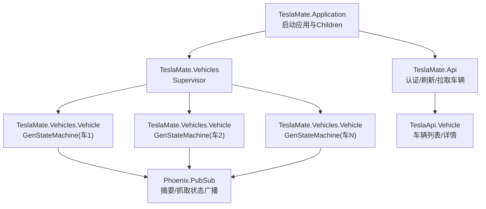
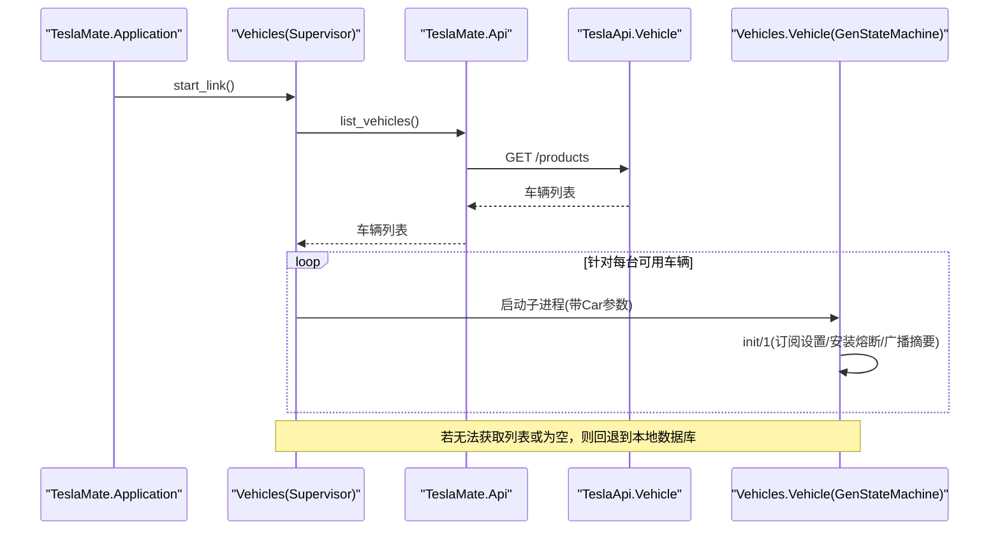
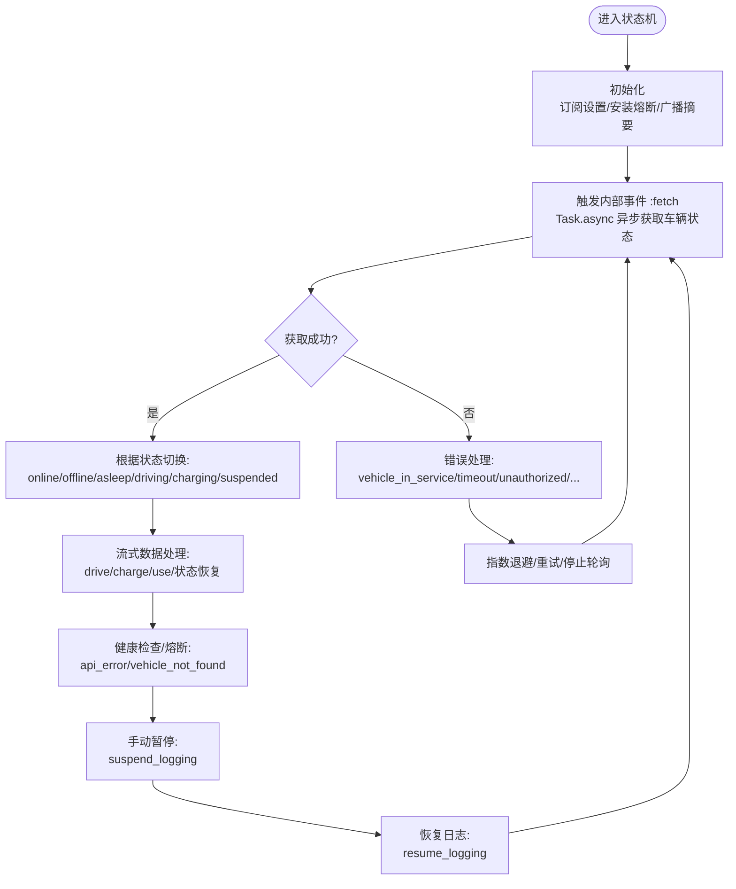
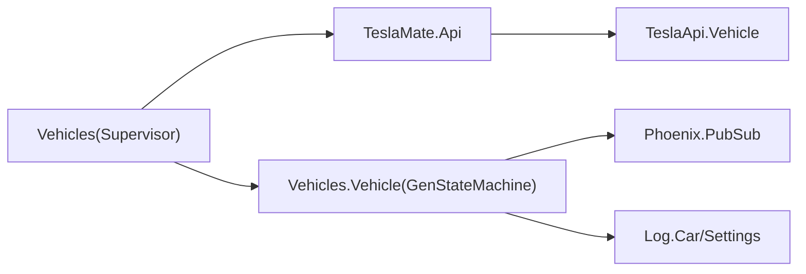
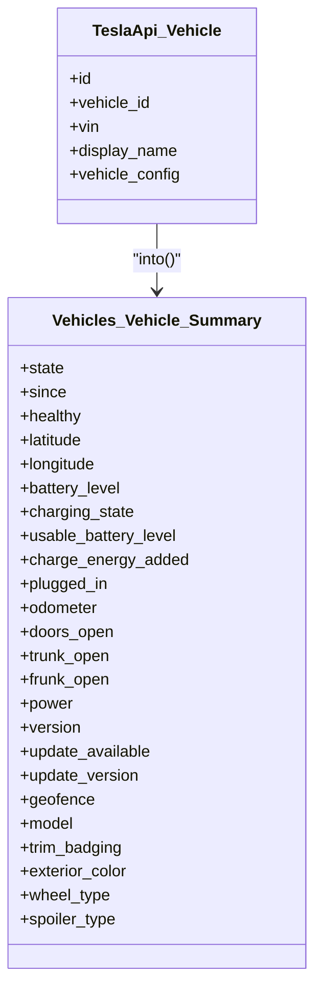
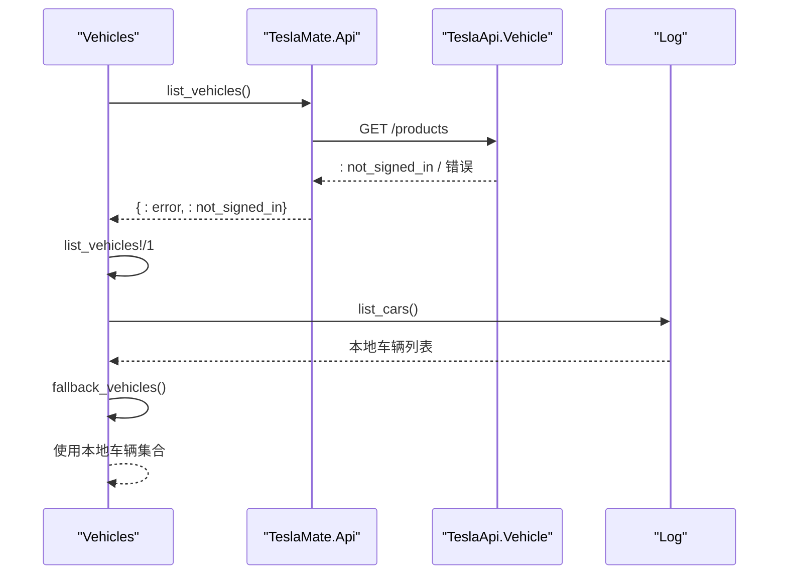

# 多车辆支持

<cite>
**本文引用的文件**
- [lib/teslamate/vehicles.ex](file://lib/teslamate/vehicles.ex)
- [lib/teslamate/vehicles/vehicle.ex](file://lib/teslamate/vehicles/vehicle.ex)
- [lib/teslamate/vehicles/vehicle/summary.ex](file://lib/teslamate/vehicles/vehicle/summary.ex)
- [lib/tesla_api/vehicle.ex](file://lib/tesla_api/vehicle.ex)
- [lib/teslamate/api.ex](file://lib/teslamate/api.ex)
- [lib/teslamate/application.ex](file://lib/teslamate/application.ex)
- [lib/teslamate/log/car.ex](file://lib/teslamate/log/car.ex)
- [lib/teslamate/settings/car_settings.ex](file://lib/teslamate/settings/car_settings.ex)
- [priv/repo/migrations/20190903151524_add_unique_index_on_vins.exs](file://priv/repo/migrations/20190903151524_add_unique_index_on_vins.exs)
- [priv/repo/migrations/20210812173700_car_priorities.exs](file://priv/repo/migrations/20210812173700_car_priorities.exs)
- [priv/repo/migrations/20210831153305_add_not_null_constraint_to_display_priority.exs](file://priv/repo/migrations/20210831153305_add_not_null_constraint_to_display_priority.exs)
- [priv/repo/migrations/20240603152807_add_enabled_to_car_settings.exs](file://priv/repo/migrations/20240603152807_add_enabled_to_car_settings.exs)
- [test/teslamate/vehicles/identification_test.exs](file://test/teslamate/vehicles/identification_test.exs)
- [test/teslamate/vehicles/vehicle_test.exs](file://test/teslamate/vehicles/vehicle_test.exs)
</cite>

## 目录
1. [简介](#简介)
2. [项目结构](#项目结构)
3. [核心组件](#核心组件)
4. [架构总览](#架构总览)
5. [详细组件分析](#详细组件分析)
6. [依赖关系分析](#依赖关系分析)
7. [性能考量](#性能考量)
8. [故障排查指南](#故障排查指南)
9. [结论](#结论)
10. [附录](#附录)

## 简介
本文件系统性阐述 TeslaMate 的多车辆支持设计与实现，重点覆盖以下方面：
- 如何通过 Tesla API 获取账户下所有车辆并动态创建 GenStateMachine 子进程进行状态管理
- 车辆识别与匹配逻辑（VIN、车辆ID、显示名称）
- 车辆优先级设置与启用/禁用控制
- 基于 Supervisor 的多车辆容错管理
- 降级策略：当无法从 Tesla API 获取车辆列表时，如何回退到本地数据库记录
- vehicles.ex 中 init/1 回调如何动态生成子进程

## 项目结构
围绕多车辆支持的关键模块与文件如下：
- 应用启动入口：TeslaMate.Application 启动 Vehicles Supervisor
- 多车辆管理器：TeslaMate.Vehicles（Supervisor）负责拉取车辆、创建子进程、过滤启用状态
- 每辆车的状态机：TeslaMate.Vehicles.Vehicle（GenStateMachine）负责单车状态机、订阅/广播、健康检查、流式数据处理等
- 车辆摘要模型：TeslaMate.Vehicles.Vehicle.Summary 将 TeslaApi.Vehicle 的状态映射为统一视图
- Tesla API 客户端：TeslaApi.Vehicle 提供车辆列表与详情接口
- API 服务：TeslaMate.Api 负责认证、刷新令牌、拉取车辆列表、预加载在线车辆状态
- 数据模型：Log.Car、Settings.CarSettings 描述车辆与设置
- 迁移：为 VIN 唯一索引、显示优先级、启用字段等提供数据库支持

图表来源
- [lib/teslamate/application.ex](file://lib/teslamate/application.ex#L16-L38)
- [lib/teslamate/vehicles.ex](file://lib/teslamate/vehicles.ex#L48-L62)
- [lib/teslamate/vehicles/vehicle.ex](file://lib/teslamate/vehicles/vehicle.ex#L122-L157)
- [lib/teslamate/api.ex](file://lib/teslamate/api.ex#L31-L50)
- [lib/tesla_api/vehicle.ex](file://lib/tesla_api/vehicle.ex#L25-L67)

章节来源
- [lib/teslamate/application.ex](file://lib/teslamate/application.ex#L16-L38)
- [lib/teslamate/vehicles.ex](file://lib/teslamate/vehicles.ex#L48-L62)

## 核心组件
- TeslaMate.Vehicles（Supervisor）
  - 作用：拉取账户下车辆列表，为每台可用车辆创建独立的 TeslaMate.Vehicles.Vehicle 子进程；根据 CarSettings.enabled 过滤启用状态；提供 list/summary/suspend/resume 等代理方法
  - 关键点：init/1 中使用 :one_for_one 策略与重启限制；list/1 使用并发任务汇总各车摘要；fallback_vehicles 在无法获取 Tesla API 列表时回退到本地数据库
- TeslaMate.Vehicles.Vehicle（GenStateMachine）
  - 作用：单车状态机，维护 Data 结构，处理 fetch、stream、状态切换、健康检查、订阅/广播、设置变更等
  - 关键点：identify/1 解析车辆型号与营销名称；healthy?/fuse 用于熔断与健康检查；resume_logging/suspend_logging 控制日志暂停/恢复
- TeslaApi.Vehicle
  - 作用：封装 Tesla API 的车辆列表与详情接口，解析响应为结构化数据
- TeslaMate.Api
  - 作用：统一认证、令牌刷新、车辆列表拉取与预加载；处理授权错误与限流
- Log.Car / Settings.CarSettings
  - 作用：持久化车辆信息与设置；VIN 唯一约束；启用字段；显示优先级

章节来源
- [lib/teslamate/vehicles.ex](file://lib/teslamate/vehicles.ex#L48-L142)
- [lib/teslamate/vehicles/vehicle.ex](file://lib/teslamate/vehicles/vehicle.ex#L50-L111)
- [lib/tesla_api/vehicle.ex](file://lib/tesla_api/vehicle.ex#L25-L96)
- [lib/teslamate/api.ex](file://lib/teslamate/api.ex#L31-L50)
- [lib/teslamate/log/car.ex](file://lib/teslamate/log/car.ex#L1-L55)
- [lib/teslamate/settings/car_settings.ex](file://lib/teslamate/settings/car_settings.ex#L1-L36)

## 架构总览
多车辆架构以 Supervisor 为中心，按车辆维度拆分为独立的 GenStateMachine 子进程，每个子进程负责该车的状态采集、事件处理与健康监控。API 层负责统一认证与车辆列表拉取，失败时回退到本地数据库。

图表来源
- [lib/teslamate/application.ex](file://lib/teslamate/application.ex#L16-L38)
- [lib/teslamate/vehicles.ex](file://lib/teslamate/vehicles.ex#L48-L108)
- [lib/teslamate/api.ex](file://lib/teslamate/api.ex#L31-L50)
- [lib/tesla_api/vehicle.ex](file://lib/tesla_api/vehicle.ex#L25-L67)
- [lib/teslamate/vehicles/vehicle.ex](file://lib/teslamate/vehicles/vehicle.ex#L160-L200)

## 详细组件分析

### 多车辆管理器（Vehicles Supervisor）
- 动态生成子进程
  - vehicles.ex 的 init/1 会读取 opts[:vehicles] 或调用 TeslaMate.Api.list_vehicles() 获取车辆列表
  - 对每辆车调用 create_or_update!/1 创建/更新 Log.Car，并基于 CarSettings.enabled 过滤启用状态
  - 使用 Supervisor.init(children, strategy: :one_for_one, ...) 为每台车创建独立子进程
- 降级策略
  - list_vehicles!/1 在 TeslaMate.Api.list_vehicles() 返回 :not_signed_in 或其他错误时，回退到 Log.list_cars() 并转换为 TeslaApi.Vehicle 形态
  - fallback_vehicles() 记录警告日志并返回本地车辆集合
- 车辆摘要与控制
  - list/1 并发查询各车摘要并排序；提供 resume_logging/suspend_logging/subscribe_to_summary 等代理方法

章节来源
- [lib/teslamate/vehicles.ex](file://lib/teslamate/vehicles.ex#L48-L108)
- [lib/teslamate/vehicles.ex](file://lib/teslamate/vehicles.ex#L110-L142)

### GenStateMachine 单车状态机（Vehicles.Vehicle）
- 初始化与健康检查
  - init/1 读取 Car 与设置，安装熔断器（vehicle_not_found、api_error），订阅设置变化，广播摘要
- 车辆识别与匹配
  - identify/1 从 vehicle_config 推导 model、trim_badging、marketing_name 等，用于后续设置与展示
  - create_or_update!/1 在 Log.Car 中写入 name/eid/vid/vin 等字段，并基于识别结果设置默认 CarSettings
- 状态机事件与流程
  - handle_event(info, :fetch, ...) 触发异步 fetch，处理 online/offline/asleep/unknown 等状态
  - handle_event(info, :stream, ...) 处理流式数据，驱动/充电/使用检测，以及在 suspended 状态下的唤醒与恢复
  - resume_logging/suspend_logging 控制日志暂停/恢复，支持在 driving/charging/updating 等状态下拒绝操作
- 健康检查与熔断
  - healthy?/fuse 通过 :fuse 安装与熔断，当连续错误超过阈值时触发降级行为（如停止轮询）

图表来源
- [lib/teslamate/vehicles/vehicle.ex](file://lib/teslamate/vehicles/vehicle.ex#L160-L200)
- [lib/teslamate/vehicles/vehicle.ex](file://lib/teslamate/vehicles/vehicle.ex#L302-L436)
- [lib/teslamate/vehicles/vehicle.ex](file://lib/teslamate/vehicles/vehicle.ex#L438-L660)

章节来源
- [lib/teslamate/vehicles/vehicle.ex](file://lib/teslamate/vehicles/vehicle.ex#L50-L111)
- [lib/teslamate/vehicles/vehicle.ex](file://lib/teslamate/vehicles/vehicle.ex#L160-L200)
- [lib/teslamate/vehicles/vehicle.ex](file://lib/teslamate/vehicles/vehicle.ex#L302-L436)
- [lib/teslamate/vehicles/vehicle.ex](file://lib/teslamate/vehicles/vehicle.ex#L438-L660)

### 车辆识别与匹配逻辑（VIN、车辆ID、显示名称）
- VIN、车辆ID、显示名称
  - TeslaApi.Vehicle 结构包含 id/vehicle_id/vin/display_name 等字段
  - Log.Car 持久化 eid/vid/vin/name 等字段，并建立唯一约束（VIN/VID/EID）
- 匹配与去重
  - vehicles.ex 的 init/1 中使用 uniq_by(fn {_mod, car: %Car{id: id}} -> id end) 去重
  - create_or_update!/1 通过 get_car_by(vin/vid/eid) 三种方式定位已有车辆，避免重复创建
- 显示名称与识别
  - identify/1 基于 vehicle_config 推导 model/trim_badging/marketing_name，用于设置默认 suspend_min 等
  - 测试验证了 display_name 变更时，Log.Car.name 也会随之更新

章节来源
- [lib/tesla_api/vehicle.ex](file://lib/tesla_api/vehicle.ex#L1-L24)
- [lib/tesla_api/vehicle.ex](file://lib/tesla_api/vehicle.ex#L75-L96)
- [lib/teslamate/log/car.ex](file://lib/teslamate/log/car.ex#L1-L55)
- [lib/teslamate/vehicles.ex](file://lib/teslamate/vehicles.ex#L48-L62)
- [lib/teslamate/vehicles.ex](file://lib/teslamate/vehicles.ex#L110-L142)
- [test/teslamate/vehicles/identification_test.exs](file://test/teslamate/vehicles/identification_test.exs#L1-L84)

### 车辆优先级与启用/禁用控制
- 显示优先级
  - 迁移添加了 cars 表的 display_priority 字段，并设为非空，默认值为 1
  - vehicles.ex 的 list/1 会对摘要结果按 Car.id 排序，通常配合 display_priority 实现前端展示顺序
- 启用/禁用
  - CarSettings.enabled 默认 true，vehicles.ex 的 init/1 会过滤 settings.enabled=false 的车辆不启动子进程
  - 迁移为 car_settings 添加 enabled 字段，支持全局/单车控制

章节来源
- [priv/repo/migrations/20210812173700_car_priorities.exs](file://priv/repo/migrations/20210812173700_car_priorities.exs#L1-L9)
- [priv/repo/migrations/20210831153305_add_not_null_constraint_to_display_priority.exs](file://priv/repo/migrations/20210831153305_add_not_null_constraint_to_display_priority.exs#L1-L15)
- [priv/repo/migrations/20240603152807_add_enabled_to_car_settings.exs](file://priv/repo/migrations/20240603152807_add_enabled_to_car_settings.exs#L1-L9)
- [lib/teslamate/vehicles.ex](file://lib/teslamate/vehicles.ex#L48-L62)
- [lib/teslamate/settings/car_settings.ex](file://lib/teslamate/settings/car_settings.ex#L1-L36)

### Supervisor 容错与多车辆管理
- Supervisor 策略
  - vehicles.ex 使用 :one_for_one 策略与 max_restarts/max_seconds 限制，确保单车异常不影响整体
- 重启与降级
  - vehicles.ex 提供 kill/restart 方法，restart 会先停止再阻塞等待重新启动
  - 当 TeslaMate.Api.list_vehicles() 返回 :not_signed_in 或错误时，回退到本地数据库，保证系统可用性

章节来源
- [lib/teslamate/vehicles.ex](file://lib/teslamate/vehicles.ex#L28-L45)
- [lib/teslamate/vehicles.ex](file://lib/teslamate/vehicles.ex#L64-L108)

### vehicles.ex 中 init/1 回调与子进程生成
- 参数与来源
  - init/1 读取 opts[:vehicles]，若未提供则调用 TeslaMate.Api.list_vehicles() 获取
- 子进程规格
  - 使用 opts[:vehicle]（默认 TeslaMate.Vehicles.Vehicle）作为子进程模块，传入 :car 参数为 Log.Car
  - 子进程名称由 TeslaMate.Vehicles.Vehicle.child_spec/1 生成，基于 car.id
- 过滤与去重
  - 去重依据 Car.id；仅启用的车辆才会被纳入 children
- 总结
  - 通过 Supervisor 为每辆车创建独立 GenStateMachine，实现强隔离与容错

章节来源
- [lib/teslamate/vehicles.ex](file://lib/teslamate/vehicles.ex#L48-L62)
- [lib/teslamate/vehicles/vehicle.ex](file://lib/teslamate/vehicles/vehicle.ex#L112-L121)

## 依赖关系分析
- 组件耦合
  - Vehicles 依赖 Api 与 TeslaApi.Vehicle 获取车辆列表；依赖 Log/Settings 进行车辆与设置持久化
  - Vehicles.Vehicle 依赖 Api/TeslaApi.Stream 进行车辆状态与流式数据交互；依赖 Phoenix.PubSub 广播摘要与抓取状态
- 外部依赖
  - Tesla API：车辆列表/详情/vehicle_data；TeslaApi.Error 错误类型驱动熔断与降级
- 循环依赖
  - 未发现循环依赖；各模块职责清晰

图表来源
- [lib/teslamate/vehicles.ex](file://lib/teslamate/vehicles.ex#L48-L62)
- [lib/teslamate/api.ex](file://lib/teslamate/api.ex#L31-L50)
- [lib/tesla_api/vehicle.ex](file://lib/tesla_api/vehicle.ex#L25-L67)
- [lib/teslamate/vehicles/vehicle.ex](file://lib/teslamate/vehicles/vehicle.ex#L122-L157)

章节来源
- [lib/teslamate/vehicles.ex](file://lib/teslamate/vehicles.ex#L48-L62)
- [lib/teslamate/api.ex](file://lib/teslamate/api.ex#L31-L50)
- [lib/teslamate/vehicles/vehicle.ex](file://lib/teslamate/vehicles/vehicle.ex#L122-L157)

## 性能考量
- 并发抓取与限流
  - Vehicles.list/1 使用 Task.async_stream 并发获取各车摘要，max_concurrency 与 timeout 控制资源占用
  - TeslaMate.Api.handle_result 对 :too_many_request 返回 retry_after，避免雪崩
- 轮询间隔与智能调度
  - Vehicles.Vehicle 支持多种轮询间隔（asleep/default/online/charging/minimum），并根据状态动态调整
- 流式 API 优化
  - 当 use_streaming_api=true 且在线时，优先使用流式数据驱动状态机，减少轮询压力

章节来源
- [lib/teslamate/vehicles.ex](file://lib/teslamate/vehicles.ex#L17-L26)
- [lib/teslamate/api.ex](file://lib/teslamate/api.ex#L281-L300)
- [lib/teslamate/vehicles/vehicle.ex](file://lib/teslamate/vehicles/vehicle.ex#L34-L49)

## 故障排查指南
- 无法获取车辆列表
  - 现象：TeslaMate.Api.list_vehicles() 返回 :not_signed_in 或错误
  - 处理：vehicles.ex 的 list_vehicles!/1 会回退到本地数据库，使用 Log.list_cars() 生成 TeslaApi.Vehicle 形态
- 车辆不在服务/离线/休眠
  - 现象：vehicle_in_service、offline、asleep 等状态
  - 处理：状态机自动断开流、降低轮询频率或停止轮询；在 suspended 状态下仍可检测 drive/charge/use
- 授权失败/令牌过期
  - 现象：unauthorized
  - 处理：TeslaMate.Api 安装熔断，触发 :refresh_auth；熔断后删除认证信息，需要重新登录
- 未知错误/超时
  - 现象：unknown、timeout
  - 处理：健康检查熔断，逐步延长轮询间隔；healthy? 为 false 时摘要中体现
- 车辆被移除/ID 变化
  - 现象：vehicle_not_found
  - 处理：熔断达到阈值后触发 Vehicles.kill 重启，避免僵尸进程

章节来源
- [lib/teslamate/vehicles.ex](file://lib/teslamate/vehicles.ex#L79-L108)
- [lib/teslamate/api.ex](file://lib/teslamate/api.ex#L262-L300)
- [lib/teslamate/vehicles/vehicle.ex](file://lib/teslamate/vehicles/vehicle.ex#L361-L436)
- [test/teslamate/vehicles/vehicle_test.exs](file://test/teslamate/vehicles/vehicle_test.exs#L185-L208)

## 结论
多车辆支持通过 Supervisor 将每辆车封装为独立的 GenStateMachine 子进程，结合 Tesla API 的车辆列表与流式数据，实现了高可用、可扩展的多车状态管理。通过识别与匹配逻辑、优先级与启用控制、健康检查与熔断机制，系统在面对网络波动、授权失效、车辆离线等场景时具备良好的降级与自愈能力。

## 附录

### 类图：车辆识别与摘要

图表来源
- [lib/tesla_api/vehicle.ex](file://lib/tesla_api/vehicle.ex#L1-L24)
- [lib/teslamate/vehicles/vehicle/summary.ex](file://lib/teslamate/vehicles/vehicle/summary.ex#L1-L61)

### 时序图：车辆登录失败的降级策略

图表来源
- [lib/teslamate/vehicles.ex](file://lib/teslamate/vehicles.ex#L79-L108)
- [lib/teslamate/api.ex](file://lib/teslamate/api.ex#L31-L50)
- [lib/teslamate/log/car.ex](file://lib/teslamate/log/car.ex#L1-L55)