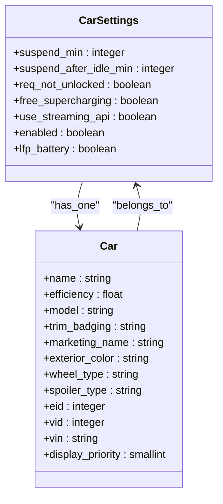
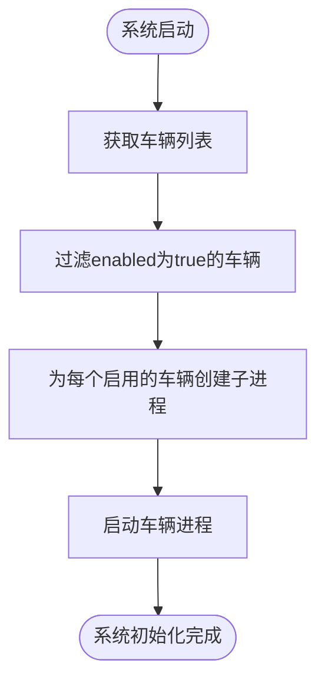
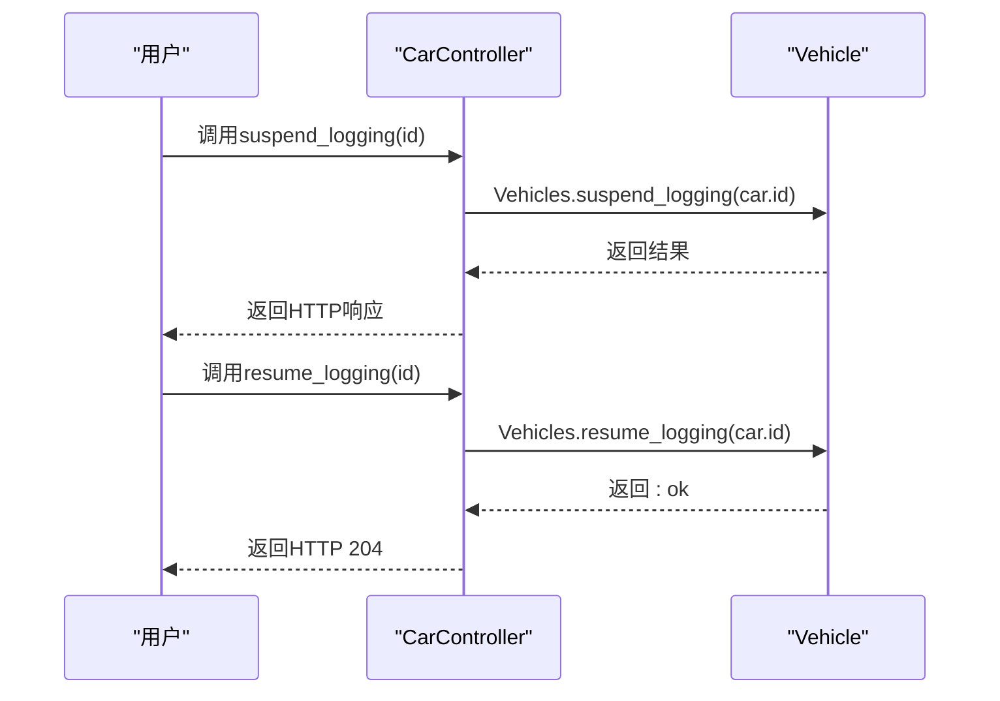
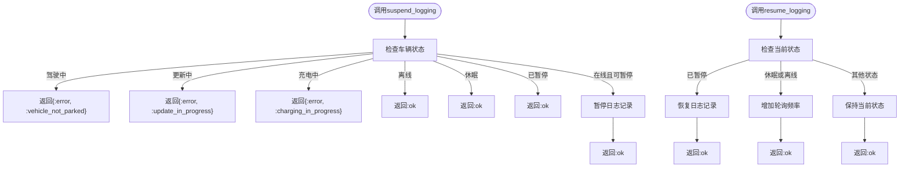
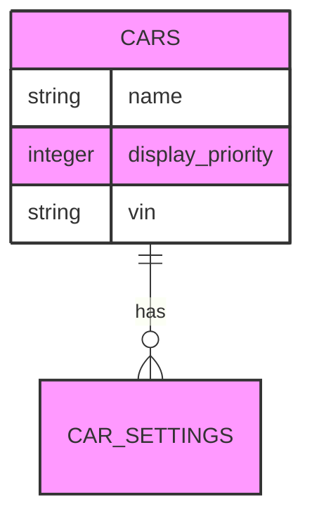

# 车辆优先级与控制

<cite>
**本文档引用的文件**   
- [car_settings.ex](file://lib/teslamate/settings/car_settings.ex)
- [vehicle.ex](file://lib/teslamate/vehicles/vehicle.ex)
- [vehicles.ex](file://lib/teslamate/vehicles.ex)
- [car_controller.ex](file://lib/teslamate_web/controllers/car_controller.ex)
- [CarSettings](file://lib/teslamate/settings/car_settings.ex)
- [Vehicle](file://lib/teslamate/vehicles/vehicle.ex)
- [Vehicles](file://lib/teslamate/vehicles.ex)
- [CarController](file://lib/teslamate_web/controllers/car_controller.ex)
- [suspend_logging_test.exs](file://test/teslamate/vehicles/vehicle/suspend_logging_test.exs)
- [car_priorities.exs](file://priv/repo/migrations/20210812173700_car_priorities.exs)
- [add_not_null_constraint_to_display_priority.exs](file://priv/repo/migrations/20210831153305_add_not_null_constraint_to_display_priority.exs)
- [add_enabled_to_car_settings.exs](file://priv/repo/migrations/20240603152807_add_enabled_to_car_settings.exs)
</cite>

## 目录
1. [简介](#简介)
2. [车辆配置模型](#车辆配置模型)
3. [车辆启用/禁用控制](#车辆启用禁用控制)
4. [日志记录控制API](#日志记录控制api)
5. [车辆状态约束](#车辆状态约束)
6. [显示优先级](#显示优先级)
7. [结论](#结论)

## 简介
本文档详细阐述了TeslaMate系统中车辆优先级与控制功能的实现机制。重点介绍如何通过CarSettings模型实现每辆车的独立配置，以及如何通过API控制车辆日志记录的暂停与恢复。同时，文档还解释了在不同车辆状态下调用控制API的约束条件，以及display_priority字段如何影响多车辆在用户界面中的显示顺序。

## 车辆配置模型
TeslaMate系统通过CarSettings模型实现每辆车的独立配置。该模型定义了车辆的各种配置参数，包括日志记录启用状态、休眠设置、流式API使用等。

**Diagram sources**
- [car_settings.ex](file://lib/teslamate/settings/car_settings.ex#L7-L17)
- [car.ex](file://lib/teslamate/log/car.ex#L8-L30)

**Section sources**
- [car_settings.ex](file://lib/teslamate/settings/car_settings.ex#L1-L36)

## 车辆启用/禁用控制
系统在启动时通过init/1函数中的filter操作实现车辆的启用/禁用控制。只有enabled字段为true的车辆才会启动其进程。

**Diagram sources**
- [vehicles.ex](file://lib/teslamate/vehicles.ex#L50-L56)

**Section sources**
- [vehicles.ex](file://lib/teslamate/vehicles.ex#L48-L62)

## 日志记录控制API
系统提供了suspend_logging/1和resume_logging/1两个API，允许用户手动控制车辆日志记录的暂停与恢复。

**Diagram sources**
- [car_controller.ex](file://lib/teslamate_web/controllers/car_controller.ex#L24-L45)
- [vehicle.ex](file://lib/teslamate/vehicles/vehicle.ex#L150-L155)

**Section sources**
- [car_controller.ex](file://lib/teslamate_web/controllers/car_controller.ex#L24-L45)
- [vehicle.ex](file://lib/teslamate/vehicles/vehicle.ex#L149-L156)

## 车辆状态约束
调用suspend_logging/1和resume_logging/1 API时，系统会根据车辆的当前状态施加不同的约束条件，并返回相应的结果。

**Diagram sources**
- [vehicle.ex](file://lib/teslamate/vehicles/vehicle.ex#L248-L299)
- [vehicle.ex](file://lib/teslamate/vehicles/vehicle.ex#L225-L247)

**Section sources**
- [vehicle.ex](file://lib/teslamate/vehicles/vehicle.ex#L248-L299)
- [suspend_logging_test.exs](file://test/teslamate/vehicles/vehicle/suspend_logging_test.exs#L7-L406)

## 显示优先级
display_priority字段用于影响多车辆在用户界面中的显示顺序。该字段的值越小，车辆在列表中的位置越靠前。

**Diagram sources**
- [car_priorities.exs](file://priv/repo/migrations/20210812173700_car_priorities.exs#L1-L9)
- [add_not_null_constraint_to_display_priority.exs](file://priv/repo/migrations/20210831153305_add_not_null_constraint_to_display_priority.exs#L1-L15)

**Section sources**
- [car_priorities.exs](file://priv/repo/migrations/20210812173700_car_priorities.exs#L1-L9)
- [add_not_null_constraint_to_display_priority.exs](file://priv/repo/migrations/20210831153305_add_not_null_constraint_to_display_priority.exs#L1-L15)

## 结论
TeslaMate系统通过CarSettings模型实现了灵活的车辆配置管理。系统利用enabled字段控制车辆进程的启动，通过suspend_logging和resume_logging API提供手动日志控制功能，并根据车辆状态施加相应的约束。display_priority字段则确保了多车辆环境下用户界面显示的有序性。这些功能共同构成了一个完整、可靠的车辆优先级与控制系统。