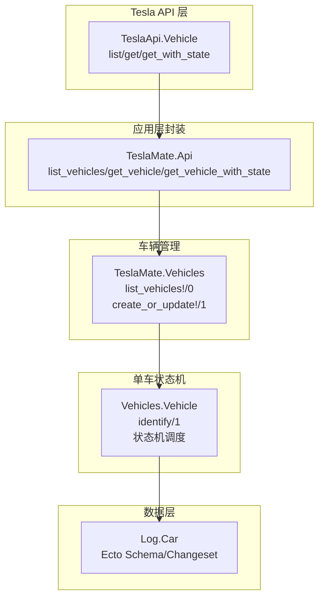
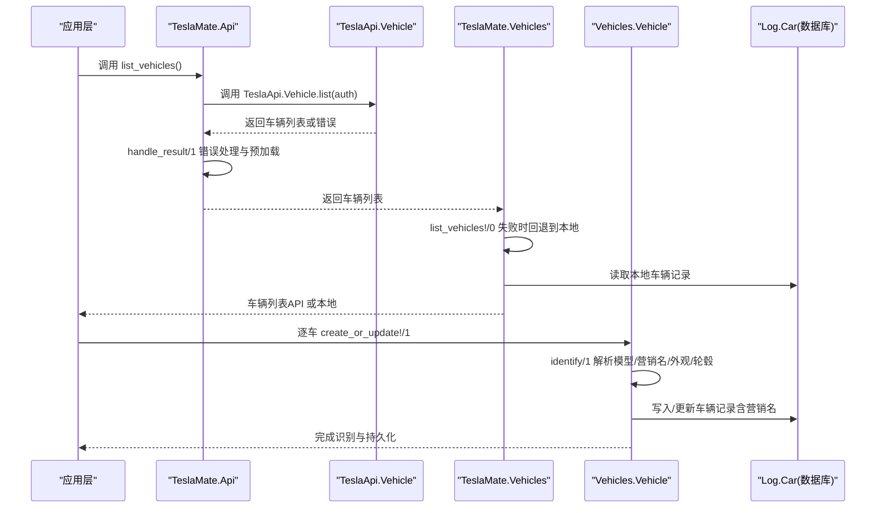
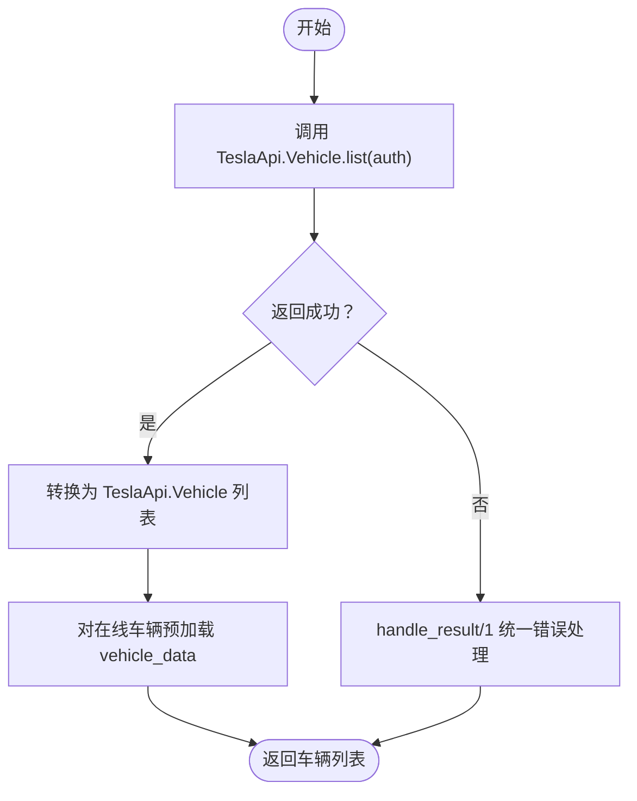
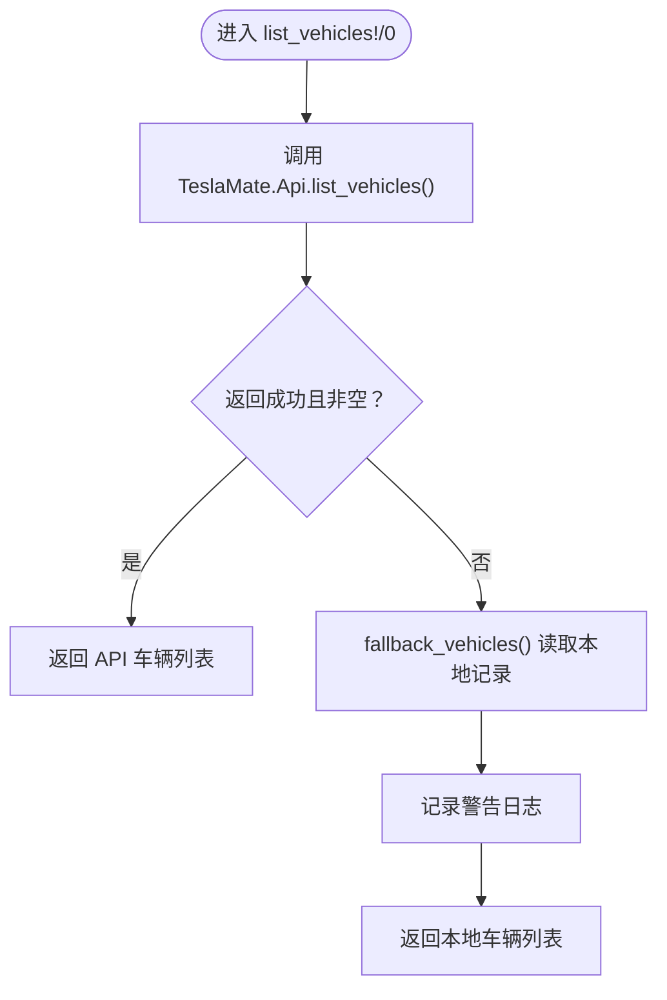
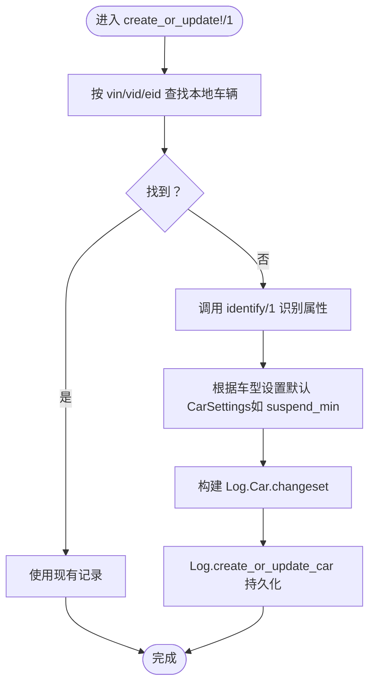
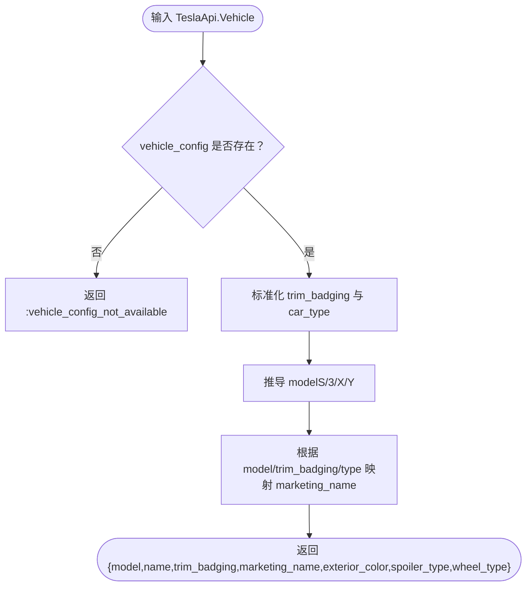
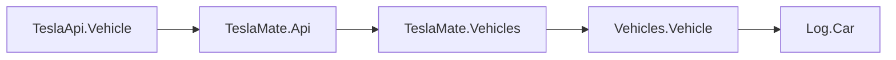

# 车辆发现与识别

<cite>
**本文引用的文件**
- [lib/tesla_api/vehicle.ex](file://lib/tesla_api/vehicle.ex)
- [lib/teslamate/api.ex](file://lib/teslamate/api.ex)
- [lib/teslamate/vehicles.ex](file://lib/teslamate/vehicles.ex)
- [lib/teslamate/vehicles/vehicle.ex](file://lib/teslamate/vehicles/vehicle.ex)
- [lib/teslamate/log/car.ex](file://lib/teslamate/log/car.ex)
- [priv/repo/migrations/20220422132017_add_marketing_name_to_car.exs](file://priv/repo/migrations/20220422132017_add_marketing_name_to_car.exs)
- [test/teslamate/vehicles/identification_test.exs](file://test/teslamate/vehicles/identification_test.exs)
- [test/teslamate/vehicles/vehicle_test.exs](file://test/teslamate/vehicles/vehicle_test.exs)
</cite>

## 目录
1. [简介](#简介)
2. [项目结构](#项目结构)
3. [核心组件](#核心组件)
4. [架构总览](#架构总览)
5. [详细组件分析](#详细组件分析)
6. [依赖关系分析](#依赖关系分析)
7. [性能考量](#性能考量)
8. [故障排查指南](#故障排查指南)
9. [结论](#结论)

## 简介
本文件围绕 TeslaMate 的“车辆发现与识别”能力，系统性阐述以下要点：
- 如何通过 Tesla API 获取账户下所有车辆信息；
- 在 list_vehicles!/0 中如何处理 API 调用失败并进行降级：从本地数据库读取车辆记录作为备用；
- create_or_update!/1 如何基于 VIN、车辆 ID 和显示名称创建或更新车辆记录，并结合 identify/1 实现对车辆型号、外观颜色、轮毂类型等属性的识别；
- 营销名称（Marketing Name）的映射规则；
- 如何根据车型自动设置默认的休眠等待时间（suspend_min）。

## 项目结构
与“车辆发现与识别”直接相关的核心模块与文件如下：
- Tesla API 客户端：lib/tesla_api/vehicle.ex
- 应用层 API 封装：lib/teslamate/api.ex
- 车辆管理入口：lib/teslamate/vehicles.ex
- 单车状态机与识别逻辑：lib/teslamate/vehicles/vehicle.ex
- 数据模型与变更集：lib/teslamate/log/car.ex
- 数据库迁移：添加营销名称字段等
- 测试用例：identification_test.exs、vehicle_test.exs

图表来源
- [lib/tesla_api/vehicle.ex](file://lib/tesla_api/vehicle.ex#L25-L96)
- [lib/teslamate/api.ex](file://lib/teslamate/api.ex#L31-L49)
- [lib/teslamate/vehicles.ex](file://lib/teslamate/vehicles.ex#L78-L141)
- [lib/teslamate/vehicles/vehicle.ex](file://lib/teslamate/vehicles/vehicle.ex#L50-L111)
- [lib/teslamate/log/car.ex](file://lib/teslamate/log/car.ex#L1-L55)

章节来源
- [lib/tesla_api/vehicle.ex](file://lib/tesla_api/vehicle.ex#L25-L96)
- [lib/teslamate/api.ex](file://lib/teslamate/api.ex#L31-L49)
- [lib/teslamate/vehicles.ex](file://lib/teslamate/vehicles.ex#L78-L141)
- [lib/teslamate/vehicles/vehicle.ex](file://lib/teslamate/vehicles/vehicle.ex#L50-L111)
- [lib/teslamate/log/car.ex](file://lib/teslamate/log/car.ex#L1-L55)

## 核心组件
- TeslaApi.Vehicle：封装 Tesla Owner API 的车辆列表、单车查询与带状态查询接口，负责将响应转换为统一的 TeslaApi.Vehicle 结构体。
- TeslaMate.Api：应用层 API 封装，提供 list_vehicles!/0、get_vehicle!/0、get_vehicle_with_state!/0 等方法；内部处理鉴权、错误熔断与重试、并发预加载在线车辆的完整状态。
- TeslaMate.Vehicles：Supervisor 子系统，负责启动各车辆子进程；在初始化阶段通过 list_vehicles!/0 获取车辆列表，并对每辆车调用 create_or_update!/1 创建或更新本地记录。
- Vehicles.Vehicle：GenStateMachine，负责单辆车的状态机、识别逻辑、休眠策略、订阅与广播等；identify/1 解析车辆配置，生成模型、营销名、外观颜色、轮毂类型等属性。
- Log.Car：Ecto Schema/Changeset，定义车辆表结构及唯一约束（eid、vid、vin），包含营销名称字段。

章节来源
- [lib/tesla_api/vehicle.ex](file://lib/tesla_api/vehicle.ex#L25-L96)
- [lib/teslamate/api.ex](file://lib/teslamate/api.ex#L31-L49)
- [lib/teslamate/vehicles.ex](file://lib/teslamate/vehicles.ex#L48-L61)
- [lib/teslamate/vehicles/vehicle.ex](file://lib/teslamate/vehicles/vehicle.ex#L50-L111)
- [lib/teslamate/log/car.ex](file://lib/teslamate/log/car.ex#L1-L55)

## 架构总览
下面以序列图展示“车辆发现与识别”的关键流程：从 Tesla API 获取车辆列表，到应用层封装，再到车辆管理器与单车状态机的协作，以及本地数据库的持久化。

图表来源
- [lib/teslamate/api.ex](file://lib/teslamate/api.ex#L31-L49)
- [lib/tesla_api/vehicle.ex](file://lib/tesla_api/vehicle.ex#L25-L96)
- [lib/teslamate/vehicles.ex](file://lib/teslamate/vehicles.ex#L78-L141)
- [lib/teslamate/vehicles/vehicle.ex](file://lib/teslamate/vehicles/vehicle.ex#L50-L111)
- [lib/teslamate/log/car.ex](file://lib/teslamate/log/car.ex#L1-L55)

## 详细组件分析

### 组件A：车辆发现（Tesla API 列表）
- TeslaApi.Vehicle.list/1：根据区域选择 API 主机地址，调用 /api/1/products 接口，过滤出包含 vehicle_id 的条目，并转换为 TeslaApi.Vehicle 结构体列表。
- TeslaMate.Api.list_vehicles/1：包装 TeslaApi.Vehicle.list/1，统一错误处理与预加载在线车辆的完整状态（get_with_state）。

图表来源
- [lib/tesla_api/vehicle.ex](file://lib/tesla_api/vehicle.ex#L25-L96)
- [lib/teslamate/api.ex](file://lib/teslamate/api.ex#L297-L314)

章节来源
- [lib/tesla_api/vehicle.ex](file://lib/tesla_api/vehicle.ex#L25-L96)
- [lib/teslamate/api.ex](file://lib/teslamate/api.ex#L297-L314)

### 组件B：降级策略（API 失败时回退本地）
- TeslaMate.Vehicles.list_vehicles!/0：当 TeslaMate.Api.list_vehicles 返回错误、空列表或未登录时，触发回退逻辑，从本地 Log.list_cars 读取历史车辆记录，构造 TeslaApi.Vehicle 形态用于后续初始化。
- 回退日志：记录警告信息，便于运维观察。

图表来源
- [lib/teslamate/vehicles.ex](file://lib/teslamate/vehicles.ex#L78-L108)

章节来源
- [lib/teslamate/vehicles.ex](file://lib/teslamate/vehicles.ex#L78-L108)

### 组件C：创建或更新车辆记录（VIN/ID/显示名）
- TeslaMate.Vehicles.create_or_update!/1：优先按 vin、vehicle_id、eid 三种键查找本地是否存在该车；若不存在则调用 Vehicles.Vehicle.identify/1 进行识别，生成 CarSettings 默认值（如 suspend_min），随后通过 Log.create_or_update_car 持久化。
- 关键点：
  - 识别逻辑由 identify/1 提供；
  - 营销名称写入 Log.Car.marketing_name 字段；
  - 唯一约束保证 vin、vid、eid 不重复。

图表来源
- [lib/teslamate/vehicles.ex](file://lib/teslamate/vehicles.ex#L110-L141)
- [lib/teslamate/vehicles/vehicle.ex](file://lib/teslamate/vehicles/vehicle.ex#L50-L111)
- [lib/teslamate/log/car.ex](file://lib/teslamate/log/car.ex#L1-L55)

章节来源
- [lib/teslamate/vehicles.ex](file://lib/teslamate/vehicles.ex#L110-L141)
- [lib/teslamate/vehicles/vehicle.ex](file://lib/teslamate/vehicles/vehicle.ex#L50-L111)
- [lib/teslamate/log/car.ex](file://lib/teslamate/log/car.ex#L1-L55)

### 组件D：识别逻辑（identify/1）
- Vehicles.Vehicle.identify/1：解析 TeslaApi.Vehicle.vehicle_config，提取 car_type、trim_badging、exterior_color、wheel_type、spoiler_type 等字段，进行大小写规范化与标准化，再根据模型与 trim_badging 映射生成 marketing_name。
- 营销名称映射规则（节选）：
  - “S”系列：根据 trim_badging 与 car_type 映射为 LR、Plaid、LR+ 等；
  - “3”系列：根据 trim_badging 映射为 LR、MR、SR+ 等；
  - “X”系列：根据 trim_badging 与 car_type 映射为 LR、Plaid 等；
  - “Y”系列：根据 trim_badging 映射为 LR AWD、LR、SR 等。
- 其他属性：model、name、exterior_color、spoiler_type、wheel_type 一并返回，供后续持久化与界面展示使用。

图表来源
- [lib/teslamate/vehicles/vehicle.ex](file://lib/teslamate/vehicles/vehicle.ex#L50-L111)

章节来源
- [lib/teslamate/vehicles/vehicle.ex](file://lib/teslamate/vehicles/vehicle.ex#L50-L111)

### 组件E：营销名称字段与迁移
- Log.Car：包含 marketing_name 字段，用于存储识别后的营销名称；
- 迁移：priv/repo/migrations/20220422132017_add_marketing_name_to_car.exs 添加了 marketing_name 字段。

章节来源
- [lib/teslamate/log/car.ex](file://lib/teslamate/log/car.ex#L1-L55)
- [priv/repo/migrations/20220422132017_add_marketing_name_to_car.exs](file://priv/repo/migrations/20220422132017_add_marketing_name_to_car.exs#L1-L9)

### 组件F：默认休眠等待时间（suspend_min）设置
- Vehicles.Vehicle.identify/1：在 create_or_update!/1 中，根据识别结果决定 CarSettings 的默认 suspend_min：
  - 当 model ∈ {"S","X"} 且 trim_badging 为空或 marketing_name 已存在时，设置 suspend_min 为 12；
  - 当 model ∈ {"3","Y"} 时，设置 suspend_min 为 12；
  - 其他情况保持默认。
- 该默认值在车辆首次创建时写入 CarSettings，后续可通过用户设置覆盖。

章节来源
- [lib/teslamate/vehicles.ex](file://lib/teslamate/vehicles.ex#L110-L141)

### 组件G：识别行为验证（测试）
- identification_test.exs：验证识别后车辆名称、模型、trim_badging 等字段正确写入；
- vehicle_test.exs：验证识别流程与状态机交互、休眠策略等行为。

章节来源
- [test/teslamate/vehicles/identification_test.exs](file://test/teslamate/vehicles/identification_test.exs#L1-L84)
- [test/teslamate/vehicles/vehicle_test.exs](file://test/teslamate/vehicles/vehicle_test.exs#L1-L499)

## 依赖关系分析
- TeslaApi.Vehicle 依赖 TeslaApi.Auth 与 TeslaApi.Error，负责网络请求与错误码映射；
- TeslaMate.Api 依赖 TeslaMate.Auth.Tokens 与 TeslaMate.Vehicles，负责鉴权、错误熔断与预加载；
- TeslaMate.Vehicles 依赖 TeslaMate.Log（Car、Settings）与 Vehicles.Vehicle 子进程；
- Vehicles.Vehicle 依赖 Log.Car、Settings.CarSettings、TeslaApi.Vehicle.State 等，实现识别与状态机调度；
- Log.Car 依赖 Ecto.Changeset，定义唯一约束与字段。

图表来源
- [lib/tesla_api/vehicle.ex](file://lib/tesla_api/vehicle.ex#L25-L96)
- [lib/teslamate/api.ex](file://lib/teslamate/api.ex#L31-L49)
- [lib/teslamate/vehicles.ex](file://lib/teslamate/vehicles.ex#L48-L61)
- [lib/teslamate/vehicles/vehicle.ex](file://lib/teslamate/vehicles/vehicle.ex#L1-L120)
- [lib/teslamate/log/car.ex](file://lib/teslamate/log/car.ex#L1-L55)

章节来源
- [lib/tesla_api/vehicle.ex](file://lib/tesla_api/vehicle.ex#L25-L96)
- [lib/teslamate/api.ex](file://lib/teslamate/api.ex#L31-L49)
- [lib/teslamate/vehicles.ex](file://lib/teslamate/vehicles.ex#L48-L61)
- [lib/teslamate/vehicles/vehicle.ex](file://lib/teslamate/vehicles/vehicle.ex#L1-L120)
- [lib/teslamate/log/car.ex](file://lib/teslamate/log/car.ex#L1-L55)

## 性能考量
- 并发预加载：TeslaMate.Api.list_vehicles/1 对在线车辆使用 Task.async_stream 预加载 vehicle_data，提升初始化速度；
- 降级回退：当 API 不可用时，快速回退至本地历史记录，避免长时间阻塞；
- 熔断与重试：TeslaMate.Api.handle_result/1 对鉴权失败、限流等情况进行熔断与重试控制；
- 状态机调度：Vehicles.Vehicle 使用 GenStateMachine 与定时器调度，合理设置 polling 间隔，降低 API 压力。

章节来源
- [lib/teslamate/api.ex](file://lib/teslamate/api.ex#L297-L314)
- [lib/teslamate/vehicles.ex](file://lib/teslamate/vehicles.ex#L78-L108)
- [lib/teslamate/vehicles/vehicle.ex](file://lib/teslamate/vehicles/vehicle.ex#L662-L741)

## 故障排查指南
- API 未登录或鉴权失败：TeslaMate.Api.handle_result/1 会熔断并触发刷新令牌；若多次失败，可能需要重新登录；
- 429 限流：返回 retry_after，系统会按秒数延时后再重试；
- 404/405/5xx：记录错误并返回通用原因，必要时检查 Tesla API 可用性与网络；
- 本地回退：当 API 返回错误或空列表时，系统会回退到本地历史车辆记录，确认本地数据是否完整；
- 识别失败：若 vehicle_config 缺失，identify/1 返回 :vehicle_config_not_available，需确保车辆状态可获取。

章节来源
- [lib/teslamate/api.ex](file://lib/teslamate/api.ex#L262-L300)
- [lib/teslamate/vehicles.ex](file://lib/teslamate/vehicles.ex#L78-L108)
- [lib/teslamate/vehicles/vehicle.ex](file://lib/teslamate/vehicles/vehicle.ex#L50-L111)

## 结论
- 通过 TeslaApi.Vehicle.list/1 与 TeslaMate.Api.list_vehicles/1，系统可靠地从 Tesla API 获取账户下所有车辆；
- 在 API 失败时，TeslaMate.Vehicles.list_vehicles!/0 提供本地回退机制，保障系统可用性；
- Vehicles.Vehicle.identify/1 将 car_type、trim_badging 等映射为模型与营销名称，并结合 Log.Car 持久化；
- 营销名称字段已纳入数据库模型，便于前端展示与统计；
- 根据车型自动设置默认的 suspend_min，有助于平衡能耗与实时性。