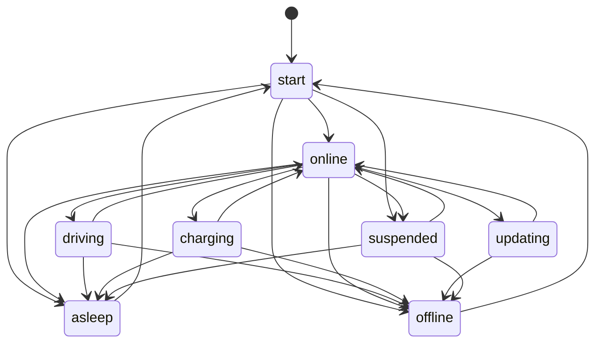
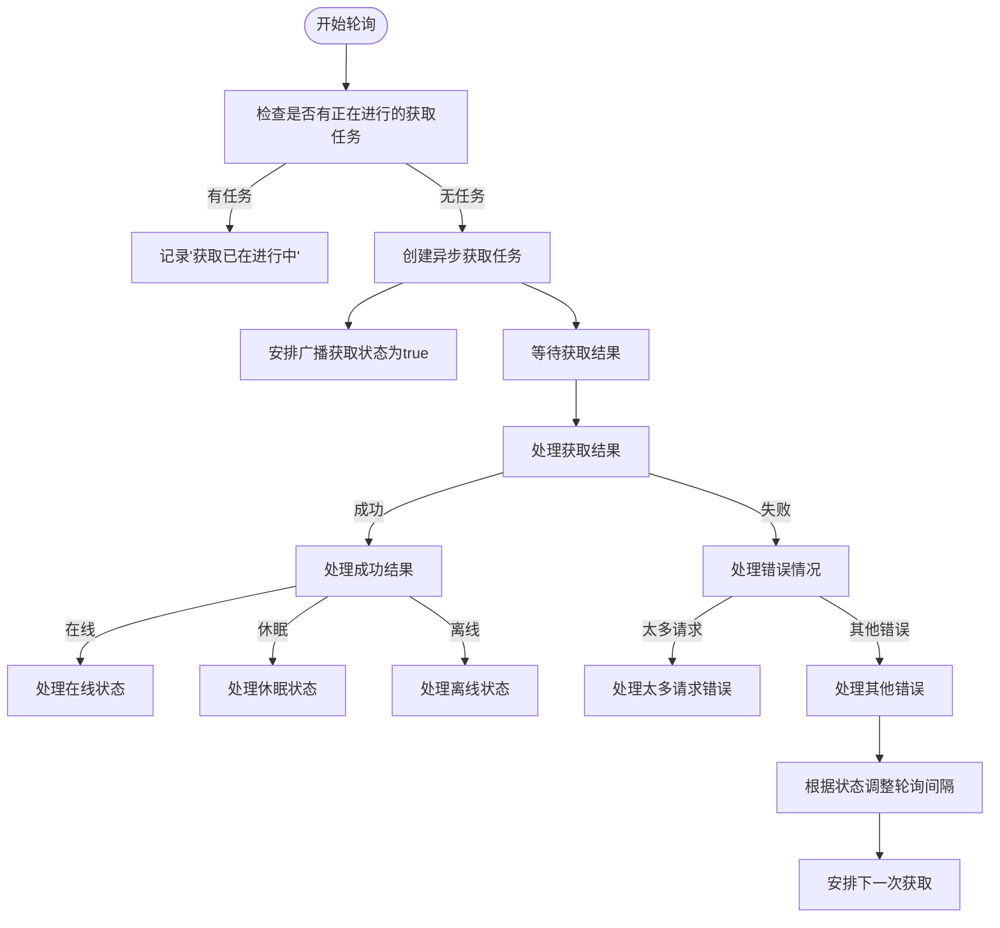
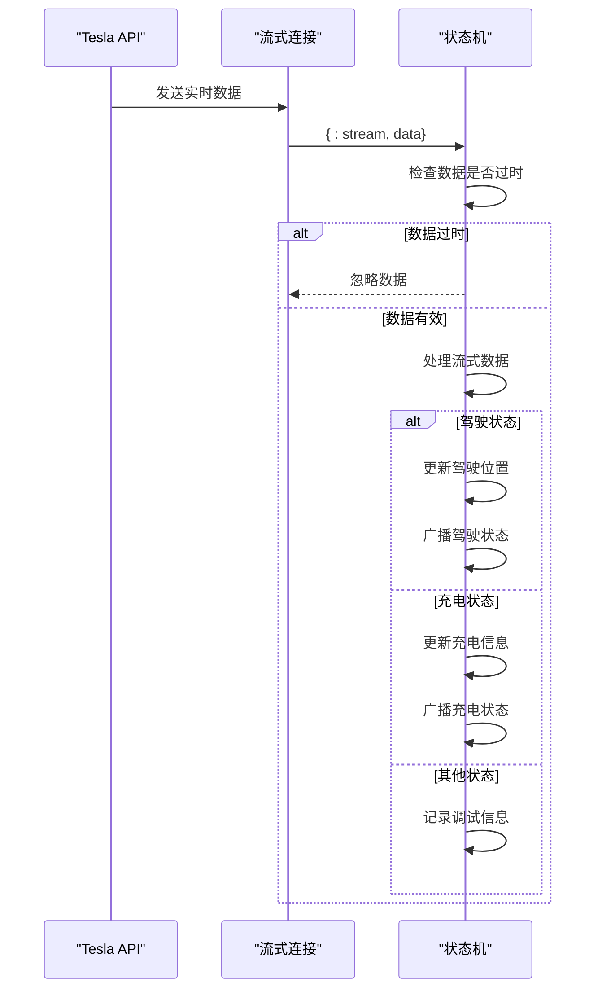
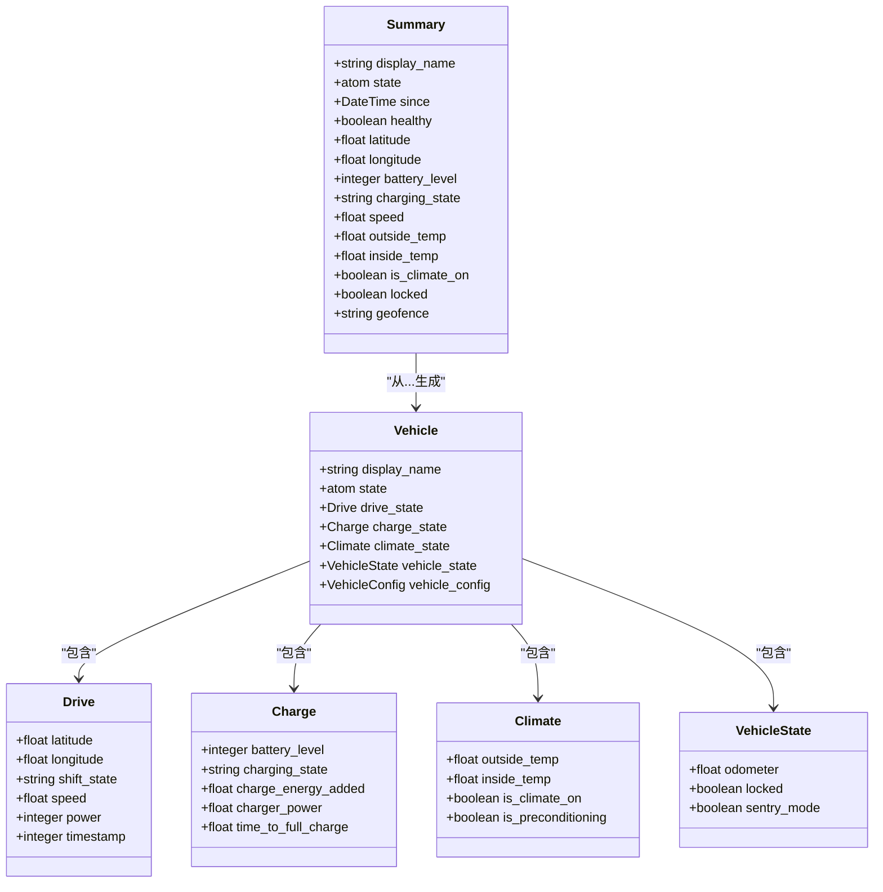

# 车辆状态同步

<cite>
**本文档引用的文件**   
- [vehicle.ex](file://lib/teslamate/vehicles/vehicle.ex)
- [state.ex](file://lib/tesla_api/vehicle/state.ex)
- [data.ex](file://lib/tesla_api/stream/data.ex)
- [summary.ex](file://lib/teslamate/vehicles/vehicle/summary.ex)
- [tesla_api.ex](file://lib/tesla_api.ex)
</cite>

## 目录
1. [引言](#引言)
2. [GenStateMachine状态机架构](#genstatemachine状态机架构)
3. [状态转换机制](#状态转换机制)
4. [数据获取与轮询策略](#数据获取与轮询策略)
5. [流式API集成](#流式api集成)
6. [事件广播与通知](#事件广播与通知)
7. [状态摘要生成](#状态摘要生成)
8. [结论](#结论)

## 引言
TeslaMate系统通过一个基于GenStateMachine的车辆状态管理器来监控和同步车辆的实时状态。该系统能够处理车辆的在线、驾驶、充电、休眠、离线和更新等多种状态，并通过定期轮询和流式API两种方式从Tesla API获取车辆最新数据。当车辆状态发生变化时，系统会通过Phoenix PubSub广播事件，通知Web界面和其他系统组件进行相应的UI更新。

## GenStateMachine状态机架构

**Diagram sources**
- [vehicle.ex](file://lib/teslamate/vehicles/vehicle.ex#L2)

**Section sources**
- [vehicle.ex](file://lib/teslamate/vehicles/vehicle.ex#L1-L1728)

## 状态转换机制
车辆状态机实现了多种状态之间的转换逻辑。当车辆处于在线状态时，系统会根据车辆的行驶状态（shift_state）判断是否开始驾驶。如果shift_state为D、N或R，则状态机转换到驾驶状态；如果检测到充电状态（charging_state为"Starting"或"Charging"），则转换到充电状态。当车辆开始软件更新时，状态机会进入更新状态。在车辆长时间静止且满足休眠条件时，系统会自动进入休眠状态以节省资源。

状态转换过程中，系统会记录状态变更的时间点，并通过日志记录相关事件。例如，当车辆开始驾驶时，系统会记录驾驶开始时间；当充电过程完成时，会记录充电持续时间和充电量等信息。

**Section sources**
- [vehicle.ex](file://lib/teslamate/vehicles/vehicle.ex#L823-L1200)

## 数据获取与轮询策略
系统通过fetch/2函数定期从Tesla API获取车辆的最新状态。轮询间隔根据车辆当前状态动态调整：驾驶状态时为2.5秒，充电状态时为5秒，在线状态时为60秒，休眠或离线状态时为30秒。这些默认值可以通过环境变量进行配置。

当系统检测到API请求过于频繁时，会根据Tesla API的retry-after响应头调整轮询间隔。在错误处理方面，系统使用了熔断器模式（circuit breaker）来防止对不可用API的持续请求。当API错误达到阈值时，熔断器会熔断，停止轮询一段时间后再尝试恢复。

**Diagram sources**
- [vehicle.ex](file://lib/teslamate/vehicles/vehicle.ex#L666-L681)

**Section sources**
- [vehicle.ex](file://lib/teslamate/vehicles/vehicle.ex#L666-L736)

## 流式API集成
系统集成了Tesla的流式API以实现更实时的数据推送。当启用流式API时，系统会建立一个持久连接，实时接收车辆的状态更新。流式数据包括时间、速度、里程、电池电量、海拔、功率、档位状态等信息。

当接收到流式数据时，系统会首先检查数据是否过时，避免处理陈旧数据。在驾驶状态或充电状态下，流式数据会被用来更新车辆的实时位置和状态。当流式连接断开或车辆离线时，系统会自动切换到轮询模式，定期从API获取车辆状态以确认真实状态。

**Diagram sources**
- [vehicle.ex](file://lib/teslamate/vehicles/vehicle.ex#L442-L554)
- [data.ex](file://lib/tesla_api/stream/data.ex#L1-L47)

**Section sources**
- [vehicle.ex](file://lib/teslamate/vehicles/vehicle.ex#L438-L608)

## 事件广播与通知
当车辆状态发生变化时，系统会通过Phoenix PubSub广播事件，通知Web界面和其他系统组件。主要广播两种类型的事件：summary_topic和fetch_topic。summary_topic事件包含车辆的完整状态摘要，包括车辆状态、电池电量、位置、速度等信息。fetch_topic事件则通知UI当前的数据获取状态（开始或结束）。

这种事件驱动的架构使得Web界面能够实时更新，无需轮询服务器获取最新状态。当车辆开始驾驶或充电时，相关组件可以立即收到通知并更新UI。同样，当数据获取完成时，界面可以更新最后同步时间等信息。

**Section sources**
- [vehicle.ex](file://lib/teslamate/vehicles/vehicle.ex#L694-L723)

## 状态摘要生成
系统通过Summary模块生成车辆状态摘要，该摘要被用于UI显示和事件广播。摘要包含了车辆的各种关键信息，如显示名称、状态、自上次状态变更的时间、健康状态、位置、电池电量、充电状态、速度、温度、车门/车窗状态等。

摘要生成时会从车辆的完整状态数据中提取相关信息，并进行必要的单位转换（如英里到公里，华氏度到摄氏度）。对于某些状态，如驾驶状态，摘要会根据内部状态机的状态进行格式化，确保UI显示正确的状态信息。

**Diagram sources**
- [summary.ex](file://lib/teslamate/vehicles/vehicle/summary.ex#L1-L251)
- [state.ex](file://lib/tesla_api/vehicle/state.ex#L1-L396)

**Section sources**
- [summary.ex](file://lib/teslamate/vehicles/vehicle/summary.ex#L1-L251)

## 结论
TeslaMate的车辆状态同步功能通过一个复杂的GenStateMachine实现，能够准确地管理车辆的各种状态并实时同步数据。系统结合了定期轮询和流式API两种数据获取方式，在保证数据实时性的同时，也考虑了API限制和网络条件。通过Phoenix PubSub的事件广播机制，实现了高效的组件间通信，确保了用户界面的实时更新。整个系统设计考虑了错误处理、状态持久化和资源优化，为用户提供了一个稳定可靠的车辆监控解决方案。