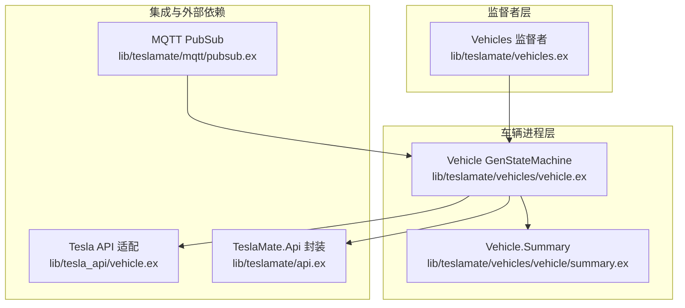
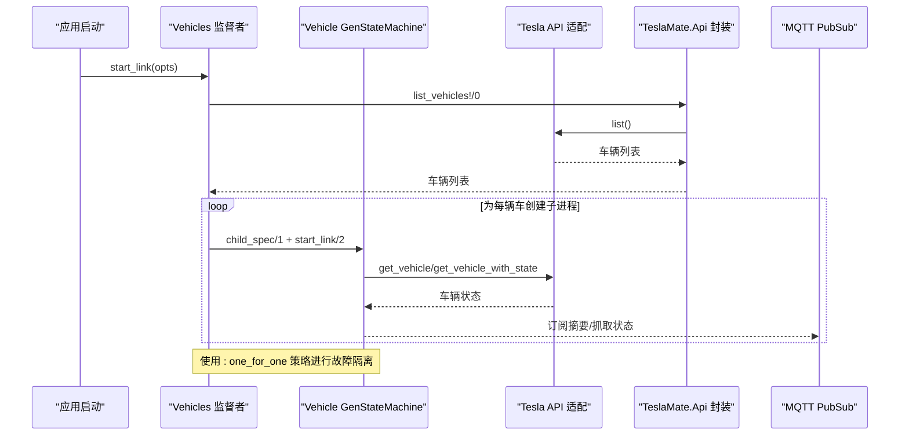
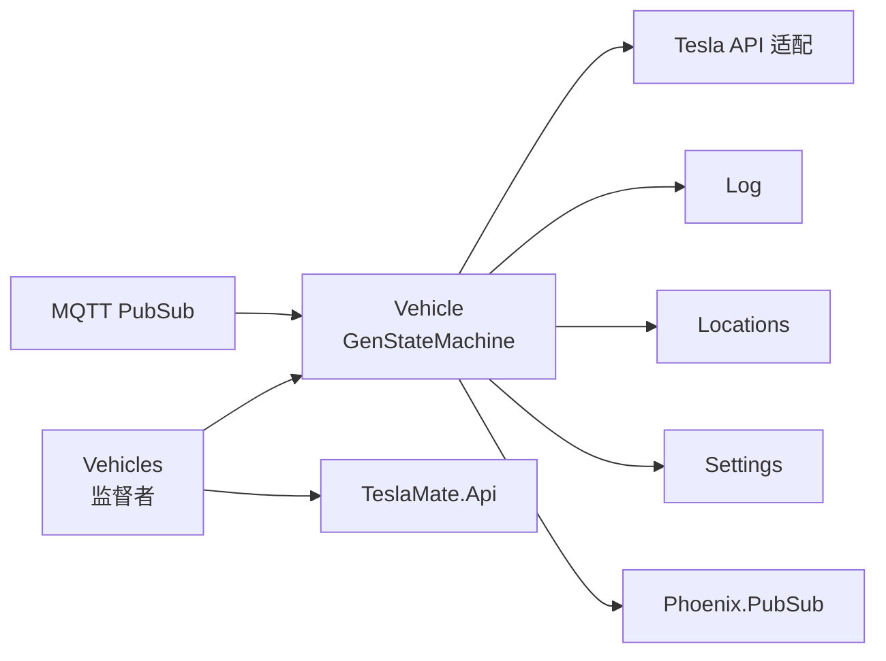

# 车辆进程管理

<cite>
**本文引用的文件**
- [lib/teslamate/vehicles.ex](file://lib/teslamate/vehicles.ex)
- [lib/teslamate/vehicles/vehicle.ex](file://lib/teslamate/vehicles/vehicle.ex)
- [lib/teslamate/vehicles/vehicle/summary.ex](file://lib/teslamate/vehicles/vehicle/summary.ex)
- [lib/teslamate/mqtt/pubsub.ex](file://lib/teslamate/mqtt/pubsub.ex)
- [lib/teslamate/api.ex](file://lib/teslamate/api.ex)
- [lib/tesla_api/vehicle.ex](file://lib/tesla_api/vehicle.ex)
- [test/teslamate/vehicles_test.exs](file://test/teslamate/vehicles_test.exs)
- [test/teslamate/vehicles/vehicle_test.exs](file://test/teslamate/vehicles/vehicle_test.exs)
- [test/teslamate/vehicles/vehicle/suspend_logging_test.exs](file://test/teslamate/vehicles/vehicle/suspend_logging_test.exs)
</cite>

## 目录
1. [简介](#简介)
2. [项目结构](#项目结构)
3. [核心组件](#核心组件)
4. [架构总览](#架构总览)
5. [详细组件分析](#详细组件分析)
6. [依赖关系分析](#依赖关系分析)
7. [性能考量](#性能考量)
8. [故障排查指南](#故障排查指南)
9. [结论](#结论)

## 简介
本文件围绕“车辆进程管理”主题，系统性阐述基于 OTP 监督者模式的多车辆架构设计与实现要点。重点包括：
- Vehicles 模块作为 Supervisor 在 init/1 回调中动态生成每个车辆的 GenStateMachine 子进程，并采用 :one_for_one 策略实现故障隔离。
- child_spec/1 函数为每个车辆进程生成唯一标识，同时通过进程名称（如 “:#{car_id}”）实现进程定位。
- 当车辆从账户中移除时，系统通过熔断器（fuse）机制检测到“车辆不存在”的错误，进而触发 Vehicles 监督者重启，优雅地终止对应车辆进程并清理其资源。

## 项目结构
与车辆进程管理相关的关键文件与职责如下：
- Vehicles 监督者：负责管理所有车辆 GenStateMachine 子进程，动态根据账户中的车辆列表创建或调整子进程树。
- 车辆 GenStateMachine：封装单辆车的状态机逻辑，处理在线/离线/驾驶/充电/暂停等状态转换、定时拉取、流式数据接入、健康检查与熔断器联动。
- MQTT PubSub：在 Vehicles 启动后，订阅各车辆的摘要与抓取状态，用于前端展示与交互。
- Tesla API 适配层：提供车辆列表、车辆信息与 vehicle_data 的获取能力，是 Vehicles 和 Vehicle 进程的上游依赖。
- 测试用例：覆盖 Vehicles 的重启、熔断器健康检查广播、暂停日志的条件限制等行为。

图表来源
- [lib/teslamate/vehicles.ex](file://lib/teslamate/vehicles.ex#L1-L143)
- [lib/teslamate/vehicles/vehicle.ex](file://lib/teslamate/vehicles/vehicle.ex#L1-L200)
- [lib/teslamate/mqtt/pubsub.ex](file://lib/teslamate/mqtt/pubsub.ex#L1-L21)
- [lib/tesla_api/vehicle.ex](file://lib/tesla_api/vehicle.ex#L1-L73)
- [lib/teslamate/api.ex](file://lib/teslamate/api.ex#L1-L320)

章节来源
- [lib/teslamate/vehicles.ex](file://lib/teslamate/vehicles.ex#L1-L143)
- [lib/teslamate/vehicles/vehicle.ex](file://lib/teslamate/vehicles/vehicle.ex#L1-L200)
- [lib/teslamate/mqtt/pubsub.ex](file://lib/teslamate/mqtt/pubsub.ex#L1-L21)

## 核心组件
- Vehicles 监督者
  - 作用：统一管理所有车辆进程；在 init/1 中根据账户车辆列表动态构建子进程树；使用 :one_for_one 策略进行故障隔离；提供 kill/0 与 restart/0 接口以触发监督者重启。
  - 关键点：children 列表由 opts[:vehicles] 或通过 TeslaMate.Api.list_vehicles() 获取；过滤掉未启用的车辆；使用 Supervisor.init(children, strategy: :one_for_one, ...)。
- 车辆 GenStateMachine
  - 作用：封装单辆车的完整生命周期与状态机逻辑，包含 fetch 定时任务、流式数据接入、状态转换、健康检查与熔断器联动。
  - 关键点：child_spec/1 返回 id 与 start；start_link/2 使用 :name 为进程命名（进程名即 “:#{car_id}”）；内部维护 Data 结构体保存车况、位置、熔断器等上下文。
- MQTT PubSub
  - 作用：在 Vehicles 启动后，为每个车辆创建订阅者，订阅 Vehicle 的摘要与抓取状态，便于前端实时展示。
- Tesla API 适配层
  - 作用：提供车辆列表、车辆详情与 vehicle_data 的获取接口，供 Vehicles 与 Vehicle 进程使用。

章节来源
- [lib/teslamate/vehicles.ex](file://lib/teslamate/vehicles.ex#L1-L143)
- [lib/teslamate/vehicles/vehicle.ex](file://lib/teslamate/vehicles/vehicle.ex#L113-L160)
- [lib/teslamate/mqtt/pubsub.ex](file://lib/teslamate/mqtt/pubsub.ex#L1-L21)
- [lib/tesla_api/vehicle.ex](file://lib/tesla_api/vehicle.ex#L1-L73)

## 架构总览
下图展示了 Vehicles 监督者与各车辆 GenStateMachine 的交互关系，以及与 Tesla API、MQTT PubSub 的集成路径。

图表来源
- [lib/teslamate/vehicles.ex](file://lib/teslamate/vehicles.ex#L46-L101)
- [lib/teslamate/vehicles/vehicle.ex](file://lib/teslamate/vehicles/vehicle.ex#L113-L160)
- [lib/tesla_api/vehicle.ex](file://lib/tesla_api/vehicle.ex#L1-L73)
- [lib/teslamate/api.ex](file://lib/teslamate/api.ex#L1-L320)
- [lib/teslamate/mqtt/pubsub.ex](file://lib/teslamate/mqtt/pubsub.ex#L1-L21)

## 详细组件分析

### Vehicles 监督者（Supervisor）
- 动态生成子进程
  - Vehicles 在 init/1 中先通过 TeslaMate.Api.list_vehicles() 获取账户中的车辆列表，若失败则回退到本地数据库记录的车辆列表。
  - 对每个车辆调用 create_or_update!/1 创建或更新本地 Car 记录，并据此生成子进程的参数。
  - 使用 Enum.uniq_by 与 Enum.filter 过滤重复与禁用的车辆，最终形成 children 列表。
- :one_for_one 策略
  - Supervisor.init(children, strategy: :one_for_one, ...) 表示当某个子进程异常退出时，仅重启该子进程，不影响其他车辆进程，实现故障隔离。
- 进程重启与优雅终止
  - kill/0：向监督者进程发送 :kill，触发监督者进程退出，随后由上层监督链自动重启。
  - restart/0：先停止监督者，等待其重新启动，确保子进程树重建。
- 进程定位
  - Vehicles.list/0 通过 Supervisor.which_children/1 获取子进程 PID，再委托给 Vehicle.summary/1 获取摘要，实现对子进程的统一访问。

章节来源
- [lib/teslamate/vehicles.ex](file://lib/teslamate/vehicles.ex#L1-L143)
- [test/teslamate/vehicles_test.exs](file://test/teslamate/vehicles_test.exs#L1-L55)

### child_spec/1 与进程命名
- child_spec/1
  - 返回的 id 为 “:#{__MODULE__}_#{car.id}”，确保每个车辆进程拥有唯一标识，便于监督者管理与日志追踪。
- 进程命名
  - start_link/2 中通过 name: Keyword.get_lazy(opts, :name, fn -> :"#{Keyword.fetch!(opts, :car).id}" end) 为进程设置名称，进程名为 “:#{car_id}”。Vehicle 提供 summary/1、suspend_logging/1、resume_logging/1 等 API，均通过进程名进行调用，实现按车号定位。

章节来源
- [lib/teslamate/vehicles/vehicle.ex](file://lib/teslamate/vehicles/vehicle.ex#L113-L160)

### 车辆 GenStateMachine（状态机）
- 初始化与依赖注入
  - init/1 中注入 Log、Api、Settings、Locations、Vehicles、Phoenix.PubSub 等依赖，并安装两个熔断器：:vehicle_not_found 与 :api_error。
- 健康检查与熔断器
  - healthy?/1 通过 :fuse.ask 检查两个熔断器状态，返回健康与否。
  - 在处理 API 错误时，会根据错误类型熔断或重置熔断器，影响健康检查结果与后续行为。
- 车辆移除与熔断器联动
  - 当 API 返回 :vehicle_not_found 时，熔断器 :vehicle_not_found 被熔断；随后检查熔断状态，若已爆炸，则调用 Vehicles.kill() 触发监督者重启，从而优雅终止对应车辆进程。
- 进程定位与调用
  - 通过进程名 “:#{car_id}” 进行远程调用，如 summary/1、suspend_logging/1、resume_logging/1 等。

章节来源
- [lib/teslamate/vehicles/vehicle.ex](file://lib/teslamate/vehicles/vehicle.ex#L136-L160)
- [lib/teslamate/vehicles/vehicle.ex](file://lib/teslamate/vehicles/vehicle.ex#L390-L411)
- [lib/teslamate/vehicles/vehicle.ex](file://lib/teslamate/vehicles/vehicle.ex#L1694-L1695)

### MQTT PubSub 与车辆订阅
- Vehicles 启动后，遍历当前车辆列表，为每个车辆创建 VehicleSubscriber 子进程，订阅 Vehicle 的摘要与抓取状态主题，便于前端实时展示。

章节来源
- [lib/teslamate/mqtt/pubsub.ex](file://lib/teslamate/mqtt/pubsub.ex#L1-L21)

### 车辆摘要模型
- Vehicle.Summary 将 TeslaApi.Vehicle 的状态字段映射为统一的摘要结构，包含状态、电量、位置、门窗状态、充电状态、软件版本等关键信息，供前端渲染与健康检查使用。

章节来源
- [lib/teslamate/vehicles/vehicle/summary.ex](file://lib/teslamate/vehicles/vehicle/summary.ex#L1-L251)

### 车辆暂停日志的条件限制
- Vehicle 在执行 suspend_logging/1 时，会检查多种前置条件（如 Sentry 模式、预加热、狗模式、用户在车、正在下载更新、车门/后备箱打开、车辆解锁且设置了“必须上锁”等），若不满足则拒绝暂停，避免误操作。

章节来源
- [test/teslamate/vehicles/vehicle/suspend_logging_test.exs](file://test/teslamate/vehicles/vehicle/suspend_logging_test.exs#L135-L264)

## 依赖关系分析
- Vehicles 依赖 TeslaMate.Api 获取账户车辆列表，依赖 Log 与 Settings 进行本地数据同步与配置订阅。
- Vehicle 进程依赖 Tesla API 获取车辆状态，依赖 Log 进行位置与过程记录，依赖 Locations 进行地理围栏匹配，依赖 Settings 订阅配置变更，依赖 Phoenix.PubSub 广播摘要与抓取状态。
- MQTT PubSub 依赖 Vehicles.list/0 获取当前车辆列表，为每个车辆创建订阅者。

图表来源
- [lib/teslamate/vehicles.ex](file://lib/teslamate/vehicles.ex#L1-L143)
- [lib/teslamate/vehicles/vehicle.ex](file://lib/teslamate/vehicles/vehicle.ex#L160-L200)
- [lib/teslamate/mqtt/pubsub.ex](file://lib/teslamate/mqtt/pubsub.ex#L1-L21)

## 性能考量
- 定时拉取与间隔控制
  - Vehicle 内部根据状态动态选择不同轮询间隔（如驾驶、充电、在线、离线/休眠等），并在导入模式下降低定时器频率，减少 API 压力。
- 流式数据接入
  - 在支持流式 API 时，优先使用流式事件驱动状态转换，减少不必要的轮询；当流式连接异常时，自动重建连接并恢复状态。
- 并发与异步
  - Vehicles.list/0 使用 Task.async_stream 并发获取各车辆摘要，提高批量查询效率。

章节来源
- [lib/teslamate/vehicles/vehicle.ex](file://lib/teslamate/vehicles/vehicle.ex#L1200-L1728)
- [lib/teslamate/vehicles.ex](file://lib/teslamate/vehicles.ex#L17-L26)

## 故障排查指南
- 车辆进程频繁重启
  - 检查熔断器状态：healthy?/1 会受 :vehicle_not_found 与 :api_error 熔断器影响；若熔断器爆炸，Vehicle 会尝试触发 Vehicles.kill() 重启监督者。
  - 查看 API 错误类型：Vehicle 在处理 API 错误时会熔断或重置熔断器，关注错误日志与熔断器状态变化。
- 车辆摘要不更新
  - 确认 Vehicle 进程是否存活；检查 Tesla API 可达性与认证状态；确认 MQTT PubSub 是否正常订阅。
- 暂停日志失败
  - 检查 Vehicle.suspend_logging/1 的前置条件（如 Sentry 模式、预加热、狗模式、用户在车、正在下载更新、车门/后备箱打开、车辆解锁等），根据返回错误逐项排除。

章节来源
- [lib/teslamate/vehicles/vehicle.ex](file://lib/teslamate/vehicles/vehicle.ex#L390-L411)
- [lib/teslamate/vehicles/vehicle.ex](file://lib/teslamate/vehicles/vehicle.ex#L1498-L1543)
- [test/teslamate/vehicles/vehicle_test.exs](file://test/teslamate/vehicles/vehicle_test.exs#L331-L366)

## 结论
本设计通过 OTP 监督者模式将多车辆进程解耦为独立的 GenStateMachine，借助 :one_for_one 策略实现故障隔离；child_spec/1 与进程命名机制保证了进程的唯一标识与可定位性；熔断器与健康检查机制使系统在面对外部 API 异常时具备自愈能力，当车辆从账户中移除时，通过熔断器爆炸触发 Vehicles 监督者重启，优雅终止对应车辆进程，确保系统稳定运行与资源回收。