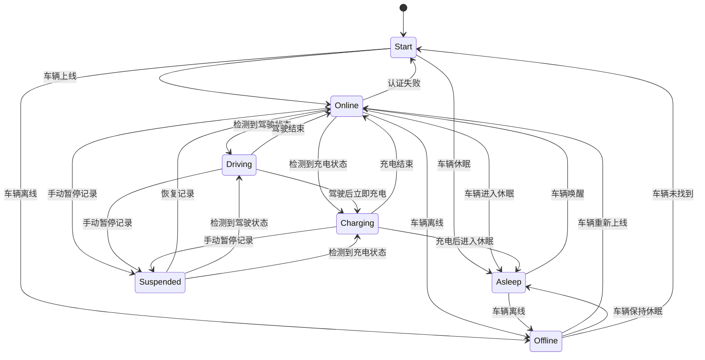
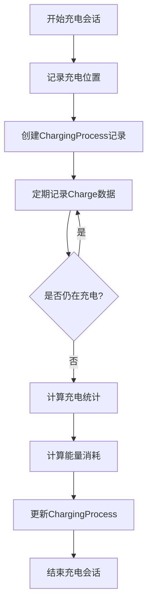
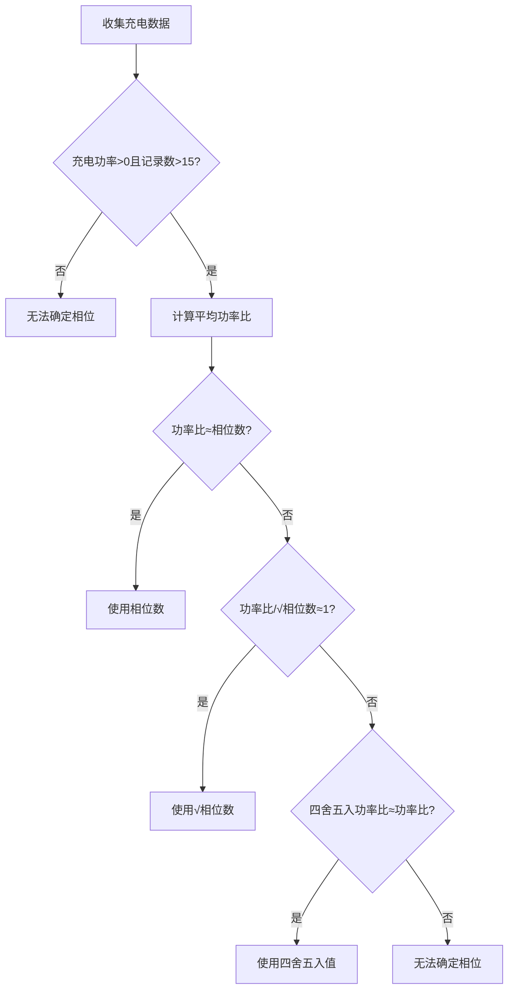
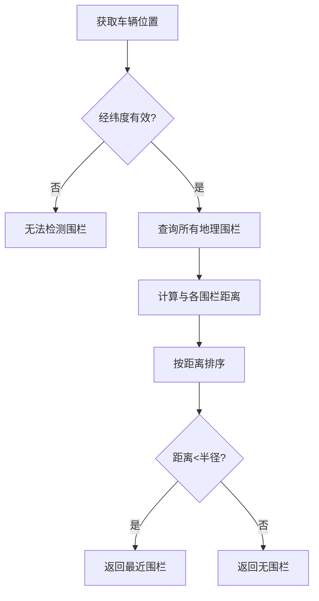
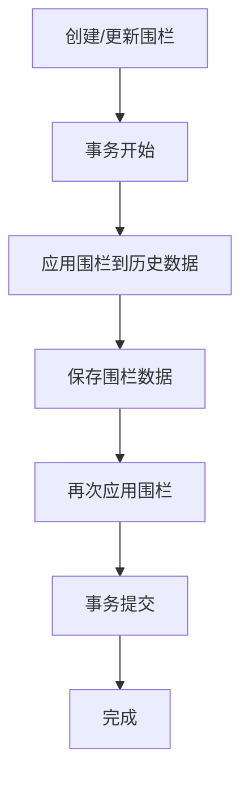
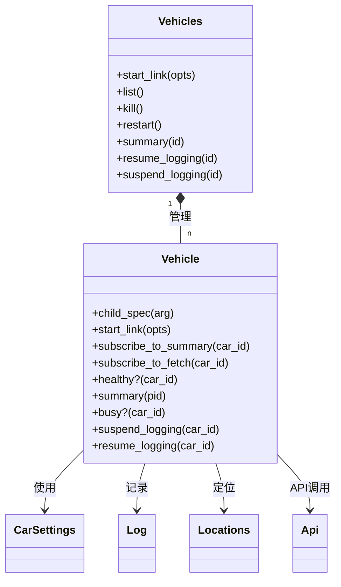
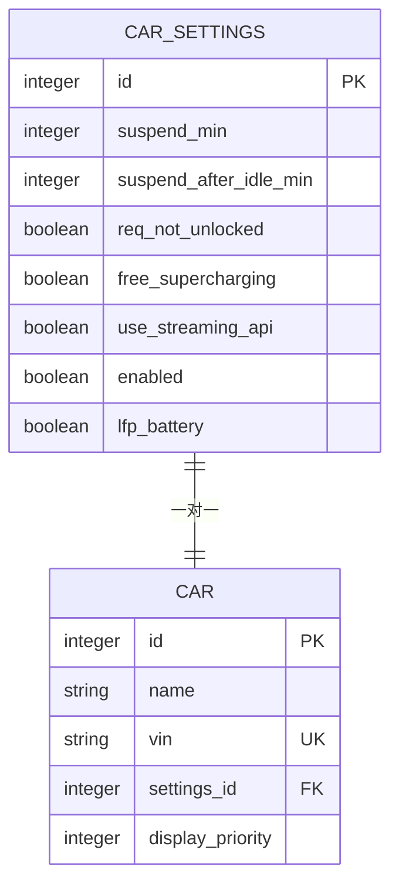
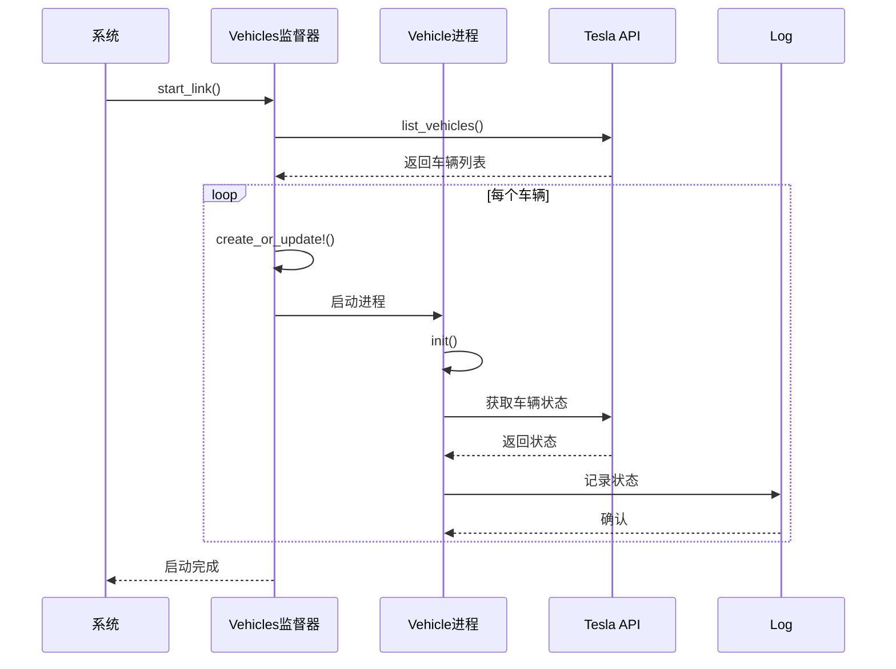

# 核心功能

<cite>
**本文档中引用的文件**   
- [vehicles.ex](file://lib/teslamate/vehicles/vehicle.ex)
- [log.ex](file://lib/teslamate/log.ex)
- [locations.ex](file://lib/teslamate/locations.ex)
- [geo_fence.ex](file://lib/teslamate/locations/geo_fence.ex)
- [car_settings.ex](file://lib/teslamate/settings/car_settings.ex)
- [charge.ex](file://lib/teslamate/log/charge.ex)
- [charging_process.ex](file://lib/teslamate/log/charging_process.ex)
- [drive.ex](file://lib/teslamate/log/drive.ex)
- [stream.ex](file://lib/tesla_api/stream.ex)
- [state.ex](file://lib/tesla_api/vehicle/state.ex)
- [summary.ex](file://lib/teslamate/vehicles/vehicle/summary.ex)
</cite>

## 目录
1. [驾驶数据记录与车辆状态监控](#驾驶数据记录与车辆状态监控)
2. [充电过程跟踪与能量计算](#充电过程跟踪与能量计算)
3. [地理围栏工作原理](#地理围栏工作原理)
4. [多车辆管理架构](#多车辆管理架构)

## 驾驶数据记录与车辆状态监控

TeslaMate通过`vehicles/vehicle.ex`中的状态机实现车辆状态监控，采用`GenStateMachine`模式管理车辆的生命周期状态。系统定义了多种车辆状态，包括`:online`（在线）、`:driving`（驾驶中）、`:charging`（充电中）、`:asleep`（休眠）、`:offline`（离线）和`:suspended`（已暂停）。

数据采集频率根据车辆状态动态调整，通过环境变量进行配置：
- 驾驶中：默认2.5秒（`POLLING_DRIVING_INTERVAL`）
- 充电中：默认5秒（`POLLING_CHARGING_INTERVAL`）
- 在线状态：默认60秒（`POLLING_ONLINE_INTERVAL`）
- 休眠状态：默认30秒（`POLLING_ASLEEP_INTERVAL`）
- 默认状态：默认15秒（`POLLING_DEFAULT_INTERVAL`）

状态转换逻辑通过`handle_event`函数实现，当接收到车辆状态更新时，系统会根据当前状态和新状态进行相应的处理。例如，当车辆从`:online`状态进入`:driving`状态时，系统会启动驾驶记录，创建新的`Drive`记录并开始记录位置数据。



**图示来源**
- [vehicles/vehicle.ex](file://lib/teslamate/vehicles/vehicle.ex#L1-L800)

**本节来源**
- [vehicles/vehicle.ex](file://lib/teslamate/vehicles/vehicle.ex#L1-L800)
- [log.ex](file://lib/teslamate/log.ex#L1-L712)

## 充电过程跟踪与能量计算

充电过程跟踪通过`log.ex`和`charging_process.ex`模块实现。系统通过`start_charging_process`函数检测充电会话的开始，当车辆状态变为充电状态或通过流式API检测到负功率时触发。

充电会话的开始检测逻辑：
1. 当车辆状态从非充电状态变为充电状态时
2. 通过流式API实时检测到`shift_state`为`P`且`power`为负值
3. 手动触发充电记录

充电会话的结束检测通过`complete_charging_process`函数实现，当车辆停止充电或车辆状态变为非充电状态时触发。

能量计算采用精确的积分方法，考虑了充电阶段的变化。系统通过`calculate_energy_used`函数计算实际消耗的电能：



能量计算公式考虑了单相和三相充电的区别：
- 对于已知相位数的充电：`energy_used = charger_actual_current * charger_voltage * phases / 1000.0`
- 对于未知相位数的充电：`energy_used = charger_power`

系统还实现了相位校正算法，通过分析充电数据的统计特征来确定实际的充电相位数：



**图示来源**
- [log.ex](file://lib/teslamate/log.ex#L395-L580)
- [charging_process.ex](file://lib/teslamate/log/charging_process.ex#L1-L61)
- [charge.ex](file://lib/teslamate/log/charge.ex#L1-L68)

**本节来源**
- [log.ex](file://lib/teslamate/log.ex#L395-L630)
- [charging_process.ex](file://lib/teslamate/log/charging_process.ex#L1-L61)
- [charge.ex](file://lib/teslamate/log/charge.ex#L1-L68)

## 地理围栏工作原理

地理围栏功能通过`locations.ex`和`geo_fence.ex`模块实现。系统使用PostGIS地理空间函数进行位置精度处理和区域检测。

地理围栏数据结构包含以下关键字段：
- `name`: 围栏名称
- `latitude`: 中心纬度
- `longitude`: 中心经度
- `radius`: 半径（米）
- `billing_type`: 计费类型（按千瓦时或按分钟）
- `cost_per_unit`: 单价
- `session_fee`: 会话费

位置精度处理使用PostgreSQL的`earth_distance`和`earth_box`函数，确保高精度的距离计算：

```sql
earth_box(ll_to_earth(g.latitude, g.longitude), g.radius) @> ll_to_earth(p.latitude, p.longitude)
AND earth_distance(ll_to_earth(g.latitude, g.longitude), ll_to_earth(latitude, p.longitude)) < g.radius
```

进出区域检测算法通过`find_geofence`函数实现，按距离排序返回最近的地理围栏：



当创建或更新地理围栏时，系统会自动重新应用围栏到历史数据，确保数据一致性：



**图示来源**
- [locations.ex](file://lib/teslamate/locations.ex#L1-L257)
- [geo_fence.ex](file://lib/teslamate/locations/geo_fence.ex#L1-L37)

**本节来源**
- [locations.ex](file://lib/teslamate/locations.ex#L1-L257)
- [geo_fence.ex](file://lib/teslamate/locations/geo_fence.ex#L1-L37)

## 多车辆管理架构

多车辆管理架构基于`vehicles.ex`和`vehicle.ex`模块实现，采用监督树结构管理多个车辆实例。

车辆识别通过VIN（车辆识别码）、车辆ID和外部ID进行，确保唯一性：



优先级设置通过`car_settings`表实现，每个车辆有独立的配置：



独立配置通过`CarSettings`结构体实现，支持以下配置项：
- `suspend_min`: 暂停记录前的最小分钟数
- `suspend_after_idle_min`: 空闲后暂停的分钟数
- `req_not_unlocked`: 要求车辆未解锁
- `free_supercharging`: 免费超级充电
- `use_streaming_api`: 使用流式API
- `enabled`: 车辆启用状态
- `lfp_battery`: LFP电池类型

车辆管理流程：
1. 启动时从Tesla API获取车辆列表
2. 对每个车辆创建独立的`Vehicle`进程
3. 根据车辆配置应用相应的策略
4. 通过监督器管理所有车辆进程的生命周期



**图示来源**
- [vehicles.ex](file://lib/teslamate/vehicles.ex#L1-L143)
- [vehicle.ex](file://lib/teslamate/vehicles/vehicle.ex#L1-L800)
- [car_settings.ex](file://lib/teslamate/settings/car_settings.ex#L1-L36)

**本节来源**
- [vehicles.ex](file://lib/teslamate/vehicles.ex#L1-L143)
- [vehicle.ex](file://lib/teslamate/vehicles/vehicle.ex#L1-L800)
- [car_settings.ex](file://lib/teslamate/settings/car_settings.ex#L1-L36)