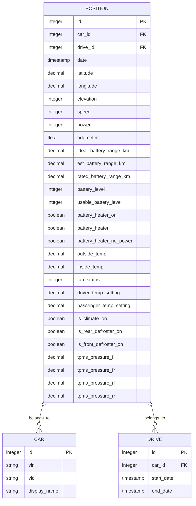
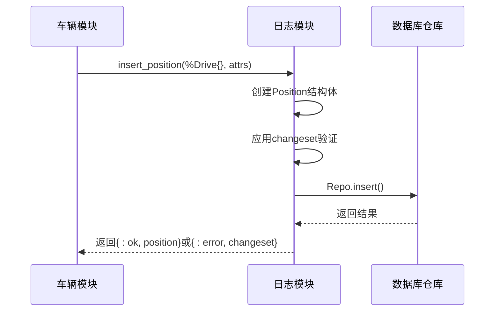
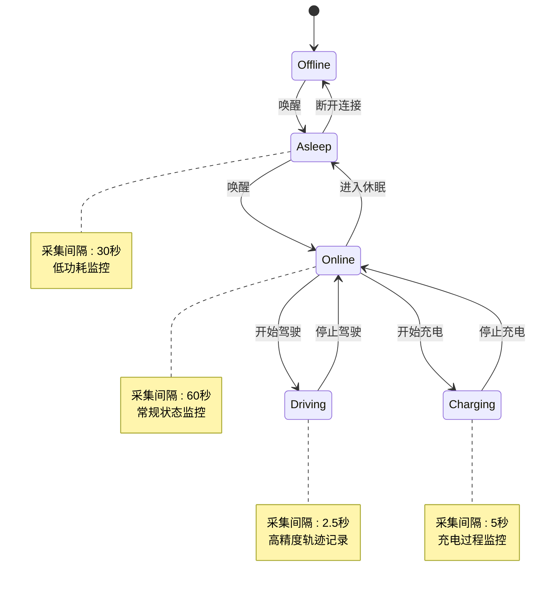
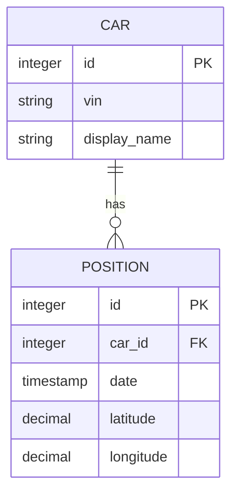
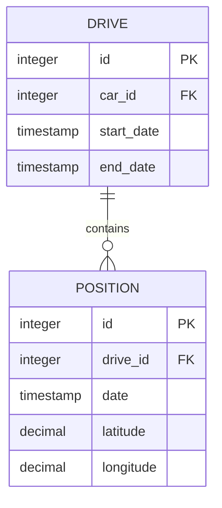
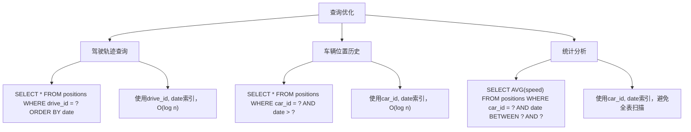
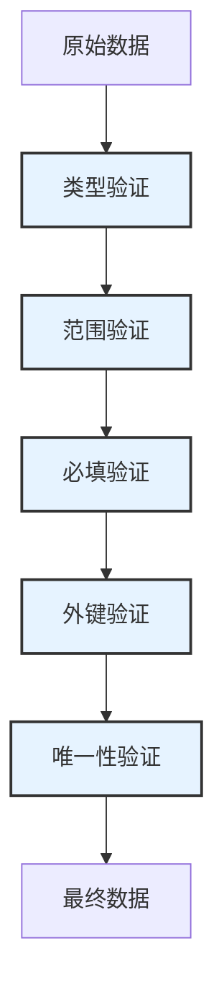
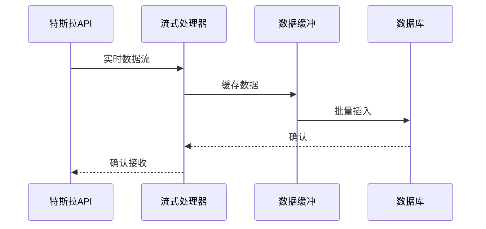
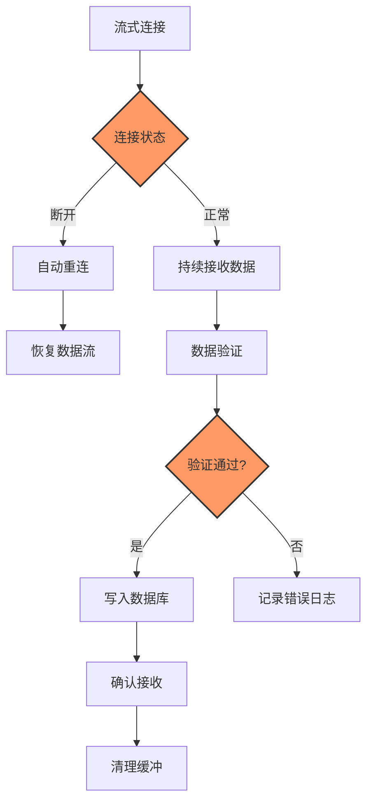

# 位置数据采集

<cite>
**本文档引用的文件**   
- [position.ex](file://lib/teslamate/log/position.ex)
- [log.ex](file://lib/teslamate/log.ex)
- [vehicle.ex](file://lib/teslamate/vehicles/vehicle.ex)
- [20230417225712_composite_index_to_position.exs](file://priv/repo/migrations/20230417225712_composite_index_to_position.exs)
- [20240915193446_composite_index_with_predicate_to_position.exs](file://priv/repo/migrations/20240915193446_composite_index_with_predicate_to_position.exs)
- [development.mdx](file://website/docs/development.mdx)
</cite>

## 目录
1. [位置数据模型](#位置数据模型)
2. [insert_position/1函数实现机制](#insert_position1函数实现机制)
3. [驾驶过程中的调用频率控制](#驾驶过程中的调用频率控制)
4. [数据关联机制](#数据关联机制)
5. [复合索引优化](#复合索引优化)
6. [数据验证与错误处理](#数据验证与错误处理)
7. [流式处理稳定性](#流式处理稳定性)

## 位置数据模型

位置数据模型定义了车辆位置和状态的核心数据结构，包含时间、地理位置和车辆状态等关键信息。模型通过Ecto框架实现，确保了数据的完整性和一致性。



**图源**
- [position.ex](file://lib/teslamate/log/position.ex#L7-L78)

### 核心字段数据类型与约束

位置模型中的核心字段具有明确的数据类型和约束条件，确保数据的准确性和完整性。

| 字段名 | 数据类型 | 约束条件 | 说明 |
|-------|--------|--------|------|
| **date** | :utc_datetime_usec | 必填 | 位置记录的时间戳，使用UTC时间 |
| **latitude** | :decimal | 必填 | 纬度坐标，十进制表示 |
| **longitude** | :decimal | 必填 | 经度坐标，十进制表示 |
| **elevation** | :integer | 可选 | 海拔高度，单位为米 |
| **speed** | :integer | 可选 | 车速，单位为km/h |
| **power** | :integer | 可选 | 功率，单位为kW |
| **odometer** | :float | 可选 | 里程表读数，单位为km |

**字段约束说明**
- `:utc_datetime_usec` 类型确保了时间戳的高精度（微秒级）
- `:decimal` 类型用于地理坐标，保证了高精度的浮点数存储
- `:integer` 类型用于海拔、速度和功率等整数型数据
- `:float` 类型用于里程表读数，支持小数精度

**节源**
- [position.ex](file://lib/teslamate/log/position.ex#L8-L15)

### 附加车辆状态数据采集逻辑

除了核心位置信息外，系统还采集了丰富的车辆状态数据，这些数据为车辆性能分析和驾驶行为研究提供了重要依据。

```mermaid
flowchart TD
A[车辆状态数据采集] --> B[电池信息]
A --> C[气候信息]
A --> D[轮胎压力]
A --> E[驾驶辅助]
B --> B1[battery_level: 电池电量百分比]
B --> B2[usable_battery_level: 可用电池容量]
B --> B3[ideal_battery_range_km: 理想续航里程]
B --> B4[rated_battery_range_km: 额定续航里程]
B --> B5[est_battery_range_km: 预估续航里程]
C --> C1[outside_temp: 外部温度]
C --> C2[inside_temp: 内部温度]
C --> C3[fan_status: 风扇状态]
C --> C4[driver_temp_setting: 驾驶员温度设置]
C --> C5[passenger_temp_setting: 乘客温度设置]
C --> C6[is_climate_on: 空调是否开启]
C --> C7[is_rear_defroster_on: 后除霜器是否开启]
C --> C8[is_front_defroster_on: 前除霜器是否开启]
D --> D1[tpms_pressure_fl: 左前胎压]
D --> D2[tpms_pressure_fr: 右前胎压]
D --> D3[tpms_pressure_rl: 左后胎压]
D --> D4[tpms_pressure_rr: 右后胎压]
E --> E1[battery_heater_on: 电池加热器是否开启]
E --> E2[battery_heater: 电池加热状态]
E --> E3[battery_heater_no_power: 电池加热无电源]
```



**数据采集逻辑**
- **电池信息**: 从车辆的充电状态中提取，包括电池电量、可用容量和各种续航里程估算
- **气候信息**: 从车辆的气候控制系统中获取，包括内外温度、风扇状态和温度设置
- **轮胎压力**: 从车辆的状态信息中读取，提供四个轮胎的实时压力数据
- **驾驶辅助**: 包括电池加热器状态和除霜器状态，反映车辆的辅助系统运行情况

**节源**
- [position.ex](file://lib/teslamate/log/position.ex#L16-L35)

## insert_position/1函数实现机制

`insert_position/1` 函数是位置数据采集的核心，负责将位置数据持久化到数据库中。该函数有两个重载版本，分别用于在驾驶会话中和独立位置记录时插入数据。



### 函数重载与参数处理

`insert_position/1` 函数通过模式匹配实现了两个不同的重载版本，适应不同的使用场景。

```elixir
def insert_position(%Drive{id: id, car_id: car_id}, attrs) do
  %Position{car_id: car_id, drive_id: id}
  |> Position.changeset(attrs)
  |> Repo.insert()
end

def insert_position(%Car{id: id}, attrs) do
  %Position{car_id: id}
  |> Position.changeset(attrs)
  |> Repo.insert()
end
```

**参数处理逻辑**
- **驾驶会话版本**: 接收 `Drive` 结构体和属性映射，自动设置 `car_id` 和 `drive_id`
- **独立记录版本**: 接收 `Car` 结构体和属性映射，仅设置 `car_id`
- 两种版本都使用 `Position.changeset/2` 进行数据验证和转换
- 最终通过 `Repo.insert/1` 将数据插入数据库

**节源**
- [log.ex](file://lib/teslamate/log.ex#L146-L156)

### 数据验证流程

数据验证是确保数据质量的关键环节，`insert_position/1` 函数通过Ecto的changeset机制实现了严格的数据验证。

```mermaid
flowchart TD
A[开始插入位置] --> B{验证必填字段}
B --> |通过| C[检查外键约束]
B --> |失败| D[返回错误]
C --> |通过| E[执行数据库插入]
C --> |失败| F[返回外键错误]
E --> G{插入成功?}
G --> |是| H[返回{:ok, position}]
G --> |否| I[返回{:error, changeset}]
style B fill:#f9f,stroke:#333,stroke-width:2px
style C fill:#f9f,stroke:#333,stroke-width:2px
```

**验证规则**
- **必填字段验证**: `validate_required([:car_id, :date, :latitude, :longitude])` 确保关键字段不为空
- **外键约束**: `foreign_key_constraint(:car_id)` 和 `foreign_key_constraint(:drive_id)` 确保引用的车辆和驾驶会话存在
- **数据类型验证**: 通过字段定义中的类型约束自动验证数据类型
- **精度验证**: 对于十进制字段，确保数值在合理范围内

**节源**
- [position.ex](file://lib/teslamate/log/position.ex#L74-L76)

## 驾驶过程中的调用频率控制

系统通过智能的调用频率控制机制，确保在不同驾驶状态下以适当的频率采集位置数据，平衡数据精度和系统性能。

### 频率控制策略

系统根据车辆的当前状态动态调整位置数据的采集频率，实现资源的最优利用。

| 车辆状态 | 采集间隔 | 说明 |
|--------|--------|------|
| **驾驶中** | 2.5秒 | 高频率采集，确保轨迹的精确性 |
| **充电中** | 5秒 | 中等频率采集，平衡数据量和精度 |
| **在线** | 60秒 | 低频率采集，节省资源 |
| **休眠** | 30秒 | 极低频率采集，最大限度节省资源 |

**环境变量配置**
```elixir
POLLING_DRIVING_INTERVAL=2.5
POLLING_CHARGING_INTERVAL=5
POLLING_ONLINE_INTERVAL=60
POLLING_ASLEEP_INTERVAL=30
```

**节源**
- [environment_variables.md](file://website/docs/configuration/environment_variables.md#L54-L57)

### 状态转换与频率调整

系统通过状态机机制管理车辆状态的转换，并根据状态变化自动调整数据采集频率。



**状态转换逻辑**
- **驾驶状态**: 当检测到车辆开始移动时，立即切换到高频率采集模式
- **充电状态**: 当车辆连接充电器时，切换到中等频率采集模式
- **在线状态**: 车辆在线但未移动或充电时，使用低频率采集
- **休眠状态**: 车辆长时间未活动时，进入极低频率采集模式以节省资源

**节源**
- [vehicle.ex](file://lib/teslamate/vehicles/vehicle.ex#L975-L1727)

## 数据关联机制

位置数据通过 `car_id` 和 `drive_id` 字段与车辆和驾驶会话建立关联，形成完整的数据关系网络。

### 车辆关联

每个位置记录都通过 `car_id` 字段与特定车辆关联，确保数据的归属清晰。



**关联实现**
- 在 `Position` 模型中定义 `belongs_to(:car, Car)` 关系
- 通过 `car_id` 外键确保数据完整性
- 支持通过车辆ID快速查询所有相关位置记录

**节源**
- [position.ex](file://lib/teslamate/log/position.ex#L37)

### 驾驶会话关联

在驾驶过程中，位置数据通过 `drive_id` 字段与特定的驾驶会话关联，形成连续的驾驶轨迹。



**会话管理**
- 当车辆开始驾驶时，创建新的 `Drive` 记录
- 所有后续的位置记录都关联到这个 `Drive` 记录
- 当驾驶结束时，关闭 `Drive` 记录并计算驾驶统计信息
- 支持通过驾驶会话ID查询完整的驾驶轨迹

**节源**
- [position.ex](file://lib/teslamate/log/position.ex#L38)

## 复合索引优化

系统通过精心设计的复合索引，显著提升了位置数据的查询性能，特别是在处理大量数据时。

### 复合索引设计

系统实现了多个复合索引，针对常见的查询模式进行优化。

```sql
-- 驾驶会话时间索引
CREATE INDEX idx_positions_drive_date ON positions (drive_id, date);

-- 车辆时间索引（带条件）
CREATE INDEX idx_positions_car_date_battery 
ON positions (car_id, date, (ideal_battery_range_km IS NOT NULL)) 
WHERE ideal_battery_range_km IS NOT NULL;
```

**索引说明**
- `idx_positions_drive_date`: 用于快速查询特定驾驶会话的时间序列数据
- `idx_positions_car_date_battery`: 用于查询特定车辆的非流式位置数据，通过条件索引减少索引大小

**节源**
- [20230417225712_composite_index_to_position.exs](file://priv/repo/migrations/20230417225712_composite_index_to_position.exs)
- [20240915193446_composite_index_with_predicate_to_position.exs](file://priv/repo/migrations/20240915193446_composite_index_with_predicate_to_position.exs)

### 查询性能优化

复合索引的设计显著提升了各种查询场景的性能。



**性能优势**
- **减少I/O操作**: 通过索引直接定位数据，减少磁盘读取
- **提高查询速度**: 从O(n)的全表扫描提升到O(log n)的索引查找
- **降低CPU负载**: 减少数据排序和过滤的计算量
- **支持大数据量**: 即使在数百万条记录的情况下也能保持快速响应

**节源**
- [development.mdx](file://website/docs/development.mdx#L168-L174)

## 数据验证与错误处理

系统实现了全面的数据验证和错误处理机制，确保数据的完整性和系统的稳定性。

### 数据验证机制

系统通过多层次的验证确保输入数据的质量。



**验证层次**
- **类型验证**: 确保每个字段的数据类型正确
- **范围验证**: 检查数值是否在合理范围内（如电量0-100%）
- **必填验证**: 确保关键字段不为空
- **外键验证**: 确保引用的外部记录存在
- **唯一性验证**: 防止重复数据的插入

**节源**
- [position.ex](file://lib/teslamate/log/position.ex#L74-L76)

### 错误处理策略

系统采用优雅的错误处理策略，确保在数据异常时系统的稳定运行。

```elixir
case insert_position(drive, position_attrs) do
  {:ok, position} ->
    # 成功处理
    broadcast_position_update(position)
  {:error, %Ecto.Changeset{} = changeset} ->
    # 错误处理
    log_validation_errors(changeset)
    retry_with_backoff(position_attrs)
end
```

**错误处理流程**
- **日志记录**: 详细记录验证错误信息，便于问题排查
- **优雅降级**: 在数据异常时，记录错误但不影响其他功能
- **重试机制**: 对临时性错误实施指数退避重试
- **监控报警**: 重要错误触发系统监控和报警

**节源**
- [vehicle.ex](file://lib/teslamate/vehicles/vehicle.ex#L1394-L1409)

## 流式处理稳定性

系统通过流式API和智能缓冲机制，确保高频率位置更新的稳定性，即使在网络不稳定的情况下也能保证数据的完整性。

### 流式API集成

系统利用特斯拉的流式API实现近乎实时的位置数据采集。



**流式处理优势**
- **低延迟**: 几乎实时获取车辆状态更新
- **高频率**: 支持每秒多次的数据更新
- **节省资源**: 减少轮询请求，降低API调用频率
- **可靠性**: 即使短暂断开也能恢复数据流

**节源**
- [vehicle.ex](file://lib/teslamate/vehicles/vehicle.ex#L1357-L1368)

### 稳定性保障机制

系统通过多种机制确保流式处理的稳定性。



**稳定性措施**
- **自动重连**: 网络中断后自动尝试重新连接
- **数据去重**: 防止重复数据的插入
- **缓冲机制**: 临时存储数据，防止丢失
- **流量控制**: 防止数据洪峰导致系统过载
- **错误隔离**: 单个数据错误不影响整体处理流程

**节源**
- [vehicle.ex](file://lib/teslamate/vehicles/vehicle.ex#L1663-L1686)