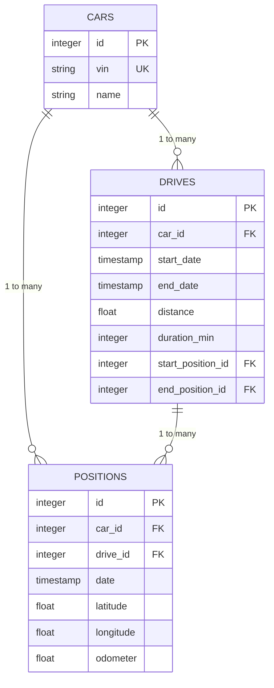
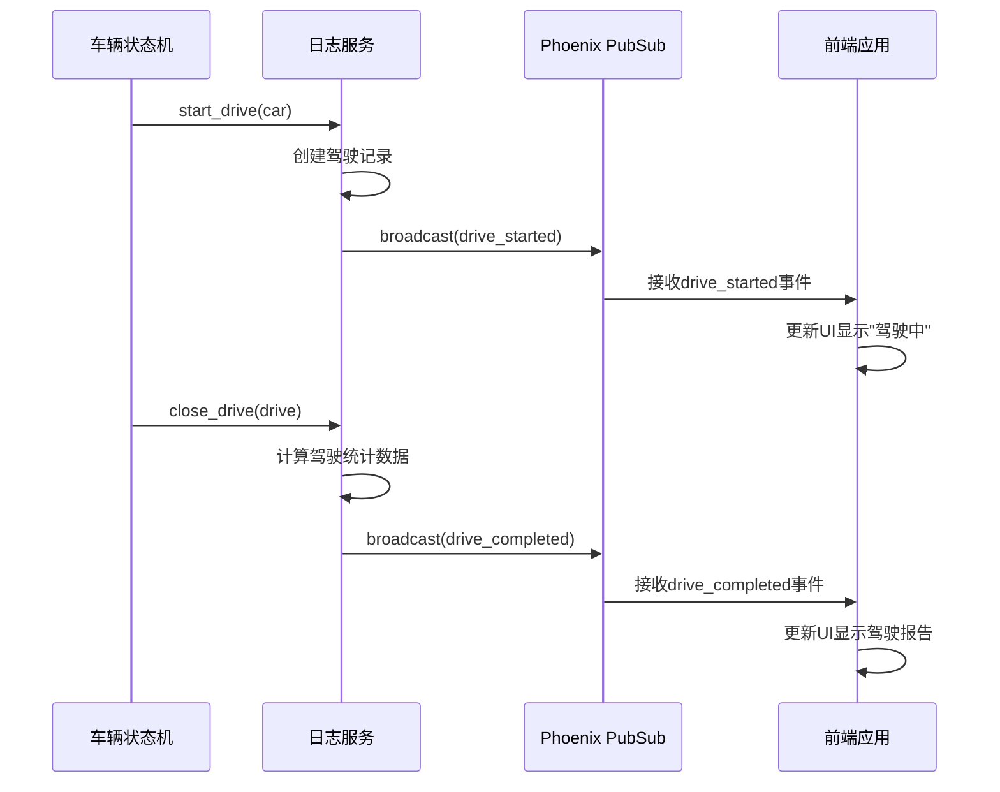

# 驾驶会话管理

<cite>
**本文档引用的文件**   
- [log.ex](file://lib/teslamate/log.ex#L237-L374)
- [vehicle.ex](file://lib/teslamate/vehicles/vehicle.ex#L1545-L1560)
- [drive.ex](file://lib/teslamate/log/drive.ex#L1-L39)
- [position.ex](file://lib/teslamate/log/position.ex#L37-L78)
- [vehicle/driving_test.exs](file://test/teslamate/vehicles/vehicle/driving_test.exs#L1-L550)
- [log_drive_test.exs](file://test/teslamate/log/log_drive_test.exs#L130-L166)
- [cascade_delete.exs](file://priv/repo/migrations/20200203120311_cascade_delete.exs#L38-L72)
</cite>

## 目录
1. [驾驶会话启动与结束机制](#驾驶会话启动与结束机制)
2. [时间戳处理逻辑](#时间戳处理逻辑)
3. [数据库约束与会话完整性](#数据库约束与会话完整性)
4. [会话恢复策略](#会话恢复策略)
5. [位置记录与会话关联](#位置记录与会话关联)
6. [事件广播机制](#事件广播机制)

## 驾驶会话启动与结束机制

驾驶会话的生命周期由车辆状态变化触发，通过 `start_drive/1` 和 `complete_drive/1` 函数管理。当车辆状态从静止变为行驶状态（shift_state 为 D、N 或 R）时，系统自动创建新的驾驶记录。`start_drive/1` 函数接收车辆实体作为参数，初始化驾驶会话并设置开始时间戳。当车辆重新挂入 P 档或长时间无活动时，`complete_drive/1` 函数被调用，计算驾驶距离、持续时间等统计信息并终止会话。若驾驶距离小于 0.01 公里或位置点少于 2 个，系统会自动删除该会话记录以保证数据质量。

**Section sources**
- [log.ex](file://lib/teslamate/log.ex#L237-L241)
- [vehicle.ex](file://lib/teslamate/vehicles/vehicle.ex#L1545-L1560)
- [vehicle/driving_test.exs](file://test/teslamate/vehicles/vehicle/driving_test.exs#L171-L204)

## 时间戳处理逻辑

Ecto 模型 Drive 的 `start_date` 和 `end_date` 字段采用 UTC 时区的微秒级时间戳（:utc_datetime_usec）来精确记录驾驶会话的起止时间。`start_date` 在调用 `start_drive/1` 时通过 `DateTime.utc_now()` 获取当前时间，确保高精度的时间记录。`end_date` 则在调用 `close_drive/1` 时，通过数据库聚合函数从关联的位置记录中提取最后一条位置点的时间。系统使用 PostgreSQL 的窗口函数 `last_value(p.date) |> over(:w)` 来确定会话结束时间，保证时间戳的准确性和一致性。

**Section sources**
- [drive.ex](file://lib/teslamate/log/drive.ex#L9-L10)
- [log.ex](file://lib/teslamate/log.ex#L257-L258)
- [log_drive_test.exs](file://test/teslamate/log/log_drive_test.exs#L138-L151)

## 数据库约束与会话完整性

系统通过多层次的数据库约束确保驾驶会话的完整性。外键约束确保 `drives` 表中的 `car_id` 引用有效的车辆记录，且在车辆删除时级联删除所有相关驾驶记录（on_delete: :delete_all）。位置记录（positions）与驾驶会话（drives）之间存在可为空的外键关系（on_delete: :nilify_all），允许在删除驾驶会话时保留位置数据。此外，应用层验证要求位置记录必须包含车辆ID、日期、纬度和经度等必要字段，防止创建不完整的位置数据，从而保障驾驶会话数据的完整性和可靠性。

**Diagram sources**
- [car.ex](file://lib/teslamate/log/car.ex#L8-L30)
- [drive.ex](file://lib/teslamate/log/drive.ex#L8-L39)
- [position.ex](file://lib/teslamate/log/position.ex#L37-L39)
- [cascade_delete.exs](file://priv/repo/migrations/20200203120311_cascade_delete.exs#L52-L72)

## 会话恢复策略

在车辆短暂离线后重新上线时，系统采用智能恢复策略处理驾驶会话。当车辆从离线或休眠状态恢复为在线状态，且前一状态为驾驶状态时，系统会检查最近的位置数据。如果发现车辆在离线期间有移动迹象（如里程变化），系统会自动关闭前一个驾驶会话并创建新的会话，确保驾驶记录的连续性。对于因网络中断导致的短暂离线，系统会尝试恢复流式连接，并根据时间戳判断数据的新鲜度，避免处理过时的流数据，从而保证会话恢复的准确性和数据一致性。

**Section sources**
- [vehicle.ex](file://lib/teslamate/vehicles/vehicle.ex#L442-L485)
- [vehicle/driving_test.exs](file://test/teslamate/vehicles/vehicle/driving_test.exs#L437-L448)

## 位置记录与会话关联

`insert_position/1` 函数负责将车辆位置数据关联到当前驾驶会话。该函数接收驾驶会话实体和位置属性作为参数，创建与特定驾驶会话关联的位置记录。位置记录包含时间戳、经纬度、速度、功率、里程表读数等关键信息。系统通过 `drive_id` 外键将位置记录与驾驶会话关联，确保所有位置数据都能正确归属到相应的驾驶活动中。在驾驶会话结束时，系统会基于这些位置记录计算总距离、最高速度、平均温度等统计信息，为驾驶分析提供数据支持。

**Section sources**
- [log.ex](file://lib/teslamate/log.ex#L146-L155)
- [position.ex](file://lib/teslamate/log/position.ex#L42-L77)
- [vehicle/driving_test.exs](file://test/teslamate/vehicles/vehicle/driving_test.exs#L76-L83)

## 事件广播机制

系统通过 Phoenix PubSub 组件广播 `drive_started` 和 `drive_completed` 事件，实现驾驶状态的实时通知。当 `start_drive/1` 成功创建驾驶会话后，系统会发布 `drive_started` 事件，携带驾驶会话ID和车辆信息。类似地，在 `close_drive/1` 完成会话终止后，系统会广播 `drive_completed` 事件，包含完整的驾驶统计数据。这些事件通过主题 `TeslaMate.PubSub` 发布，前端应用和其他服务可以订阅这些主题，实时更新用户界面或触发后续处理逻辑，如生成驾驶报告或更新车辆状态摘要。

**Diagram sources**
- [vehicle.ex](file://lib/teslamate/vehicles/vehicle.ex#L1545-L1554)
- [log.ex](file://lib/teslamate/log.ex#L237-L241)
- [vehicle.ex](file://lib/teslamate/vehicles/vehicle.ex#L696-L711)