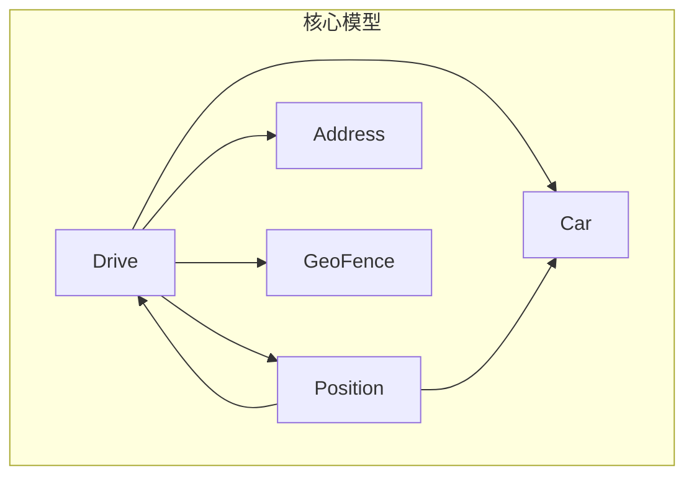
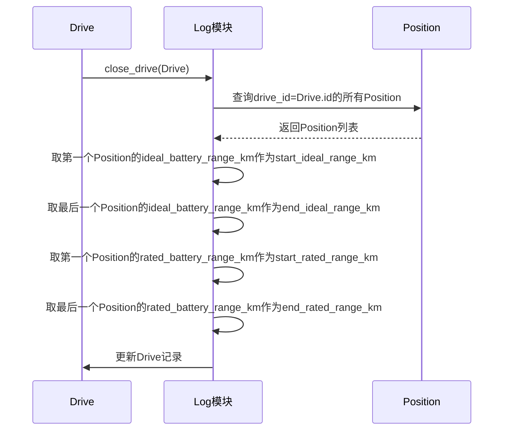
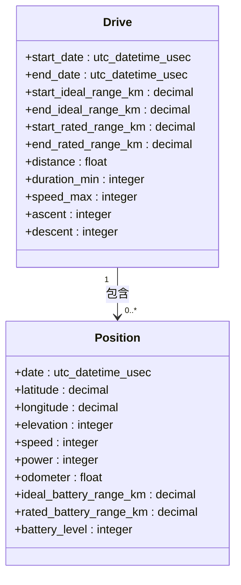
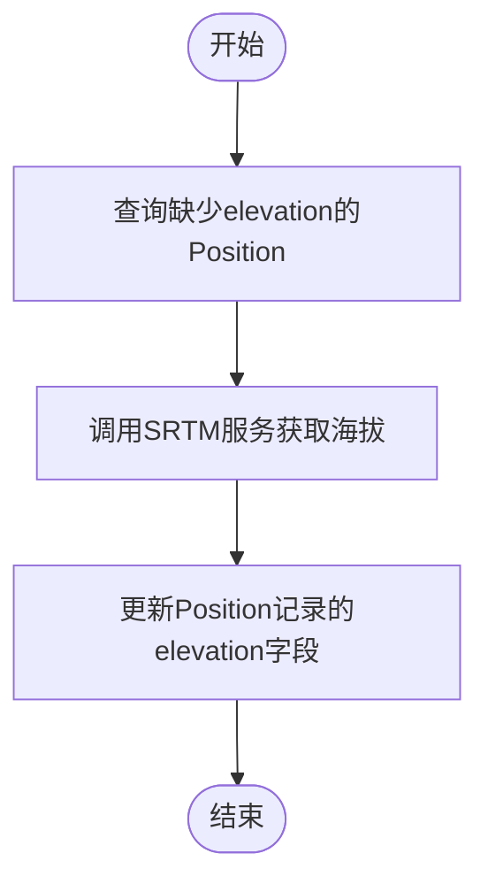

# 驾驶数据持久化

<cite>
**本文档中引用的文件**  
- [drive.ex](file://lib/teslamate/log/drive.ex)
- [position.ex](file://lib/teslamate/log/position.ex)
- [log.ex](file://lib/teslamate/log.ex)
- [terrain.ex](file://lib/teslamate/terrain.ex)
- [20190913175011_add_rated_range_to_drives.exs](file://priv/repo/migrations/20190913175011_add_rated_range_to_drives.exs)
- [20190913175543_set_start_and_end_rated_range_km.exs](file://priv/repo/migrations/20190913175543_set_start_and_end_rated_range_km.exs)
- [20250613133700_add_and_calculate_elevation_changes.exs](file://priv/repo/migrations/20250613133700_add_and_calculate_elevation_changes.exs)
- [20200410112005_database_efficiency_improvements.exs](file://priv/repo/migrations/20200410112005_database_efficiency_improvements.exs)
- [20200203120311_cascade_delete.exs](file://priv/repo/migrations/20200203120311_cascade_delete.exs)
- [20191007105010_add_new_fkey_indexes.exs](file://priv/repo/migrations/20191007105010_add_new_fkey_indexes.exs)
</cite>

## 目录
1. [引言](#引言)
2. [项目结构](#项目结构)
3. [核心组件](#核心组件)
4. [架构概述](#架构概述)
5. [详细组件分析](#详细组件分析)
6. [依赖分析](#依赖分析)
7. [性能考虑](#性能考虑)
8. [故障排除指南](#故障排除指南)
9. [结论](#结论)

## 引言
本文档详细描述了TeslaMate项目中驾驶数据的持久化机制，重点关注Drive模型中与续航相关的字段（如start_ideal_range_km、end_rated_range_km等）的计算与存储逻辑。文档解释了如何从Position记录中提取起始和结束位置的电池续航数据，并通过数据库迁移脚本实现历史数据的批量更新。同时，文档还说明了distance、duration_min、speed_max等驾驶统计指标的计算方法，以及ascent和descent等地形数据的来源。此外，文档阐述了Drive与Car、Position、Address等模型的关联关系，并分析了外键约束和索引策略对数据完整性和查询性能的影响。

## 项目结构
TeslaMate项目采用Elixir语言开发，使用Phoenix框架构建Web界面，数据持久化基于PostgreSQL数据库。项目结构清晰，主要分为以下几个部分：
- `lib/`：包含核心业务逻辑，如日志处理、车辆管理、位置服务等。
- `priv/repo/migrations/`：包含数据库迁移脚本，用于管理数据库模式的变更。
- `test/`：包含单元测试和集成测试，确保代码的正确性和稳定性。
- `grafana/`：包含Grafana仪表板配置，用于数据可视化。

**Section sources**
- [drive.ex](file://lib/teslamate/log/drive.ex)
- [position.ex](file://lib/teslamate/log/position.ex)
- [log.ex](file://lib/teslamate/log.ex)

## 核心组件
本节分析与驾驶数据持久化相关的几个核心组件，包括Drive模型、Position模型、日志处理模块和地形数据模块。

**Section sources**
- [drive.ex](file://lib/teslamate/log/drive.ex)
- [position.ex](file://lib/teslamate/log/position.ex)
- [log.ex](file://lib/teslamate/log.ex)
- [terrain.ex](file://lib/teslamate/terrain.ex)

## 架构概述
TeslaMate的驾驶数据持久化架构围绕Drive和Position两个核心模型展开。Drive模型记录每次驾驶的总体信息，如起始和结束时间、距离、持续时间、速度最大值等。Position模型记录驾驶过程中的具体位置信息，包括经纬度、海拔、速度、功率、里程表读数、电池续航等。Drive与Position之间存在一对多的关系，一个Drive可以包含多个Position记录。



**Diagram sources **
- [drive.ex](file://lib/teslamate/log/drive.ex)
- [position.ex](file://lib/teslamate/log/position.ex)

## 详细组件分析

### Drive模型分析
Drive模型是驾驶数据的核心，它存储了每次驾驶的汇总信息。关键字段包括：
- `start_ideal_range_km` 和 `end_ideal_range_km`：起始和结束时的理想续航里程（公里）。
- `start_rated_range_km` 和 `end_rated_range_km`：起始和结束时的额定续航里程（公里）。
- `distance`：本次驾驶的总距离（公里）。
- `duration_min`：本次驾驶的持续时间（分钟）。
- `speed_max`：本次驾驶的最大速度（公里/小时）。
- `ascent` 和 `descent`：本次驾驶的累计爬升和下降高度（米）。

这些字段的计算和存储逻辑在`log.ex`文件中的`close_drive/2`函数中实现。该函数通过聚合关联的Position记录来计算这些统计值。

#### 续航字段计算逻辑
续航相关字段的计算依赖于Position模型中的`ideal_battery_range_km`和`rated_battery_range_km`字段。在Drive关闭时，系统会查询其关联的所有Position记录，并取第一个和最后一个Position的续航值作为Drive的起始和结束续航值。



**Diagram sources **
- [drive.ex](file://lib/teslamate/log/drive.ex)
- [log.ex](file://lib/teslamate/log.ex)

### Position模型分析
Position模型记录了车辆在特定时间点的详细状态，是计算Drive统计值的基础。关键字段包括：
- `date`：记录的时间戳。
- `latitude` 和 `longitude`：地理位置。
- `elevation`：海拔高度（米）。
- `speed`：当前速度（公里/小时）。
- `power`：当前功率（千瓦），正值表示消耗，负值表示回收。
- `odometer`：里程表读数（公里）。
- `ideal_battery_range_km` 和 `rated_battery_range_km`：当前的理想和额定续航里程（公里）。
- `battery_level`：当前电池电量百分比。

Position记录通过`drive_id`外键与Drive关联，形成驾驶过程的时间序列数据。



**Diagram sources **
- [drive.ex](file://lib/teslamate/log/drive.ex)
- [position.ex](file://lib/teslamate/log/position.ex)

### 统计指标计算方法
Drive模型中的统计指标通过Ecto查询和PostgreSQL的窗口函数在`close_drive/2`函数中计算得出。

- **距离 (distance)**：通过计算最后一个Position的`odometer`减去第一个Position的`odometer`得到。
- **持续时间 (duration_min)**：通过计算最后一个Position的`date`减去第一个Position的`date`，然后转换为分钟得到。
- **最大速度 (speed_max)**：通过查询所有关联Position记录的`speed`字段的最大值得到。
- **温度平均值 (outside_temp_avg, inside_temp_avg)**：通过查询所有关联Position记录的`outside_temp`和`inside_temp`字段的平均值得到。

这些计算在`log.ex`文件的`drive_data`查询中完成。

**Section sources**
- [log.ex](file://lib/teslamate/log.ex)

### 地形数据来源
`ascent`（爬升）和`descent`（下降）字段表示驾驶过程中的累计海拔变化。这些数据来源于SRTM（Shuttle Radar Topography Mission）地形数据。

系统通过`terrain.ex`模块定期查询`positions`表中缺少`elevation`值的记录，调用外部服务获取海拔高度，并更新数据库。`ascent`和`descent`的计算在`close_drive/2`函数中完成，通过计算连续Position记录之间海拔差值的累加和得到。



**Diagram sources **
- [terrain.ex](file://lib/teslamate/terrain.ex)
- [log.ex](file://lib/teslamate/log.ex)

## 依赖分析
本节分析Drive模型与其他模型的关联关系，以及数据库的外键约束和索引策略。

### 模型关联关系
Drive模型与多个其他模型存在关联：
- `belongs_to :car`：每个Drive属于一辆Car。
- `belongs_to :start_position` 和 `belongs_to :end_position`：每个Drive有起始和结束的Position。
- `belongs_to :start_address` 和 `belongs_to :end_address`：每个Drive有起始和结束的地址。
- `belongs_to :start_geofence` 和 `belongs_to :end_geofence`：每个Drive有起始和结束的地理围栏。

这些关联关系在`drive.ex`文件中通过`belongs_to`宏定义。

### 外键约束
数据库通过外键约束保证数据完整性。例如，`drives`表的`car_id`字段引用`cars`表的`id`字段，确保每个Drive都关联到一个有效的Car。`positions`表的`drive_id`字段引用`drives`表的`id`字段，确保每个Position都属于一个有效的Drive。

```mermaid
erDiagram
DRIVE {
integer id PK
integer car_id FK
timestamp start_date
timestamp end_date
decimal start_ideal_range_km
decimal end_ideal_range_km
decimal start_rated_range_km
decimal end_rated_range_km
float distance
integer duration_min
integer speed_max
integer ascent
integer descent
}
POSITION {
integer id PK
integer car_id FK
integer drive_id FK
timestamp date
decimal latitude
decimal longitude
integer elevation
integer speed
integer power
float odometer
decimal ideal_battery_range_km
decimal rated_battery_range_km
integer battery_level
}
CAR {
integer id PK
string name
float efficiency
string model
}
ADDRESS {
integer id PK
string name
decimal latitude
decimal longitude
}
GEO_FENCE {
integer id PK
string name
decimal latitude
decimal longitude
integer radius
}
DRIVE ||--o{ POSITION : 包含
DRIVE }o--|| CAR : 属于
DRIVE }o--|| ADDRESS : 起始/结束地址
DRIVE }o--|| GEO_FENCE : 起始/结束围栏
```

**Diagram sources **
- [drive.ex](file://lib/teslamate/log/drive.ex)
- [position.ex](file://lib/teslamate/log/position.ex)
- [car.ex](file://lib/teslamate/log/car.ex)

### 索引策略
数据库索引对查询性能至关重要。`drives`表在`start_position_id`、`end_position_id`、`start_geofence_id`、`end_geofence_id`等外键字段上创建了索引，以加速关联查询。`positions`表在`drive_id`和`date`字段上创建了复合索引，以优化按驾驶和时间范围查询位置数据的性能。

**Section sources**
- [20191007105010_add_new_fkey_indexes.exs](file://priv/repo/migrations/20191007105010_add_new_fkey_indexes.exs)
- [20230417225712_composite_index_to_position.exs](file://priv/repo/migrations/20230417225712_composite_index_to_position.exs)

## 性能考虑
为了优化性能，系统采取了多项措施：
- **数据类型优化**：在`20200410112005_database_efficiency_improvements.exs`迁移中，将`speed_max`、`duration_min`等字段从`:integer`改为`:smallint`，将续航字段从`:float`改为`:decimal`，以减少存储空间和提高查询效率。
- **批量更新**：对于历史数据的更新，如`20190913175543_set_start_and_end_rated_range_km.exs`迁移，使用`Repo.stream()`和`Stream.each/2`进行流式处理，避免一次性加载所有数据到内存。
- **级联删除**：在`20200203120311_cascade_delete.exs`迁移中，为外键添加了`on_delete: :delete_all`和`on_delete: :nilify_all`选项，确保删除Car时自动删除其所有Drive和Position，删除Drive时将关联Position的`drive_id`设为NULL，维护数据一致性。

**Section sources**
- [20200410112005_database_efficiency_improvements.exs](file://priv/repo/migrations/20200410112005_database_efficiency_improvements.exs)
- [20200203120311_cascade_delete.exs](file://priv/repo/migrations/20200203120311_cascade_delete.exs)

## 故障排除指南
在处理驾驶数据持久化问题时，可以参考以下几点：
- **检查Position数据**：确保`positions`表中有足够的数据，且`ideal_battery_range_km`和`rated_battery_range_km`字段不为空。
- **验证外键关系**：检查`drives`表的`car_id`、`start_position_id`、`end_position_id`等外键是否指向有效的记录。
- **查看日志**：检查应用日志，特别是`Terrain`模块的日志，确认海拔数据是否成功获取。
- **数据库查询**：直接查询数据库，验证统计值的计算是否正确。

**Section sources**
- [log.ex](file://lib/teslamate/log.ex)
- [terrain.ex](file://lib/teslamate/terrain.ex)

## 结论
TeslaMate项目通过精心设计的Drive和Position模型，实现了驾驶数据的高效持久化。系统利用Ecto和PostgreSQL的强大功能，通过聚合查询和窗口函数计算复杂的统计指标，并通过外键约束和索引策略保证数据完整性和查询性能。地形数据的引入进一步丰富了驾驶分析的维度。整体架构清晰，可维护性强，为用户提供准确、可靠的驾驶数据记录和分析功能。