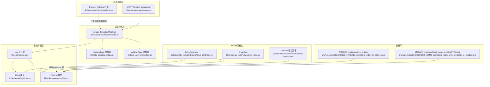
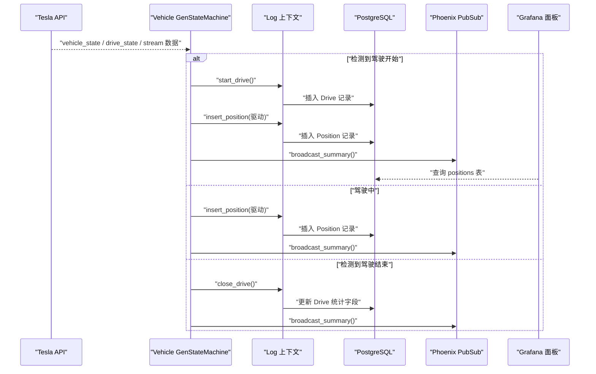
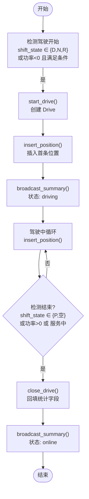
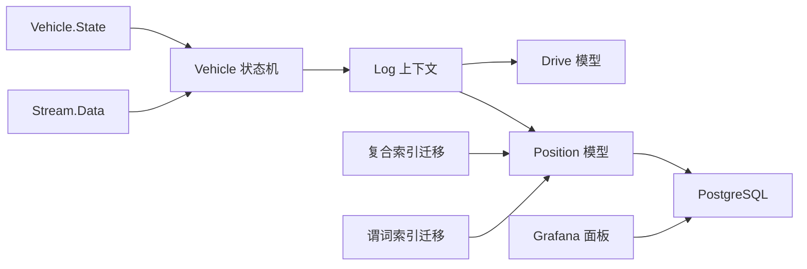

# 驾驶数据记录

<cite>
**本文引用的文件**
- [lib/teslamate/log/drive.ex](file://lib/teslamate/log/drive.ex)
- [lib/teslamate/log/position.ex](file://lib/teslamate/log/position.ex)
- [lib/teslamate/log.ex](file://lib/teslamate/log.ex)
- [lib/teslamate/vehicles/vehicle.ex](file://lib/teslamate/vehicles/vehicle.ex)
- [lib/tesla_api/stream/data.ex](file://lib/tesla_api/stream/data.ex)
- [lib/tesla_api/vehicle/state.ex](file://lib/tesla_api/vehicle/state.ex)
- [lib/teslamate_web/controllers/drive_controller.ex](file://lib/teslamate_web/controllers/drive_controller.ex)
- [lib/teslamate_web/views/drive_view.ex](file://lib/teslamate_web/views/drive_view.ex)
- [lib/teslamate/mqtt/pubsub.ex](file://lib/teslamate/mqtt/pubsub.ex)
- [grafana/dashboards/internal/drive-details.json](file://grafana/dashboards/internal/drive-details.json)
- [priv/repo/migrations/20230417225712_composite_index_to_position.exs](file://priv/repo/migrations/20230417225712_composite_index_to_position.exs)
- [priv/repo/migrations/20240915193446_composite_index_with_predicate_to_position.exs](file://priv/repo/migrations/20240915193446_composite_index_with_predicate_to_position.exs)
- [website/docs/configuration/environment_variables.md](file://website/docs/configuration/environment_variables.md)
- [test/teslamate/log/log_drive_test.exs](file://test/teslamate/log/log_drive_test.exs)
- [test/teslamate/vehicles/vehicle/driving_test.exs](file://test/teslamate/vehicles/vehicle/driving_test.exs)
</cite>

## 目录
1. [简介](#简介)
2. [项目结构](#项目结构)
3. [核心组件](#核心组件)
4. [架构总览](#架构总览)
5. [详细组件分析](#详细组件分析)
6. [依赖关系分析](#依赖关系分析)
7. [性能考量](#性能考量)
8. [故障排查指南](#故障排查指南)
9. [结论](#结论)
10. [附录](#附录)

## 简介
本文件围绕驾驶数据记录功能进行系统化说明，重点覆盖：
- 驾驶会话的启动与结束机制（基于Tesla API流式数据与轮询）
- 位置数据采集频率（轮询间隔与流式推送）
- 驾驶状态转换逻辑（在线/离线/休眠/驾驶/暂停/充电）
- 驾驶数据的存储结构（Ecto模型Drive与Position）
- 关键指标计算（距离、时长、速度极值、海拔增减）
- 与Grafana仪表板的集成方式
- 通过Phoenix PubSub广播驾驶状态变化
- 代码示例路径：insert_position/1 与 start_drive/1 的实现要点

## 项目结构
围绕驾驶数据记录的关键模块与文件如下：
- 日志上下文：驱动Ecto模型与数据聚合逻辑
- 车辆状态机：处理Tesla API响应、状态转换与位置写入
- Tesla API适配层：流式数据结构与车辆状态结构
- Web控制器与视图：导出GPX轨迹
- Grafana仪表板：可视化驾驶轨迹与指标
- 数据库迁移：为positions表建立复合索引以优化查询

图表来源
- [lib/teslamate/log/drive.ex](file://lib/teslamate/log/drive.ex#L1-L79)
- [lib/teslamate/log/position.ex](file://lib/teslamate/log/position.ex#L1-L79)
- [lib/teslamate/log.ex](file://lib/teslamate/log.ex#L146-L171)
- [lib/teslamate/vehicles/vehicle.ex](file://lib/teslamate/vehicles/vehicle.ex#L1-L200)
- [lib/tesla_api/stream/data.ex](file://lib/tesla_api/stream/data.ex#L1-L47)
- [lib/tesla_api/vehicle/state.ex](file://lib/tesla_api/vehicle/state.ex#L1-L396)
- [lib/teslamate_web/controllers/drive_controller.ex](file://lib/teslamate_web/controllers/drive_controller.ex#L1-L31)
- [lib/teslamate_web/views/drive_view.ex](file://lib/teslamate_web/views/drive_view.ex#L1-L4)
- [grafana/dashboards/internal/drive-details.json](file://grafana/dashboards/internal/drive-details.json#L467-L498)
- [priv/repo/migrations/20230417225712_composite_index_to_position.exs](file://priv/repo/migrations/20230417225712_composite_index_to_position.exs#L1-L8)
- [priv/repo/migrations/20240915193446_composite_index_with_predicate_to_position.exs](file://priv/repo/migrations/20240915193446_composite_index_with_predicate_to_position.exs#L1-L9)

章节来源
- [lib/teslamate/log/drive.ex](file://lib/teslamate/log/drive.ex#L1-L79)
- [lib/teslamate/log/position.ex](file://lib/teslamate/log/position.ex#L1-L79)
- [lib/teslamate/log.ex](file://lib/teslamate/log.ex#L146-L171)
- [lib/teslamate/vehicles/vehicle.ex](file://lib/teslamate/vehicles/vehicle.ex#L1-L200)
- [lib/tesla_api/stream/data.ex](file://lib/tesla_api/stream/data.ex#L1-L47)
- [lib/tesla_api/vehicle/state.ex](file://lib/tesla_api/vehicle/state.ex#L1-L396)
- [lib/teslamate_web/controllers/drive_controller.ex](file://lib/teslamate_web/controllers/drive_controller.ex#L1-L31)
- [lib/teslamate_web/views/drive_view.ex](file://lib/teslamate_web/views/drive_view.ex#L1-L4)
- [grafana/dashboards/internal/drive-details.json](file://grafana/dashboards/internal/drive-details.json#L467-L498)
- [priv/repo/migrations/20230417225712_composite_index_to_position.exs](file://priv/repo/migrations/20230417225712_composite_index_to_position.exs#L1-L8)
- [priv/repo/migrations/20240915193446_composite_index_with_predicate_to_position.exs](file://priv/repo/migrations/20240915193446_composite_index_with_predicate_to_position.exs#L1-L9)

## 核心组件
- Drive 模型：记录一次驾驶会话的起止时间、里程、时长、温度与能耗极值、海拔增减、起终点地址与地理围栏等。
- Position 模型：记录每条位置数据的时间戳、经纬度、海拔、速度、功率、里程、电池范围与温度等。
- Log 上下文：提供插入位置、开始/关闭驾驶、更新状态等操作；负责聚合统计指标。
- Vehicle 状态机：根据Tesla API返回的状态（在线/离线/休眠）与流式数据（shift_state/power）判定驾驶开始/继续/结束，并通过PubSub广播摘要。
- Tesla API适配：Stream.Data与Vehicle.State结构体用于解析流式与非流式数据。
- Grafana面板：通过PostgreSQL数据源查询positions表，渲染速度、功率、范围、SOC、海拔与轨迹地图。
- Web导出：DriveController提供GPX导出接口，供外部工具或可视化使用。

章节来源
- [lib/teslamate/log/drive.ex](file://lib/teslamate/log/drive.ex#L1-L79)
- [lib/teslamate/log/position.ex](file://lib/teslamate/log/position.ex#L1-L79)
- [lib/teslamate/log.ex](file://lib/teslamate/log.ex#L146-L171)
- [lib/teslamate/vehicles/vehicle.ex](file://lib/teslamate/vehicles/vehicle.ex#L438-L554)
- [lib/tesla_api/stream/data.ex](file://lib/tesla_api/stream/data.ex#L1-L47)
- [lib/tesla_api/vehicle/state.ex](file://lib/tesla_api/vehicle/state.ex#L168-L214)
- [grafana/dashboards/internal/drive-details.json](file://grafana/dashboards/internal/drive-details.json#L467-L498)
- [lib/teslamate_web/controllers/drive_controller.ex](file://lib/teslamate_web/controllers/drive_controller.ex#L1-L31)

## 架构总览
驾驶数据记录的整体流程：
- Vehicle状态机从Tesla API获取车辆状态或接收流式数据；
- 当检测到shift_state为D/N/R或功率为负且满足条件时，触发驾驶开始；
- 在驾驶过程中周期性插入位置数据；
- 当shift_state回到P或空，或车辆进入服务状态时，关闭驾驶并回填指标；
- 通过Phoenix PubSub广播摘要，前端与仪表板实时感知状态变化；
- Grafana面板查询positions表生成轨迹与指标图。

图表来源
- [lib/teslamate/vehicles/vehicle.ex](file://lib/teslamate/vehicles/vehicle.ex#L438-L554)
- [lib/teslamate/log.ex](file://lib/teslamate/log.ex#L237-L375)
- [lib/teslamate/log.ex](file://lib/teslamate/log.ex#L146-L171)
- [grafana/dashboards/internal/drive-details.json](file://grafana/dashboards/internal/drive-details.json#L467-L498)

## 详细组件分析

### 驾驶会话的启动与结束机制
- 启动条件：当流式数据中的shift_state为D/N/R，或在休眠/暂停状态下检测到功率为负且满足条件时，调用start_drive创建会话。
- 过程：在事务中先创建Drive，再插入首条Position，同时查找地理围栏；随后广播摘要。
- 结束条件：当shift_state为P或空，且功率为负或正时，或车辆进入服务状态，调用close_drive回填统计字段；若无有效位置则删除该会话。
- 超时：长时间无新数据时，Vehicle状态机也会尝试关闭当前驾驶并切换到在线状态。

图表来源
- [lib/teslamate/vehicles/vehicle.ex](file://lib/teslamate/vehicles/vehicle.ex#L438-L554)
- [lib/teslamate/vehicles/vehicle.ex](file://lib/teslamate/vehicles/vehicle.ex#L1078-L1109)
- [lib/teslamate/vehicles/vehicle.ex](file://lib/teslamate/vehicles/vehicle.ex#L1545-L1568)
- [lib/teslamate/log.ex](file://lib/teslamate/log.ex#L237-L375)

章节来源
- [lib/teslamate/vehicles/vehicle.ex](file://lib/teslamate/vehicles/vehicle.ex#L438-L554)
- [lib/teslamate/vehicles/vehicle.ex](file://lib/teslamate/vehicles/vehicle.ex#L1078-L1109)
- [lib/teslamate/vehicles/vehicle.ex](file://lib/teslamate/vehicles/vehicle.ex#L1545-L1568)
- [lib/teslamate/log.ex](file://lib/teslamate/log.ex#L237-L375)
- [test/teslamate/vehicles/vehicle/driving_test.exs](file://test/teslamate/vehicles/vehicle/driving_test.exs#L1-L34)

### 位置数据采集频率
- 轮询间隔（秒）由环境变量控制，默认值见配置文档；当车辆处于不同状态时采用不同的最小间隔：
  - 驾驶：默认2.5秒
  - 充电：默认5秒
  - 在线：默认60秒
  - 休眠：默认30秒
  - 默认：默认15秒
  - 最小：默认0秒
- 流式API：启用后可获得更频繁的数据推送，但实际入库仍受轮询调度与状态机逻辑影响。

章节来源
- [lib/teslamate/vehicles/vehicle.ex](file://lib/teslamate/vehicles/vehicle.ex#L30-L49)
- [website/docs/configuration/environment_variables.md](file://website/docs/configuration/environment_variables.md#L52-L58)

### 驾驶状态转换逻辑
- 状态机在不同状态间转换：start → asleep/offline → online → driving → suspended → start
- 转换依据：
  - 在线/离线/休眠：根据Tesla API返回的state
  - 驾驶：根据shift_state与功率判断
  - 暂停：手动触发或满足条件时进入，恢复时提高轮询频率
  - 充电：功率为负且满足条件
- 超时与错误：对超时、未授权、服务中、令牌过期等情况进行熔断与重试策略。

章节来源
- [lib/teslamate/vehicles/vehicle.ex](file://lib/teslamate/vehicles/vehicle.ex#L302-L435)
- [lib/teslamate/vehicles/vehicle.ex](file://lib/teslamate/vehicles/vehicle.ex#L438-L554)
- [lib/teslamate/vehicles/vehicle.ex](file://lib/teslamate/vehicles/vehicle.ex#L570-L660)

### 驾驶数据的存储结构
- Drive 模型字段：起止时间、平均内外温、速度/功率极值、起终点理想/标称续航、起终点里程、距离、时长（分钟）、海拔增减等。
- Position 模型字段：时间戳、经纬度、海拔、速度、功率、里程、电池范围、SOC、内外温、空调/座椅加热、胎压等。
- 关系：Drive.has_many Positions；Position.belongs_to Drive；均属于同一Car。

章节来源
- [lib/teslamate/log/drive.ex](file://lib/teslamate/log/drive.ex#L1-L79)
- [lib/teslamate/log/position.ex](file://lib/teslamate/log/position.ex#L1-L79)

### 关键指标计算
- 距离：首尾里程差（仅当有效位置数≥2且距离≥0.01）
- 时长：末时间-首时间（分钟）
- 速度/功率极值：按窗口聚合的最大/最小
- 海拔增减：对相邻海拔差求和，超过小整型上限时置零
- 地址与地理围栏：在关闭驾驶时通过位置点查找并回填

章节来源
- [lib/teslamate/log.ex](file://lib/teslamate/log.ex#L237-L375)
- [test/teslamate/log/log_drive_test.exs](file://test/teslamate/log/log_drive_test.exs#L130-L156)
- [test/teslamate/log/log_drive_test.exs](file://test/teslamate/log/log_drive_test.exs#L266-L276)

### 通过Tesla API实时获取车辆行驶信息
- 非流式API：Vehicle状态机定期拉取vehicle_state与drive_state等字段
- 流式API：接收Stream.Data，包含时间、速度、里程、功率、海拔、方向、range、shift_state等；状态机据此判定驾驶开始/继续/结束
- 数据清洗：Stream.Data结构体将原始字符串数值转换为合适的类型

章节来源
- [lib/teslamate/vehicles/vehicle.ex](file://lib/teslamate/vehicles/vehicle.ex#L438-L554)
- [lib/tesla_api/stream/data.ex](file://lib/tesla_api/stream/data.ex#L1-L47)
- [lib/tesla_api/vehicle/state.ex](file://lib/tesla_api/vehicle/state.ex#L168-L214)

### 结合Ecto模型Drive与Position实现高精度轨迹记录
- 插入位置：insert_position/2支持两种签名：传入Drive或Car，自动填充外键
- 事务一致性：开始/结束驾驶与插入首条位置在事务中完成，保证原子性
- 索引优化：positions表建立复合索引与谓词索引，提升按drive_id/date与带range字段查询的性能

章节来源
- [lib/teslamate/log.ex](file://lib/teslamate/log.ex#L146-L171)
- [lib/teslamate/log.ex](file://lib/teslamate/log.ex#L237-L241)
- [priv/repo/migrations/20230417225712_composite_index_to_position.exs](file://priv/repo/migrations/20230417225712_composite_index_to_position.exs#L1-L8)
- [priv/repo/migrations/20240915193446_composite_index_with_predicate_to_position.exs](file://priv/repo/migrations/20240915193446_composite_index_with_predicate_to_position.exs#L1-L9)

### 计算驾驶距离、持续时间、速度极值等关键指标
- 距离与时长：通过窗口函数对Position集合按时间排序，计算首尾里程差与时间差
- 速度/功率极值：窗口内max/min
- 海拔增减：相邻海拔差分求和，溢出保护
- 地址与围栏：关闭驾驶时通过位置点查找并回填

章节来源
- [lib/teslamate/log.ex](file://lib/teslamate/log.ex#L243-L375)
- [test/teslamate/log/log_drive_test.exs](file://test/teslamate/log/log_drive_test.exs#L130-L156)

### 与Grafana仪表板的集成方式
- 数据源：PostgreSQL数据源连接TeslaMate数据库
- 查询示例：驱动面板通过positions表查询速度、功率、range、SOC、海拔与经纬度，按时间序列渲染
- GPX导出：通过DriveController的gpx接口导出单次驾驶轨迹，便于外部工具查看

章节来源
- [grafana/dashboards/internal/drive-details.json](file://grafana/dashboards/internal/drive-details.json#L467-L498)
- [lib/teslamate_web/controllers/drive_controller.ex](file://lib/teslamate_web/controllers/drive_controller.ex#L1-L31)

### insert_position/1 与 start_drive/1 的实现细节（代码示例路径）
- insert_position/2
  - 传入Drive：自动设置drive_id与car_id
  - 传入Car：仅设置car_id
  - 返回插入结果
  - 示例路径：[lib/teslamate/log.ex](file://lib/teslamate/log.ex#L146-L171)
- start_drive/1
  - 创建Drive记录，设置start_date
  - 示例路径：[lib/teslamate/log.ex](file://lib/teslamate/log.ex#L237-L241)
- close_drive/1
  - 聚合计指标并更新Drive
  - 示例路径：[lib/teslamate/log.ex](file://lib/teslamate/log.ex#L243-L375)

章节来源
- [lib/teslamate/log.ex](file://lib/teslamate/log.ex#L146-L171)
- [lib/teslamate/log.ex](file://lib/teslamate/log.ex#L237-L241)
- [lib/teslamate/log.ex](file://lib/teslamate/log.ex#L243-L375)

### 通过Phoenix PubSub广播驾驶状态变化
- Vehicle状态机在每次状态变更或位置插入后，通过broadcast_summary与broadcast_fetch广播摘要与抓取状态
- 前端与仪表板订阅主题，实时感知状态变化
- 示例路径：[lib/teslamate/vehicles/vehicle.ex](file://lib/teslamate/vehicles/vehicle.ex#L694-L724)

章节来源
- [lib/teslamate/vehicles/vehicle.ex](file://lib/teslamate/vehicles/vehicle.ex#L694-L724)

## 依赖关系分析
- Vehicle状态机依赖Tesla API适配层（Stream.Data、Vehicle.State）与Log上下文（插入位置、开始/结束驾驶）
- Log上下文依赖Ecto仓库与地理位置服务（地址/围栏）
- Grafana面板依赖PostgreSQL数据源与positions表
- 数据库索引迁移优化positions表查询性能

图表来源
- [lib/tesla_api/vehicle/state.ex](file://lib/tesla_api/vehicle/state.ex#L168-L214)
- [lib/tesla_api/stream/data.ex](file://lib/tesla_api/stream/data.ex#L1-L47)
- [lib/teslamate/vehicles/vehicle.ex](file://lib/teslamate/vehicles/vehicle.ex#L1-L200)
- [lib/teslamate/log.ex](file://lib/teslamate/log.ex#L146-L171)
- [grafana/dashboards/internal/drive-details.json](file://grafana/dashboards/internal/drive-details.json#L467-L498)
- [priv/repo/migrations/20230417225712_composite_index_to_position.exs](file://priv/repo/migrations/20230417225712_composite_index_to_position.exs#L1-L8)
- [priv/repo/migrations/20240915193446_composite_index_with_predicate_to_position.exs](file://priv/repo/migrations/20240915193446_composite_index_with_predicate_to_position.exs#L1-L9)

## 性能考量
- 位置数据量大：启用流式API时，positions表占主要存储空间；建议按需查询并使用谓词索引过滤
- 索引优化：复合索引positions(drive_id,date)与谓词索引positions(ideal_battery_range_km IS NOT NULL)显著提升查询效率
- 查询建议：仅在必要时查询positions表；如15秒间隔足够，可通过WHERE条件限制范围
- 扩展建议：启用pg_stat_statements收集慢查询，定期分析并优化

章节来源
- [website/docs/development.mdx](file://website/docs/development.mdx#L166-L202)
- [priv/repo/migrations/20230417225712_composite_index_to_position.exs](file://priv/repo/migrations/20230417225712_composite_index_to_position.exs#L1-L8)
- [priv/repo/migrations/20240915193446_composite_index_with_predicate_to_position.exs](file://priv/repo/migrations/20240915193446_composite_index_with_predicate_to_position.exs#L1-L9)

## 故障排查指南
- API错误与熔断
  - 处理未授权、服务中、令牌过期、请求过多等情况，状态机内置熔断与重试
  - 示例路径：[lib/teslamate/vehicles/vehicle.ex](file://lib/teslamate/vehicles/vehicle.ex#L361-L435)
- 驾驶未正确结束
  - 检查shift_state是否为P或空，功率是否为正；确认close_drive条件（至少两条有效位置且距离≥0.01）
  - 示例路径：[lib/teslamate/log.ex](file://lib/teslamate/log.ex#L346-L375)
- 仪表板查询缓慢
  - 确认已应用索引迁移；使用EXPLAIN ANALYZE检查查询计划；按需添加WHERE条件
  - 示例路径：[website/docs/development.mdx](file://website/docs/development.mdx#L166-L202)
- GPX导出失败
  - 确认Drive存在且包含位置数据；检查控制器返回状态码
  - 示例路径：[lib/teslamate_web/controllers/drive_controller.ex](file://lib/teslamate_web/controllers/drive_controller.ex#L1-L31)

章节来源
- [lib/teslamate/vehicles/vehicle.ex](file://lib/teslamate/vehicles/vehicle.ex#L361-L435)
- [lib/teslamate/log.ex](file://lib/teslamate/log.ex#L346-L375)
- [website/docs/development.mdx](file://website/docs/development.mdx#L166-L202)
- [lib/teslamate_web/controllers/drive_controller.ex](file://lib/teslamate_web/controllers/drive_controller.ex#L1-L31)

## 结论
本系统通过Vehicle状态机与Tesla API紧密协作，实现了高精度的驾驶数据记录与可视化。Ecto模型Drive与Position清晰定义了存储结构，Log上下文负责指标聚合与事务一致性；Phoenix PubSub保障了状态变化的实时广播；Grafana面板与GPX导出提供了丰富的可视化与导出能力。配合数据库索引优化与查询建议，可在大规模数据场景下保持良好性能。

## 附录
- 环境变量与轮询间隔参考：[website/docs/configuration/environment_variables.md](file://website/docs/configuration/environment_variables.md#L52-L58)
- 单元测试验证指标计算与状态机行为：
  - [test/teslamate/log/log_drive_test.exs](file://test/teslamate/log/log_drive_test.exs#L130-L156)
  - [test/teslamate/vehicles/vehicle/driving_test.exs](file://test/teslamate/vehicles/vehicle/driving_test.exs#L1-L34)