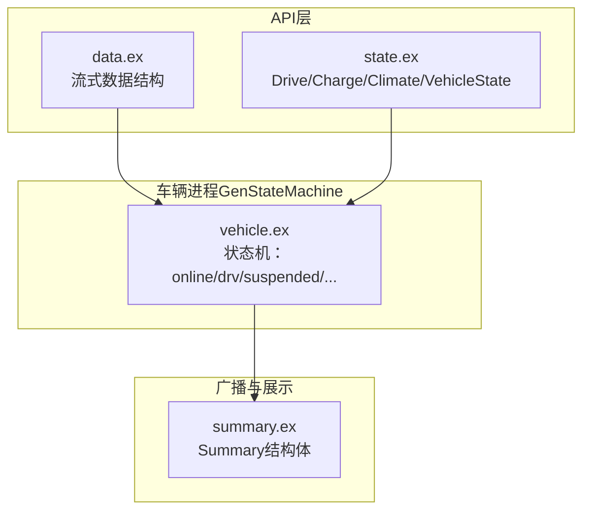
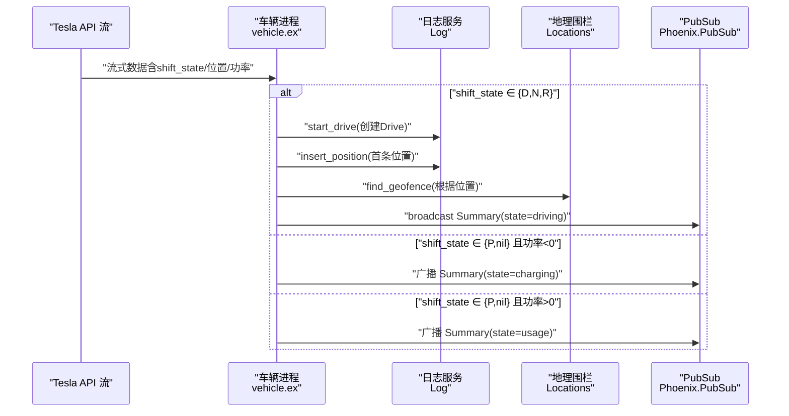
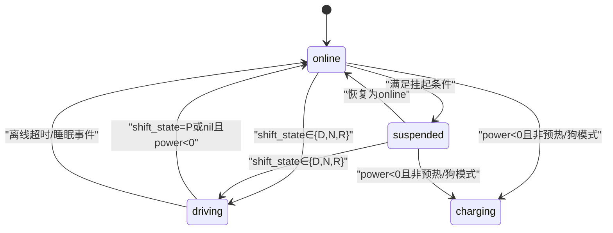
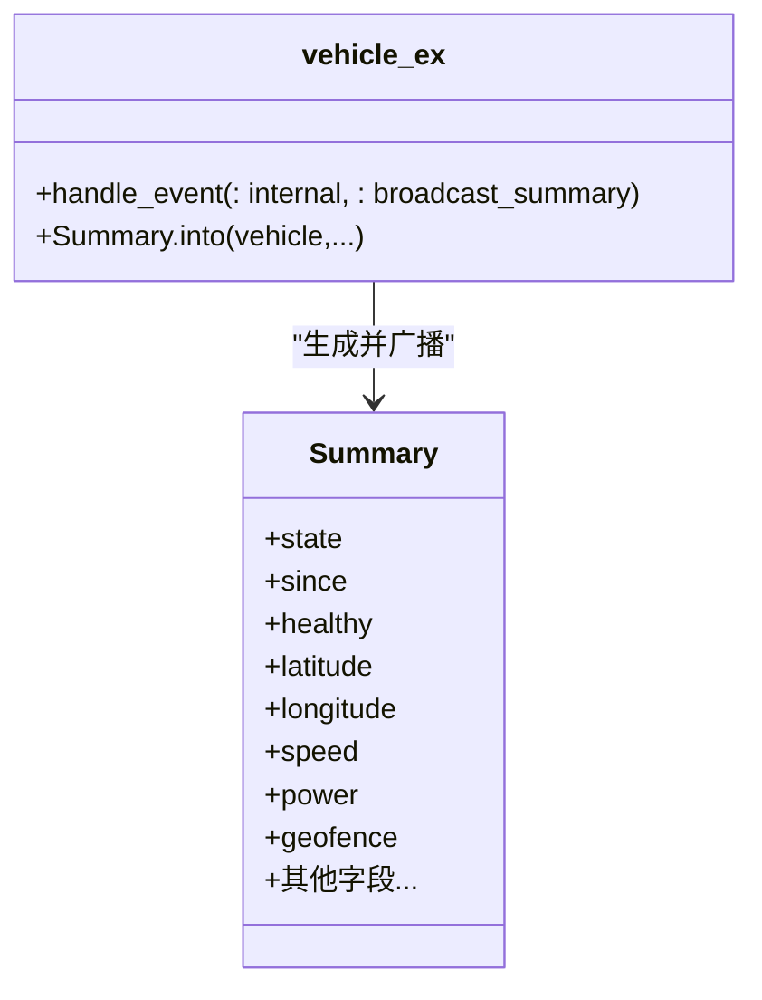
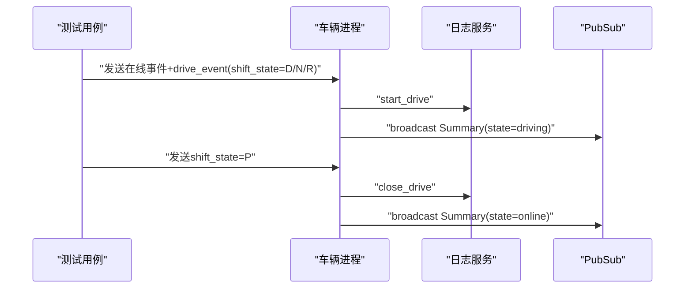
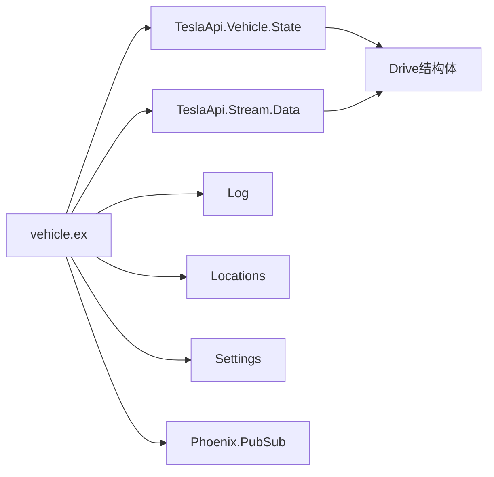
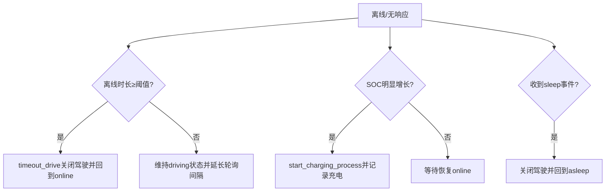

# 驾驶状态转换

<cite>
**本文引用的文件**
- [vehicle.ex](file://lib/teslamate/vehicles/vehicle.ex)
- [summary.ex](file://lib/teslamate/vehicles/vehicle/summary.ex)
- [data.ex](file://lib/tesla_api/stream/data.ex)
- [state.ex](file://lib/tesla_api/vehicle/state.ex)
- [driving_test.exs](file://test/teslamate/vehicles/vehicle/driving_test.exs)
- [streaming_test.exs](file://test/teslamate/vehicles/vehicle/streaming_test.exs)
</cite>

## 目录
1. [简介](#简介)
2. [项目结构与核心模块](#项目结构与核心模块)
3. [核心组件](#核心组件)
4. [架构总览](#架构总览)
5. [详细组件分析](#详细组件分析)
6. [依赖关系分析](#依赖关系分析)
7. [性能与间隔策略](#性能与间隔策略)
8. [故障与恢复策略](#故障与恢复策略)
9. [结论](#结论)

## 简介
本文件围绕车辆从“在线”到“驾驶”的状态转换机制进行深入解析，重点说明：
- 如何通过 Tesla API 流式数据中的 shift_state 字段识别驾驶行为开始；
- 如何结合 drive_state 结构体中的 timestamp 和位置信息确认一次驾驶会话的启动；
- 状态机如何管理 online、driving、suspended 等状态之间的转换；
- 在信号丢失或数据延迟情况下，系统如何进行状态恢复与超时处理；
- 基于测试用例展示从接收到驾驶事件到触发 start_drive 调用的完整流程，以及如何通过 Summary 结构体广播状态变化。

## 项目结构与核心模块
- 状态机实现位于车辆进程模块，负责接收来自 Tesla API 的实时流式数据与周期性拉取结果，驱动状态转换与事件分发。
- Summary 模块将当前车辆状态与关键指标封装为可广播的摘要消息，供前端与订阅者消费。
- Tesla API 层提供流式数据结构定义与车辆状态模型，确保数据类型一致与字段标准化。



图表来源
- [vehicle.ex](file://lib/teslamate/vehicles/vehicle.ex#L440-L554)
- [data.ex](file://lib/tesla_api/stream/data.ex#L1-L47)
- [state.ex](file://lib/tesla_api/vehicle/state.ex#L168-L214)
- [summary.ex](file://lib/teslamate/vehicles/vehicle/summary.ex#L1-L120)

章节来源
- [vehicle.ex](file://lib/teslamate/vehicles/vehicle.ex#L440-L554)
- [summary.ex](file://lib/teslamate/vehicles/vehicle/summary.ex#L1-L120)
- [data.ex](file://lib/tesla_api/stream/data.ex#L1-L47)
- [state.ex](file://lib/tesla_api/vehicle/state.ex#L168-L214)

## 核心组件
- 状态机入口与回调：车辆进程使用 GenStateMachine 定义状态与事件处理，包括流式数据到达、内部定时器、设置变更、API 拉取结果等。
- 驾驶状态判定：当流式数据或拉取结果中的 drive_state.shift_state 属于 D/N/R 时，判定为驾驶开始；当 shift_state 为 P 或 nil 且功率为负值时，判定为充电；当 shift_state 为 P 且功率为正值时，判定为使用设备。
- 驾驶会话启动：start_drive 创建一次新的 Drive 记录并插入首条位置记录，同时更新 geofence 与时间戳。
- Summary 广播：每次状态变化或周期性事件都会生成 Summary 并通过 PubSub 广播，供前端与外部系统订阅。

章节来源
- [vehicle.ex](file://lib/teslamate/vehicles/vehicle.ex#L440-L554)
- [vehicle.ex](file://lib/teslamate/vehicles/vehicle.ex#L1545-L1560)
- [summary.ex](file://lib/teslamate/vehicles/vehicle/summary.ex#L1-L120)

## 架构总览
下图展示了从 Tesla API 流式数据到状态机、再到 Summary 广播的关键路径与状态流转。



图表来源
- [vehicle.ex](file://lib/teslamate/vehicles/vehicle.ex#L440-L554)
- [vehicle.ex](file://lib/teslamate/vehicles/vehicle.ex#L1545-L1560)
- [summary.ex](file://lib/teslamate/vehicles/vehicle/summary.ex#L1-L120)

## 详细组件分析

### 驾驶状态判定与会话启动
- 判定依据：流式数据或拉取结果中的 drive_state.shift_state 字段，当其属于 D/N/R 时，表示车辆进入驾驶状态。
- 启动流程：
  - 调用 start_drive 创建 Drive 记录；
  - 插入首条位置记录（包含时间戳、经纬度、速度、功率、里程等）；
  - 查询地理围栏并更新 Data 结构；
  - 进入 driving 状态并广播 Summary。

```mermaid
flowchart TD
Start(["接收流式数据"]) --> CheckShift["检查shift_state是否为D/N/R"]
CheckShift --> |是| StartDrive["start_drive创建Drive并插入首条位置"]
StartDrive --> GeoFence["查询地理围栏"]
GeoFence --> EnterDriving["进入driving状态并广播Summary"]
CheckShift --> |否| CheckPower["检查power与shift_state"]
CheckPower --> |power<0且shift_state∈{nil,P}| Charging["进入charging状态并广播"]
CheckPower --> |power>0且shift_state∈{nil,P}| Usage["记录使用并广播"]
CheckPower --> |其他| Keep["保持当前状态"]
```

图表来源
- [vehicle.ex](file://lib/teslamate/vehicles/vehicle.ex#L440-L554)
- [vehicle.ex](file://lib/teslamate/vehicles/vehicle.ex#L1545-L1560)

章节来源
- [vehicle.ex](file://lib/teslamate/vehicles/vehicle.ex#L440-L554)
- [vehicle.ex](file://lib/teslamate/vehicles/vehicle.ex#L1545-L1560)

### 从在线到驾驶的状态转换
- 在线态处理：
  - 当收到流式数据且 shift_state ∈ {D,N,R} 时，立即启动驾驶会话并进入 driving 状态；
  - 若为充电态（power<0 且非预热/狗模式），则进入 charging 状态；
  - 否则尝试挂起（suspend）逻辑，若满足条件则进入 suspended 状态。
- 驾驶态处理：
  - 继续接收流式数据并插入位置；
  - 当 shift_state 变为 P 或 nil 且功率为负值时，关闭当前驾驶会话并回到 online 状态；
  - 当长时间无响应或离线超过阈值时，执行超时关闭并回到 online 状态。



图表来源
- [vehicle.ex](file://lib/teslamate/vehicles/vehicle.ex#L821-L909)
- [vehicle.ex](file://lib/teslamate/vehicles/vehicle.ex#L968-L1115)
- [vehicle.ex](file://lib/teslamate/vehicles/vehicle.ex#L1412-L1495)

章节来源
- [vehicle.ex](file://lib/teslamate/vehicles/vehicle.ex#L821-L909)
- [vehicle.ex](file://lib/teslamate/vehicles/vehicle.ex#L968-L1115)
- [vehicle.ex](file://lib/teslamate/vehicles/vehicle.ex#L1412-L1495)

### Summary 结构体与广播
- Summary 将当前车辆状态与关键指标（如 state、since、latitude/longitude、speed、power、geofence 等）封装为统一结构；
- 每次状态变化或周期性事件都会触发广播，前端与订阅者可据此更新界面与统计。



图表来源
- [summary.ex](file://lib/teslamate/vehicles/vehicle/summary.ex#L1-L120)
- [vehicle.ex](file://lib/teslamate/vehicles/vehicle.ex#L696-L711)

章节来源
- [summary.ex](file://lib/teslamate/vehicles/vehicle/summary.ex#L1-L120)
- [vehicle.ex](file://lib/teslamate/vehicles/vehicle.ex#L696-L711)

### 测试用例映射：从驾驶事件到 start_drive 调用
- 场景一：shift_state 从 D/N/R 开始，触发驾驶启动与 Summary 广播；
- 场景二：shift_state 为 P 不触发驾驶，但可能结束当前驾驶会话；
- 场景三：离线期间 SOC 明显增长时，系统识别为充电并记录充电过程；
- 场景四：长时间离线后超时关闭驾驶并回到 online；
- 场景五：短时间离线后继续驾驶，不中断会话。



图表来源
- [driving_test.exs](file://test/teslamate/vehicles/vehicle/driving_test.exs#L1-L121)
- [driving_test.exs](file://test/teslamate/vehicles/vehicle/driving_test.exs#L171-L204)
- [driving_test.exs](file://test/teslamate/vehicles/vehicle/driving_test.exs#L226-L309)
- [driving_test.exs](file://test/teslamate/vehicles/vehicle/driving_test.exs#L311-L373)
- [driving_test.exs](file://test/teslamate/vehicles/vehicle/driving_test.exs#L375-L436)

章节来源
- [driving_test.exs](file://test/teslamate/vehicles/vehicle/driving_test.exs#L1-L121)
- [driving_test.exs](file://test/teslamate/vehicles/vehicle/driving_test.exs#L171-L204)
- [driving_test.exs](file://test/teslamate/vehicles/vehicle/driving_test.exs#L226-L309)
- [driving_test.exs](file://test/teslamate/vehicles/vehicle/driving_test.exs#L311-L373)
- [driving_test.exs](file://test/teslamate/vehicles/vehicle/driving_test.exs#L375-L436)

## 依赖关系分析
- vehicle.ex 依赖：
  - TeslaApi.Vehicle.State（Drive/Charge/Climate/VehicleState）用于结构化解析；
  - TeslaApi.Stream.Data（流式数据结构）用于标准化流式字段；
  - Log、Locations、Settings、Phoenix.PubSub 等服务用于日志、地理围栏、配置与广播；
  - GenStateMachine 提供状态机框架。
- 数据模型：
  - Drive 结构体包含 timestamp、latitude、longitude、speed、power、shift_state 等关键字段；
  - 流式数据结构包含 time、est_lat、est_lng、speed、power、soc、odometer 等字段。



图表来源
- [vehicle.ex](file://lib/teslamate/vehicles/vehicle.ex#L1-L120)
- [state.ex](file://lib/tesla_api/vehicle/state.ex#L168-L214)
- [data.ex](file://lib/tesla_api/stream/data.ex#L1-L47)

章节来源
- [vehicle.ex](file://lib/teslamate/vehicles/vehicle.ex#L1-L120)
- [state.ex](file://lib/tesla_api/vehicle/state.ex#L168-L214)
- [data.ex](file://lib/tesla_api/stream/data.ex#L1-L47)

## 性能与间隔策略
- 轮询间隔：
  - 驾驶态默认轮询间隔较短，以保证位置与状态的高频率更新；
  - 充电态与在线态采用较长间隔，减少 API 压力；
  - 睡眠/离线态采用指数退避策略，避免频繁请求。
- 流式连接：
  - 当启用流式 API 时，优先使用流式数据；否则回退到周期性拉取；
  - 断连后重建连接并丢弃过期数据，避免旧数据覆盖新状态。

章节来源
- [vehicle.ex](file://lib/teslamate/vehicles/vehicle.ex#L438-L603)
- [vehicle.ex](file://lib/teslamate/vehicles/vehicle.ex#L1710-L1727)

## 故障与恢复策略
- 数据过期与丢弃：
  - 对于流式数据，若时间戳早于上次响应，则丢弃该条数据并快速重试；
  - 对于拉取结果，若时间戳倒退，同样丢弃并提示。
- 离线与超时：
  - 驾驶过程中离线超过阈值（默认约 15 分钟）后，自动关闭当前驾驶会话并回到 online；
  - 离线期间若 SOC 明显增长，系统识别为充电并记录充电过程；
  - 收到睡眠事件时，关闭当前驾驶并回到 asleep 状态。
- 异常场景：
  - 多次断开或令牌过期时，重新建立流式连接；
  - 车辆在服务中时，停止驾驶并回到 online。



图表来源
- [vehicle.ex](file://lib/teslamate/vehicles/vehicle.ex#L975-L1008)
- [vehicle.ex](file://lib/teslamate/vehicles/vehicle.ex#L1010-L1057)
- [streaming_test.exs](file://test/teslamate/vehicles/vehicle/streaming_test.exs#L142-L187)

章节来源
- [vehicle.ex](file://lib/teslamate/vehicles/vehicle.ex#L975-L1008)
- [vehicle.ex](file://lib/teslamate/vehicles/vehicle.ex#L1010-L1057)
- [streaming_test.exs](file://test/teslamate/vehicles/vehicle/streaming_test.exs#L142-L187)

## 结论
- 驾驶状态转换的核心在于对 Tesla API 流式数据中 shift_state 的严格判定，并结合 drive_state 的 timestamp 与位置信息确认驾驶会话的启动；
- 状态机在 online、driving、suspended 等状态间灵活切换，通过 Summary 结构体统一广播状态变化；
- 在信号丢失或数据延迟情况下，系统具备完善的丢弃过期数据、超时关闭驾驶、识别离线充电等恢复策略；
- 测试用例覆盖了从驾驶开始、中途结束、离线恢复、超时关闭等关键路径，验证了状态转换的正确性与鲁棒性。