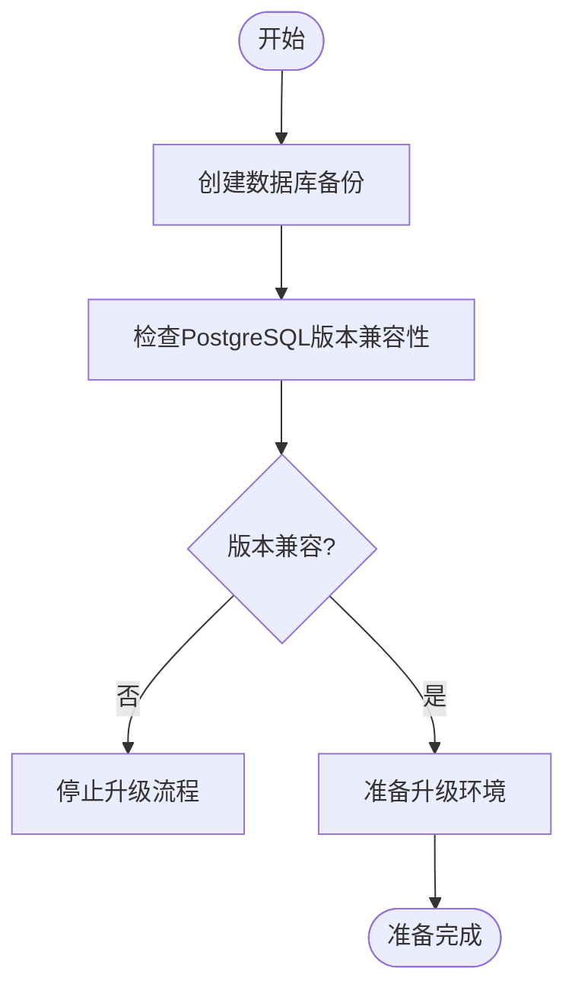
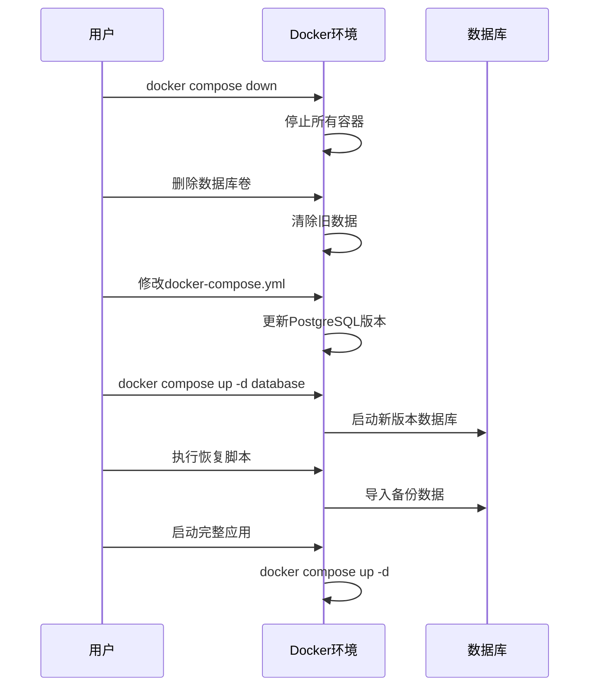
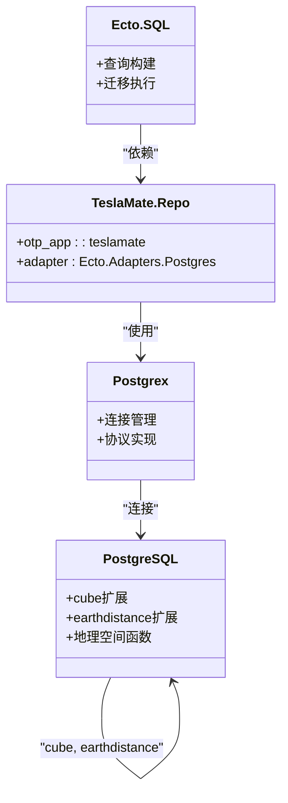
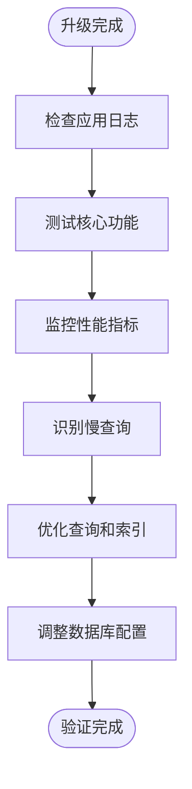

# PostgreSQL升级

<cite>
**本文档中引用的文件**  
- [runtime.exs](file://config/runtime.exs)
- [mix.exs](file://mix.exs)
- [repo.ex](file://lib/teslamate/repo.ex)
- [upgrading_postgres.md](file://website/docs/maintenance/upgrading_postgres.md)
- [backup_restore.mdx](file://website/docs/maintenance/backup_restore.mdx)
- [database_check.ex](file://lib/teslamate/database_check.ex)
- [release.ex](file://lib/teslamate/release.ex)
- [20190925152807_create_geo_extensions.exs](file://priv/repo/migrations/20190925152807_create_geo_extensions.exs)
- [20240929084639_recreate_geo_extensions.exs](file://priv/repo/migrations/20240929084639_recreate_geo_extensions.exs)
- [20250407155134_upgrade_earthdistance.exs](file://priv/repo/migrations/20250407155134_upgrade_earthdistance.exs)
- [environment_variables.md](file://website/docs/configuration/environment_variables.md)
- [application.ex](file://lib/teslamate/application.ex)
- [database-info.json](file://grafana/dashboards/database-info.json)
- [20240915193446_composite_index_with_predicate_to_position.exs](file://priv/repo/migrations/20240915193446_composite_index_with_predicate_to_position.exs)
- [development.mdx](file://website/docs/development.mdx)
</cite>

## 目录
1. [简介](#简介)
2. [升级前准备](#升级前准备)
3. [执行升级步骤](#执行升级步骤)
4. [兼容性与配置调整](#兼容性与配置调整)
5. [回滚策略与应急恢复](#回滚策略与应急恢复)
6. [升级后验证与性能优化](#升级后验证与性能优化)
7. [结论](#结论)

## 简介
本指南详细说明了TeslaMate项目中PostgreSQL数据库的升级流程。TeslaMate是一个用于跟踪特斯拉车辆数据的应用程序，其后端使用Ecto作为ORM框架与PostgreSQL数据库交互。升级过程需要特别注意地理空间扩展（如cube和earthdistance）的兼容性问题，以及Ecto与不同PostgreSQL版本之间的协同工作。本指南将涵盖从备份到验证的完整升级流程，并提供回滚策略和性能优化建议。

**Section sources**
- [application.ex](file://lib/teslamate/application.ex#L1-L81)
- [mix.exs](file://mix.exs#L1-L114)

## 升级前准备
在进行PostgreSQL版本升级之前，必须完成充分的准备工作以确保数据安全和系统稳定性。首要步骤是创建完整的数据库备份。对于使用Docker Compose的部署，可以通过执行`docker compose exec -T database pg_dump -U teslamate teslamate > ./teslamate.bck`命令来生成备份文件。对于NixOS用户，可以使用`teslamate-backup`脚本进行备份。备份文件应存储在安全的外部位置，以防在升级过程中丢失。

其次，需要检查当前数据库版本是否符合TeslaMate的要求。TeslaMate在启动时会通过`TeslaMate.DatabaseCheck.check_postgres_version()`函数验证PostgreSQL版本。该函数查询`server_version_num`并根据预定义的版本要求进行检查。目前支持的最低版本为PostgreSQL 16.7、17.3和18.0。如果版本过低或过高，系统将抛出错误或发出警告。

**Diagram sources**
- [backup_restore.mdx](file://website/docs/maintenance/backup_restore.mdx#L1-L102)
- [database_check.ex](file://lib/teslamate/database_check.ex#L1-L76)

**Section sources**
- [backup_restore.mdx](file://website/docs/maintenance/backup_restore.mdx#L1-L102)
- [database_check.ex](file://lib/teslamate/database_check.ex#L1-L76)

## 执行升级步骤
PostgreSQL主要版本升级的执行步骤需要严格按照顺序进行。首先，停止所有TeslaMate相关的容器，使用`docker compose down`命令确保数据库处于静止状态。然后，删除现有的数据库卷，这一步会清除所有数据，因此必须确保已有可用的备份。删除卷的命令为`docker volume rm "$(basename "$PWD")_teslamate-db"`。

接下来，修改`docker-compose.yml`文件中的PostgreSQL镜像版本，例如从`postgres:16`升级到`postgres:18-trixie`。同时，确保卷挂载配置正确，通常应挂载到`/var/lib/postgresql/data`。启动新的数据库容器后，使用之前创建的备份文件进行数据恢复。恢复过程包括停止TeslaMate容器、删除现有模式、重新创建模式和扩展，然后导入备份数据。

**Diagram sources**
- [upgrading_postgres.md](file://website/docs/maintenance/upgrading_postgres.md#L1-L34)
- [backup_restore.mdx](file://website/docs/maintenance/backup_restore.mdx#L57-L102)

**Section sources**
- [upgrading_postgres.md](file://website/docs/maintenance/upgrading_postgres.md#L1-L34)
- [backup_restore.mdx](file://website/docs/maintenance/backup_restore.mdx#L57-L102)

## 兼容性与配置调整
PostgreSQL版本升级过程中，必须特别关注与Ecto框架和地理空间数据类型的兼容性问题。TeslaMate依赖于`cube`和`earthdistance`两个PostgreSQL扩展来处理地理位置数据。在`20190925152807_create_geo_extensions.exs`迁移文件中，这些扩展被创建并用于地理围栏功能。在升级到新版本PostgreSQL时，可能需要重新创建这些扩展，如`20240929084639_recreate_geo_extensions.exs`迁移所示，该迁移文件明确执行了`DROP EXTENSION cube CASCADE`和`CREATE EXTENSION cube WITH SCHEMA public`操作。

此外，`20250407155134_upgrade_earthdistance.exs`迁移文件显示了对`earthdistance`扩展的升级操作，使用`ALTER EXTENSION earthdistance UPDATE`命令。这表明在某些PostgreSQL版本升级中，可能需要显式更新扩展以确保兼容性。

在`config/runtime.exs`文件中，数据库连接参数可以根据环境变量进行调整。关键参数包括`DATABASE_SSL`（启用SSL连接）、`DATABASE_POOL_SIZE`（连接池大小）和`DATABASE_TIMEOUT`（查询超时时间）。在升级后，可能需要根据新版本的性能特征调整这些参数。例如，PostgreSQL 16+可能需要更大的连接池来处理并发查询。

**Diagram sources**
- [repo.ex](file://lib/teslamate/repo.ex#L1-L6)
- [20190925152807_create_geo_extensions.exs](file://priv/repo/migrations/20190925152807_create_geo_extensions.exs#L1-L17)
- [20240929084639_recreate_geo_extensions.exs](file://priv/repo/migrations/20240929084639_recreate_geo_extensions.exs#L1-L10)
- [20250407155134_upgrade_earthdistance.exs](file://priv/repo/migrations/20250407155134_upgrade_earthdistance.exs#L1-L8)

**Section sources**
- [runtime.exs](file://config/runtime.exs#L104-L149)
- [mix.exs](file://mix.exs#L41-L42)
- [environment_variables.md](file://website/docs/configuration/environment_variables.md#L9-L62)

## 回滚策略与应急恢复
制定有效的回滚策略是数据库升级过程中的关键环节。如果升级失败或出现严重问题，应能够快速恢复到之前的稳定状态。最可靠的回滚方法是使用之前创建的备份文件进行恢复。对于Docker Compose部署，可以使用`teslamate-restore`脚本或手动执行恢复命令。

应急恢复方案包括：首先停止所有TeslaMate容器以避免写入冲突，然后删除现有数据库模式并重新初始化。重新初始化过程需要重新创建`public`模式和必要的扩展（`cube`和`earthdistance`），然后导入备份数据。在NixOS环境中，可以使用`teslamate-restore`命令简化此过程。

为了防止升级过程中出现意外，建议在执行删除数据库卷操作前，将备份文件复制到多个安全位置。此外，可以考虑在升级前创建虚拟机或容器的快照，以便在极端情况下进行系统级恢复。

**Section sources**
- [backup_restore.mdx](file://website/docs/maintenance/backup_restore.mdx#L57-L102)
- [upgrading_postgres.md](file://website/docs/maintenance/upgrading_postgres.md#L13-L18)

## 升级后验证与性能优化
升级完成后，必须进行全面的验证以确保系统正常运行。首先，检查TeslaMate应用日志，确认没有数据库连接或兼容性错误。`TeslaMate.DatabaseCheck`模块会在启动时自动验证PostgreSQL版本，如果版本兼容，会记录"PostgreSQL version X.X is compatible"的信息。

性能回归测试应重点关注查询执行时间和资源使用情况。可以通过Grafana仪表板中的"database-info"面板监控索引使用情况和查询性能。`database-info.json`文件中的查询显示了如何监控索引扫描次数和元组读取情况。此外，可以启用PostgreSQL的`pg_stat_statements`扩展来识别执行时间最长或调用次数最多的查询。

查询性能优化建议包括：审查并优化复合索引，如`20240915193446_composite_index_with_predicate_to_position.exs`迁移中创建的带条件的复合索引；定期分析表统计信息以帮助查询规划器做出更好的决策；以及根据实际查询模式调整`DATABASE_POOL_SIZE`和`DATABASE_TIMEOUT`等连接参数。

**Diagram sources**
- [database_check.ex](file://lib/teslamate/database_check.ex#L17-L24)
- [database-info.json](file://grafana/dashboards/database-info.json#L875-L884)
- [20240915193446_composite_index_with_predicate_to_position.exs](file://priv/repo/migrations/20240915193446_composite_index_with_predicate_to_position.exs#L1-L9)

**Section sources**
- [database_check.ex](file://lib/teslamate/database_check.ex#L17-L24)
- [development.mdx](file://website/docs/development.mdx#L200-L208)
- [release.ex](file://lib/teslamate/release.ex#L1-L34)

## 结论
PostgreSQL数据库升级是一个需要谨慎规划和执行的过程。通过遵循本指南中的步骤，可以安全地完成TeslaMate的数据库升级。关键要点包括：始终在升级前创建完整备份，验证版本兼容性，正确处理地理空间扩展，以及准备详细的回滚计划。升级后，应进行彻底的验证和性能测试，以确保系统的稳定性和性能。通过合理的配置调整和查询优化，可以充分发挥新版本PostgreSQL的优势。