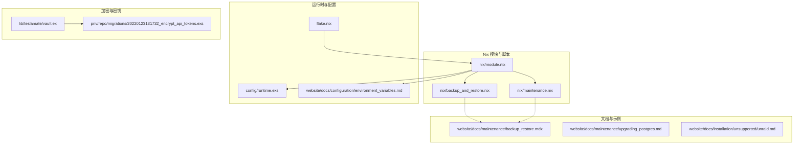
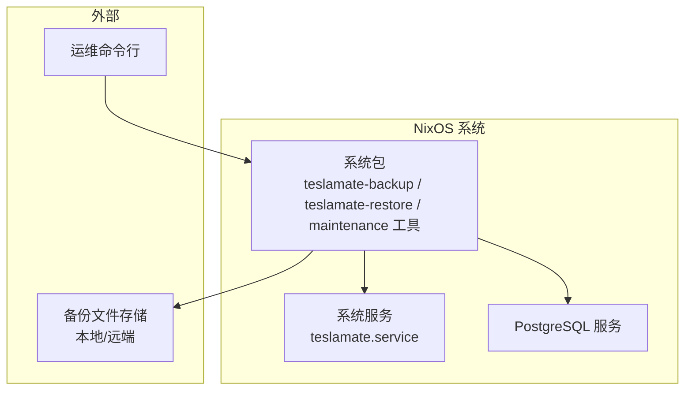
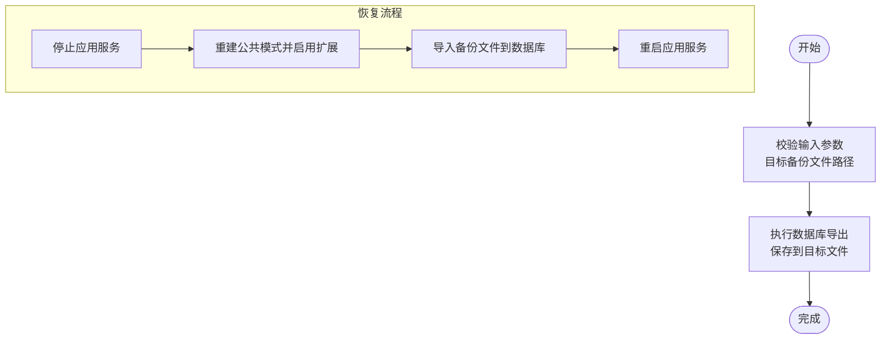
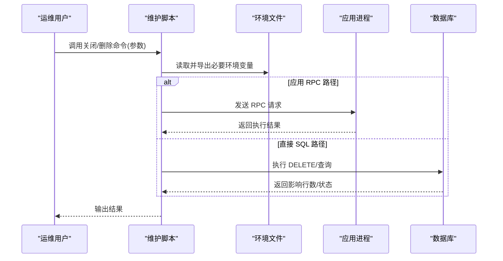
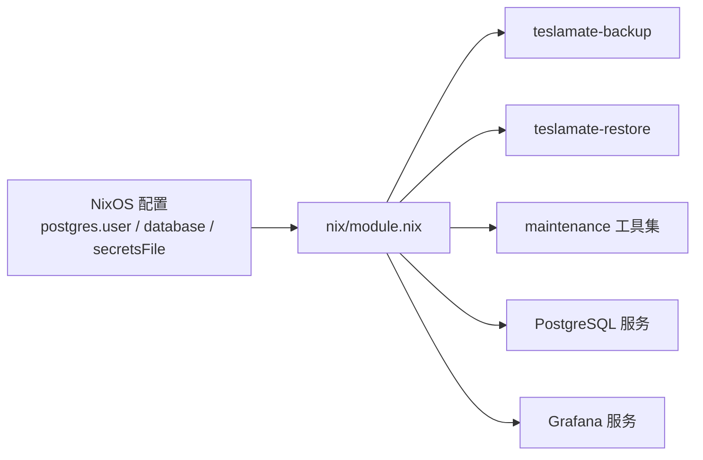
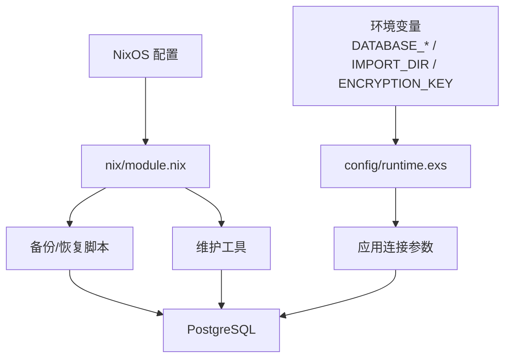

# 备份与恢复

<cite>
**本文引用的文件**
- [nix/backup_and_restore.nix](file://nix/backup_and_restore.nix)
- [nix/maintenance.nix](file://nix/maintenance.nix)
- [nix/module.nix](file://nix/module.nix)
- [website/docs/maintenance/backup_restore.mdx](file://website/docs/maintenance/backup_restore.mdx)
- [website/docs/maintenance/upgrading_postgres.md](file://website/docs/maintenance/upgrading_postgres.md)
- [website/docs/installation/unsupported/unraid.md](file://website/docs/installation/unsupported/unraid.md)
- [website/docs/configuration/environment_variables.md](file://website/docs/configuration/environment_variables.md)
- [config/runtime.exs](file://config/runtime.exs)
- [lib/teslamate/vault.ex](file://lib/teslamate/vault.ex)
- [priv/repo/migrations/20220123131732_encrypt_api_tokens.exs](file://priv/repo/migrations/20220123131732_encrypt_api_tokens.exs)
- [flake.nix](file://flake.nix)
</cite>

## 目录
1. [简介](#简介)
2. [项目结构](#项目结构)
3. [核心组件](#核心组件)
4. [架构总览](#架构总览)
5. [详细组件分析](#详细组件分析)
6. [依赖关系分析](#依赖关系分析)
7. [性能与可靠性考量](#性能与可靠性考量)
8. [故障排查指南](#故障排查指南)
9. [结论](#结论)
10. [附录：操作示例与最佳实践](#附录操作示例与最佳实践)

## 简介
本指南面向使用 NixOS 部署 TeslaMate 的用户，系统性阐述“完整备份”与“增量备份”的策略与落地方式，并结合 nix/backup_and_restore.nix 的实现，说明备份脚本工作机制、可配置参数、自动化部署路径以及从备份中恢复数据的完整步骤（含 PostgreSQL 数据库与配置文件）。同时提供备份验证方法、恢复后数据一致性检查建议，以及常见错误处理方案。

## 项目结构
围绕备份与恢复的关键文件与模块如下：
- Nix 模块与脚本：nix/module.nix、nix/backup_and_restore.nix、nix/maintenance.nix
- 文档与示例：website/docs/maintenance/backup_restore.mdx、website/docs/maintenance/upgrading_postgres.md、website/docs/installation/unsupported/unraid.md
- 运行时配置与环境变量：config/runtime.exs、website/docs/configuration/environment_variables.md
- 加密与密钥管理：lib/teslamate/vault.ex、priv/repo/migrations/20220123131732_encrypt_api_tokens.exs
- Nix 构建入口：flake.nix

图表来源
- [nix/module.nix](file://nix/module.nix#L190-L230)
- [nix/backup_and_restore.nix](file://nix/backup_and_restore.nix#L1-L49)
- [nix/maintenance.nix](file://nix/maintenance.nix#L1-L114)
- [website/docs/maintenance/backup_restore.mdx](file://website/docs/maintenance/backup_restore.mdx#L1-L102)
- [website/docs/maintenance/upgrading_postgres.md](file://website/docs/maintenance/upgrading_postgres.md#L1-L34)
- [website/docs/installation/unsupported/unraid.md](file://website/docs/installation/unsupported/unraid.md#L74-L232)
- [config/runtime.exs](file://config/runtime.exs#L96-L133)
- [website/docs/configuration/environment_variables.md](file://website/docs/configuration/environment_variables.md#L9-L62)
- [lib/teslamate/vault.ex](file://lib/teslamate/vault.ex#L1-L140)
- [priv/repo/migrations/20220123131732_encrypt_api_tokens.exs](file://priv/repo/migrations/20220123131732_encrypt_api_tokens.exs#L48-L95)
- [flake.nix](file://flake.nix#L1-L35)

章节来源
- [nix/module.nix](file://nix/module.nix#L190-L230)
- [nix/backup_and_restore.nix](file://nix/backup_and_restore.nix#L1-L49)
- [nix/maintenance.nix](file://nix/maintenance.nix#L1-L114)
- [website/docs/maintenance/backup_restore.mdx](file://website/docs/maintenance/backup_restore.mdx#L1-L102)
- [website/docs/maintenance/upgrading_postgres.md](file://website/docs/maintenance/upgrading_postgres.md#L1-L34)
- [website/docs/installation/unsupported/unraid.md](file://website/docs/installation/unsupported/unraid.md#L74-L232)
- [config/runtime.exs](file://config/runtime.exs#L96-L133)
- [website/docs/configuration/environment_variables.md](file://website/docs/configuration/environment_variables.md#L9-L62)
- [lib/teslamate/vault.ex](file://lib/teslamate/vault.ex#L1-L140)
- [priv/repo/migrations/20220123131732_encrypt_api_tokens.exs](file://priv/repo/migrations/20220123131732_encrypt_api_tokens.exs#L48-L95)
- [flake.nix](file://flake.nix#L1-L35)

## 核心组件
- 备份与恢复脚本：通过 Nix 打包为可执行命令，封装了数据库导出与导入、服务启停等关键步骤。
- 维护工具：提供关闭/删除行程与充电过程等维护能力，便于恢复后清理或修复数据。
- Nix 模块集成：在 NixOS 上自动注入备份/恢复脚本与维护工具到系统包集合，并传递数据库凭据与环境文件路径。
- 文档与示例：提供 Docker Compose 与 NixOS 两种场景下的备份/恢复步骤与注意事项。

章节来源
- [nix/backup_and_restore.nix](file://nix/backup_and_restore.nix#L1-L49)
- [nix/maintenance.nix](file://nix/maintenance.nix#L1-L114)
- [nix/module.nix](file://nix/module.nix#L190-L230)
- [website/docs/maintenance/backup_restore.mdx](file://website/docs/maintenance/backup_restore.mdx#L1-L102)

## 架构总览
下图展示 NixOS 部署中，备份/恢复脚本与应用服务、数据库之间的交互关系。

图表来源
- [nix/backup_and_restore.nix](file://nix/backup_and_restore.nix#L1-L49)
- [nix/module.nix](file://nix/module.nix#L190-L230)

## 详细组件分析

### 备份与恢复脚本（nix/backup_and_restore.nix）
- 脚本职责
  - 备份：调用数据库客户端对指定数据库执行导出，输出到指定文件。
  - 恢复：停止应用服务，重建公共模式并启用扩展，导入备份文件，再启动应用服务。
- 关键机制
  - 使用系统用户权限切换与数据库用户名/库名参数化，确保最小权限与可移植性。
  - 通过服务管理器控制应用生命周期，避免写入冲突。
  - 恢复阶段重建扩展以保证数据库功能完整性。
- 可配置参数
  - databaseUser：数据库用户名
  - databaseName：数据库名称
- 与 Nix 模块集成
  - 在 NixOS 模块中，将上述参数从配置对象注入到脚本构建上下文，最终作为系统包提供。

图表来源
- [nix/backup_and_restore.nix](file://nix/backup_and_restore.nix#L1-L49)

章节来源
- [nix/backup_and_restore.nix](file://nix/backup_and_restore.nix#L1-L49)
- [nix/module.nix](file://nix/module.nix#L190-L230)

### 维护工具（nix/maintenance.nix）
- 提供以下命令：
  - 关闭行程：通过应用 RPC 触发关闭指定行程。
  - 关闭充电过程：通过应用 RPC 触发完成指定充电过程。
  - 删除行程：直接对数据库执行删除。
  - 删除充电过程：直接对数据库执行删除。
- 关键机制
  - 读取环境文件以获取应用运行所需的认证信息。
  - 对输入参数进行基本校验（如 ID 类型）。
  - 通过数据库客户端执行 SQL 操作或调用应用 RPC。

图表来源
- [nix/maintenance.nix](file://nix/maintenance.nix#L1-L114)

章节来源
- [nix/maintenance.nix](file://nix/maintenance.nix#L1-L114)

### Nix 模块集成（nix/module.nix）
- 将备份/恢复脚本与维护工具打包为系统包，并注入数据库用户、数据库名、环境文件路径等参数。
- 同时配置 PostgreSQL 服务与 Grafana 服务，确保数据库连接与可视化的一致性。
- 通过 flake.nix 导出默认 NixOS 模块，便于在系统配置中引用。

图表来源
- [nix/module.nix](file://nix/module.nix#L190-L230)
- [flake.nix](file://flake.nix#L1-L35)

章节来源
- [nix/module.nix](file://nix/module.nix#L190-L230)
- [flake.nix](file://flake.nix#L1-L35)

### 文档与示例（website/docs）
- 备份与恢复文档提供了 Docker Compose 与 NixOS 两套操作步骤与注意事项，包括服务名差异、TTY 问题、备份文件安全存放等。
- 升级 PostgreSQL 的文档强调先备份、再删除旧卷、升级镜像版本、最后恢复的顺序。
- Unraid 示例展示了基于定时任务的每日备份与恢复流程，包含压缩与清理策略。

章节来源
- [website/docs/maintenance/backup_restore.mdx](file://website/docs/maintenance/backup_restore.mdx#L1-L102)
- [website/docs/maintenance/upgrading_postgres.md](file://website/docs/maintenance/upgrading_postgres.md#L1-L34)
- [website/docs/installation/unsupported/unraid.md](file://website/docs/installation/unsupported/unraid.md#L74-L232)

## 依赖关系分析
- 备份/恢复脚本依赖于：
  - 数据库客户端（用于导出/导入）
  - 服务管理器（用于停止/启动应用服务）
  - 系统用户权限（以受控用户身份访问数据库）
- Nix 模块依赖于：
  - 配置对象提供的数据库凭据与环境文件路径
  - Nix 包集合（用于打包脚本）
- 运行时配置依赖于：
  - 环境变量（数据库主机、端口、SSL 等）
  - 应用配置（Repo 连接参数）

图表来源
- [config/runtime.exs](file://config/runtime.exs#L96-L133)
- [website/docs/configuration/environment_variables.md](file://website/docs/configuration/environment_variables.md#L9-L62)
- [nix/module.nix](file://nix/module.nix#L190-L230)
- [nix/backup_and_restore.nix](file://nix/backup_and_restore.nix#L1-L49)
- [nix/maintenance.nix](file://nix/maintenance.nix#L1-L114)

章节来源
- [config/runtime.exs](file://config/runtime.exs#L96-L133)
- [website/docs/configuration/environment_variables.md](file://website/docs/configuration/environment_variables.md#L9-L62)
- [nix/module.nix](file://nix/module.nix#L190-L230)
- [nix/backup_and_restore.nix](file://nix/backup_and_restore.nix#L1-L49)
- [nix/maintenance.nix](file://nix/maintenance.nix#L1-L114)

## 性能与可靠性考量
- 备份窗口与锁竞争
  - 恢复前停止应用服务可避免写入冲突；生产环境建议在低峰时段执行。
- 数据库连接与超时
  - 运行时配置支持连接池大小与查询超时，可根据数据量调整以平衡性能与稳定性。
- 存储与传输
  - 建议将备份文件存放在独立介质或远端存储，避免与应用容器共享同一卷导致的误删风险。
- 加密与密钥
  - 应用使用 AES-GCM 对敏感令牌进行加密，迁移时需确保密钥可用，否则可能需要重新登录。

章节来源
- [nix/backup_and_restore.nix](file://nix/backup_and_restore.nix#L1-L49)
- [config/runtime.exs](file://config/runtime.exs#L96-L133)
- [lib/teslamate/vault.ex](file://lib/teslamate/vault.ex#L1-L140)
- [priv/repo/migrations/20220123131732_encrypt_api_tokens.exs](file://priv/repo/migrations/20220123131732_encrypt_api_tokens.exs#L48-L95)

## 故障排查指南
- 常见问题与处理
  - 服务名不匹配：文档提示在某些环境中服务名为 database 或 db，请根据实际 compose 文件调整。
  - TTY 错误：在计划任务中执行时需禁用伪终端，否则会报错。
  - 备份文件丢失：部分 GUI 在升级时会删除 compose 目录，务必将备份文件移动到安全位置。
  - 数据库连接失败：核对 DATABASE_HOST、DATABASE_PORT、DATABASE_USER、DATABASE_PASS 等环境变量。
  - 恢复后无法登录：若迁移密钥未正确保留，应用可能要求重新登录令牌。
- 验证与一致性检查
  - 恢复后可通过 Grafana 仪表盘与应用界面核对关键指标是否一致。
  - 使用维护工具检查是否存在未关闭的行程或充电过程，必要时进行关闭/删除。
  - 对比备份时间点与恢复时间点的数据量（如行程条目数），确认无遗漏。

章节来源
- [website/docs/maintenance/backup_restore.mdx](file://website/docs/maintenance/backup_restore.mdx#L1-L102)
- [website/docs/installation/unsupported/unraid.md](file://website/docs/installation/unsupported/unraid.md#L74-L232)
- [lib/teslamate/vault.ex](file://lib/teslamate/vault.ex#L1-L140)
- [nix/maintenance.nix](file://nix/maintenance.nix#L1-L114)

## 结论
通过 NixOS 模块化集成，备份与恢复脚本实现了可移植、可配置、可自动化部署。结合文档与维护工具，用户可以在生产环境中安全地执行完整备份与恢复，并在升级数据库或迁移密钥后保持数据一致性与业务连续性。建议将备份文件置于独立存储介质，并在低峰时段执行恢复操作，以降低对业务的影响。

## 附录：操作示例与最佳实践

### 备份策略
- 完整备份
  - 使用 NixOS 提供的备份脚本，按需指定输出文件名（包含时间戳）。
  - 建议将备份文件复制到远端存储，避免与应用容器共享同一卷。
- 增量备份
  - 当前脚本仅提供完整备份；如需增量备份，可在外部使用数据库层的增量导出工具或定期快照策略（例如数据库层面的 WAL 归档与时间点恢复）。

章节来源
- [nix/backup_and_restore.nix](file://nix/backup_and_restore.nix#L1-L49)
- [website/docs/maintenance/backup_restore.mdx](file://website/docs/maintenance/backup_restore.mdx#L1-L102)

### 自动化与可配置参数
- 备份频率与存储位置
  - 在系统中添加定时任务，按日/周/月执行备份脚本，并将输出文件归档至远端存储。
- 加密选项
  - 通过环境变量提供密钥，确保迁移后仍可解密令牌；迁移密钥时需同步更新密钥文件。
- 参数说明
  - databaseUser、databaseName：由 Nix 模块注入，无需手动修改。
  - secretsFile：由 Nix 模块注入，维护工具通过该文件加载应用运行所需环境变量。

章节来源
- [nix/module.nix](file://nix/module.nix#L190-L230)
- [website/docs/configuration/environment_variables.md](file://website/docs/configuration/environment_variables.md#L9-L62)
- [lib/teslamate/vault.ex](file://lib/teslamate/vault.ex#L1-L140)

### 从备份恢复数据（PostgreSQL 与配置）
- 步骤概览
  - 停止应用服务，避免写入冲突。
  - 重建公共模式并启用扩展，确保数据库功能完整。
  - 导入备份文件到目标数据库。
  - 启动应用服务。
- 恢复后一致性检查
  - 登录应用与 Grafana，核对关键指标与历史数据。
  - 使用维护工具检查并修复未关闭的行程/充电过程。
- 升级 PostgreSQL 的恢复流程
  - 先创建备份，再删除旧数据库卷，升级镜像版本，最后恢复备份。

章节来源
- [nix/backup_and_restore.nix](file://nix/backup_and_restore.nix#L1-L49)
- [website/docs/maintenance/backup_restore.mdx](file://website/docs/maintenance/backup_restore.mdx#L1-L102)
- [website/docs/maintenance/upgrading_postgres.md](file://website/docs/maintenance/upgrading_postgres.md#L1-L34)

### 实际操作示例（路径参考）
- 备份（NixOS）
  - 参考路径：nix/backup_and_restore.nix 中的备份脚本定义与安装阶段。
- 恢复（NixOS）
  - 参考路径：nix/backup_and_restore.nix 中的恢复脚本定义与安装阶段。
- 维护（关闭/删除）
  - 参考路径：nix/maintenance.nix 中的维护脚本定义与安装阶段。
- 文档示例
  - 参考路径：website/docs/maintenance/backup_restore.mdx、website/docs/maintenance/upgrading_postgres.md、website/docs/installation/unsupported/unraid.md。

章节来源
- [nix/backup_and_restore.nix](file://nix/backup_and_restore.nix#L1-L49)
- [nix/maintenance.nix](file://nix/maintenance.nix#L1-L114)
- [website/docs/maintenance/backup_restore.mdx](file://website/docs/maintenance/backup_restore.mdx#L1-L102)
- [website/docs/maintenance/upgrading_postgres.md](file://website/docs/maintenance/upgrading_postgres.md#L1-L34)
- [website/docs/installation/unsupported/unraid.md](file://website/docs/installation/unsupported/unraid.md#L74-L232)