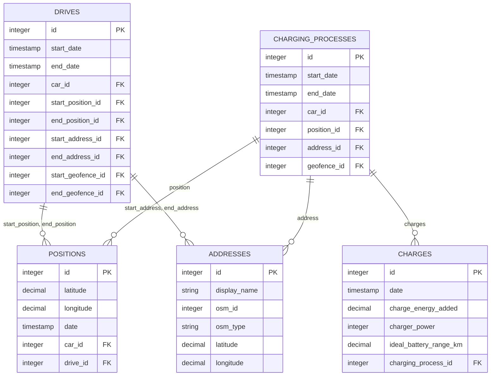

# 手动修复数据

<cite>
**本文档中引用的文件**  
- [repair.ex](file://lib/teslamate/repair.ex)
- [drive.ex](file://lib/teslamate/log/drive.ex)
- [charging_process.ex](file://lib/teslamate/log/charging_process.ex)
- [charge.ex](file://lib/teslamate/log/charge.ex)
- [address.ex](file://lib/teslamate/locations/address.ex)
- [locations.ex](file://lib/teslamate/locations.ex)
- [database_check.ex](file://lib/teslamate/database_check.ex)
- [20190821143938_add_constraints.exs](file://priv/repo/migrations/20190821143938_add_constraints.exs)
- [20200203120311_cascade_delete.exs](file://priv/repo/migrations/20200203120311_cascade_delete.exs)
- [20190812191616_rename_trips_to_drives.exs](file://priv/repo/migrations/20190812191616_rename_trips_to_drives.exs)
- [20190821155748_drop_consumption_columns.exs](file://priv/repo/migrations/20190821155748_drop_consumption_columns.exs)
- [manually_fixing_data.mdx](file://website/docs/maintenance/manually_fixing_data.mdx)
</cite>

## 目录
1. [简介](#简介)
2. [数据库结构与关键约束](#数据库结构与关键约束)
3. [数据模式演变历史](#数据模式演变历史)
4. [识别异常数据记录的SQL查询示例](#识别异常数据记录的sql查询示例)
5. [数据修复操作步骤](#数据修复操作步骤)
6. [修复后的验证方法](#修复后的验证方法)
7. [潜在风险提示](#潜在风险提示)

## 简介
本指南旨在为TeslaMate数据库中出现的数据不一致或损坏场景提供详细的手动修复指导。通过理解数据库的结构、外键关系和数据完整性规则，用户可以安全地识别并修复异常数据记录，如不完整的驾驶行程或充电过程。结合数据库迁移文件的历史记录，本文档还将说明修复时需要注意的版本兼容性问题，并提供具体的数据修复脚本和操作步骤。

**Section sources**
- [manually_fixing_data.mdx](file://website/docs/maintenance/manually_fixing_data.mdx)

## 数据库结构与关键约束
TeslaMate数据库的核心结构包括多个关键表，如`drives`（驾驶行程）、`charging_processes`（充电过程）、`charges`（充电记录）、`positions`（位置信息）和`addresses`（地址信息）。这些表通过外键关系相互关联，确保数据的完整性和一致性。

### 核心表结构
- **drives**: 存储驾驶行程信息，包含起止时间、位置、地址、地理围栏等外键。
- **charging_processes**: 存储充电过程信息，包含起止时间、位置、地址、地理围栏等外键。
- **charges**: 存储充电过程中的详细记录，与`charging_processes`表通过外键关联。
- **positions**: 存储车辆位置信息，与`drives`和`charging_processes`表通过外键关联。
- **addresses**: 存储地址信息，与`drives`、`charging_processes`和`positions`表通过外键关联。

### 外键关系
- `drives`表中的`car_id`、`start_position_id`、`end_position_id`、`start_address_id`、`end_address_id`、`start_geofence_id`、`end_geofence_id`字段均通过外键约束关联到相应表。
- `charging_processes`表中的`car_id`、`position_id`、`address_id`、`geofence_id`字段均通过外键约束关联到相应表。
- `charges`表中的`charging_process_id`字段通过外键约束关联到`charging_processes`表。

### 数据完整性规则
- `drives`表中的`start_date`字段为必填项，确保每个驾驶行程都有明确的开始时间。
- `charging_processes`表中的`start_date`字段为必填项，确保每个充电过程都有明确的开始时间。
- `charges`表中的`date`、`charging_process_id`、`charge_energy_added`、`charger_power`、`ideal_battery_range_km`字段为必填项，确保充电记录的完整性。



**Diagram sources**
- [drive.ex](file://lib/teslamate/log/drive.ex#L8-L39)
- [charging_process.ex](file://lib/teslamate/log/charging_process.ex#L8-L29)
- [charge.ex](file://lib/teslamate/log/charge.ex#L7-L30)
- [address.ex](file://lib/teslamate/locations/address.ex#L5-L24)

**Section sources**
- [drive.ex](file://lib/teslamate/log/drive.ex)
- [charging_process.ex](file://lib/teslamate/log/charging_process.ex)
- [charge.ex](file://lib/teslamate/log/charge.ex)
- [address.ex](file://lib/teslamate/locations/address.ex)

## 数据模式演变历史
TeslaMate数据库的模式通过一系列迁移文件逐步演变，确保了数据结构的灵活性和兼容性。以下是几个关键迁移文件的说明：

### 20190821143938_add_constraints.exs
此迁移文件添加了数据完整性约束，确保`states`和`updates`表中的`end_date`字段不早于`start_date`字段，从而保证时间逻辑的正确性。

### 20200203120311_cascade_delete.exs
此迁移文件修改了外键约束，引入了级联删除和空值化策略。例如，当删除一辆车时，相关的驾驶行程和充电过程将被级联删除，而地址和地理围栏信息则会被空值化，以保持数据的完整性。

### 20190812191616_rename_trips_to_drives.exs
此迁移文件将`trips`表重命名为`drives`，并将`positions`表中的`trip_id`字段重命名为`drive_id`，以更好地反映数据的实际含义。

### 20190821155748_drop_consumption_columns.exs
此迁移文件移除了`drives`表中的`consumption_kWh`和`consumption_kWh_100km`字段，因为这些数据可以通过其他方式计算得出，无需单独存储。

**Section sources**
- [20190821143938_add_constraints.exs](file://priv/repo/migrations/20190821143938_add_constraints.exs)
- [20200203120311_cascade_delete.exs](file://priv/repo/migrations/20200203120311_cascade_delete.exs)
- [20190812191616_rename_trips_to_drives.exs](file://priv/repo/migrations/20190812191616_rename_trips_to_drives.exs)
- [20190821155748_drop_consumption_columns.exs](file://priv/repo/migrations/20190821155748_drop_consumption_columns.exs)

## 识别异常数据记录的SQL查询示例
以下SQL查询示例可用于识别常见的异常数据记录：

### 识别不完整的驾驶行程
```sql
SELECT id, start_date, end_date 
FROM drives 
WHERE end_date IS NULL;
```

### 识别不完整的充电过程
```sql
SELECT id, start_date, end_date 
FROM charging_processes 
WHERE end_date IS NULL;
```

### 识别缺少地址信息的驾驶行程
```sql
SELECT id, start_date, start_position_id, end_position_id 
FROM drives 
WHERE (start_address_id IS NULL OR end_address_id IS NULL) 
  AND start_position_id IS NOT NULL 
  AND end_position_id IS NOT NULL;
```

### 识别缺少地址信息的充电过程
```sql
SELECT id, start_date, position_id 
FROM charging_processes 
WHERE address_id IS NULL 
  AND position_id IS NOT NULL;
```

**Section sources**
- [repair.ex](file://lib/teslamate/repair.ex#L41-L57)
- [repair.ex](file://lib/teslamate/repair.ex#L61-L68)

## 数据修复操作步骤
### 终止未完成的驾驶行程或充电过程
如果由于某些原因（如程序崩溃或重启）导致驾驶行程或充电过程未被完整记录，可以手动终止它们。这将为未完成的记录分配一个结束时间。

#### 终止驾驶行程
```bash
docker compose exec teslamate bin/teslamate rpc \
    "TeslaMate.Repo.get!(TeslaMate.Log.Drive, 9999) |> TeslaMate.Log.close_drive()"
```

#### 终止充电过程
```bash
docker compose exec teslamate bin/teslamate rpc \
    "TeslaMate.Repo.get!(TeslaMate.Log.ChargingProcess, 9999) |> TeslaMate.Log.complete_charging_process()"
```

### 删除错误的驾驶行程或充电过程
如果某个驾驶行程或充电过程被错误记录，可以将其删除。

#### 删除驾驶行程
1. 连接到运行中的数据库容器：
   ```bash
   docker compose exec database psql teslamate teslamate
   ```
2. 执行删除查询：
   ```sql
   DELETE FROM drives WHERE id = 9999;
   ```

#### 删除充电过程
1. 连接到运行中的数据库容器：
   ```bash
   docker compose exec database psql teslamate teslamate
   ```
2. 执行删除查询：
   ```sql
   DELETE FROM charging_processes WHERE id = 9999;
   ```

**Section sources**
- [manually_fixing_data.mdx](file://website/docs/maintenance/manually_fixing_data.mdx#L37-L82)

## 修复后的验证方法
修复数据后，应通过以下方法验证修复结果：

### 验证驾驶行程完整性
```sql
SELECT id, start_date, end_date 
FROM drives 
WHERE id = 9999;
```

### 验证充电过程完整性
```sql
SELECT id, start_date, end_date 
FROM charging_processes 
WHERE id = 9999;
```

### 验证地址信息完整性
```sql
SELECT d.id, d.start_address_id, d.end_address_id, cp.address_id
FROM drives d
LEFT JOIN charging_processes cp ON d.id = cp.id
WHERE d.id = 9999 OR cp.id = 9999;
```

**Section sources**
- [manually_fixing_data.mdx](file://website/docs/maintenance/manually_fixing_data.mdx#L111-L132)

## 潜在风险提示
- **备份数据**：在进行任何数据库修改之前，务必先备份数据，以防操作失误导致数据丢失。
- **级联删除**：删除车辆记录时，相关联的驾驶行程、充电过程等记录也会被级联删除，请谨慎操作。
- **索引膨胀**：频繁的更新和删除操作可能导致索引膨胀，影响数据库性能。必要时可执行`REINDEX DATABASE teslamate`命令重新索引数据库。

**Section sources**
- [manually_fixing_data.mdx](file://website/docs/maintenance/manually_fixing_data.mdx#L158-L187)