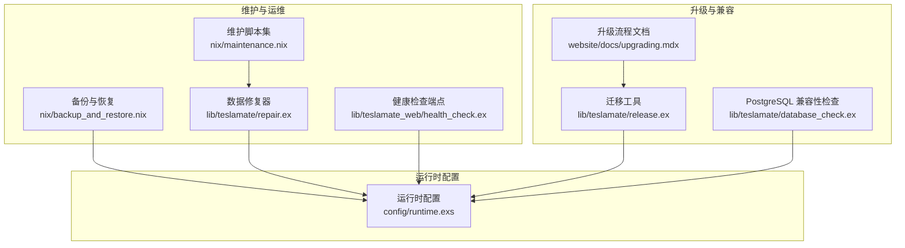
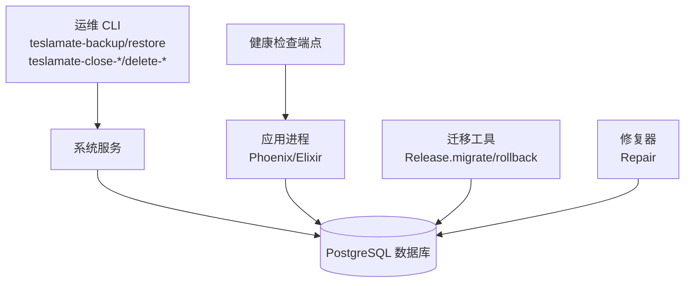
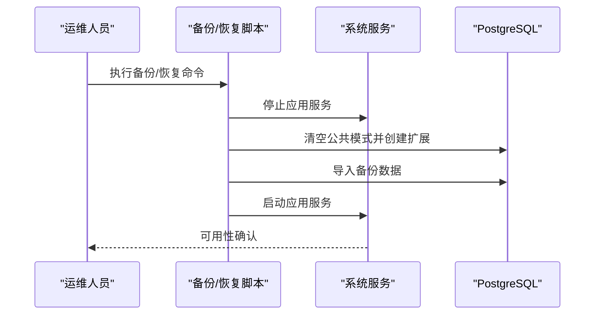
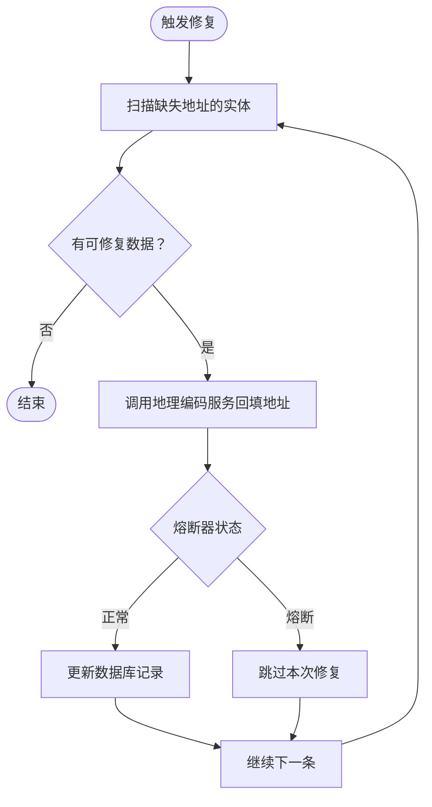
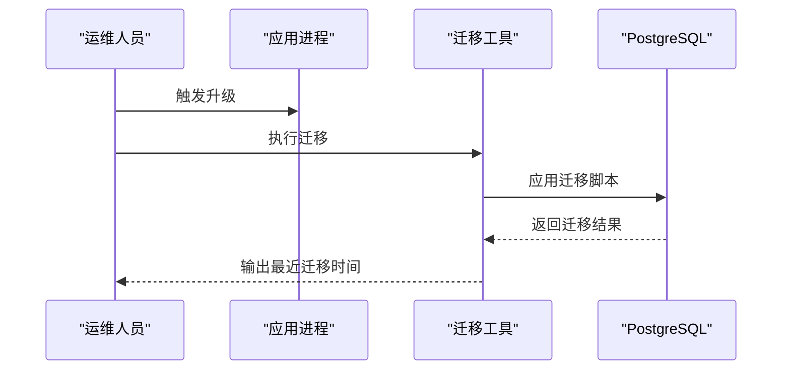
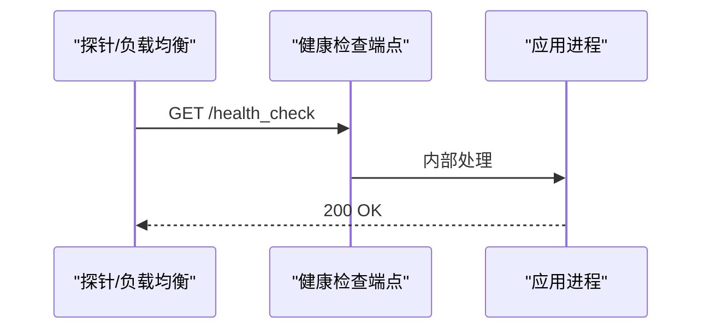
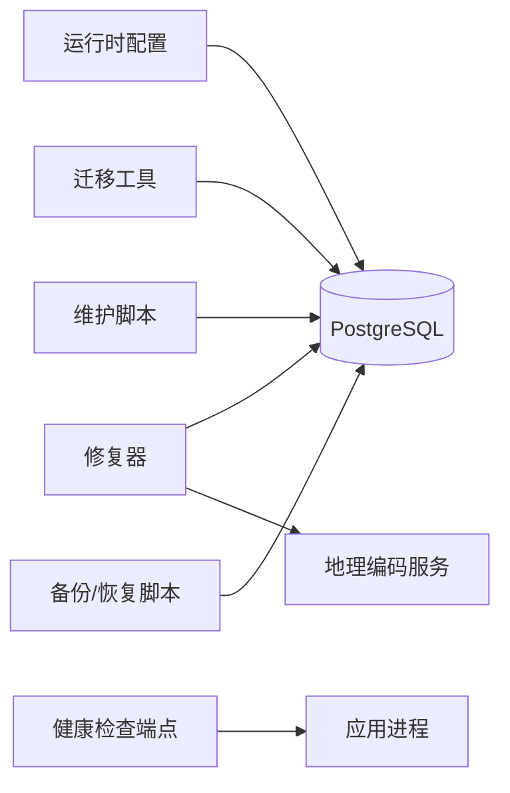

# 维护与故障排除

<cite>
**本文引用的文件**
- [nix/maintenance.nix](file://nix/maintenance.nix)
- [nix/backup_and_restore.nix](file://nix/backup_and_restore.nix)
- [lib/teslamate/repair.ex](file://lib/teslamate/repair.ex)
- [lib/teslamate/database_check.ex](file://lib/teslamate/database_check.ex)
- [lib/teslamate/release.ex](file://lib/teslamate/release.ex)
- [lib/teslamate_web/health_check.ex](file://lib/teslamate_web/health_check.ex)
- [website/docs/maintenance/backup_restore.mdx](file://website/docs/maintenance/backup_restore.mdx)
- [website/docs/maintenance/manually_fixing_data.mdx](file://website/docs/maintenance/manually_fixing_data.mdx)
- [website/docs/maintenance/upgrading_postgres.mdx](file://website/docs/maintenance/upgrading_postgres.mdx)
- [website/docs/upgrading.mdx](file://website/docs/upgrading.mdx)
- [config/runtime.exs](file://config/runtime.exs)
- [lib/teslamate_web/live/car_live/summary.html.heex](file://lib/teslamate_web/live/car_live/summary.html.heex)
</cite>

## 目录
1. [简介](#简介)
2. [项目结构](#项目结构)
3. [核心组件](#核心组件)
4. [架构总览](#架构总览)
5. [详细组件分析](#详细组件分析)
6. [依赖关系分析](#依赖关系分析)
7. [性能考量](#性能考量)
8. [故障排除指南](#故障排除指南)
9. [结论](#结论)
10. [附录](#附录)

## 简介
本指南聚焦于系统的维护与故障排除，覆盖备份与恢复、数据修复、系统升级以及常见问题诊断（性能下降、数据丢失、连接问题）。内容基于仓库中的实现与官方文档，帮助用户在生产环境中安全地执行维护操作，并在出现问题时快速定位与修复。

## 项目结构
围绕维护与故障排除的关键模块与文档分布如下：
- 备份与恢复：通过 Nix 脚本与官方文档提供备份/恢复命令与最佳实践
- 数据修复：内置修复器按规则自动补全地址信息，支持手动终止/删除行程或充电过程
- 升级与迁移：提供数据库迁移工具与 PostgreSQL 版本兼容性检查
- 健康检查：提供轻量健康检查端点，辅助监控与排障
- 运行时配置：数据库连接参数、SSL、池大小等影响稳定性与性能的关键设置

图表来源
- [nix/backup_and_restore.nix](file://nix/backup_and_restore.nix#L1-L50)
- [nix/maintenance.nix](file://nix/maintenance.nix#L1-L114)
- [lib/teslamate/repair.ex](file://lib/teslamate/repair.ex#L1-L153)
- [lib/teslamate_web/health_check.ex](file://lib/teslamate_web/health_check.ex#L1-L14)
- [lib/teslamate/release.ex](file://lib/teslamate/release.ex#L1-L34)
- [lib/teslamate/database_check.ex](file://lib/teslamate/database_check.ex#L1-L76)
- [config/runtime.exs](file://config/runtime.exs#L101-L149)
- [website/docs/upgrading.mdx](file://website/docs/upgrading.mdx#L1-L115)

章节来源
- [nix/backup_and_restore.nix](file://nix/backup_and_restore.nix#L1-L50)
- [nix/maintenance.nix](file://nix/maintenance.nix#L1-L114)
- [lib/teslamate/repair.ex](file://lib/teslamate/repair.ex#L1-L153)
- [lib/teslamate_web/health_check.ex](file://lib/teslamate_web/health_check.ex#L1-L14)
- [lib/teslamate/release.ex](file://lib/teslamate/release.ex#L1-L34)
- [lib/teslamate/database_check.ex](file://lib/teslamate/database_check.ex#L1-L76)
- [config/runtime.exs](file://config/runtime.exs#L101-L149)
- [website/docs/upgrading.mdx](file://website/docs/upgrading.mdx#L1-L115)

## 核心组件
- 备份与恢复脚本：提供 pg_dump 备份与恢复流程，包含停止服务、重建扩展、恢复数据与重启服务的步骤
- 维护脚本集：提供关闭未完成行程/充电、删除行程/充电的便捷脚本；适用于 Docker 与 NixOS 场景
- 数据修复器：周期性扫描缺失地址的行程与充电过程，调用地理编码服务回填地址，具备熔断保护
- 升级与迁移：提供一键迁移与回滚接口，查询最近迁移时间；配合 PostgreSQL 版本检查确保兼容性
- 健康检查端点：简单返回 200 的健康检查路由，便于外部探针探测
- 运行时配置：集中管理数据库连接、SSL、池大小、超时等关键参数

章节来源
- [nix/backup_and_restore.nix](file://nix/backup_and_restore.nix#L1-L50)
- [nix/maintenance.nix](file://nix/maintenance.nix#L1-L114)
- [lib/teslamate/repair.ex](file://lib/teslamate/repair.ex#L1-L153)
- [lib/teslamate/release.ex](file://lib/teslamate/release.ex#L1-L34)
- [lib/teslamate_web/health_check.ex](file://lib/teslamate_web/health_check.ex#L1-L14)
- [config/runtime.exs](file://config/runtime.exs#L101-L149)

## 架构总览
下图展示维护与故障排除相关组件之间的交互关系与职责边界。

图表来源
- [nix/backup_and_restore.nix](file://nix/backup_and_restore.nix#L1-L50)
- [nix/maintenance.nix](file://nix/maintenance.nix#L1-L114)
- [lib/teslamate/release.ex](file://lib/teslamate/release.ex#L1-L34)
- [lib/teslamate/repair.ex](file://lib/teslamate/repair.ex#L1-L153)
- [lib/teslamate_web/health_check.ex](file://lib/teslamate_web/health_check.ex#L1-L14)

## 详细组件分析

### 备份与恢复
- 备份策略
  - 使用 pg_dump 导出数据库为归档文件，建议在非高峰时段执行
  - 备份后务必转移至安全位置，避免容器升级导致工作目录被清理
  - 在 Docker Compose 中注意服务名差异（如 database/db），并使用 -T 避免伪终端错误
- 恢复流程
  - 停止应用服务以避免写入冲突
  - 清空公共模式并重建必需扩展（cube、earthdistance）
  - 将备份文件导入目标数据库
  - 启动应用服务并确认可用性

图表来源
- [nix/backup_and_restore.nix](file://nix/backup_and_restore.nix#L1-L50)
- [website/docs/maintenance/backup_restore.mdx](file://website/docs/maintenance/backup_restore.mdx#L1-L102)

章节来源
- [nix/backup_and_restore.nix](file://nix/backup_and_restore.nix#L1-L50)
- [website/docs/maintenance/backup_restore.mdx](file://website/docs/maintenance/backup_restore.mdx#L1-L102)

### 数据修复与手动修复
- 自动修复
  - 修复器定期扫描缺少起终点地址的行程与缺少地址的充电过程
  - 通过地理编码服务回填地址，具备熔断保护，避免对第三方服务造成压力
- 手动修复
  - 终止未完成的行程/充电，确保结束时间与状态正确
  - 删除误记的行程/充电，必要时可批量删除车辆相关数据
  - 如出现索引膨胀导致性能下降，可执行数据库级重索引

图表来源
- [lib/teslamate/repair.ex](file://lib/teslamate/repair.ex#L1-L153)
- [website/docs/maintenance/manually_fixing_data.mdx](file://website/docs/maintenance/manually_fixing_data.mdx#L1-L216)

章节来源
- [lib/teslamate/repair.ex](file://lib/teslamate/repair.ex#L1-L153)
- [website/docs/maintenance/manually_fixing_data.mdx](file://website/docs/maintenance/manually_fixing_data.mdx#L1-L216)

### 升级与迁移
- 升级流程
  - 建议先备份，再拉取新镜像或构建新版本
  - 对于手动安装场景，需执行数据库迁移
  - 升级后可重新导入 Grafana 仪表盘
- 迁移工具
  - 提供一键迁移与回滚接口，支持按版本号回滚
  - 可查询最近一次迁移的时间，辅助判断是否成功
- PostgreSQL 兼容性
  - 提供版本检测与兼容性校验，明确各主版本的最低要求
  - 超出已测试范围的版本会给出警告，建议谨慎使用

图表来源
- [lib/teslamate/release.ex](file://lib/teslamate/release.ex#L1-L34)
- [website/docs/upgrading.mdx](file://website/docs/upgrading.mdx#L1-L115)
- [lib/teslamate/database_check.ex](file://lib/teslamate/database_check.ex#L1-L76)

章节来源
- [lib/teslamate/release.ex](file://lib/teslamate/release.ex#L1-L34)
- [website/docs/upgrading.mdx](file://website/docs/upgrading.mdx#L1-L115)
- [lib/teslamate/database_check.ex](file://lib/teslamate/database_check.ex#L1-L76)

### 健康检查与监控
- 健康检查端点
  - 提供 /health_check 路由，返回 200 表示服务可用
  - 可用于反向代理或外部探针进行存活检测
- 前端健康提示
  - 前端界面中若健康检查失败，会显示告警图标，便于快速发现异常

图表来源
- [lib/teslamate_web/health_check.ex](file://lib/teslamate_web/health_check.ex#L1-L14)
- [lib/teslamate_web/live/car_live/summary.html.heex](file://lib/teslamate_web/live/car_live/summary.html.heex#L186-L225)

章节来源
- [lib/teslamate_web/health_check.ex](file://lib/teslamate_web/health_check.ex#L1-L14)
- [lib/teslamate_web/live/car_live/summary.html.heex](file://lib/teslamate_web/live/car_live/summary.html.heex#L186-L225)

## 依赖关系分析
- 组件耦合
  - 备份/恢复脚本直接依赖系统服务与数据库客户端
  - 维护脚本通过 RPC 或直接 SQL 访问数据库，依赖运行时环境变量
  - 修复器依赖地理编码服务与熔断器机制
  - 迁移工具依赖 Ecto 迁移框架与数据库连接
  - 健康检查端点仅依赖路由层，无数据库依赖
- 外部依赖
  - PostgreSQL 扩展 cube、earthdistance 在恢复阶段重建
  - 地理编码服务用于地址补全，具备熔断保护
  - 运行时配置决定数据库连接方式（TCP/UNIX Socket）、SSL、池大小与超时

图表来源
- [nix/backup_and_restore.nix](file://nix/backup_and_restore.nix#L1-L50)
- [nix/maintenance.nix](file://nix/maintenance.nix#L1-L114)
- [lib/teslamate/repair.ex](file://lib/teslamate/repair.ex#L1-L153)
- [lib/teslamate/release.ex](file://lib/teslamate/release.ex#L1-L34)
- [lib/teslamate_web/health_check.ex](file://lib/teslamate_web/health_check.ex#L1-L14)
- [config/runtime.exs](file://config/runtime.exs#L101-L149)

章节来源
- [nix/backup_and_restore.nix](file://nix/backup_and_restore.nix#L1-L50)
- [nix/maintenance.nix](file://nix/maintenance.nix#L1-L114)
- [lib/teslamate/repair.ex](file://lib/teslamate/repair.ex#L1-L153)
- [lib/teslamate/release.ex](file://lib/teslamate/release.ex#L1-L34)
- [lib/teslamate_web/health_check.ex](file://lib/teslamate_web/health_check.ex#L1-L14)
- [config/runtime.exs](file://config/runtime.exs#L101-L149)

## 性能考量
- 数据库连接与池
  - 合理设置连接池大小与查询超时，避免高并发下的阻塞
  - 在 IPv6 环境下启用相应选项，减少解析开销
- 地理编码与熔断
  - 修复器对地理编码服务施加熔断保护，避免频繁失败拖垮系统
- 索引与重索引
  - 大量更新/删除后可能出现索引膨胀，可执行数据库级重索引缓解性能退化

章节来源
- [config/runtime.exs](file://config/runtime.exs#L101-L149)
- [lib/teslamate/repair.ex](file://lib/teslamate/repair.ex#L1-L153)
- [website/docs/maintenance/manually_fixing_data.mdx](file://website/docs/maintenance/manually_fixing_data.mdx#L190-L216)

## 故障排除指南

### 备份与恢复
- 备份失败
  - 检查服务名是否正确（如 database/db），并确保使用 -T
  - 若更改了数据库用户/名称，请同步修改命令中的用户名与数据库名
- 恢复失败
  - 确认应用服务已停止，避免写入冲突
  - 恢复前确认扩展已重建（cube、earthdistance）
  - 恢复后检查应用日志与健康检查端点

章节来源
- [website/docs/maintenance/backup_restore.mdx](file://website/docs/maintenance/backup_restore.mdx#L1-L102)
- [nix/backup_and_restore.nix](file://nix/backup_and_restore.nix#L1-L50)

### 数据修复与手动修复
- 无法自动补全地址
  - 检查地理编码服务可用性与熔断器状态
  - 适当降低修复频率或限制单次修复数量
- 手动终止/删除行程/充电
  - 使用维护脚本或 RPC 命令，确保 ID 正确
  - 删除前务必确认数据无误，必要时先备份

章节来源
- [lib/teslamate/repair.ex](file://lib/teslamate/repair.ex#L1-L153)
- [website/docs/maintenance/manually_fixing_data.mdx](file://website/docs/maintenance/manually_fixing_data.mdx#L1-L216)
- [nix/maintenance.nix](file://nix/maintenance.nix#L1-L114)

### 升级与迁移
- 升级后数据库异常
  - 执行迁移工具，确保所有迁移均已应用
  - 查询最近迁移时间，确认迁移成功
- PostgreSQL 版本不兼容
  - 使用版本检查工具确认当前版本是否满足最低要求
  - 超出测试范围的版本请谨慎使用并做好回滚准备

章节来源
- [lib/teslamate/release.ex](file://lib/teslamate/release.ex#L1-L34)
- [lib/teslamate/database_check.ex](file://lib/teslamate/database_check.ex#L1-L76)
- [website/docs/upgrading.mdx](file://website/docs/upgrading.mdx#L1-L115)

### 连接问题与性能下降
- 连接问题
  - 检查数据库连接参数（主机、端口、用户、密码、SSL）
  - 若使用 UNIX Socket，确认路径与权限正确
  - 调整池大小与超时，避免连接耗尽
- 性能下降
  - 关注索引膨胀，必要时执行重索引
  - 检查地理编码服务调用频率，避免触发熔断
  - 查看健康检查端点与前端健康提示，定位异常

章节来源
- [config/runtime.exs](file://config/runtime.exs#L101-L149)
- [lib/teslamate_web/health_check.ex](file://lib/teslamate_web/health_check.ex#L1-L14)
- [lib/teslamate_web/live/car_live/summary.html.heex](file://lib/teslamate_web/live/car_live/summary.html.heex#L186-L225)
- [website/docs/maintenance/manually_fixing_data.mdx](file://website/docs/maintenance/manually_fixing_data.mdx#L190-L216)

## 结论
通过标准化的备份/恢复流程、自动化的数据修复器、完善的迁移与兼容性检查，以及清晰的健康检查与配置项，本系统能够在生产环境中稳定运行并高效应对各类维护与故障场景。建议在每次变更前执行备份，并结合健康检查与日志进行持续监控。

## 附录
- 常用命令参考
  - 备份：使用备份脚本导出数据库
  - 恢复：停止服务、重建扩展、导入备份、启动服务
  - 终止/删除：使用维护脚本或 RPC 命令
  - 迁移：执行迁移工具，确认最近迁移时间
  - 健康检查：访问 /health_check，关注前端健康提示

章节来源
- [nix/backup_and_restore.nix](file://nix/backup_and_restore.nix#L1-L50)
- [nix/maintenance.nix](file://nix/maintenance.nix#L1-L114)
- [lib/teslamate/release.ex](file://lib/teslamate/release.ex#L1-L34)
- [lib/teslamate_web/health_check.ex](file://lib/teslamate_web/health_check.ex#L1-L14)
- [config/runtime.exs](file://config/runtime.exs#L101-L149)