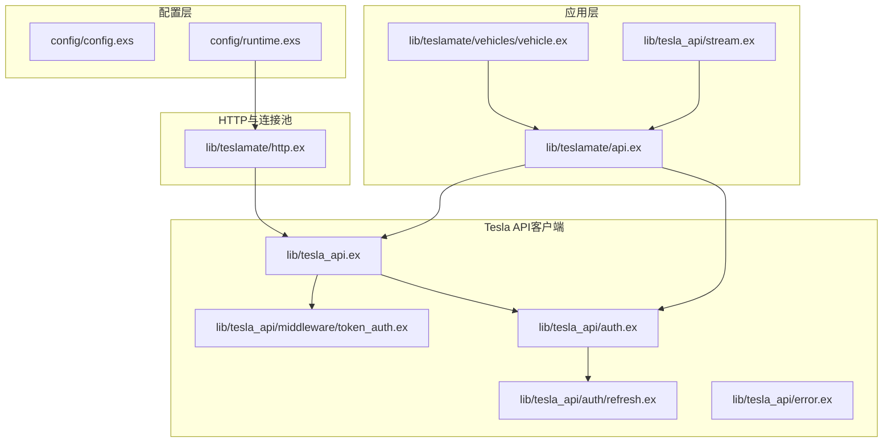
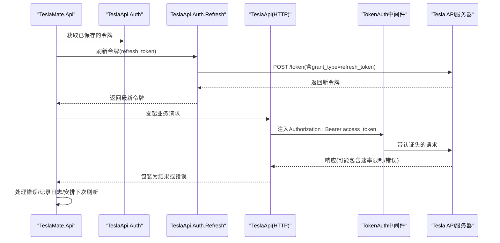
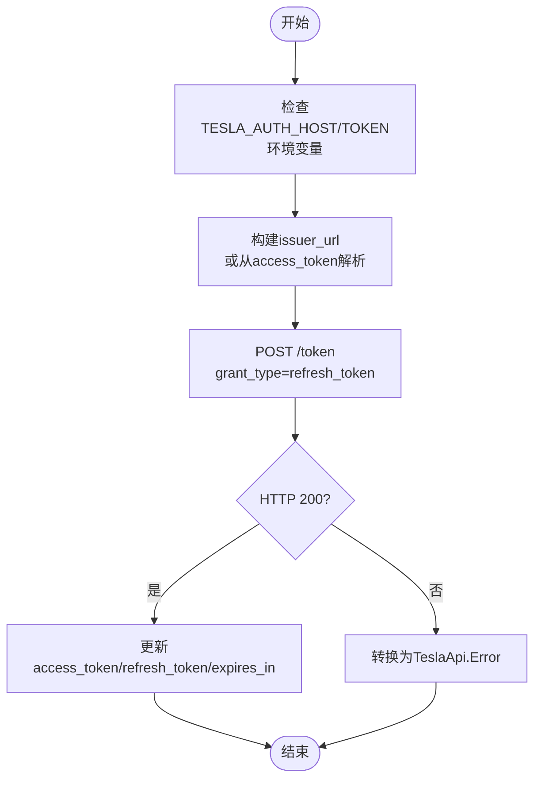
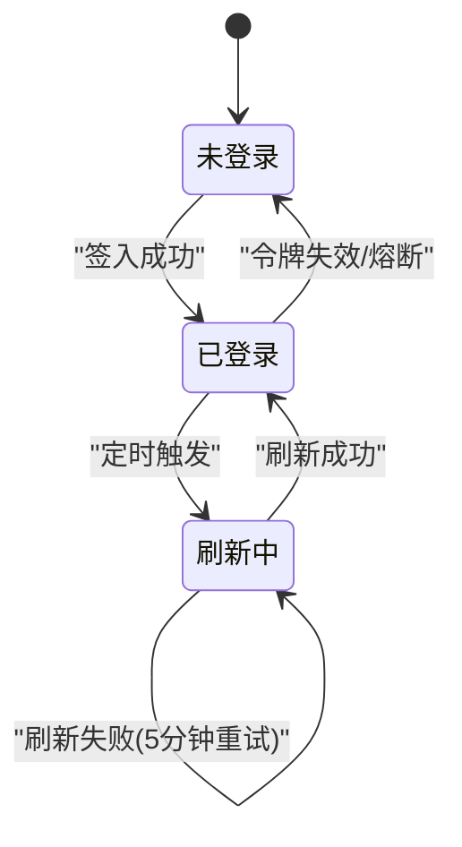
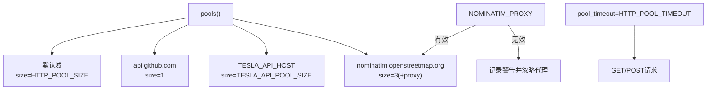
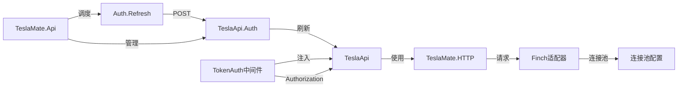

# API 配置

<cite>
**本文引用的文件**
- [config/config.exs](file://config/config.exs)
- [config/runtime.exs](file://config/runtime.exs)
- [lib/tesla_api.ex](file://lib/tesla_api.ex)
- [lib/tesla_api/auth.ex](file://lib/tesla_api/auth.ex)
- [lib/tesla_api/auth/refresh.ex](file://lib/tesla_api/auth/refresh.ex)
- [lib/tesla_api/middleware/token_auth.ex](file://lib/tesla_api/middleware/token_auth.ex)
- [lib/tesla_api/error.ex](file://lib/tesla_api/error.ex)
- [lib/teslamate/api.ex](file://lib/teslamate/api.ex)
- [lib/teslamate/http.ex](file://lib/teslamate/http.ex)
- [website/docs/configuration/api.md](file://website/docs/configuration/api.md)
- [website/docs/configuration/environment_variables.md](file://website/docs/configuration/environment_variables.md)
- [lib/tesla_api/stream.ex](file://lib/tesla_api/stream.ex)
- [lib/teslamate/vehicles/vehicle.ex](file://lib/teslamate/vehicles/vehicle.ex)
</cite>

## 目录
1. [简介](#简介)
2. [项目结构](#项目结构)
3. [核心组件](#核心组件)
4. [架构总览](#架构总览)
5. [详细组件分析](#详细组件分析)
6. [依赖关系分析](#依赖关系分析)
7. [性能与频率限制](#性能与频率限制)
8. [故障排查指南](#故障排查指南)
9. [结论](#结论)
10. [附录：环境变量清单](#附录环境变量清单)

## 简介
本文件面向TeslaMate与特斯拉官方API（以及第三方API）的配置与使用，重点说明以下内容：
- 如何配置认证凭据（refresh_token）与API端点基础URL
- 请求频率限制策略与退避重试
- token_auth中间件如何注入认证头
- refresh模块如何处理令牌刷新
- 使用Tesla Fleet API或MyTeslaMate等第三方API的配置选项
- 在config/runtime.exs中相关API客户端的超时、重试与连接池配置
- 调试API通信问题的方法，包括启用详细日志、验证令牌有效性、处理API变更或中断

## 项目结构
围绕API配置的关键目录与文件：
- 配置入口与运行时配置：config/config.exs、config/runtime.exs
- Tesla API客户端与中间件：lib/tesla_api.ex、lib/tesla_api/middleware/token_auth.ex、lib/tesla_api/auth.ex、lib/tesla_api/auth/refresh.ex、lib/tesla_api/error.ex
- HTTP连接池与Finch适配：lib/teslamate/http.ex
- API会话与令牌刷新调度：lib/teslamate/api.ex
- 第三方API与区域支持文档：website/docs/configuration/api.md、website/docs/configuration/environment_variables.md
- 流式数据与错误处理：lib/tesla_api/stream.ex、lib/teslamate/vehicles/vehicle.ex

图表来源
- [config/config.exs](file://config/config.exs#L1-L30)
- [config/runtime.exs](file://config/runtime.exs#L101-L190)
- [lib/teslamate/http.ex](file://lib/teslamate/http.ex#L1-L91)
- [lib/tesla_api.ex](file://lib/tesla_api.ex#L1-L18)
- [lib/tesla_api/auth.ex](file://lib/tesla_api/auth.ex#L1-L99)
- [lib/tesla_api/auth/refresh.ex](file://lib/tesla_api/auth/refresh.ex#L1-L43)
- [lib/tesla_api/middleware/token_auth.ex](file://lib/tesla_api/middleware/token_auth.ex#L1-L15)
- [lib/teslamate/api.ex](file://lib/teslamate/api.ex#L1-L317)
- [lib/tesla_api/stream.ex](file://lib/tesla_api/stream.ex#L167-L212)
- [lib/teslamate/vehicles/vehicle.ex](file://lib/teslamate/vehicles/vehicle.ex#L412-L454)

章节来源
- [config/config.exs](file://config/config.exs#L1-L30)
- [config/runtime.exs](file://config/runtime.exs#L101-L190)

## 核心组件
- Tesla API客户端（TeslaApi）：封装了HTTP适配器、基础URL、头部、JSON序列化、日志与中间件链。
- 认证模块（TeslaApi.Auth）：负责OAuth流程、颁发者URL推断、地区识别、访问令牌校验与刷新委托。
- 刷新模块（TeslaApi.Auth.Refresh）：根据refresh_token向鉴权端点发起刷新请求，并返回新的令牌集合。
- 中间件（TokenAuth）：从请求上下文中读取access_token并注入Authorization头。
- 应用级API服务（TeslaMate.Api）：管理登录状态、保存令牌、定时刷新、熔断与退避重试。
- HTTP连接池（TeslaMate.HTTP）：按域名配置连接池大小与代理，统一请求超时。
- 错误模型（TeslaApi.Error）：将HTTP响应转换为可读的异常类型，便于上层处理。

章节来源
- [lib/tesla_api.ex](file://lib/tesla_api.ex#L1-L18)
- [lib/tesla_api/auth.ex](file://lib/tesla_api/auth.ex#L1-L99)
- [lib/tesla_api/auth/refresh.ex](file://lib/tesla_api/auth/refresh.ex#L1-L43)
- [lib/tesla_api/middleware/token_auth.ex](file://lib/tesla_api/middleware/token_auth.ex#L1-L15)
- [lib/teslamate/api.ex](file://lib/teslamate/api.ex#L1-L317)
- [lib/teslamate/http.ex](file://lib/teslamate/http.ex#L1-L91)
- [lib/tesla_api/error.ex](file://lib/tesla_api/error.ex#L1-L38)

## 架构总览
下图展示了TeslaMate与特斯拉API交互的整体流程，包括认证、令牌刷新、请求注入与错误处理。

图表来源
- [lib/teslamate/api.ex](file://lib/teslamate/api.ex#L141-L204)
- [lib/tesla_api/auth/refresh.ex](file://lib/tesla_api/auth/refresh.ex#L8-L41)
- [lib/tesla_api/middleware/token_auth.ex](file://lib/tesla_api/middleware/token_auth.ex#L4-L12)
- [lib/tesla_api.ex](file://lib/tesla_api.ex#L6-L12)

## 详细组件分析

### 认证与令牌刷新
- 刷新逻辑：refresh模块根据环境变量构造issuer_url与token端点，携带grant_type=refresh_token与scope等参数调用鉴权端点，成功后更新access_token、refresh_token、expires_in等字段。
- 鉴权端点选择：若未设置TESLA_AUTH_HOST，则通过access_token派生issuer_url；否则使用环境变量拼接自定义路径。
- 访问令牌注入：TokenAuth中间件从env.opts中读取access_token并注入Authorization头，供后续插件与适配器使用。

图表来源
- [lib/tesla_api/auth/refresh.ex](file://lib/tesla_api/auth/refresh.ex#L8-L41)
- [lib/tesla_api/middleware/token_auth.ex](file://lib/tesla_api/middleware/token_auth.ex#L4-L12)

章节来源
- [lib/tesla_api/auth/refresh.ex](file://lib/tesla_api/auth/refresh.ex#L1-L43)
- [lib/tesla_api/middleware/token_auth.ex](file://lib/tesla_api/middleware/token_auth.ex#L1-L15)

### 应用级API服务（TeslaMate.Api）
- 登录与恢复：启动时尝试从持久化存储恢复access/refresh令牌，若可用则提前刷新并写回，同时安排定时刷新。
- 定时刷新：基于expires_in的75%计算延迟，避免过期；失败时以5分钟间隔重试。
- 错误处理：针对未授权、限流等进行熔断与退避，必要时触发重新登录流程。
- 结果包装：对列表/单体车辆查询结果进行预加载与错误映射，输出统一格式。

图表来源
- [lib/teslamate/api.ex](file://lib/teslamate/api.ex#L141-L204)
- [lib/teslamate/api.ex](file://lib/teslamate/api.ex#L213-L247)

章节来源
- [lib/teslamate/api.ex](file://lib/teslamate/api.ex#L1-L317)

### HTTP连接池与超时
- 连接池配置：按域名分组，分别为Tesla API、OpenStreetMap、GitHub与默认域，分别设置size。
- 池超时：HTTP_POOL_TIMEOUT控制从池中获取连接的最大等待时间（微秒）。
- 代理支持：NOMINATIM_PROXY仅支持HTTP代理，解析失败时回退不使用代理并记录警告。

图表来源
- [lib/teslamate/http.ex](file://lib/teslamate/http.ex#L1-L91)

章节来源
- [lib/teslamate/http.ex](file://lib/teslamate/http.ex#L1-L91)

### 日志与调试
- TeslaApi与Auth客户端均内置Logger插件，按状态级别输出日志。
- TeslaMate.Api在刷新失败、未授权、限流等场景输出详细日志，便于定位问题。
- 流式API在客户端错误与令牌过期时记录告警并触发相应处理。

章节来源
- [lib/tesla_api.ex](file://lib/tesla_api.ex#L10-L16)
- [lib/tesla_api/auth.ex](file://lib/tesla_api/auth.ex#L20-L25)
- [lib/teslamate/api.ex](file://lib/teslamate/api.ex#L176-L204)
- [lib/tesla_api/stream.ex](file://lib/tesla_api/stream.ex#L167-L212)

## 依赖关系分析
- TeslaApi客户端依赖Finch适配器与中间件链，通过BaseUrl与Headers插件统一注入基础URL与通用头部。
- TeslaMate.Api依赖TeslaApi.Auth与TeslaApi.Vehicle等模块，负责令牌生命周期管理与车辆数据拉取。
- TeslaMate.HTTP为所有外部HTTP请求提供统一连接池与超时控制，减少重复配置。

图表来源
- [lib/teslamate/http.ex](file://lib/teslamate/http.ex#L1-L91)
- [lib/tesla_api.ex](file://lib/tesla_api.ex#L1-L18)
- [lib/tesla_api/auth.ex](file://lib/tesla_api/auth.ex#L1-L99)
- [lib/tesla_api/auth/refresh.ex](file://lib/tesla_api/auth/refresh.ex#L1-L43)
- [lib/tesla_api/middleware/token_auth.ex](file://lib/tesla_api/middleware/token_auth.ex#L1-L15)
- [lib/teslamate/api.ex](file://lib/teslamate/api.ex#L1-L317)

章节来源
- [lib/teslamate/http.ex](file://lib/teslamate/http.ex#L1-L91)
- [lib/tesla_api.ex](file://lib/tesla_api.ex#L1-L18)
- [lib/tesla_api/auth.ex](file://lib/tesla_api/auth.ex#L1-L99)
- [lib/tesla_api/auth/refresh.ex](file://lib/tesla_api/auth/refresh.ex#L1-L43)
- [lib/tesla_api/middleware/token_auth.ex](file://lib/tesla_api/middleware/token_auth.ex#L1-L15)
- [lib/teslamate/api.ex](file://lib/teslamate/api.ex#L1-L317)

## 性能与频率限制
- 连接池与超时
  - Tesla API连接池大小由TESLA_API_POOL_SIZE控制，默认10。
  - 默认域连接池大小由HTTP_POOL_SIZE控制，默认5。
  - HTTP_POOL_TIMEOUT控制连接池获取超时（微秒），默认10000。
- 令牌刷新策略
  - 基于expires_in的75%计算刷新延迟，避免过期。
  - 刷新失败时每5分钟重试一次。
- 速率限制与退避
  - 当收到“过多请求”错误时，按retry-after秒数退避。
  - 其他错误根据当前状态（驾驶/充电/在线/离线）采用不同退避间隔。
- 流式数据
  - 若收到过期令牌错误，流式模块会记录告警并通知上层处理。

章节来源
- [lib/teslamate/http.ex](file://lib/teslamate/http.ex#L1-L91)
- [lib/teslamate/api.ex](file://lib/teslamate/api.ex#L213-L247)
- [lib/teslamate/api.ex](file://lib/teslamate/api.ex#L281-L300)
- [lib/tesla_api/stream.ex](file://lib/tesla_api/stream.ex#L167-L212)
- [lib/teslamate/vehicles/vehicle.ex](file://lib/teslamate/vehicles/vehicle.ex#L412-L454)

## 故障排查指南
- 启用详细日志
  - 确保TeslaApi与Auth客户端的日志插件开启，观察请求状态与错误消息。
  - 关注TeslaMate.Api中的刷新失败、未授权与限流日志。
- 验证令牌有效性
  - 若出现未授权错误，系统会尝试自动刷新；若多次失败，建议检查refresh_token是否正确、网络连通性与鉴权端点可达性。
  - 对于第三方API（如MyTeslaMate），确认TOKEN格式为?token=xxxx-xxxx-xxxx且TESLA_API_HOST/TESLA_AUTH_HOST/TESLA_AUTH_PATH配置正确。
- 处理API变更或中断
  - 若收到“过多请求”，按retry-after退避；若持续失败，检查连接池大小与超时设置。
  - 对于流式数据，若提示令牌过期，需重新登录或刷新令牌。
- 环境变量核对
  - 确认TESLA_API_HOST、TESLA_AUTH_HOST、TESLA_AUTH_PATH、TESLA_AUTH_CLIENT_ID、TOKEN等第三方API相关变量。
  - 若使用中国区API，确保区域端点与证书策略符合要求。

章节来源
- [lib/tesla_api.ex](file://lib/tesla_api.ex#L10-L16)
- [lib/tesla_api/auth.ex](file://lib/tesla_api/auth.ex#L20-L25)
- [lib/teslamate/api.ex](file://lib/teslamate/api.ex#L176-L204)
- [lib/teslamate/api.ex](file://lib/teslamate/api.ex#L281-L300)
- [lib/tesla_api/stream.ex](file://lib/tesla_api/stream.ex#L167-L212)
- [website/docs/configuration/api.md](file://website/docs/configuration/api.md#L40-L73)
- [website/docs/configuration/environment_variables.md](file://website/docs/configuration/environment_variables.md#L9-L62)

## 结论
TeslaMate通过清晰的模块划分与中间件链实现了与特斯拉API的稳定交互。认证与刷新由独立模块负责，应用层通过定时任务与熔断策略保障可靠性；HTTP层提供灵活的连接池与超时配置，便于在不同网络环境下优化性能。结合详细的日志与错误处理机制，用户可以快速定位并解决API通信问题。

## 附录：环境变量清单
- Tesla API与鉴权
  - TESLA_API_HOST：Tesla API基础URL（默认值见文档）
  - TESLA_AUTH_HOST：鉴权API基础URL（默认值见文档）
  - TESLA_AUTH_PATH：鉴权路径（默认值见文档）
  - TESLA_AUTH_CLIENT_ID：客户端ID（默认值见文档）
  - TOKEN：第三方API提供的令牌（格式?token=xxxx-xxxx-xxxx）
- 连接池与超时
  - TESLA_API_POOL_SIZE：Tesla API连接池大小（默认10）
  - HTTP_POOL_SIZE：默认域连接池大小（默认5）
  - HTTP_POOL_TIMEOUT：连接池获取超时（微秒，默认10000）
  - NOMINATIM_PROXY：OpenStreetMap代理（仅支持HTTP）
- 流式与轮询
  - TESLA_WSS_HOST：流式WebSocket主机
  - TESLA_WSS_TLS_ACCEPT_INVALID_CERTS：接受无效证书（默认false）
  - TESLA_WSS_USE_VIN：使用vin而非vid连接流
  - POLLING_*：不同状态下轮询间隔（秒）
- 其他
  - ENCRYPTION_KEY：加密API令牌所需密钥（必填）

章节来源
- [website/docs/configuration/environment_variables.md](file://website/docs/configuration/environment_variables.md#L9-L62)
- [website/docs/configuration/api.md](file://website/docs/configuration/api.md#L40-L73)