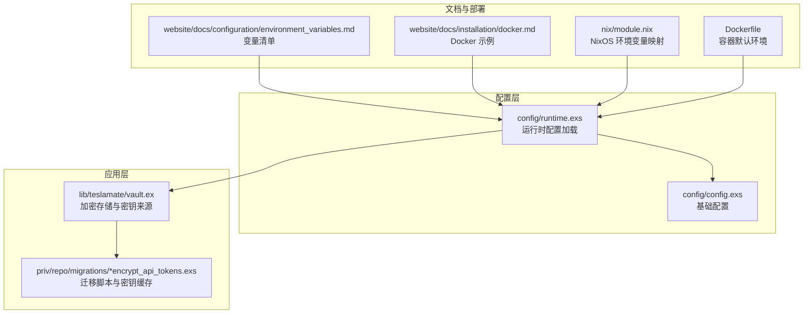
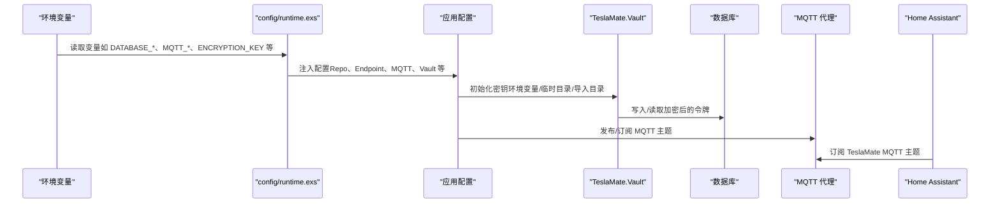
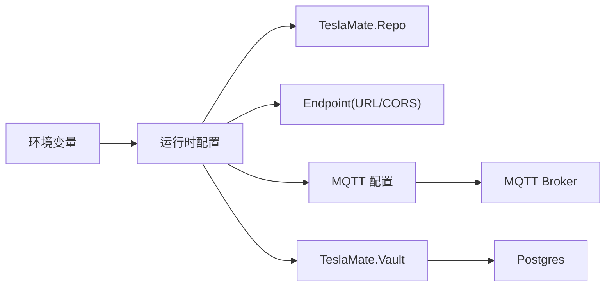

# 环境变量

<cite>
**本文引用的文件**
- [config/runtime.exs](file://config/runtime.exs)
- [config/config.exs](file://config/config.exs)
- [lib/teslamate/vault.ex](file://lib/teslamate/vault.ex)
- [priv/repo/migrations/20220123131732_encrypt_api_tokens.exs](file://priv/repo/migrations/20220123131732_encrypt_api_tokens.exs)
- [website/docs/configuration/environment_variables.md](file://website/docs/configuration/environment_variables.md)
- [website/docs/installation/docker.md](file://website/docs/installation/docker.md)
- [website/docs/integrations/home_assistant.md](file://website/docs/integrations/home_assistant.md)
- [website/docs/faq.md](file://website/docs/faq.md)
- [nix/module.nix](file://nix/module.nix)
- [Dockerfile](file://Dockerfile)
- [lib/teslamate_web/cldr.ex](file://lib/teslamate_web/cldr.ex)
</cite>

## 目录
1. [简介](#简介)
2. [项目结构](#项目结构)
3. [核心组件](#核心组件)
4. [架构总览](#架构总览)
5. [详细组件分析](#详细组件分析)
6. [依赖分析](#依赖分析)
7. [性能考虑](#性能考虑)
8. [故障排查指南](#故障排查指南)
9. [结论](#结论)
10. [附录](#附录)

## 简介
本文件系统化梳理 TeslaMate 支持的全部运行时环境变量，覆盖数据库连接、MQTT 集成、认证与安全（含 API 令牌加密）、时区与本地化、导入目录、HTTP 绑定地址、反向代理 URL、Tesla 官方 API/认证/流式接口参数、轮询间隔与网络池等。重点说明：
- 每个变量的作用、默认值、可选取值范围及对系统行为的影响
- 敏感信息（如 API 令牌、数据库密码）的安全管理实践，以及如何通过 TeslaMate.Vault 模块进行加密存储
- 环境变量与 runtime.exs 的优先级关系
- 典型部署场景（Docker、NixOS）下的配置示例
- 常见问题：变量未生效、大小写敏感性、与 Home Assistant 的 MQTT 集成配置

## 项目结构
TeslaMate 在启动时从 runtime.exs 中读取环境变量，并将其注入到应用配置中；敏感数据通过 Cloak 加密存储在数据库中；网站文档提供了变量清单与部署示例。

图表来源
- [config/runtime.exs](file://config/runtime.exs#L1-L190)
- [config/config.exs](file://config/config.exs#L1-L30)
- [lib/teslamate/vault.ex](file://lib/teslamate/vault.ex#L1-L141)
- [priv/repo/migrations/20220123131732_encrypt_api_tokens.exs](file://priv/repo/migrations/20220123131732_encrypt_api_tokens.exs#L1-L120)
- [website/docs/configuration/environment_variables.md](file://website/docs/configuration/environment_variables.md#L1-L62)
- [website/docs/installation/docker.md](file://website/docs/installation/docker.md#L1-L103)
- [nix/module.nix](file://nix/module.nix#L195-L238)
- [Dockerfile](file://Dockerfile#L1-L81)

章节来源
- [config/runtime.exs](file://config/runtime.exs#L1-L190)
- [config/config.exs](file://config/config.exs#L1-L30)

## 核心组件
- 运行时配置加载器：从环境变量读取并注入到应用配置，支持按环境（dev/prod/test）差异化默认值
- 加密存储模块：基于 Cloak 的 AES-GCM 加密，密钥可来自环境变量或持久化位置
- 变量清单与部署示例：网站文档提供变量列表、Docker/NixOS 示例与 Home Assistant 集成说明

章节来源
- [config/runtime.exs](file://config/runtime.exs#L89-L189)
- [lib/teslamate/vault.ex](file://lib/teslamate/vault.ex#L1-L141)
- [website/docs/configuration/environment_variables.md](file://website/docs/configuration/environment_variables.md#L1-L62)
- [website/docs/installation/docker.md](file://website/docs/installation/docker.md#L1-L103)
- [nix/module.nix](file://nix/module.nix#L195-L238)

## 架构总览
下图展示环境变量如何影响系统行为：从环境变量到运行时配置，再到加密存储与外部服务集成。

图表来源
- [config/runtime.exs](file://config/runtime.exs#L101-L189)
- [lib/teslamate/vault.ex](file://lib/teslamate/vault.ex#L48-L127)
- [website/docs/integrations/home_assistant.md](file://website/docs/integrations/home_assistant.md#L1-L200)

## 详细组件分析

### 数据库相关环境变量
- DATABASE_USER、DATABASE_PASS、DATABASE_NAME、DATABASE_HOST、DATABASE_PORT
  - 作用：指定 Postgres 连接参数
  - 默认值：生产环境默认用户/密码为“postgres”，主机默认“localhost”，端口默认“5432”
  - 影响：用于构建 Repo 配置；当 DATABASE_SOCKET_DIR 存在时，优先使用 UNIX 套接字连接
- DATABASE_SOCKET_DIR
  - 作用：提供包含 UNIX 套接字的目录路径，替代 HOST/PORT 方案
  - 默认值：未设置时使用 HOST/PORT 参数
- DATABASE_POOL_SIZE、DATABASE_TIMEOUT
  - 作用：连接池大小与查询超时（毫秒）
  - 默认值：10、60000
- DATABASE_SSL、DATABASE_SSL_CA_CERT_FILE、DATABASE_SSL_SNI、DATABASE_IPV6
  - 作用：启用 SSL 或不验证证书；指定 CA 文件；设置 SNI；启用 IPv6
  - 默认值：SSL 关闭；SNI 使用主机名或默认主机

章节来源
- [config/runtime.exs](file://config/runtime.exs#L104-L153)

### Web 与 URL 相关环境变量
- PORT、HTTP_BINDING_ADDRESS
  - 作用：Web 服务监听端口与绑定地址；支持 IPv6、Unix 套接字与权限设置
  - 默认值：PORT 默认 4000；HTTP_BINDING_ADDRESS 默认监听所有地址
- VIRTUAL_HOST、URL_PATH
  - 作用：生成 URL 的主机与路径（配合反向代理）
  - 默认值：虚拟主机“localhost”，路径“/”
- SECRET_KEY_BASE、SIGNING_SALT、CHECK_ORIGIN
  - 作用：会话签名与 CSRF 校验；可配置允许来源列表或逗号分隔的主机白名单
  - 默认值：随机生成的密钥与盐；默认关闭来源检查

章节来源
- [config/runtime.exs](file://config/runtime.exs#L155-L167)

### MQTT 相关环境变量
- DISABLE_MQTT
  - 作用：禁用 MQTT 功能
  - 默认值：未设置时启用
- MQTT_HOST、MQTT_PORT、MQTT_USERNAME、MQTT_PASSWORD、MQTT_TLS、MQTT_TLS_ACCEPT_INVALID_CERTS、MQTT_IPV6、MQTT_NAMESPACE
  - 作用：MQTT 代理连接参数、TLS 与证书校验策略、IPv6、命名空间前缀
  - 默认值：主机“localhost”；端口 1883（TLS 时 8883）；命名空间需合法（不含斜杠）

章节来源
- [config/runtime.exs](file://config/runtime.exs#L168-L178)

### 导入与缓存相关环境变量
- IMPORT_DIR
  - 作用：导入目录（如 TeslaFi），启动时自动检测目录内容并进入导入模式
  - 默认值：“./import”
- SRTM_CACHE
  - 作用：地形高程数据缓存目录
  - 默认值：当前用户主目录下的“.srtm_cache”

章节来源
- [config/runtime.exs](file://config/runtime.exs#L180-L186)

### 加密与安全相关环境变量
- ENCRYPTION_KEY
  - 作用：用于加密 Tesla API 令牌的密钥（必填）
  - 默认值：测试环境默认“secret”
  - 安全实践：强烈建议使用强随机密钥；密钥由 Cloak AES-GCM 保护，IV 长度固定为 12 字节
  - 备份恢复：迁移脚本会在临时目录与导入目录写入密钥文件，重启后可自动恢复
- VAULT_KEY
  - 说明：仓库中未直接使用该变量名；实际使用的是 ENCRYPTION_KEY。两者在概念上一致，均用于加密存储

章节来源
- [config/runtime.exs](file://config/runtime.exs#L187-L187)
- [lib/teslamate/vault.ex](file://lib/teslamate/vault.ex#L1-L141)
- [priv/repo/migrations/20220123131732_encrypt_api_tokens.exs](file://priv/repo/migrations/20220123131732_encrypt_api_tokens.exs#L1-L120)

### 时区与本地化相关环境变量
- TZ
  - 作用：设置容器/进程本地时区，影响日志时间显示
  - 默认值：未设置时使用系统默认
- TZDATA_DIR
  - 作用：tzdata 数据目录
  - 默认值：/tmp
- LOCALES
  - 作用：Cldr 本地化数据目录
  - 默认值：未设置时下载语言包

章节来源
- [config/runtime.exs](file://config/runtime.exs#L189-L189)
- [lib/teslamate_web/cldr.ex](file://lib/teslamate_web/cldr.ex#L1-L11)
- [website/docs/faq.md](file://website/docs/faq.md#L67-L70)

### Tesla API/认证/流式接口相关环境变量
- TESLA_API_HOST、TESLA_API_POOL_SIZE
  - 作用：官方 API 主机与连接池大小
- TESLA_AUTH_HOST、TESLA_AUTH_PATH、TESLA_AUTH_CLIENT_ID
  - 作用：认证主机、路径与客户端 ID
- TESLA_WSS_HOST、TESLA_WSS_TLS_ACCEPT_INVALID_CERTS、TESLA_WSS_USE_VIN
  - 作用：流式 WebSocket 主机、证书校验策略、是否使用 vin 连接
- TOKEN
  - 作用：第三方 Tesla API 提供者的访问令牌（格式要求）
- DEFAULT_GEOFENCE
  - 作用：默认地理围栏值
- TESLAFI_IMPORT_VEHICLE_ID
  - 作用：导入 TeslaFi 数据时的默认车辆 ID

章节来源
- [website/docs/configuration/environment_variables.md](file://website/docs/configuration/environment_variables.md#L1-L62)

### 轮询与网络相关环境变量
- POLLING_ASLEEP_INTERVAL、POLLING_CHARGING_INTERVAL、POLLING_DRIVING_INTERVAL、POLLING_ONLINE_INTERVAL、POLLING_DEFAULT_INTERVAL、POLLING_MINIMUM_INTERVAL
  - 作用：不同状态下拉取频率（秒）
- HTTP_POOL_SIZE、HTTP_POOL_TIMEOUT、ULIMIT_MAX_NOFILE、NOMINATIM_PROXY
  - 作用：通用 HTTP 连接池大小与超时、文件描述符上限、OpenStreetMap 代理

章节来源
- [website/docs/configuration/environment_variables.md](file://website/docs/configuration/environment_variables.md#L1-L62)

## 依赖分析
- 环境变量到配置的映射关系
  - DATABASE_* → TeslaMate.Repo 配置
  - MQTT_* → :mqtt 应用配置
  - ENCRYPTION_KEY → TeslaMate.Vault 密钥来源
  - VIRTUAL_HOST/URL_PATH → Endpoint URL
  - CHECK_ORIGIN → Endpoint CORS 校验
  - IMPORT_DIR → 导入模式开关
  - TZ/TZDATA_DIR → 时区与 tzdata 数据目录
- 外部依赖
  - Postgres（数据库）
  - MQTT 代理（可选）
  - Tesla 官方 API/认证/流式接口（可选）
  - OpenStreetMap Nominatim（可选）

图表来源
- [config/runtime.exs](file://config/runtime.exs#L101-L189)

章节来源
- [config/runtime.exs](file://config/runtime.exs#L101-L189)

## 性能考虑
- 合理设置 DATABASE_POOL_SIZE 与 DATABASE_TIMEOUT，避免连接池耗尽导致阻塞
- 调整 POLLING_* 间隔以平衡数据实时性与能耗/API 调用频率
- 限制 HTTP_POOL_SIZE 与 HTTP_POOL_TIMEOUT，防止资源滥用
- ULIMIT_MAX_NOFILE 可在高并发场景下控制文件描述符上限

[本节为通用指导，无需具体文件来源]

## 故障排查指南
- 变量未生效
  - 检查变量名大小写：环境变量严格区分大小写，确保与文档一致
  - 确认变量在启动前已导出（Docker/NixOS 示例中已包含）
  - 查看启动日志，确认变量被正确读取
- 大小写敏感性
  - 所有变量均为大小写敏感，请核对拼写
- MQTT 无法连接
  - 检查 DISABLE_MQTT 是否误设为“true”
  - 校验 MQTT_HOST/MQTT_PORT/TLS 设置与证书策略
  - 确保 MQTT_NAMESPACE 不包含非法字符（如斜杠）
- 加密密钥丢失
  - 若未设置 ENCRYPTION_KEY，系统会生成临时密钥并在重启后丢失，需重新登录 API 令牌
  - 迁移脚本会在临时目录与导入目录写入密钥文件，确保这些目录持久化
- Home Assistant 集成
  - 确认 MQTT 代理可达且主题前缀与文档一致
  - 在 Home Assistant 中订阅正确的主题（如 teslamate/cars/{id}/...）

章节来源
- [config/runtime.exs](file://config/runtime.exs#L168-L178)
- [lib/teslamate/vault.ex](file://lib/teslamate/vault.ex#L48-L127)
- [website/docs/integrations/home_assistant.md](file://website/docs/integrations/home_assistant.md#L1-L200)
- [website/docs/faq.md](file://website/docs/faq.md#L67-L70)

## 结论
- 环境变量是 TeslaMate 运行时配置的核心入口，涵盖数据库、MQTT、安全、时区、导入与外部服务等关键领域
- 敏感信息必须通过 ENCRYPTION_KEY 加密存储，建议在部署时明确密钥来源与备份策略
- 不同部署方式（Docker、NixOS）均提供变量示例，应结合自身网络与安全策略进行调整
- 出现问题时，优先检查变量大小写、MQTT 连接与密钥持久化

[本节为总结，无需具体文件来源]

## 附录

### 环境变量与 runtime.exs 的优先级关系
- runtime.exs 使用 System.get_env/System.fetch_env! 读取变量
- 对于不同环境（dev/prod/test），可通过 defaults 参数提供差异化默认值
- 生产环境建议使用 fetch_env! 强制要求关键变量存在，避免静默失败

章节来源
- [config/runtime.exs](file://config/runtime.exs#L89-L99)

### 典型部署场景示例

- Docker
  - 示例包含 ENCRYPTION_KEY、DATABASE_*、MQTT_HOST 等关键变量
  - 建议将密钥与数据库凭据放入安全的 secrets 管理
  - 容器暴露端口 4000，可通过反向代理提供 HTTPS

章节来源
- [website/docs/installation/docker.md](file://website/docs/installation/docker.md#L1-L103)
- [Dockerfile](file://Dockerfile#L1-L81)

- NixOS
  - 通过 NixOS 模块将配置映射为环境变量（如 PORT、DATABASE_*、MQTT_*）
  - 支持根据开关禁用 MQTT

章节来源
- [nix/module.nix](file://nix/module.nix#L195-L238)

### 与 Home Assistant 的 MQTT 集成要点
- 订阅主题前缀与 car ID，确保与 TeslaMate 输出一致
- 使用 MQTT 传感器与设备追踪器，构建仪表盘与自动化

章节来源
- [website/docs/integrations/home_assistant.md](file://website/docs/integrations/home_assistant.md#L1-L200)