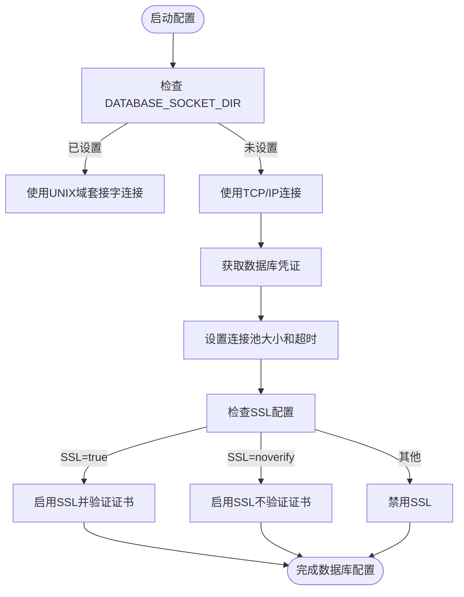
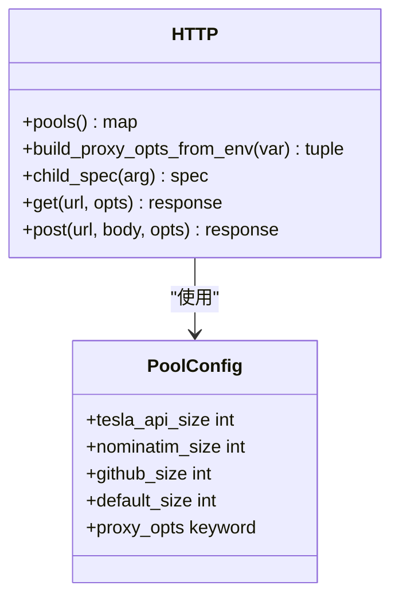
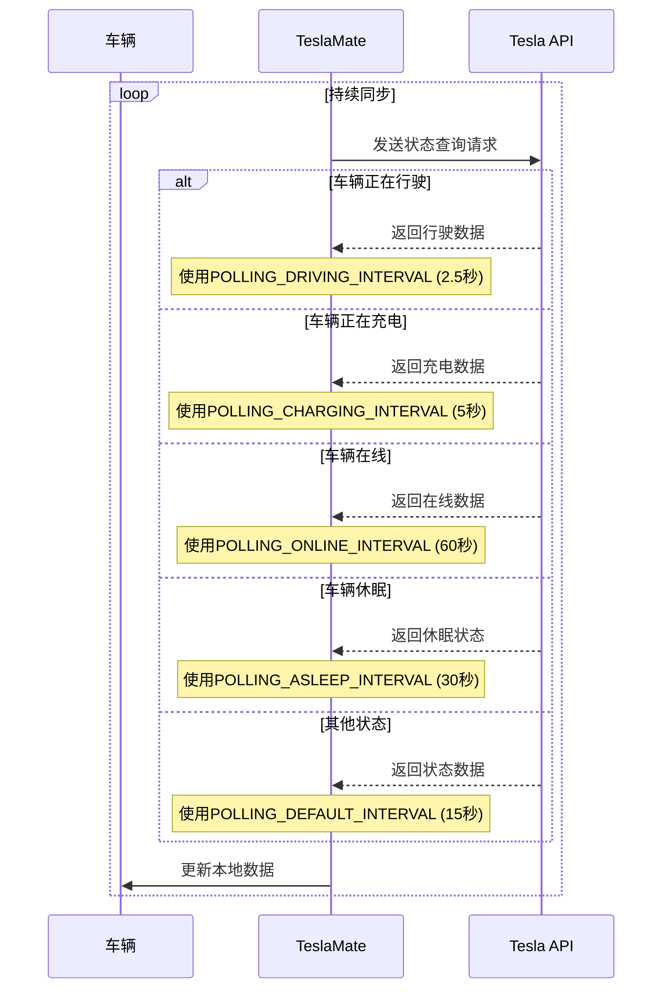
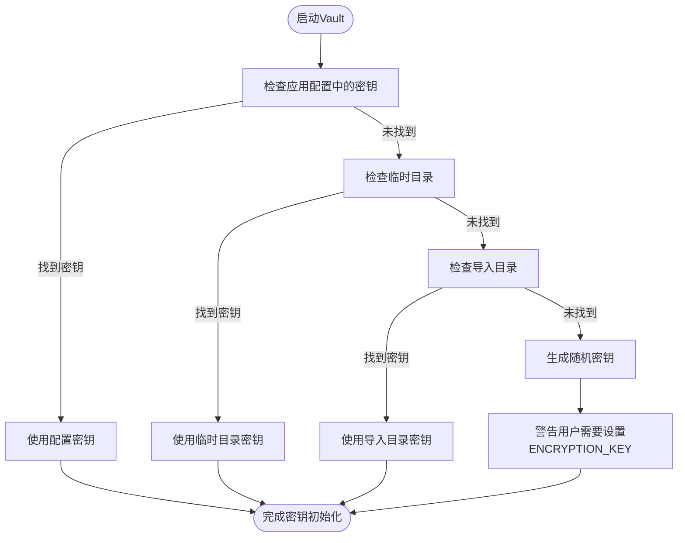
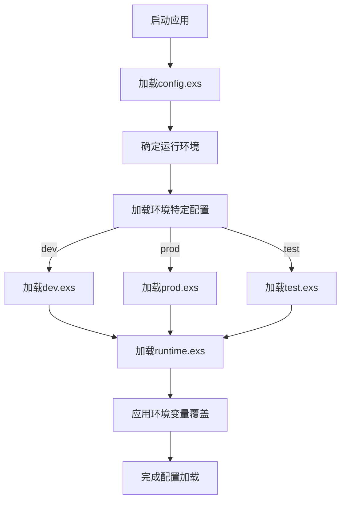
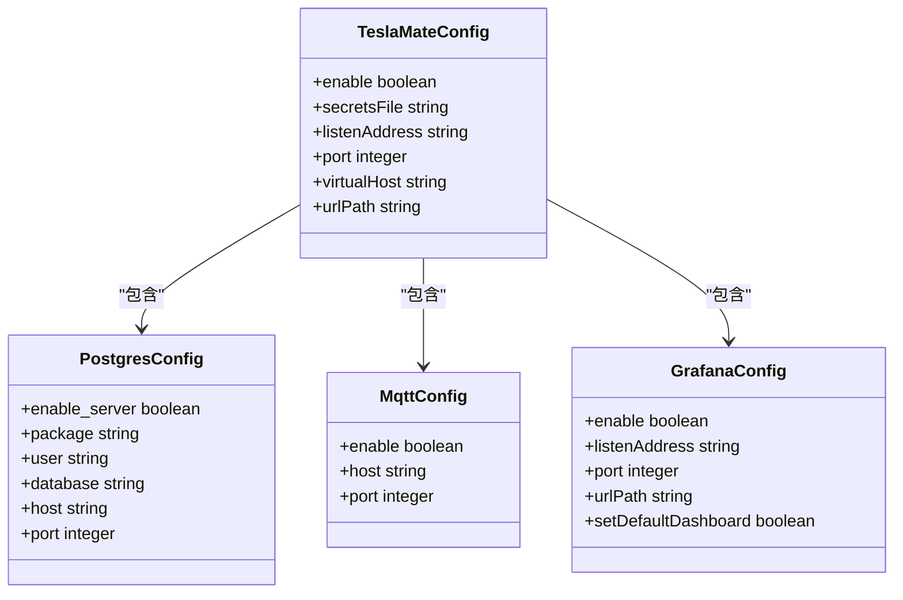

# 运行时配置

<cite>
**本文档中引用的文件**  
- [runtime.exs](file://config/runtime.exs)
- [config.exs](file://config/config.exs)
- [dev.exs](file://config/dev.exs)
- [prod.exs](file://config/prod.exs)
- [test.exs](file://config/test.exs)
- [vault.ex](file://lib/teslamate/vault.ex)
- [http.ex](file://lib/teslamate/http.ex)
- [vehicle.ex](file://lib/teslamate/vehicles/vehicle.ex)
- [module.nix](file://nix/module.nix)
- [environment_variables.md](file://website/docs/configuration/environment_variables.md)
</cite>

## 目录
1. [简介](#简介)
2. [数据库连接配置](#数据库连接配置)
3. [HTTP客户端配置](#http客户端配置)
4. [车辆数据同步间隔](#车辆数据同步间隔)
5. [日志级别控制](#日志级别控制)
6. [加密模块(Vault)配置](#加密模块vault配置)
7. [环境配置加载机制](#环境配置加载机制)
8. [Nix模块集成配置](#nix模块集成配置)
9. [常见配置错误及排查](#常见配置错误及排查)

## 简介
TeslaMate的运行时配置主要通过`runtime.exs`文件实现，该文件在应用程序启动时动态加载环境变量并配置系统参数。配置系统采用分层结构，结合了静态配置文件和动态环境变量，支持开发、生产和测试等不同环境的灵活配置。核心配置包括数据库连接、HTTP客户端行为、车辆数据同步策略、日志记录和数据加密等关键功能。

**Section sources**
- [runtime.exs](file://config/runtime.exs#L1-L190)
- [config.exs](file://config/config.exs#L1-L30)

## 数据库连接配置
TeslaMate使用PostgreSQL作为主要数据存储，通过`runtime.exs`文件中的配置项管理数据库连接。配置支持两种连接方式：TCP/IP连接和UNIX域套接字连接。

### TCP/IP连接配置
当未指定`DATABASE_SOCKET_DIR`环境变量时，系统使用TCP/IP连接方式：
- **DATABASE_USER**: 数据库用户名，默认为"postgres"
- **DATABASE_PASS**: 数据库用户密码，默认为"postgres"
- **DATABASE_HOST**: 数据库服务器主机名，默认为"localhost"
- **DATABASE_PORT**: 数据库服务器端口，默认为"5432"

### UNIX域套接字连接配置
当设置了`DATABASE_SOCKET_DIR`环境变量时，系统使用UNIX域套接字连接，这通常用于Docker容器或本地部署场景，提供更高的性能和安全性。

### 连接池与超时
- **DATABASE_POOL_SIZE**: 数据库连接池大小，默认为10个连接
- **DATABASE_TIMEOUT**: 数据库查询超时时间（毫秒），默认为60000毫秒
- **DATABASE_IPV6**: 是否启用IPv6连接，默认为false

### SSL连接配置
支持三种SSL模式：
- **DATABASE_SSL=true**: 启用SSL并验证证书
- **DATABASE_SSL=noverify**: 启用SSL但不验证证书
- **DATABASE_SSL**未设置或为其他值：禁用SSL

当启用SSL验证时，必须通过`DATABASE_SSL_CA_CERT_FILE`指定CA证书文件路径。



**Diagram sources**
- [runtime.exs](file://config/runtime.exs#L104-L149)

**Section sources**
- [runtime.exs](file://config/runtime.exs#L104-L153)

## HTTP客户端配置
HTTP客户端配置主要管理与Tesla API及其他外部服务的通信，包括连接池、超时和代理设置。

### 连接池配置
系统为不同域名配置了独立的HTTP连接池：
- **TESLA_API_POOL_SIZE**: Tesla API主机的HTTP池大小，默认为10
- **HTTP_POOL_SIZE**: 其他域名的默认HTTP连接池大小，默认为5
- 特定服务有固定池大小：Nominatim OpenStreetMap为3，GitHub API为1

### 超时与重试策略
- **HTTP_POOL_TIMEOUT**: 从HTTP池获取连接的最大等待时间（微秒），默认为10000微秒
- 系统使用Finch作为HTTP客户端，内置了连接复用和超时管理机制

### 代理配置
- **NOMINATIM_PROXY**: 为OpenStreetMap Nominatim API请求配置HTTP代理，仅支持HTTP协议



**Diagram sources**
- [http.ex](file://lib/teslamate/http.ex#L4-L19)

**Section sources**
- [http.ex](file://lib/teslamate/http.ex#L1-L91)
- [environment_variables.md](file://website/docs/configuration/environment_variables.md#L43-L61)

## 车辆数据同步间隔
车辆数据同步间隔配置决定了TeslaMate与Tesla车辆API交互的频率，根据车辆状态动态调整以平衡数据实时性和API调用频率。

### 不同状态下的同步间隔
- **POLLING_ASLEEP_INTERVAL**: 车辆休眠时的同步间隔，默认30秒
- **POLLING_CHARGING_INTERVAL**: 车辆充电时的最小同步间隔，默认5秒
- **POLLING_DRIVING_INTERVAL**: 车辆行驶时的同步间隔，默认2.5秒
- **POLLING_ONLINE_INTERVAL**: 车辆在线时的同步间隔，默认60秒
- **POLLING_DEFAULT_INTERVAL**: 默认同步间隔，默认15秒
- **POLLING_MINIMUM_INTERVAL**: 最小同步间隔，无默认值

### 同步逻辑实现
系统根据车辆当前状态选择合适的同步间隔，优先级从高到低为：行驶 > 充电 > 在线 > 休眠 > 默认。当车辆状态变化时，系统会自动调整同步频率。



**Diagram sources**
- [vehicle.ex](file://lib/teslamate/vehicles/vehicle.ex#L1075-L1083)
- [environment_variables.md](file://website/docs/configuration/environment_variables.md#L52-L57)

**Section sources**
- [vehicle.ex](file://lib/teslamate/vehicles/vehicle.ex#L308-L1621)
- [environment_variables.md](file://website/docs/configuration/environment_variables.md#L52-L57)

## 日志级别控制
日志级别配置通过`config/prod.exs`和其他环境配置文件实现，控制应用程序的日志输出详细程度。

### 生产环境日志配置
在生产环境中，日志级别设置为`:info`，仅记录重要信息和警告，避免产生过多日志文件：
```elixir
config :logger, level: :info
```

### 开发环境日志配置
开发环境启用调试模式，显示更详细的日志信息，便于开发和问题排查：
```elixir
config :logger, :console, format: "$metadata[$level] $message\n"
```

### 测试环境日志配置
测试环境将日志级别设置为`:warning`，仅记录警告和错误信息，避免测试输出被过多日志干扰：
```elixir
config :logger, level: :warning
```

**Section sources**
- [prod.exs](file://config/prod.exs#L9-L14)
- [dev.exs](file://config/dev.exs#L25)
- [test.exs](file://config/test.exs#L3)

## 加密模块(Vault)配置
TeslaMate使用Cloak库实现数据加密，主要保护Tesla API令牌等敏感信息。

### 加密密钥管理
- **ENCRYPTION_KEY**: 用于加密API令牌的主密钥，必须在生产环境中设置
- 密钥来源优先级：应用配置 > 临时目录 > 导入目录
- 如果未提供密钥，系统会生成随机密钥，但重启后需要重新登录

### 加密实现
使用AES-256-GCM模式进行加密，确保数据的机密性和完整性。加密数据的结构包括：
- 密钥标签(Key Tag)
- 初始化向量(IV)，长度为12字节
- 密文标签(Ciphertag)，长度为16字节
- 密文(Ciphertext)

### 密钥恢复机制
系统尝试从多个位置恢复加密密钥：
1. 应用程序配置
2. 系统临时目录
3. 导入目录(import)



**Diagram sources**
- [vault.ex](file://lib/teslamate/vault.ex#L50-L78)

**Section sources**
- [vault.ex](file://lib/teslamate/vault.ex#L1-L141)
- [runtime.exs](file://config/runtime.exs#L187)
- [environment_variables.md](file://website/docs/configuration/environment_variables.md#L11)

## 环境配置加载机制
TeslaMate采用分层配置机制，结合静态配置文件和动态环境变量，支持不同部署环境的灵活配置。

### 配置文件加载顺序
1. `config.exs`: 基础配置，对所有环境通用
2. `#{config_env()}.exs`: 环境特定配置，根据运行环境加载
3. `runtime.exs`: 运行时配置，从环境变量读取并覆盖前面的配置

### 环境变量优先级
运行时配置具有最高优先级，可以覆盖配置文件中的设置。这种设计使得容器化部署和云环境配置更加灵活。

### 环境特定配置示例
- **开发环境(dev)**: 启用代码重载和调试错误
- **生产环境(prod)**: 启用静态资源缓存和服务器模式
- **测试环境(test)**: 禁用Web服务器，使用沙盒数据库



**Diagram sources**
- [config.exs](file://config/config.exs#L29)
- [runtime.exs](file://config/runtime.exs#L1-L190)

**Section sources**
- [config.exs](file://config/config.exs#L1-L30)
- [dev.exs](file://config/dev.exs#L1-L32)
- [prod.exs](file://config/prod.exs#L1-L15)
- [test.exs](file://config/test.exs#L1-L11)
- [runtime.exs](file://config/runtime.exs#L1-L190)

## Nix模块集成配置
Nix模块提供了声明式的系统配置方式，通过`module.nix`文件定义TeslaMate服务的完整配置。

### 服务配置选项
- **enable**: 是否启用TeslaMate服务
- **secretsFile**: 包含敏感信息的环境文件路径
- **listenAddress**: Web界面监听地址
- **port**: 服务监听端口
- **virtualHost**: 用于生成URL的主机部分

### 数据库集成
Nix模块支持内嵌PostgreSQL服务器配置：
- **postgres.enable_server**: 是否创建PostgreSQL服务器
- 自动配置数据库用户、数据库名和连接参数
- 支持通过环境文件提供数据库密码

### MQTT和Grafana集成
- **mqtt.enable**: 是否启用MQTT集成
- **grafana.enable**: 是否创建并配置Grafana仪表板
- 自动配置数据源和仪表板路径



**Diagram sources**
- [module.nix](file://nix/module.nix#L23-L164)

**Section sources**
- [module.nix](file://nix/module.nix#L1-L368)

## 常见配置错误及排查
### 数据库连接失败
**症状**: 应用启动失败，数据库连接超时或认证失败
**排查步骤**:
1. 检查`DATABASE_HOST`、`DATABASE_PORT`是否正确
2. 验证`DATABASE_USER`和`DATABASE_PASS`是否匹配
3. 确认数据库服务是否正在运行
4. 检查防火墙设置是否允许连接

### 加密密钥丢失
**症状**: 重启后需要重新登录Tesla账户
**解决方案**:
1. 设置`ENCRYPTION_KEY`环境变量
2. 或从`tm_encryption.key`文件恢复密钥
3. 密钥文件可能位于临时目录或导入目录

### MQTT连接问题
**症状**: 无法发布MQTT消息或订阅主题
**排查步骤**:
1. 检查`MQTT_HOST`和`MQTT_PORT`配置
2. 验证`MQTT_USERNAME`和`MQTT_PASSWORD`是否正确
3. 确认MQTT代理服务是否运行
4. 检查`DISABLE_MQTT`是否意外设置为`true`

### HTTP超时问题
**症状**: API请求频繁超时或失败
**解决方案**:
1. 增加`HTTP_POOL_TIMEOUT`值
2. 检查网络连接质量
3. 验证`NOMINATIM_PROXY`代理配置是否正确

**Section sources**
- [runtime.exs](file://config/runtime.exs#L104-L189)
- [vault.ex](file://lib/teslamate/vault.ex#L57-L72)
- [module.nix](file://nix/module.nix#L25-L37)
- [environment_variables.md](file://website/docs/configuration/environment_variables.md#L9-L62)