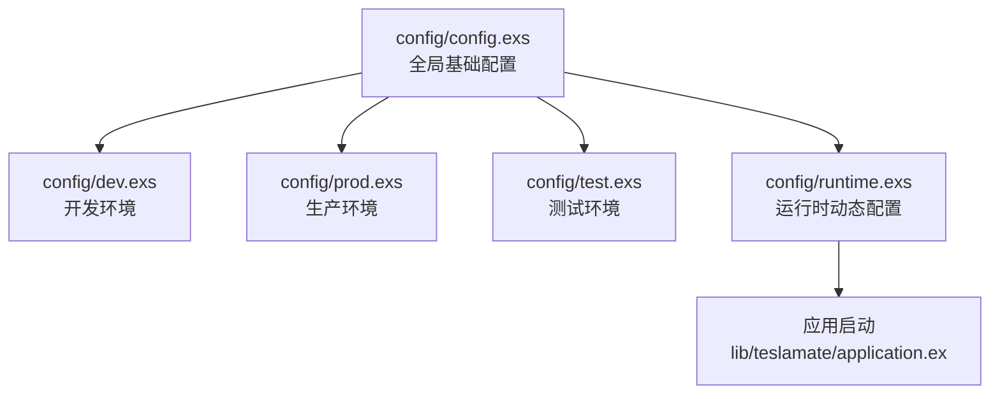
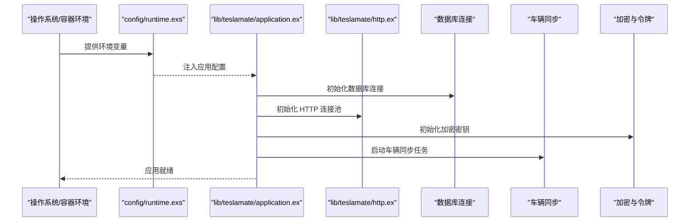
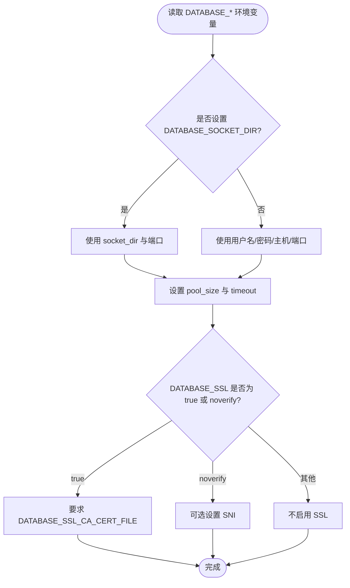
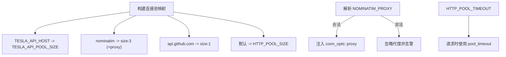
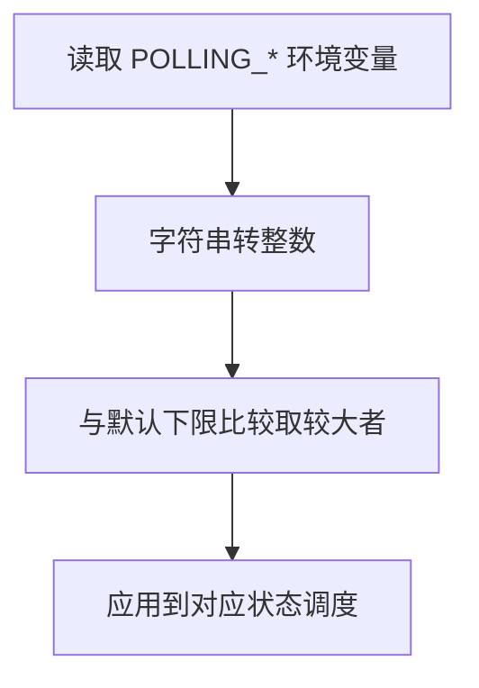
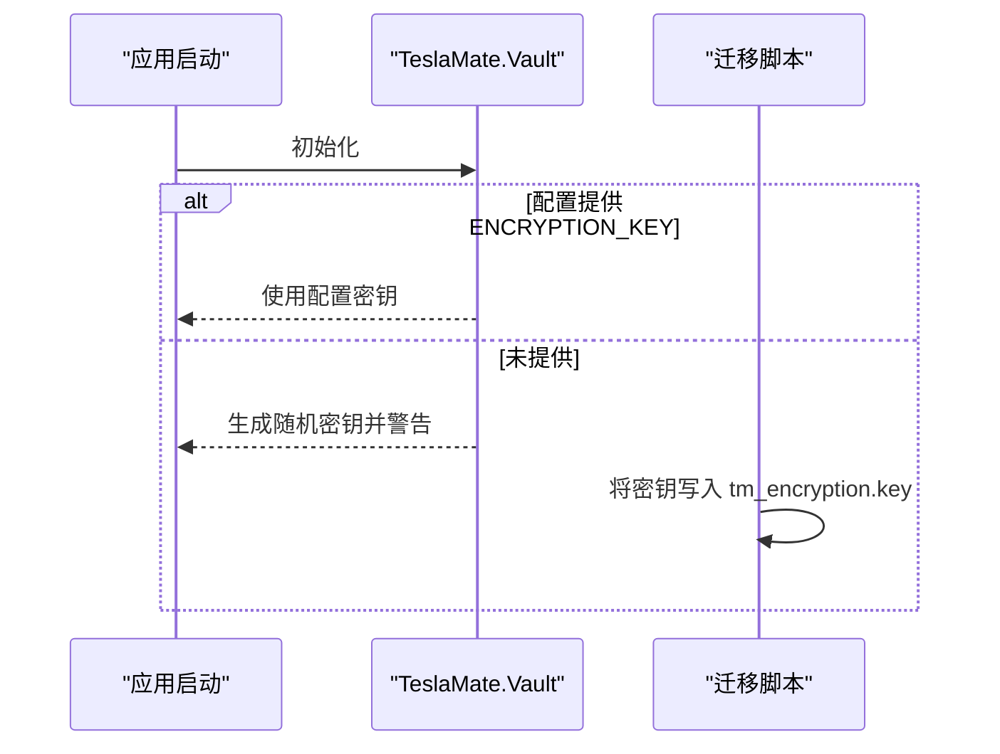
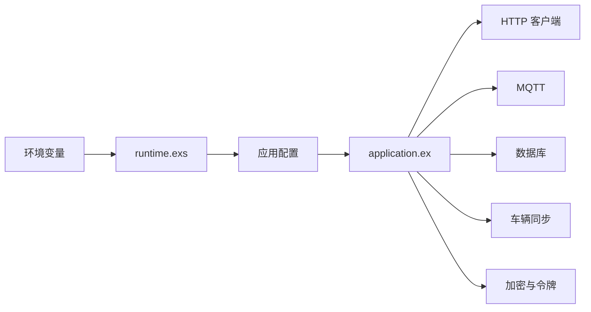

# 配置

<cite>
**本文引用的文件**
- [config/runtime.exs](file://config/runtime.exs)
- [config/config.exs](file://config/config.exs)
- [config/dev.exs](file://config/dev.exs)
- [config/prod.exs](file://config/prod.exs)
- [lib/teslamate/http.ex](file://lib/teslamate/http.ex)
- [lib/teslamate/vehicles/vehicle.ex](file://lib/teslamate/vehicles/vehicle.ex)
- [lib/teslamate/vault.ex](file://lib/teslamate/vault.ex)
- [lib/teslamate/application.ex](file://lib/teslamate/application.ex)
- [website/docs/configuration/environment_variables.md](file://website/docs/configuration/environment_variables.md)
</cite>

## 目录
1. [简介](#简介)
2. [项目结构与配置层次](#项目结构与配置层次)
3. [核心配置组件](#核心配置组件)
4. [架构总览](#架构总览)
5. [详细组件解析](#详细组件解析)
6. [依赖关系分析](#依赖关系分析)
7. [性能与资源特性](#性能与资源特性)
8. [故障排查指南](#故障排查指南)
9. [结论](#结论)
10. [附录：环境变量与最佳实践](#附录环境变量与最佳实践)

## 简介
本文件系统性梳理 TeslaMate 的配置体系，重点覆盖 runtime.exs 中的运行时配置参数（数据库连接、HTTP 客户端设置、MQTT、导入模式、时区与加密等），并结合环境变量文档，解释各配置项的作用、默认值、有效范围及对系统行为的影响。同时说明配置优先级与加载顺序，并给出生产与开发环境的最佳实践建议，包含安全配置要点（API 密钥与加密）。

## 项目结构与配置层次
TeslaMate 使用 Elixir 的配置机制，按环境拆分配置文件：
- config/config.exs：全局基础配置，导入当前环境配置文件
- config/{dev,prod,test}.exs：各环境特定配置
- config/runtime.exs：运行时动态配置，从环境变量读取并注入到应用配置

图表来源
- [config/config.exs](file://config/config.exs#L1-L30)
- [config/dev.exs](file://config/dev.exs#L1-L32)
- [config/prod.exs](file://config/prod.exs#L1-L15)
- [config/runtime.exs](file://config/runtime.exs#L1-L190)
- [lib/teslamate/application.ex](file://lib/teslamate/application.ex#L1-L81)

章节来源
- [config/config.exs](file://config/config.exs#L1-L30)
- [config/dev.exs](file://config/dev.exs#L1-L32)
- [config/prod.exs](file://config/prod.exs#L1-L15)
- [config/runtime.exs](file://config/runtime.exs#L1-L190)
- [lib/teslamate/application.ex](file://lib/teslamate/application.ex#L1-L81)

## 核心配置组件
- 数据库连接与 SSL：通过 DATABASE_* 系列环境变量配置用户、主机、端口、池大小、超时、SSL 与 IPv6 等
- Web 服务与 URL：通过 VIRTUAL_HOST、URL_PATH、PORT、HTTP_BINDING_ADDRESS、CHECK_ORIGIN、SECRET_KEY_BASE、SIGNING_SALT 等控制
- MQTT：通过 MQTT_* 系列环境变量启用或禁用，配置主机、端口、认证、TLS、命名空间与 IPv6
- HTTP 客户端：通过 TESLA_API_HOST、TESLA_API_POOL_SIZE、HTTP_POOL_SIZE、HTTP_POOL_TIMEOUT、NOMINATIM_PROXY 控制连接池与代理
- 车辆同步间隔：通过 POLLING_* 系列环境变量控制不同状态下的轮询间隔
- 加密与令牌：通过 ENCRYPTION_KEY 与 Vault 组件实现 API 令牌加密存储
- 导入模式：通过 IMPORT_DIR 自动检测导入目录并切换为导入模式
- 时区与数据目录：通过 TZ 与 TZDATA_DIR 控制日志时区与 tzdata 数据目录

章节来源
- [config/runtime.exs](file://config/runtime.exs#L101-L190)
- [lib/teslamate/http.ex](file://lib/teslamate/http.ex#L1-L91)
- [lib/teslamate/vehicles/vehicle.ex](file://lib/teslamate/vehicles/vehicle.ex#L1-L48)
- [lib/teslamate/vault.ex](file://lib/teslamate/vault.ex#L32-L140)
- [website/docs/configuration/environment_variables.md](file://website/docs/configuration/environment_variables.md#L1-L62)

## 架构总览
运行时配置加载流程如下：应用启动时，runtime.exs 从环境变量读取并写入应用配置；随后应用根据配置启动 HTTP、MQTT、数据库、车辆同步等子系统。

图表来源
- [config/runtime.exs](file://config/runtime.exs#L101-L190)
- [lib/teslamate/application.ex](file://lib/teslamate/application.ex#L1-L81)
- [lib/teslamate/http.ex](file://lib/teslamate/http.ex#L1-L91)

## 详细组件解析

### 数据库连接与 SSL（runtime.exs）
- 连接方式选择：若设置 DATABASE_SOCKET_DIR，则使用 Unix Socket；否则使用用户名、密码、主机、端口
- 池大小与超时：DATABASE_POOL_SIZE、DATABASE_TIMEOUT
- 数据库名称：DATABASE_NAME（开发/测试环境有默认值）
- SSL：DATABASE_SSL 可为 true 或 noverify；true 时必须提供 CA 证书文件；noverify 时可设置 SNI
- IPv6：DATABASE_IPV6=true 时启用 IPv6 套接字选项

图表来源
- [config/runtime.exs](file://config/runtime.exs#L104-L153)

章节来源
- [config/runtime.exs](file://config/runtime.exs#L104-L153)

### Web 服务与 URL（runtime.exs）
- 监听地址与端口：PORT、HTTP_BINDING_ADDRESS 支持 IP 地址或 Unix 套接路经
- URL 生成：VIRTUAL_HOST、URL_PATH
- 安全与跨域：SECRET_KEY_BASE、SIGNING_SALT、CHECK_ORIGIN 支持 true/false/白名单列表
- LiveView 签名盐：SIGNING_SALT

章节来源
- [config/runtime.exs](file://config/runtime.exs#L155-L167)

### MQTT 配置（runtime.exs）
- 开关：DISABLE_MQTT=true 可禁用
- 主机与端口：MQTT_HOST、MQTT_PORT
- 认证：MQTT_USERNAME、MQTT_PASSWORD
- TLS：MQTT_TLS、MQTT_TLS_ACCEPT_INVALID_CERTS
- 命名空间：MQTT_NAMESPACE（不允许包含斜杠）
- IPv6：MQTT_IPV6

章节来源
- [config/runtime.exs](file://config/runtime.exs#L168-L178)

### HTTP 客户端与代理（lib/teslamate/http.ex）
- 连接池：按域名分组，支持自定义大小
  - Tesla API 域名：TESLA_API_HOST、TESLA_API_POOL_SIZE
  - Nominatim：固定 size:3，支持 HTTP 代理 NOMINATIM_PROXY
  - GitHub API：固定 size:1
  - 默认：HTTP_POOL_SIZE
- 超时：HTTP_POOL_TIMEOUT（微秒）
- 代理校验：仅支持 http scheme，且需包含 host 与 port

图表来源
- [lib/teslamate/http.ex](file://lib/teslamate/http.ex#L1-L91)

章节来源
- [lib/teslamate/http.ex](file://lib/teslamate/http.ex#L1-L91)

### 车辆同步间隔（lib/teslamate/vehicles/vehicle.ex）
- 状态相关间隔（秒）：
  - 睡眠中：POLLING_ASLEEP_INTERVAL，默认 30
  - 行驶中：POLLING_DRIVING_INTERVAL，默认 2.5
  - 在线：POLLING_ONLINE_INTERVAL，默认 60
  - 默认：POLLING_DEFAULT_INTERVAL，默认 15
  - 最小值：POLLING_MINIMUM_INTERVAL，默认 0
- 代码逻辑会将环境变量转换为整数并取最大值以确保不低于默认下限

图表来源
- [lib/teslamate/vehicles/vehicle.ex](file://lib/teslamate/vehicles/vehicle.ex#L35-L48)

章节来源
- [lib/teslamate/vehicles/vehicle.ex](file://lib/teslamate/vehicles/vehicle.ex#L35-L48)

### 加密与令牌（lib/teslamate/vault.ex）
- ENCRYPTION_KEY：用于加密存储 Tesla API 令牌
- 若未提供，系统会生成随机密钥并在日志中提示，重启后可能需要重新登录
- 密钥持久化：迁移会在 tmp 目录与 IMPORT_DIR 写入 tm_encryption.key 文件

图表来源
- [lib/teslamate/vault.ex](file://lib/teslamate/vault.ex#L32-L140)
- [config/runtime.exs](file://config/runtime.exs#L187-L188)

章节来源
- [lib/teslamate/vault.ex](file://lib/teslamate/vault.ex#L32-L140)
- [config/runtime.exs](file://config/runtime.exs#L187-L188)

### 导入模式（runtime.exs）
- IMPORT_DIR：导入目录路径（默认 import）
- 若目录存在且包含有效文件名，系统进入导入模式，禁用地形与修复任务，启动导入器

章节来源
- [config/runtime.exs](file://config/runtime.exs#L180-L183)
- [lib/teslamate/application.ex](file://lib/teslamate/application.ex#L22-L52)

### 时区与 tzdata（runtime.exs）
- TZ：本地时区（影响日志时间显示）
- TZDATA_DIR：tzdata 数据目录（默认 /tmp）

章节来源
- [config/runtime.exs](file://config/runtime.exs#L189-L190)

## 依赖关系分析
- 配置加载顺序
  - config/config.exs 导入当前环境配置（dev/prod/test）
  - runtime.exs 在运行时从环境变量读取并覆盖或补充配置
  - 应用启动时，application.ex 根据配置决定启动子系统（HTTP、MQTT、数据库、车辆同步、导入等）
- 关键依赖
  - HTTP 客户端依赖环境变量构建连接池
  - 车辆同步依赖 POLLING_* 环境变量控制调度
  - 加密依赖 ENCRYPTION_KEY 与 Vault 组件
  - 数据库连接依赖 DATABASE_* 环境变量

图表来源
- [config/runtime.exs](file://config/runtime.exs#L101-L190)
- [lib/teslamate/application.ex](file://lib/teslamate/application.ex#L1-L81)
- [lib/teslamate/http.ex](file://lib/teslamate/http.ex#L1-L91)
- [lib/teslamate/vehicles/vehicle.ex](file://lib/teslamate/vehicles/vehicle.ex#L1-L48)
- [lib/teslamate/vault.ex](file://lib/teslamate/vault.ex#L32-L140)

章节来源
- [config/config.exs](file://config/config.exs#L29-L30)
- [config/runtime.exs](file://config/runtime.exs#L101-L190)
- [lib/teslamate/application.ex](file://lib/teslamate/application.ex#L1-L81)

## 性能与资源特性
- 数据库连接池：通过 DATABASE_POOL_SIZE 控制并发连接上限，避免过度占用资源
- HTTP 连接池：按域名分组，避免热点域名导致连接争用；NOMINATIM_PROXY 仅支持 HTTP 代理
- 轮询策略：不同车辆状态采用不同间隔，降低 API 压力；最小间隔可限制最短周期
- 文件描述符上限：可通过 ULIMIT_MAX_NOFILE 控制进程打开文件数量，防止内存膨胀

章节来源
- [lib/teslamate/http.ex](file://lib/teslamate/http.ex#L1-L91)
- [lib/teslamate/vehicles/vehicle.ex](file://lib/teslamate/vehicles/vehicle.ex#L35-L48)
- [website/docs/configuration/environment_variables.md](file://website/docs/configuration/environment_variables.md#L1-L62)

## 故障排查指南
- 数据库连接失败
  - 检查 DATABASE_SOCKET_DIR 与 DATABASE_* 是否匹配
  - 若启用 SSL，确认 DATABASE_SSL_CA_CERT_FILE 路径正确
  - 检查 DATABASE_IPV6 与网络连通性
- HTTP 请求超时或连接池耗尽
  - 调整 HTTP_POOL_SIZE、TESLA_API_POOL_SIZE、HTTP_POOL_TIMEOUT
  - 如需访问 Nominatim，设置 NOMINATIM_PROXY 并确保 scheme/host/port 正确
- MQTT 无法连接
  - 检查 DISABLE_MQTT、MQTT_HOST、MQTT_PORT、MQTT_TLS、MQTT_USERNAME/PASSWORD
  - MQTT_NAMESPACE 不允许包含斜杠
- 车辆同步频率异常
  - 检查 POLLING_* 环境变量是否为整数且不低于默认下限
- 加密与令牌问题
  - 未设置 ENCRYPTION_KEY 时，系统会生成临时密钥并提示；建议提供稳定密钥并持久化
- 导入模式未生效
  - 确认 IMPORT_DIR 存在且包含有效文件名，系统才会进入导入模式

章节来源
- [config/runtime.exs](file://config/runtime.exs#L104-L178)
- [lib/teslamate/http.ex](file://lib/teslamate/http.ex#L1-L91)
- [lib/teslamate/vehicles/vehicle.ex](file://lib/teslamate/vehicles/vehicle.ex#L35-L48)
- [lib/teslamate/vault.ex](file://lib/teslamate/vault.ex#L32-L140)
- [config/runtime.exs](file://config/runtime.exs#L180-L183)

## 结论
TeslaMate 的配置体系以环境变量为核心，runtime.exs 在运行时统一注入应用配置，配合各模块（HTTP、MQTT、数据库、车辆同步、加密）实现灵活可控的部署与运行。通过合理设置 DATABASE_*、HTTP_*、POLLING_*、MQTT_*、ENCRYPTION_KEY 等变量，可在不同环境中平衡性能、安全与稳定性。

## 附录：环境变量与最佳实践

### 环境变量清单与说明
- 数据库
  - DATABASE_USER、DATABASE_PASS、DATABASE_NAME、DATABASE_HOST、DATABASE_PORT、DATABASE_SOCKET_DIR
  - DATABASE_POOL_SIZE、DATABASE_TIMEOUT、DATABASE_SSL、DATABASE_SSL_CA_CERT_FILE、DATABASE_SSL_SNI、DATABASE_IPV6
- Web 与 URL
  - VIRTUAL_HOST、URL_PATH、PORT、HTTP_BINDING_ADDRESS、CHECK_ORIGIN、SECRET_KEY_BASE、SIGNING_SALT
- MQTT
  - DISABLE_MQTT、MQTT_HOST、MQTT_PORT、MQTT_USERNAME、MQTT_PASSWORD、MQTT_TLS、MQTT_TLS_ACCEPT_INVALID_CERTS、MQTT_NAMESPACE、MQTT_IPV6
- HTTP 客户端
  - TESLA_API_HOST、TESLA_API_POOL_SIZE、HTTP_POOL_SIZE、HTTP_POOL_TIMEOUT、NOMINATIM_PROXY
- 车辆同步
  - POLLING_ASLEEP_INTERVAL、POLLING_CHARGING_INTERVAL、POLLING_DRIVING_INTERVAL、POLLING_ONLINE_INTERVAL、POLLING_DEFAULT_INTERVAL、POLLING_MINIMUM_INTERVAL
- 加密与导入
  - ENCRYPTION_KEY、IMPORT_DIR
- 时区与辅助
  - TZ、TZDATA_DIR、DEFAULT_GEOFENCE、ULIMIT_MAX_NOFILE

章节来源
- [website/docs/configuration/environment_variables.md](file://website/docs/configuration/environment_variables.md#L1-L62)

### 配置优先级与加载顺序
- 顺序
  - config/config.exs 导入当前环境配置（dev/prod/test）
  - runtime.exs 从环境变量读取并写入应用配置
  - 应用启动时，application.ex 根据配置决定子系统启动
- 优先级
  - 生产环境强制要求某些变量（如 DATABASE_USER/PASS/NAME、ENCRYPTION_KEY）
  - runtime.exs 对部分变量提供 dev/test 默认值，生产环境应显式设置

章节来源
- [config/config.exs](file://config/config.exs#L29-L30)
- [config/runtime.exs](file://config/runtime.exs#L96-L133)
- [lib/teslamate/application.ex](file://lib/teslamate/application.ex#L1-L81)

### 实际配置示例（生产与开发）
- 生产环境建议
  - 显式设置 DATABASE_*、ENCRYPTION_KEY、MQTT_*（如启用）、CHECK_ORIGIN 白名单
  - 设置 HTTP_POOL_SIZE、TESLA_API_POOL_SIZE 以适配负载
  - 启用 DATABASE_SSL 并提供 CA 证书文件
  - 设置 PORT、HTTP_BINDING_ADDRESS 与反向代理配合
- 开发环境建议
  - 使用 dev.exs 的默认配置，必要时调整 CHECK_ORIGIN、PORT
  - 可临时关闭 MQTT 或使用本地代理进行调试

章节来源
- [config/dev.exs](file://config/dev.exs#L1-L32)
- [config/prod.exs](file://config/prod.exs#L1-L15)
- [config/runtime.exs](file://config/runtime.exs#L101-L190)
- [website/docs/configuration/environment_variables.md](file://website/docs/configuration/environment_variables.md#L1-L62)

### 安全配置建议
- API 密钥与加密
  - 必须设置 ENCRYPTION_KEY，避免每次重启都需要重新登录
  - 将 tm_encryption.key 放置在持久化卷中，确保密钥持久化
- HTTPS 与证书
  - 生产环境启用 DATABASE_SSL 并提供有效的 CA 证书
  - 反向代理处启用 TLS，CHECK_ORIGIN 严格限制来源
- MQTT 安全
  - 启用认证与 TLS，避免明文传输
  - 限制 MQTT_NAMESPACE，避免冲突与误订阅
- 网络与代理
  - 仅使用 HTTP 代理访问 Nominatim，确保 scheme/host/port 正确
  - 限制文件描述符上限，防止资源滥用

章节来源
- [lib/teslamate/vault.ex](file://lib/teslamate/vault.ex#L32-L140)
- [config/runtime.exs](file://config/runtime.exs#L123-L149)
- [lib/teslamate/http.ex](file://lib/teslamate/http.ex#L24-L65)
- [website/docs/configuration/environment_variables.md](file://website/docs/configuration/environment_variables.md#L1-L62)