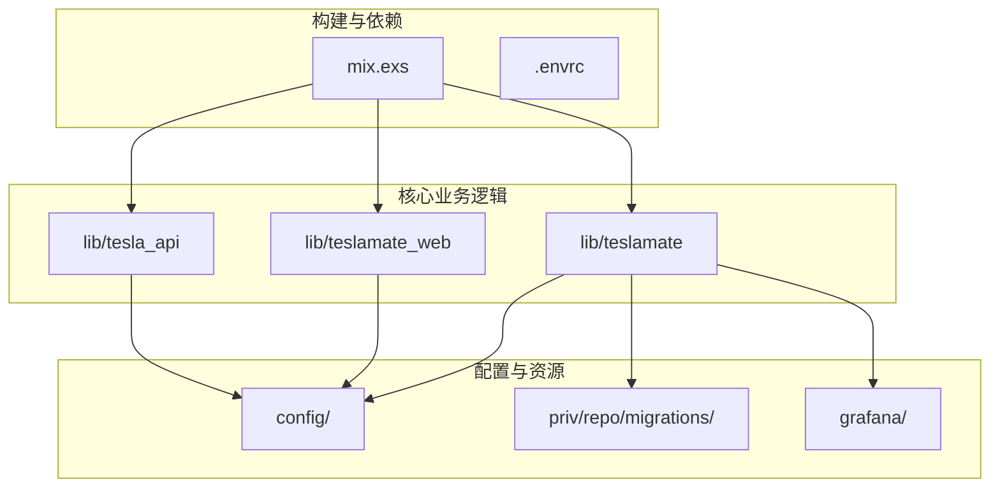
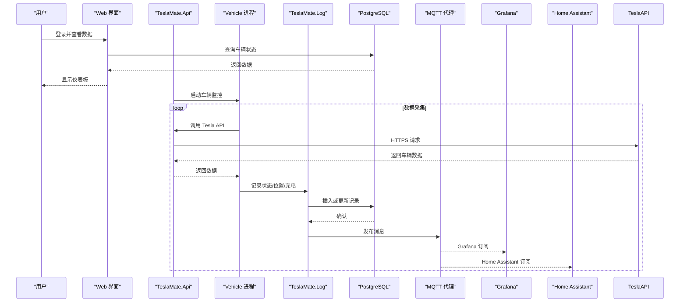
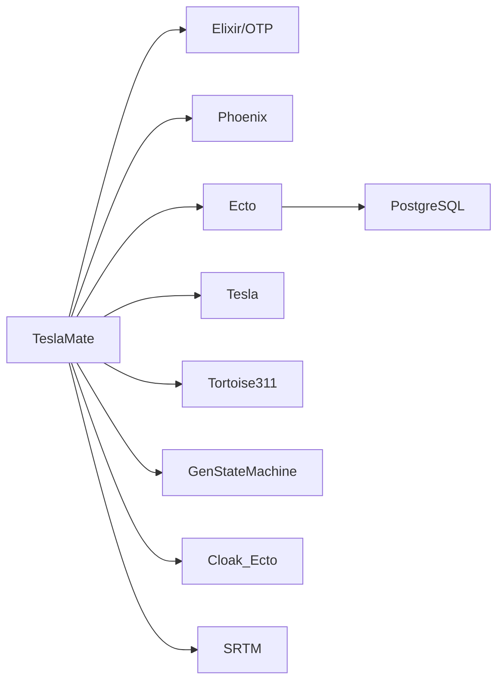

# 项目概述

<cite>
**本文档中引用的文件**  
- [README.md](file://README.md)
- [mix.exs](file://mix.exs)
- [lib/teslamate/application.ex](file://lib/teslamate/application.ex)
- [lib/teslamate/repo.ex](file://lib/teslamate/repo.ex)
- [lib/teslamate_web/endpoint.ex](file://lib/teslamate_web/endpoint.ex)
- [lib/teslamate/mqtt.ex](file://lib/teslamate/mqtt.ex)
- [lib/tesla_api.ex](file://lib/tesla_api.ex)
- [lib/teslamate/vehicles.ex](file://lib/teslamate/vehicles.ex)
- [lib/teslamate/api.ex](file://lib/teslamate/api.ex)
- [lib/teslamate/updater.ex](file://lib/teslamate/updater.ex)
- [lib/teslamate/log.ex](file://lib/teslamate/log.ex)
- [lib/teslamate/import.ex](file://lib/teslamate/import.ex)
- [config/config.exs](file://config/config.exs)
</cite>

## 目录
1. [简介](#简介)
2. [项目结构](#项目结构)
3. [核心组件](#核心组件)
4. [架构概述](#架构概述)
5. [详细组件分析](#详细组件分析)
6. [依赖分析](#依赖分析)
7. [性能考虑](#性能考虑)
8. [故障排除指南](#故障排除指南)
9. [结论](#结论)

## 简介

TeslaMate 是一个功能强大的自托管特斯拉车辆数据记录器，旨在以高精度收集、存储和可视化特斯拉车辆的运行数据。该项目采用 Elixir/OTP 构建，利用 Phoenix 框架提供 Web 界面，通过 Ecto 与 PostgreSQL 数据库交互，并通过 MQTT 协议将实时数据发布到本地消息代理，便于与其他系统（如 Home Assistant、Node-RED）集成。其设计目标是最大限度地减少对车辆的“吸血”耗电，确保车辆在不活跃时能尽快进入休眠状态。

系统通过 Tesla API 定期轮询车辆状态，并在车辆处于“在线”或“行驶”状态时使用流式 API 获取实时数据。所有采集的数据被持久化存储到 PostgreSQL 数据库中，并可通过 Grafana 预置的丰富仪表板进行深度分析和可视化。此外，TeslaMate 还支持从第三方服务（如 TeslaFi）导入历史数据，并提供地理围栏、充电成本追踪、固件更新记录等高级功能。

**Section sources**
- [README.md](file://README.md)

## 项目结构

TeslaMate 的项目结构遵循 Elixir 应用的标准布局，清晰地分离了关注点。`lib/` 目录下包含了应用的核心逻辑，分为 `teslamate`（业务逻辑）、`teslamate_web`（Web 接口）和 `tesla_api`（与 Tesla 服务的交互）。`config/` 目录管理所有环境配置。`priv/repo/migrations/` 包含了数据库迁移脚本，定义了数据模型的演进。`grafana/` 目录则存放了预配置的 Grafana 仪表板和数据源定义，开箱即用。



**Diagram sources**
- [lib/teslamate/application.ex](file://lib/teslamate/application.ex)
- [lib/teslamate_web/endpoint.ex](file://lib/teslamate_web/endpoint.ex)
- [lib/tesla_api.ex](file://lib/tesla_api.ex)
- [config/config.exs](file://config/config.exs)

**Section sources**
- [lib/teslamate/application.ex](file://lib/teslamate/application.ex)
- [lib/teslamate_web/endpoint.ex](file://lib/teslamate_web/endpoint.ex)
- [lib/tesla_api.ex](file://lib/tesla_api.ex)
- [config/config.exs](file://config/config.exs)

## 核心组件

TeslaMate 的核心组件围绕 Elixir/OTP 的监督树和 GenServer 模型构建，确保了系统的健壮性和容错性。`TeslaMate.Application` 作为顶级监督者，负责启动和管理所有子进程。`TeslaMate.Repo` 封装了与 PostgreSQL 数据库的交互。`TeslaMateWeb.Endpoint` 是 Phoenix 应用的入口点，处理所有 HTTP 请求。`TeslaMate.Mqtt` 负责与 MQTT 代理的连接和消息发布。`TeslaMate.Api` 模块管理与 Tesla 云服务的认证和 API 调用，是数据采集的源头。

**Section sources**
- [lib/teslamate/application.ex](file://lib/teslamate/application.ex)
- [lib/teslamate/repo.ex](file://lib/teslamate/repo.ex)
- [lib/teslamate_web/endpoint.ex](file://lib/teslamate_web/endpoint.ex)
- [lib/teslamate/mqtt.ex](file://lib/teslamate/mqtt.ex)
- [lib/teslamate/api.ex](file://lib/teslamate/api.ex)

## 架构概述

TeslaMate 的整体架构是一个典型的生产者-消费者-存储-发布模型。系统启动后，`TeslaMate.Api` 进程通过 Tesla API 获取车辆列表和状态。对于每辆已认证的车辆，`TeslaMate.Vehicles` 监督者会启动一个独立的 `Vehicle` 进程。该进程是数据采集的核心，它会根据车辆状态决定是进行轮询还是建立流式连接。采集到的原始数据由 `TeslaMate.Log` 上下文处理，经过解析和转换后，通过 `TeslaMate.Repo` 写入 PostgreSQL 数据库。同时，`TeslaMate.Mqtt.Publisher` 会监听到这些数据变更，并将其发布到预定义的 MQTT 主题上，供外部系统消费。Web 界面（`TeslaMateWeb`）则从数据库读取数据，为用户提供交互式仪表板和配置界面。



**Diagram sources**
- [lib/teslamate/application.ex](file://lib/teslamate/application.ex)
- [lib/teslamate/api.ex](file://lib/teslamate/api.ex)
- [lib/teslamate/vehicles.ex](file://lib/teslamate/vehicles.ex)
- [lib/teslamate/log.ex](file://lib/teslamate/log.ex)
- [lib/teslamate/mqtt.ex](file://lib/teslamate/mqtt.ex)
- [lib/teslamate/repo.ex](file://lib/teslamate/repo.ex)

## 详细组件分析

### TeslaMate.Application 分析

`TeslaMate.Application` 模块是整个系统的启动入口和监督中心。它实现了 `Application` 行为，其 `start/2` 函数被 OTP 调用以启动应用。该模块首先检查 PostgreSQL 版本兼容性，然后通过 `children/0` 函数定义并启动所有子进程，包括数据库仓库、HTTP 客户端、API 接口、车辆管理器、Web 端点、地形服务和修复服务。其监督策略为 `:one_for_one`，意味着任何一个子进程崩溃时，只有该进程会被重启，而不会影响其他组件，这保证了系统的高可用性。

**Section sources**
- [lib/teslamate/application.ex](file://lib/teslamate/application.ex)

### TeslaMate.Api 分析

`TeslaMate.Api` 是一个 `GenServer`，负责处理与 Tesla 云服务的所有通信。它管理着 OAuth 2.0 认证令牌的生命周期，包括初始登录、令牌刷新和错误处理。该模块使用 `:fuse` 库来实现熔断器模式，防止在 Tesla API 返回 401 未授权错误时进行无限次的刷新尝试。当令牌过期时，它会自动使用刷新令牌获取新的访问令牌，并调度下一次刷新。所有对 Tesla API 的调用（如获取车辆列表、获取车辆状态、启动流式连接）都通过此模块进行，它还负责处理网络错误和 API 限流。

```mermaid
classDiagram
class TeslaMate.Api {
+start_link(opts) GenServer.on_start()
+list_vehicles(name) { : ok, [Vehicle]} | { : error, reason}
+get_vehicle_with_state(name, id) { : ok, Vehicle} | { : error, reason}
+stream(name, vid, receiver) { : ok, pid} | { : error, reason}
+signed_in?(name) boolean()
+sign_in(name, credentials) : ok | { : error, reason}
+sign_out(name) : ok
-init(opts) GenServer.on_init()
-handle_call(msg, from, state) GenServer.on_call()
-handle_info(msg, state) GenServer.on_info()
-refresh_tokens(tokens) { : ok, Auth} | { : error, reason}
-schedule_refresh(auth, state) { : ok, State}
-handle_result(result, auth, name) result
}
class TeslaApi.Auth {
+token string
+refresh_token string
+expires_in integer
}
TeslaMate.Api --> TeslaApi.Auth : "使用"
```

**Diagram sources**
- [lib/teslamate/api.ex](file://lib/teslamate/api.ex)

**Section sources**
- [lib/teslamate/api.ex](file://lib/teslamate/api.ex)

### TeslaMate.Vehicles 分析

`TeslaMate.Vehicles` 是一个 `Supervisor`，负责管理所有注册车辆的生命周期。它会从 Tesla API 获取车辆列表，并为每辆车启动一个 `Vehicle` 进程（由 `TeslaMate.Vehicles.Vehicle` 模块实现）。这些进程是独立的，彼此隔离，因此一辆车的监控问题不会影响其他车辆。`Vehicles` 模块提供了 `list/0` 等接口，用于查询所有车辆的摘要信息。当需要重启所有车辆监控时（例如配置更改后），可以调用 `restart/0` 函数，它会优雅地停止并重新启动整个监督树。

**Section sources**
- [lib/teslamate/vehicles.ex](file://lib/teslamate/vehicles.ex)

### TeslaMate.Log 分析

`TeslaMate.Log` 是一个 Ecto 上下文，封装了所有与数据持久化相关的业务逻辑。它定义了 `Car`、`Drive`、`ChargingProcess`、`Position`、`State` 等数据库模型的变更集（changeset）和操作函数。该模块不仅提供基本的 CRUD 操作，还实现了复杂的业务规则，例如在结束一次行程时计算总距离、持续时间和平均速度，或在完成一次充电过程时计算消耗的电能和成本。它通过 `Repo` 与数据库交互，确保了数据的一致性和完整性。

**Section sources**
- [lib/teslamate/log.ex](file://lib/teslamate/log.ex)

## 依赖分析

TeslaMate 的依赖关系清晰且模块化。其核心依赖包括：
- **Elixir/OTP**: 提供并发、容错和热代码升级的基础。
- **Phoenix**: 用于构建 Web 界面和 API。
- **Ecto**: 用于数据库访问和模式迁移。
- **PostgreSQL**: 作为主数据存储。
- **Tesla**: 一个灵活的 HTTP 客户端库，用于与 Tesla API 通信。
- **Tortoise311**: 一个 MQTT 3.1.1 客户端，用于与 MQTT 代理通信。
- **GenStateMachine**: 用于实现 `TeslaMate.Import` 模块的状态机逻辑。

这些依赖通过 `mix.exs` 文件中的 `deps/0` 函数声明，并由 Mix 工具管理。项目还使用了 `cloak_ecto` 来加密数据库中的敏感信息（如 API 令牌），以及 `srtm` 库来获取地形高程数据。



**Diagram sources**
- [mix.exs](file://mix.exs)

**Section sources**
- [mix.exs](file://mix.exs)

## 性能考虑

TeslaMate 在性能方面进行了多项优化。首先，它通过智能的轮询策略和流式 API 的结合，平衡了数据实时性和车辆休眠时间。其次，大量使用了 Ecto 的批处理和预加载功能，减少了数据库查询次数。对于高计算成本的操作（如计算行程的海拔变化），系统会分批处理，避免阻塞主进程。此外，使用 `ETS` 表来缓存 Tesla API 的认证令牌，避免了频繁的数据库读写。Grafana 仪表板直接查询 PostgreSQL，利用其强大的聚合能力进行数据可视化，减轻了 TeslaMate 应用本身的负担。

## 故障排除指南

常见的 TeslaMate 问题通常与认证、网络连接或数据库有关。如果车辆数据停止更新，应首先检查 `TeslaMate.Api` 的日志，确认是否出现认证失败（401）或 API 限流（429）错误。检查网络连接和 Tesla API 的可用性。如果 MQTT 消息未发布，需验证 `config/config.exs` 中的 MQTT 配置是否正确，并确认 MQTT 代理正在运行。对于数据库问题，可以使用 `mix ecto.migrate` 命令确保所有迁移已应用，并检查 `PostgreSQL` 服务的状态。导入历史数据时，应确保 CSV 文件格式正确且位于正确的目录。

**Section sources**
- [lib/teslamate/api.ex](file://lib/teslamate/api.ex)
- [lib/teslamate/mqtt.ex](file://lib/teslamate/mqtt.ex)
- [config/config.exs](file://config/config.exs)

## 结论

TeslaMate 是一个设计精良、功能全面的开源项目，它成功地将现代 Elixir/OTP 的优势应用于车辆数据记录领域。其模块化的架构、健壮的错误处理和丰富的集成功能，使其成为特斯拉车主监控和分析车辆数据的理想选择。通过对核心组件的深入分析，我们可以看到其如何高效地采集、存储、发布和可视化数据，为用户提供了宝贵的洞察力。无论是用于家庭自动化集成还是进行深度数据分析，TeslaMate 都展现出了极高的实用价值和可扩展性。