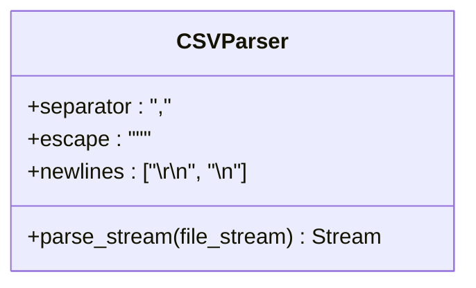

# CSV格式规范

<cite>
**本文档引用的文件**   
- [csv.ex](file://lib/teslamate/import/csv.ex)
- [line_parser.ex](file://lib/teslamate/import/line_parser.ex)
- [import.ex](file://lib/teslamate/import.ex)
- [teslafi.md](file://website/docs/import/teslafi.md)
- [TeslaFi62016.csv](file://test/fixtures/import/01_complete/TeslaFi62016.csv)
- [TeslaFi72016.csv](file://test/fixtures/import/01_complete/TeslaFi72016.csv)
- [import_test.exs](file://test/teslamate/import_test.exs)
</cite>

## 目录
1. [文件命名规则与车辆识别](#文件命名规则与车辆识别)
2. [CSV解析器配置与分隔符检测](#csv解析器配置与分隔符检测)
3. [数据模型与字段映射](#数据模型与字段映射)
4. [时间戳与UTC时区处理](#时间戳与utc时区处理)
5. [数据完整性校验规则](#数据完整性校验规则)
6. [实际CSV样本与解析逻辑](#实际csv样本与解析逻辑)

## 文件命名规则与车辆识别

TeslaMate支持的CSV文件命名遵循特定模式，用于识别数据所属的车辆和时间范围。系统通过文件名解析年份和月份，以确定数据的导入顺序。文件名支持两种格式：`MMYYYY.csv` 和 `TeslaFiMMYYYY.csv`，其中 `MM` 代表月份（1-12），`YYYY` 代表年份。

文件名解析逻辑在 `import.ex` 文件中实现，通过正则表达式匹配文件名。如果文件名符合 `<<m::binary-size(2), y::binary-size(4), ".csv"::bitstring>>` 或 `<<"TeslaFi"::bitstring, m::binary-size(2), y::binary-size(4), ".csv"::bitstring>>` 模式，则提取月份和年份。对于单数字月份，系统也支持 `<<"TeslaFi"::bitstring, m::binary-size(1), y::binary-size(4), ".csv"::bitstring>>` 格式。

当CSV文件中缺少车辆ID时，系统会使用环境变量 `TESLAFI_IMPORT_VEHICLE_ID` 的值作为默认ID。如果该环境变量未设置，则默认使用ID `1`。

**Section sources**
- [import.ex](file://lib/teslamate/import.ex#L193-L206)

## CSV解析器配置与分隔符检测

CSV解析功能由 `NimbleCSV` 库提供，其配置在 `csv.ex` 文件中定义。解析器被配置为使用逗号 `,` 作为分隔符，双引号 `"` 作为转义字符，并支持 `\r\n` 和 `\n` 两种换行符。



**Diagram sources**
- [csv.ex](file://lib/teslamate/import/csv.ex#L2)

**Section sources**
- [csv.ex](file://lib/teslamate/import/csv.ex#L2)

## 数据模型与字段映射

CSV文件包含丰富的车辆状态数据，这些数据被映射到内部数据结构中。关键字段包括：

- **SOC（充电状态）**: 对应 `battery_level` 字段，表示电池的充电百分比。
- **里程**: 对应 `odometer` 字段，记录车辆的总行驶里程。
- **位置坐标**: 对应 `latitude` 和 `longitude` 字段，记录车辆的经纬度。
- **充电事件标记**: 对应 `charging_state` 字段，标识车辆是否正在充电。

在 `line_parser.ex` 文件中，`parse/2` 函数负责将CSV行数据转换为内部结构体。它使用 `Enum.reduce/3` 函数遍历CSV行的键值对，并根据键名将值映射到相应的嵌套结构中，如 `charge_state`、`climate_state`、`drive_state` 等。

**Section sources**
- [line_parser.ex](file://lib/teslamate/import/line_parser.ex#L18-L134)

## 时间戳与UTC时区处理

CSV文件中的时间戳字段 `Date` 采用本地时间格式。系统在解析时会将其转换为UTC时间。`line_parser.ex` 文件中的 `into_vehicle/3` 函数负责处理时间戳转换。

该函数尝试解析三种时间格式：`{YYYY}-{M}-{D} {h24}:{m}:{s}`、`{M}/{D}/{YYYY} {h12}:{m}:{s} {AM}` 和 `{M}/{D}/{YYYY} {h24}:{m}`。解析成功后，使用 `DateTime.from_naive/2` 函数将本地时间转换为UTC时间，并将结果以毫秒为单位的Unix时间戳存储在 `timestamp` 字段中。

**Section sources**
- [line_parser.ex](file://lib/teslamate/import/line_parser.ex#L82-L107)

## 数据完整性校验规则

系统在导入CSV数据时实施了严格的数据完整性校验。`csv.ex` 文件中的 `parse/1` 函数首先检查文件内容，如果文件为空或无法解析，则返回相应的错误。

在 `import.ex` 文件中，`create_event_streams/2` 函数负责创建事件流。它会对解析后的数据进行过滤，移除无效或不完整的数据行。例如，如果某行数据的 `drive_state` 时间戳为 `nil`，或者数据属于多个不同的车辆，则该行数据将被过滤掉。

此外，系统还会检查数据的时间序列顺序。如果存在时间重叠的情况（即已有的TeslaMate数据与即将导入的TeslaFi数据有时间上的重叠），系统将只导入早于最早TeslaMate数据的时间段。

**Section sources**
- [csv.ex](file://lib/teslamate/import/csv.ex#L4-L28)
- [import.ex](file://lib/teslamate/import.ex#L222-L267)

## 实际CSV样本与解析逻辑

以下是一个实际的CSV样本数据行：

```
data_id,Date,calendar_enabled,remote_start_enabled,vehicle_id,display_name,color,backseat_token,notifications_enabled,vin,backseat_token_updated_at,id,tokens,id_s,state,user_charge_enable_request,time_to_full_charge,charge_current_request,charge_enable_request,charge_to_max_range,charger_phases,battery_heater_on,managed_charging_start_time,battery_range,charger_power,charge_limit_soc,charger_pilot_current,charge_port_latch,battery_current,charger_actual_current,scheduled_charging_pending,fast_charger_type,usable_battery_level,motorized_charge_port,charge_limit_soc_std,not_enough_power_to_heat,battery_level,charge_energy_added,charge_port_door_open,max_range_charge_counter,charge_limit_soc_max,ideal_battery_range,managed_charging_active,charging_state,fast_charger_present,trip_charging,managed_charging_user_canceled,scheduled_charging_start_time,est_battery_range,charge_rate,charger_voltage,charge_current_request_max,eu_vehicle,charge_miles_added_ideal,charge_limit_soc_min,charge_miles_added_rated,inside_temp,longitude,heading,gps_as_of,latitude,speed,shift_state,seat_heater_rear_right,seat_heater_rear_left_back,seat_heater_left,passenger_temp_setting,is_auto_conditioning_on,driver_temp_setting,outside_temp,seat_heater_rear_center,is_rear_defroster_on,seat_heater_rear_right_back,smart_preconditioning,seat_heater_right,fan_status,is_front_defroster_on,seat_heater_rear_left,gui_charge_rate_units,gui_24_hour_time,gui_temperature_units,gui_range_display,gui_distance_units,sun_roof_installed,rhd,remote_start_supported,homelink_nearby,parsed_calendar_supported,spoiler_type,ft,odometer,remote_start,pr,has_spoiler,roof_color,perf_config,valet_mode,calendar_supported,pf,sun_roof_percent_open,third_row_seats,seat_type,api_version,rear_seat_heaters,rt,exterior_color,df,autopark_state,sun_roof_state,notifications_supported,vehicle_name,dr,autopark_style,car_type,wheel_type,locked,center_display_state,last_autopark_error,car_version,dark_rims,autopark_state_v2,inside_tempF,driver_temp_settingF,outside_tempF,odometerF,idleNumber,sleepNumber,driveNumber,chargeNumber,polling,idleTime,running,rerunning,maxRange,left_temp_direction,max_avail_temp,is_climate_on,right_temp_direction,min_avail_temp,rear_seat_type,power,steering_wheel_heater,wiper_blade_heater,side_mirror_heaters,elevation
1,"2016-06-26 07:58:31",True,True,1111111111,82420,None,None,True,1YYSA1YYYFF08YYYY,None,999999999999999,,999999999999999,online,None,0.0,32,False,False,None,False,None,154.38,0,60,40,Engaged,-0.4,0,False,<invalid>,60,True,90,False,60,17.9,True,0,100,194.65,False,Complete,False,False,False,1467014400,136.39,0.0,0,40,False,78.0,50,61.5,24.0,0.0,90,1466953114,0.0,None,None,0,0,0,20.3,False,20.3,20.0,0,False,0,False,0,0,3,0,kW,False,F,Rated,mi/hr,1,False,True,True,True,None,0,13927.07505,False,0,False,None,P1,False,True,0,0,None,1,3,0,0,Black,0,disabled,unknown,True,82420,0,standard,s,Base19,True,0,no_error,2.20.30,False,disabled,75,68,68.0,13927,1,0,0,0,,0,0,0,,,,,,,,,,,,
```

`line_parser.ex` 文件中的 `parse/2` 函数会将此行数据转换为一个嵌套的Elixir映射（map）。例如，`battery_level` 的值 `60` 会被映射到 `charge_state` 结构体中，而 `latitude` 和 `longitude` 的值会被映射到 `drive_state` 结构体中。布尔值（如 `True` 或 `False`）会被正确转换为Elixir的 `true` 或 `false`。

**Section sources**
- [TeslaFi62016.csv](file://test/fixtures/import/01_complete/TeslaFi62016.csv)
- [line_parser.ex](file://lib/teslamate/import/line_parser.ex#L18-L134)