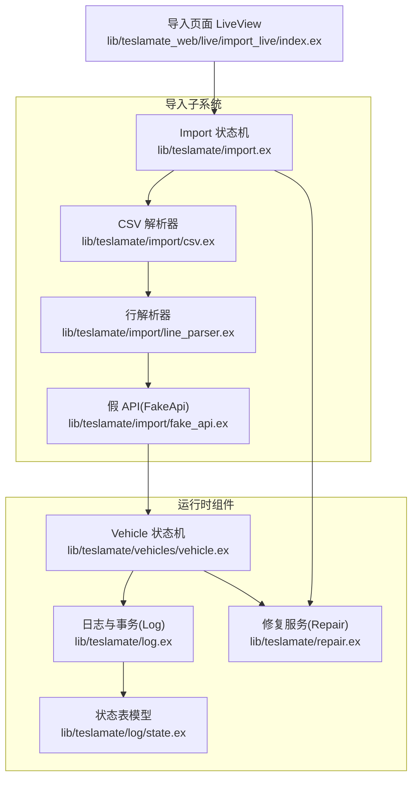
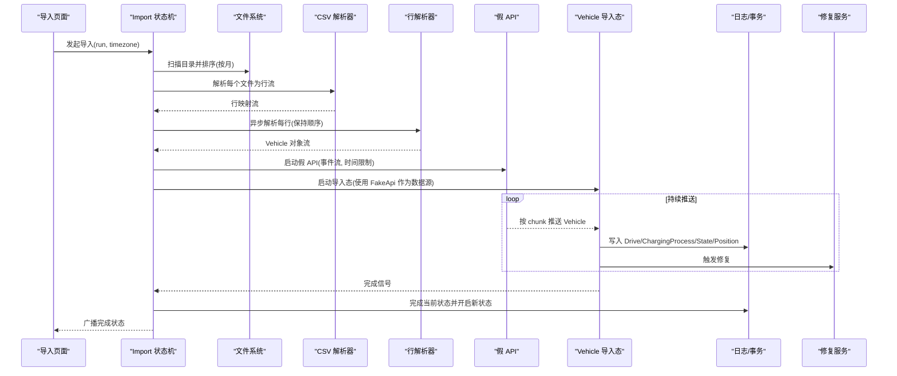
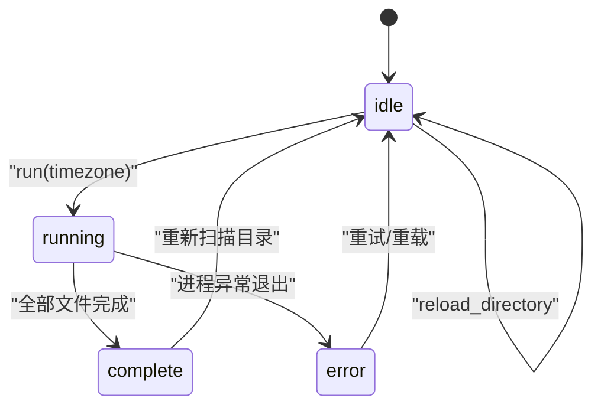
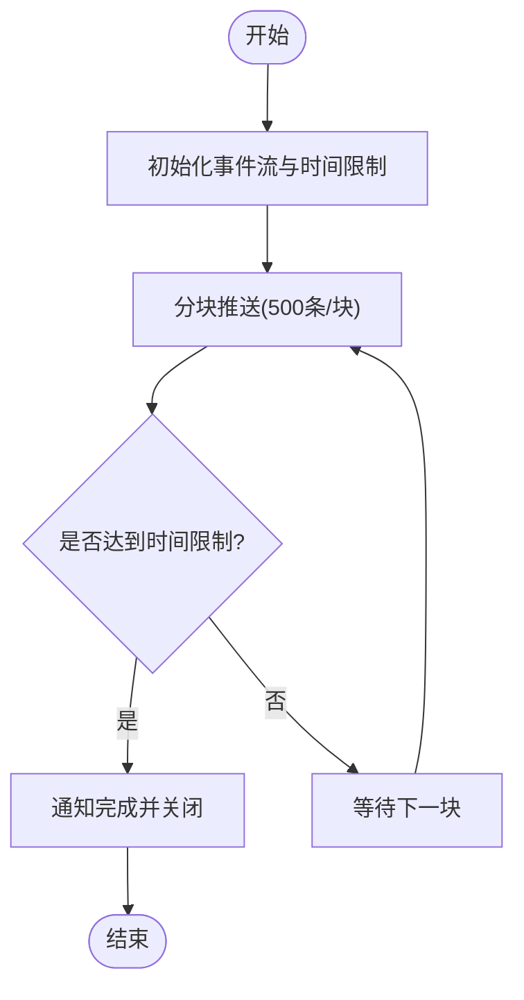
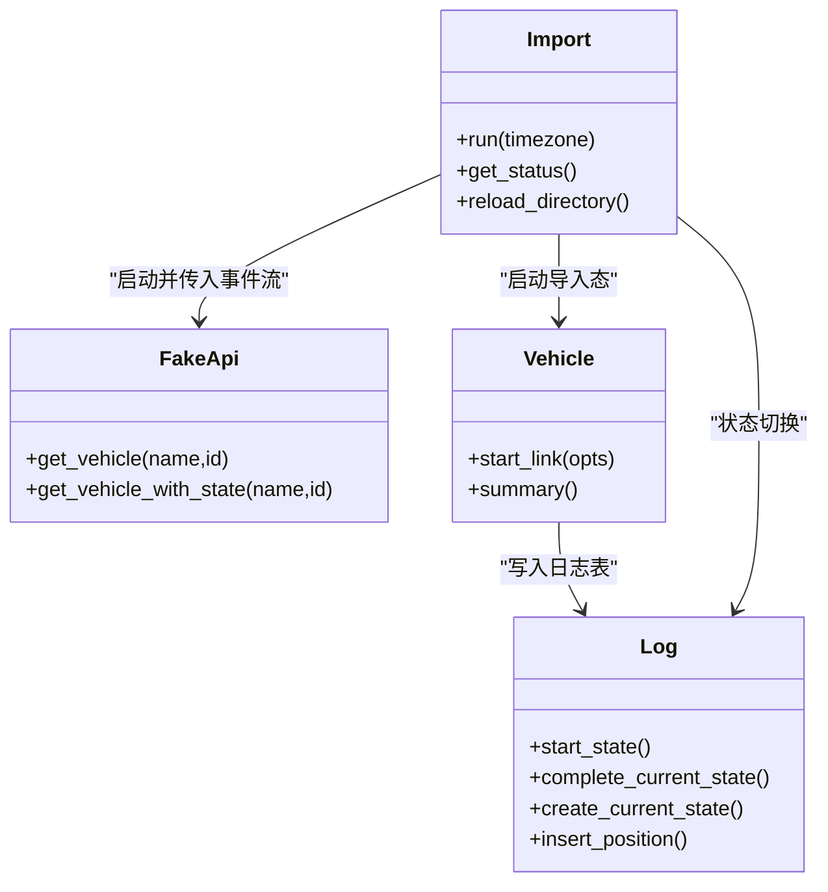
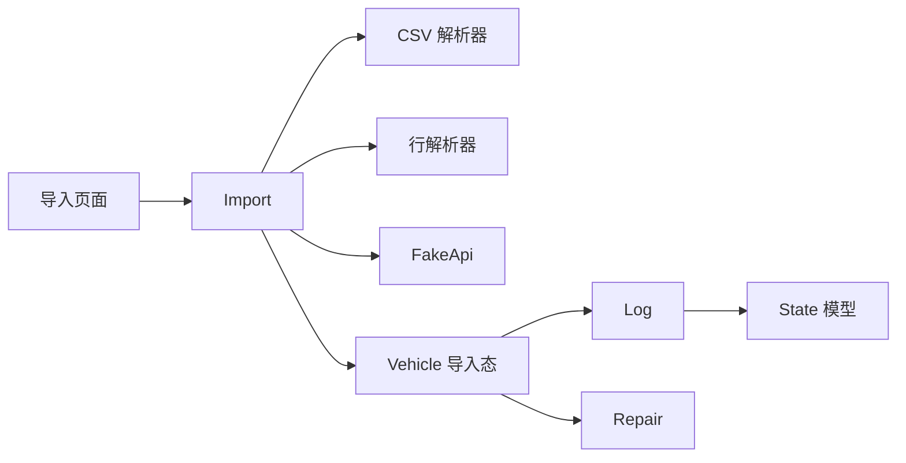

# 导入流程机制

<cite>
**本文引用的文件**
- [lib/teslamate/import.ex](file://lib/teslamate/import.ex)
- [lib/teslamate/import/csv.ex](file://lib/teslamate/import/csv.ex)
- [lib/teslamate/import/fake_api.ex](file://lib/teslamate/import/fake_api.ex)
- [lib/teslamate/import/line_parser.ex](file://lib/teslamate/import/line_parser.ex)
- [lib/teslamate/vehicles/vehicle.ex](file://lib/teslamate/vehicles/vehicle.ex)
- [lib/teslamate/log.ex](file://lib/teslamate/log.ex)
- [lib/teslamate/log/state.ex](file://lib/teslamate/log/state.ex)
- [lib/teslamate/repair.ex](file://lib/teslamate/repair.ex)
- [lib/teslamate_web/live/import_live/index.ex](file://lib/teslamate_web/live/import_live/index.ex)
- [test/teslamate/import_test.exs](file://test/teslamate/import_test.exs)
- [config/config.exs](file://config/config.exs)
</cite>

## 目录
1. [简介](#简介)
2. [项目结构](#项目结构)
3. [核心组件](#核心组件)
4. [架构总览](#架构总览)
5. [详细组件分析](#详细组件分析)
6. [依赖关系分析](#依赖关系分析)
7. [性能考量](#性能考量)
8. [故障排查指南](#故障排查指南)
9. [结论](#结论)
10. [附录](#附录)

## 简介
本文件系统化梳理 TeslaMate 的导入流程机制，重点围绕 Import 模块的状态机实现，解释 idle、running、complete 和 error 四个状态之间的转换条件与触发事件；说明 FakeApi 如何模拟 Tesla API 数据流以重建历史车辆状态；阐述导入器与 Vehicle 实体协同工作，将解析后的 CSV 记录注入到正常数据处理管道并保持与实时采集一致；覆盖批量插入优化、事务管理与内存控制策略；并通过流程图展示从文件读取到数据持久化的完整生命周期，并结合测试用例路径说明错误恢复与中断续传的实现方式。

## 项目结构
导入相关的核心代码位于以下模块：
- 导入状态机：lib/teslamate/import.ex
- CSV 解析：lib/teslamate/import/csv.ex
- 行解析器：lib/teslamate/import/line_parser.ex
- 假 API（FakeApi）：lib/teslamate/import/fake_api.ex
- 车辆状态机：lib/teslamate/vehicles/vehicle.ex
- 日志与事务：lib/teslamate/log.ex、lib/teslamate/log/state.ex
- 修复服务：lib/teslamate/repair.ex
- 导入界面：lib/teslamate_web/live/import_live/index.ex
- 配置：config/config.exs
- 测试：test/teslamate/import_test.exs

图表来源
- [lib/teslamate/import.ex](file://lib/teslamate/import.ex#L1-L302)
- [lib/teslamate/import/csv.ex](file://lib/teslamate/import/csv.ex#L1-L31)
- [lib/teslamate/import/line_parser.ex](file://lib/teslamate/import/line_parser.ex#L1-L135)
- [lib/teslamate/import/fake_api.ex](file://lib/teslamate/import/fake_api.ex#L1-L179)
- [lib/teslamate/vehicles/vehicle.ex](file://lib/teslamate/vehicles/vehicle.ex#L1-L800)
- [lib/teslamate/log.ex](file://lib/teslamate/log.ex#L1-L712)
- [lib/teslamate/log/state.ex](file://lib/teslamate/log/state.ex#L1-L32)
- [lib/teslamate/repair.ex](file://lib/teslamate/repair.ex#L1-L153)
- [lib/teslamate_web/live/import_live/index.ex](file://lib/teslamate_web/live/import_live/index.ex#L1-L81)

章节来源
- [lib/teslamate/import.ex](file://lib/teslamate/import.ex#L1-L302)
- [lib/teslamate/import/csv.ex](file://lib/teslamate/import/csv.ex#L1-L31)
- [lib/teslamate/import/line_parser.ex](file://lib/teslamate/import/line_parser.ex#L1-L135)
- [lib/teslamate/import/fake_api.ex](file://lib/teslamate/import/fake_api.ex#L1-L179)
- [lib/teslamate/vehicles/vehicle.ex](file://lib/teslamate/vehicles/vehicle.ex#L1-L800)
- [lib/teslamate/log.ex](file://lib/teslamate/log.ex#L1-L712)
- [lib/teslamate/log/state.ex](file://lib/teslamate/log/state.ex#L1-L32)
- [lib/teslamate/repair.ex](file://lib/teslamate/repair.ex#L1-L153)
- [lib/teslamate_web/live/import_live/index.ex](file://lib/teslamate_web/live/import_live/index.ex#L1-L81)
- [config/config.exs](file://config/config.exs#L1-L30)

## 核心组件
- Import 状态机：负责扫描导入目录、按月文件排序、解析 CSV、过滤无效记录、创建车辆与状态、启动 FakeApi 与 Vehicle 导入进程、广播进度、处理完成与错误。
- CSV 解析器：基于 NimbleCSV 定义分隔符，支持首行检测与内容空检查，返回标准化行映射流。
- 行解析器：将单行映射转换为 TeslaApi.Vehicle 结构，统一时间戳、布尔值、数值等字段类型，兼容多种日期格式与时区。
- 假 API（FakeApi）：模拟 Tesla API 的 get_vehicle/get_vehicle_with_state 接口，按 chunk 分批推送解析后的车辆状态，支持按时间限制停止推送，避免覆盖现有状态。
- Vehicle 导入态：以 import? 启动，使用 FakeApi 作为数据源，写入日志表（Drive、ChargingProcess、State、Position 等），并触发 Repair 服务进行后续修复。
- 日志与事务：封装状态切换、位置插入、充电过程统计、更新记录等，保证一致性与约束。
- 修复服务：周期性修复缺失地址/范围等数据，降低导入后数据不一致风险。
- 导入页面：LiveView 订阅状态变更，允许用户选择时区并发起导入。

章节来源
- [lib/teslamate/import.ex](file://lib/teslamate/import.ex#L1-L302)
- [lib/teslamate/import/csv.ex](file://lib/teslamate/import/csv.ex#L1-L31)
- [lib/teslamate/import/line_parser.ex](file://lib/teslamate/import/line_parser.ex#L1-L135)
- [lib/teslamate/import/fake_api.ex](file://lib/teslamate/import/fake_api.ex#L1-L179)
- [lib/teslamate/vehicles/vehicle.ex](file://lib/teslamate/vehicles/vehicle.ex#L1-L800)
- [lib/teslamate/log.ex](file://lib/teslamate/log.ex#L1-L712)
- [lib/teslamate/repair.ex](file://lib/teslamate/repair.ex#L1-L153)
- [lib/teslamate_web/live/import_live/index.ex](file://lib/teslamate_web/live/import_live/index.ex#L1-L81)

## 架构总览
导入流程采用“状态机驱动 + 流式解析 + 假 API 模拟 + Vehicle 导入态”的组合模式，确保历史数据可被无缝注入到与实时采集一致的数据处理管道中。

图表来源
- [lib/teslamate/import.ex](file://lib/teslamate/import.ex#L60-L181)
- [lib/teslamate/import/csv.ex](file://lib/teslamate/import/csv.ex#L1-L31)
- [lib/teslamate/import/line_parser.ex](file://lib/teslamate/import/line_parser.ex#L1-L135)
- [lib/teslamate/import/fake_api.ex](file://lib/teslamate/import/fake_api.ex#L1-L179)
- [lib/teslamate/vehicles/vehicle.ex](file://lib/teslamate/vehicles/vehicle.ex#L1-L800)
- [lib/teslamate/log.ex](file://lib/teslamate/log.ex#L1-L712)
- [lib/teslamate/repair.ex](file://lib/teslamate/repair.ex#L1-L153)

## 详细组件分析

### Import 状态机：状态与事件流转
- 状态定义
  - idle：初始状态，扫描目录并列出待处理文件，标记已完成的月份。
  - running：开始导入，创建车辆与状态，启动 FakeApi 与 Vehicle 导入进程，持续接收完成事件并广播进度。
  - complete：所有文件导入完成，清理导入态进程，结束当前状态并开启新状态。
  - error：导入过程中发生异常，记录错误原因并广播错误状态。
- 关键事件
  - 外部调用：run(timezone)、running?、enabled?、valid_file_name?、get_status、reload_directory、subscribe。
  - 内部事件：read_directory、import、broadcast。
  - info 事件：:done（单个 chunk 完成）、:done（全部完成）、进程退出（:normal/:killed/:failed）。
- 转换条件
  - idle -> running：收到 run(timezone) 且当前状态为 idle。
  - running -> complete：收到 :done 且所有文件都完成。
  - running -> error：收到进程退出且非正常退出。
  - 其他状态 -> idle：目录重载或初始化。
- 进度与广播
  - 每当收到 :done 或完成一个文件，会将已完成集合更新并广播状态，包含每个文件的完成标志。
- 文件筛选与校验
  - 仅接受符合命名规则的 CSV 文件（如 TeslaFiMMYYYY.csv 或 MMYYYY.csv），并按年月排序。
  - 解析失败或无内容时返回错误状态。
- 与 Vehicle/FakeApi 协作
  - 创建车辆信息（若缺失 VIN/VID/EID 则尝试从数据中推断），设置导入态参数（禁用流式 API、暂停策略等）。
  - 启动 FakeApi，传入事件流与时间限制（最早状态的起始时间），避免覆盖已有状态。
  - 启动 Vehicle 导入态，使用 FakeApi 作为数据源，进入导入循环。
- 错误处理
  - 捕获文件系统错误、解析异常、车辆数据不完整等情况，转为 error 状态并广播。

图表来源
- [lib/teslamate/import.ex](file://lib/teslamate/import.ex#L60-L181)

章节来源
- [lib/teslamate/import.ex](file://lib/teslamate/import.ex#L1-L302)

### CSV 解析器：分隔符与首行检测
- 使用 NimbleCSV 定义分隔符为逗号，转义字符为双引号，支持多换行符。
- 首次解析仅读取两行，用于检测分隔符是否不受支持或文件为空。
- 正式解析时将每行映射为键值对字典，忽略空行，返回行流供后续处理。

章节来源
- [lib/teslamate/import/csv.ex](file://lib/teslamate/import/csv.ex#L1-L31)

### 行解析器：统一字段类型与时区转换
- 默认填充 TeslaApi.Vehicle 的各子状态字段，便于后续统一处理。
- 字段值映射规则：
  - 空字符串/None 映射为 nil。
  - 布尔值字符串映射为 true/false。
  - 数值字符串优先解析为整数，否则解析为浮点数，否则保留原字符串。
  - 特殊字段如 display_name、vehicle_name、state（waking/shutdown 映射为 online）等做兼容处理。
- 时间戳处理：
  - 支持多种日期格式解析，转换为指定时区的毫秒时间戳，遇到时区歧义或转换失败则记录警告并忽略该条目。
- 输出：将映射后的字段组装为 TeslaApi.Vehicle 结构，供 Vehicle 导入态消费。

章节来源
- [lib/teslamate/import/line_parser.ex](file://lib/teslamate/import/line_parser.ex#L1-L135)

### 假 API（FakeApi）：事件流与时间限制
- 角色：模拟 Tesla API 的 get_vehicle/get_vehicle_with_state，按 chunk 推送解析后的 Vehicle 对象。
- 关键能力：
  - 事件流切分为固定大小的 chunk（默认 500），维护已到达的最大索引，按序推送。
  - 当目标 Vehicle 的 drive_state.timestamp 达到或超过 date_limit（最早状态的起始时间）时，停止推送并通知完成。
  - 支持处理空 chunk、vehicle_changed（文件包含多个车辆）等边界情况。
- 进程间通信：
  - 通过 GenServer 接收调用，内部维护事件队列与 chunk 缓存，按需拉取下一批事件。
  - 完成时向父进程发送 :done 与最终完成信号，以便 Import 状态机继续推进。

图表来源
- [lib/teslamate/import/fake_api.ex](file://lib/teslamate/import/fake_api.ex#L1-L179)

章节来源
- [lib/teslamate/import/fake_api.ex](file://lib/teslamate/import/fake_api.ex#L1-L179)

### Vehicle 导入态：与日志管道的协同
- 启动参数：
  - import? = true，禁用流式 API，设置暂停策略（如 suspend_min、suspend_after_idle_min），确保导入期间稳定写入。
  - deps_api 指向 FakeApi，使 Vehicle 以导入态消费事件流。
- 写入逻辑：
  - 将解析后的 Vehicle 状态写入 Drive、ChargingProcess、State、Position 等表，触发 Repair 服务进行后续修复。
  - 在导入开始前完成当前状态的结束与新状态的开启，保证时间线连续。
- 与日志事务：
  - 使用 Repo.transaction 包裹关键写入，确保一致性与约束（如状态唯一性、时间先后等）。
  - 通过 Log.start_state/completing/create_current_state 等方法维护状态表的 start_date/end_date 连续性。

图表来源
- [lib/teslamate/import.ex](file://lib/teslamate/import.ex#L120-L181)
- [lib/teslamate/import/fake_api.ex](file://lib/teslamate/import/fake_api.ex#L1-L179)
- [lib/teslamate/vehicles/vehicle.ex](file://lib/teslamate/vehicles/vehicle.ex#L1-L800)
- [lib/teslamate/log.ex](file://lib/teslamate/log.ex#L1-L712)

章节来源
- [lib/teslamate/vehicles/vehicle.ex](file://lib/teslamate/vehicles/vehicle.ex#L1-L800)
- [lib/teslamate/log.ex](file://lib/teslamate/log.ex#L1-L712)

### 导入页面：订阅与交互
- LiveView 订阅 Import 状态主题，接收状态变更并更新 UI。
- 用户可选择时区并发起导入，页面即时反映导入进度与完成状态。

章节来源
- [lib/teslamate_web/live/import_live/index.ex](file://lib/teslamate_web/live/import_live/index.ex#L1-L81)

## 依赖关系分析
- Import 依赖：
  - 文件系统：读取 CSV 文件列表并逐个解析。
  - CSV/行解析器：将原始 CSV 行转换为统一的 Vehicle 结构。
  - FakeApi：提供稳定的事件流接口，避免直接依赖真实 Tesla API。
  - Vehicle：导入态消费事件流并写入日志。
  - Log/Repair：事务与修复，保证数据完整性与一致性。
- Vehicle 依赖：
  - Log：写入 Drive/ChargingProcess/State/Position。
  - Settings/Locations：地理围栏、地址解析等。
  - PubSub：广播摘要与抓取状态。
- 配置：
  - Logger、Phoenix PubSub、Ecto Repo 等基础设施支撑导入与日志写入。

图表来源
- [lib/teslamate/import.ex](file://lib/teslamate/import.ex#L1-L302)
- [lib/teslamate/import/csv.ex](file://lib/teslamate/import/csv.ex#L1-L31)
- [lib/teslamate/import/line_parser.ex](file://lib/teslamate/import/line_parser.ex#L1-L135)
- [lib/teslamate/import/fake_api.ex](file://lib/teslamate/import/fake_api.ex#L1-L179)
- [lib/teslamate/vehicles/vehicle.ex](file://lib/teslamate/vehicles/vehicle.ex#L1-L800)
- [lib/teslamate/log.ex](file://lib/teslamate/log.ex#L1-L712)
- [lib/teslamate/repair.ex](file://lib/teslamate/repair.ex#L1-L153)
- [lib/teslamate_web/live/import_live/index.ex](file://lib/teslamate_web/live/import_live/index.ex#L1-L81)

章节来源
- [lib/teslamate/import.ex](file://lib/teslamate/import.ex#L1-L302)
- [lib/teslamate/vehicles/vehicle.ex](file://lib/teslamate/vehicles/vehicle.ex#L1-L800)
- [lib/teslamate/log.ex](file://lib/teslamate/log.ex#L1-L712)
- [lib/teslamate/repair.ex](file://lib/teslamate/repair.ex#L1-L153)
- [lib/teslamate_web/live/import_live/index.ex](file://lib/teslamate_web/live/import_live/index.ex#L1-L81)

## 性能考量
- 流式解析与异步处理
  - CSV 解析与行解析均采用流式与异步任务，保持顺序但提升吞吐量。
  - 事件流按 chunk 推送，避免一次性堆积大量事件。
- 内存控制
  - 事件队列与 chunk 缓存仅保存当前窗口，达到时间限制后停止推送，防止无限增长。
  - 行解析器对空值与无效值进行快速过滤，减少后续写入失败与回滚成本。
- 事务与批量写入
  - 关键写入使用 Repo.transaction 包裹，确保原子性与一致性。
  - 日志层对 Drive/ChargingProcess 等统计聚合采用窗口函数与一次查询完成，减少多次往返。
- 时区与 DST 处理
  - 行解析器对时区歧义与 DST 变更进行容错处理，避免因时区问题导致的重复或遗漏。
- 修复服务
  - Repair 服务定期修复缺失地址/范围等数据，降低导入后数据不一致风险，间接提升整体性能与稳定性。

章节来源
- [lib/teslamate/import/csv.ex](file://lib/teslamate/import/csv.ex#L1-L31)
- [lib/teslamate/import/line_parser.ex](file://lib/teslamate/import/line_parser.ex#L1-L135)
- [lib/teslamate/import/fake_api.ex](file://lib/teslamate/import/fake_api.ex#L1-L179)
- [lib/teslamate/log.ex](file://lib/teslamate/log.ex#L1-L712)
- [lib/teslamate/repair.ex](file://lib/teslamate/repair.ex#L1-L153)

## 故障排查指南
- 常见错误与定位
  - 文件分隔符不受支持：CSV 解析器会在首行检测到不支持的分隔符时返回错误状态。
  - 文件为空：解析返回 no_contents，导入状态机进入 error。
  - 车辆数据不完整：导入器要求至少存在 VIN/VID/EID 中的一个，否则抛出异常。
  - 多车混入：同一文件包含多个车辆时，导入器会检测并终止处理。
  - 数据库约束冲突：状态表 end_date 必须晚于 start_date，且当前状态必须先结束再开启，违反约束会触发回滚。
- 错误恢复与续传
  - Import 状态机在完成每个文件后会记录完成集合，再次运行时可跳过已完成月份，实现续传。
  - 导入完成后，Vehicle 导入态进程会被正常退出，随后 Import 会完成当前状态并开启新状态，确保与实时采集一致。
  - Repair 服务会周期性修复缺失数据，降低导入后数据不一致风险。
- 测试验证
  - 测试覆盖了多车混入、DST 变更、时区差异、错误场景等，可参考测试用例路径定位问题。

章节来源
- [lib/teslamate/import.ex](file://lib/teslamate/import.ex#L120-L181)
- [lib/teslamate/import/csv.ex](file://lib/teslamate/import/csv.ex#L1-L31)
- [lib/teslamate/log/state.ex](file://lib/teslamate/log/state.ex#L1-L32)
- [test/teslamate/import_test.exs](file://test/teslamate/import_test.exs#L1-L569)

## 结论
TeslaMate 的导入流程通过 Import 状态机、CSV/行解析器、FakeApi 与 Vehicle 导入态的协同，实现了从历史 CSV 到统一日志管道的平滑过渡。其关键优势包括：
- 状态机清晰的状态与事件流转，便于监控与调试；
- 流式解析与 chunk 推送，兼顾吞吐与内存控制；
- 事务与约束保障数据一致性；
- 续传与修复机制提升可用性与鲁棒性。

这些设计使得导入过程与实时采集保持一致，同时具备良好的扩展性与可维护性。

## 附录
- 代码示例路径（不展示具体代码）
  - 导入状态机初始化与事件处理：[lib/teslamate/import.ex](file://lib/teslamate/import.ex#L58-L181)
  - CSV 解析与首行检测：[lib/teslamate/import/csv.ex](file://lib/teslamate/import/csv.ex#L1-L31)
  - 行解析器字段映射与时区处理：[lib/teslamate/import/line_parser.ex](file://lib/teslamate/import/line_parser.ex#L1-L135)
  - 假 API 事件流与时间限制：[lib/teslamate/import/fake_api.ex](file://lib/teslamate/import/fake_api.ex#L1-L179)
  - Vehicle 导入态写入日志与事务：[lib/teslamate/vehicles/vehicle.ex](file://lib/teslamate/vehicles/vehicle.ex#L1-L800)
  - 日志与状态表约束：[lib/teslamate/log.ex](file://lib/teslamate/log.ex#L1-L712)、[lib/teslamate/log/state.ex](file://lib/teslamate/log/state.ex#L1-L32)
  - 导入页面订阅与交互：[lib/teslamate_web/live/import_live/index.ex](file://lib/teslamate_web/live/import_live/index.ex#L1-L81)
  - 错误恢复与续传测试用例：[test/teslamate/import_test.exs](file://test/teslamate/import_test.exs#L1-L569)