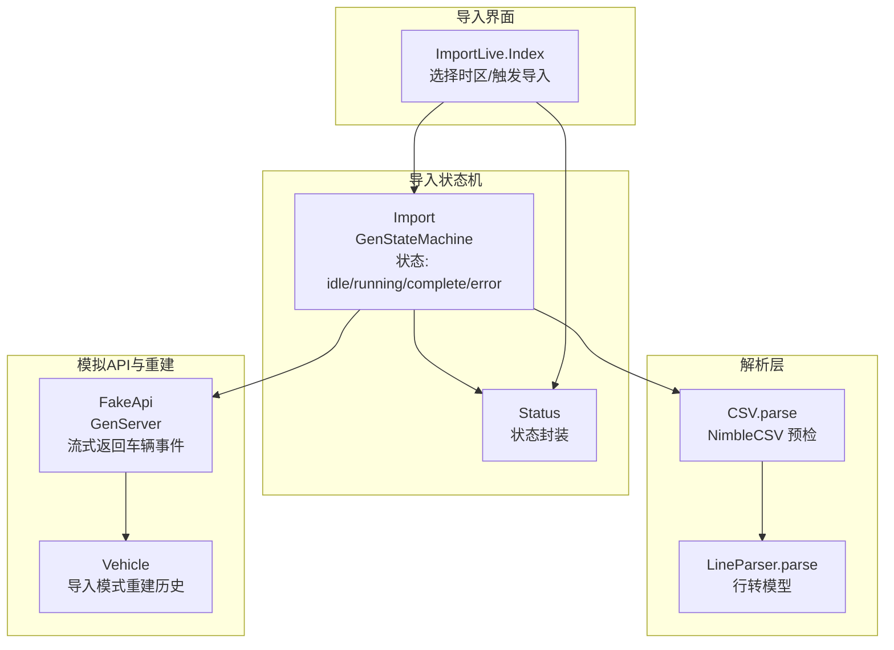
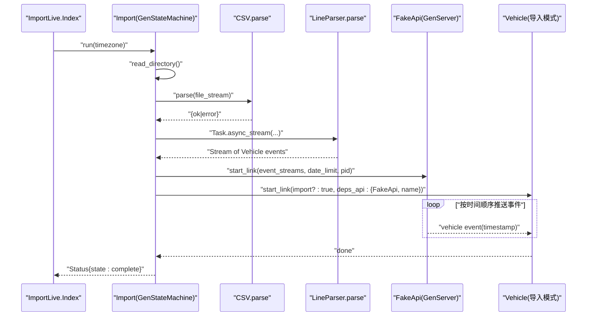
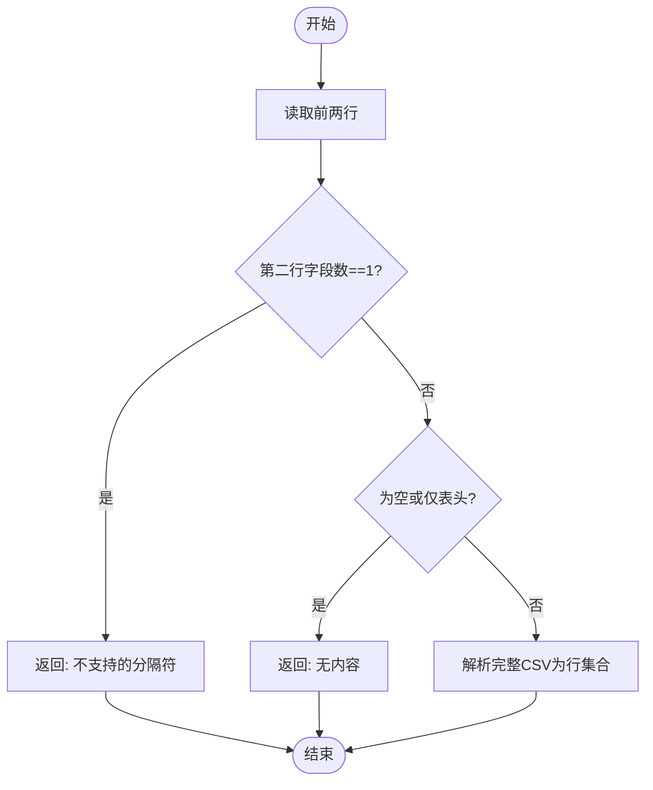
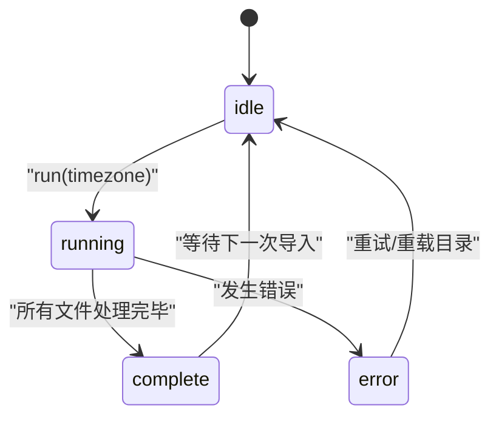
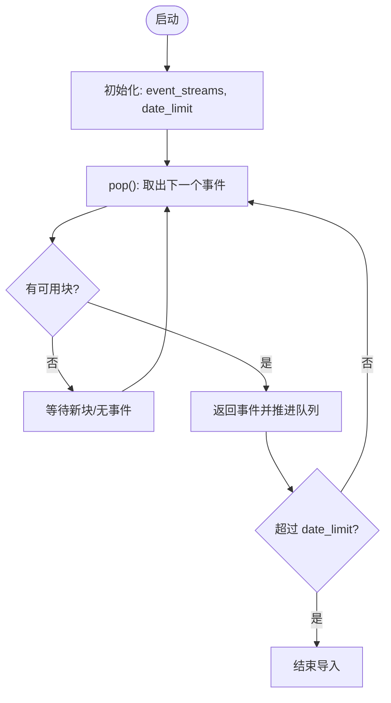
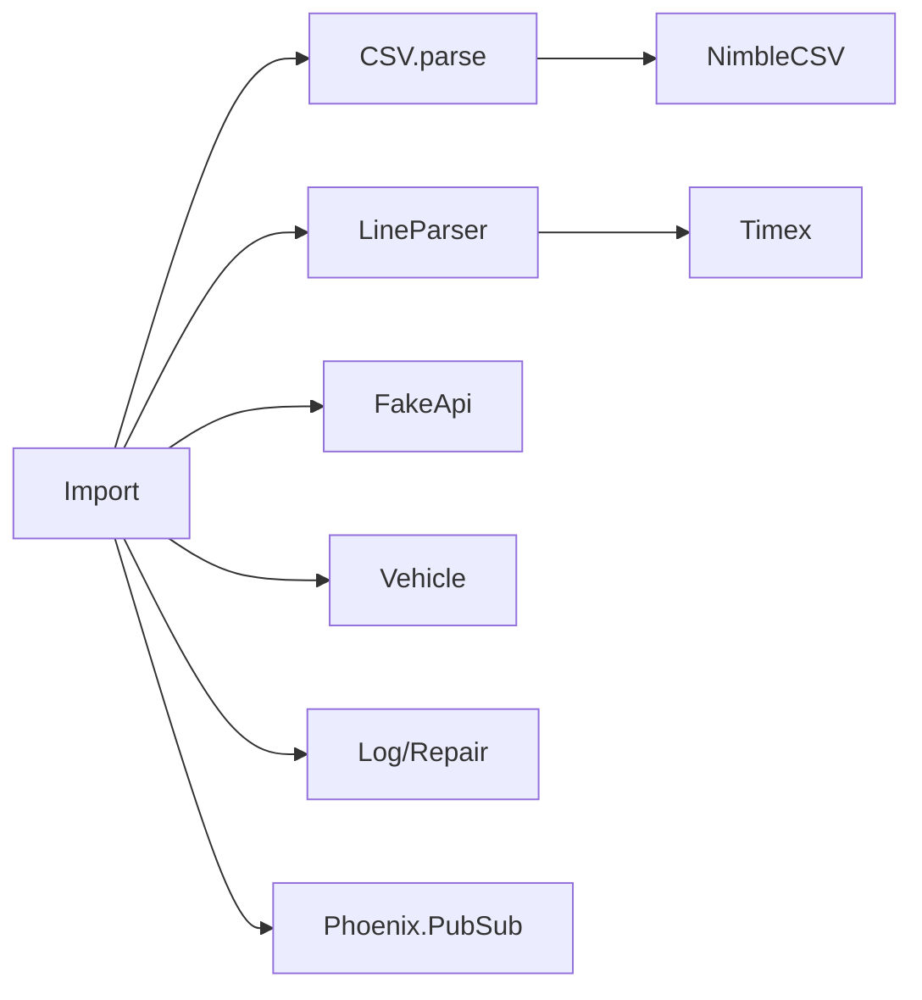

# 数据导入

<cite>
**本文引用的文件列表**
- [lib/teslamate/import.ex](file://lib/teslamate/import.ex)
- [lib/teslamate/import/csv.ex](file://lib/teslamate/import/csv.ex)
- [lib/teslamate/import/line_parser.ex](file://lib/teslamate/import/line_parser.ex)
- [lib/teslamate/import/fake_api.ex](file://lib/teslamate/import/fake_api.ex)
- [lib/teslamate_web/live/import_live/index.ex](file://lib/teslamate_web/live/import_live/index.ex)
- [test/teslamate/import_test.exs](file://test/teslamate/import_test.exs)
- [test/teslamate_web/live/import_test.exs](file://test/teslamate_web/live/import_test.exs)
- [website/docs/import/teslafi.md](file://website/docs/import/teslafi.md)
- [website/docs/import/tesla_apiscraper.md](file://website/docs/import/tesla_apiscraper.md)
- [config/config.exs](file://config/config.exs)
</cite>

## 目录
1. [简介](#简介)
2. [项目结构](#项目结构)
3. [核心组件](#核心组件)
4. [架构总览](#架构总览)
5. [详细组件分析](#详细组件分析)
6. [依赖关系分析](#依赖关系分析)
7. [性能考量](#性能考量)
8. [故障排查指南](#故障排查指南)
9. [结论](#结论)
10. [附录](#附录)

## 简介
本文件系统化阐述 TeslaMate 的数据导入能力，重点覆盖：
- CSV 文件命名规范与目录组织（如 MMYYYY.csv 或 TeslaFiMMYYYY.csv）
- 时区处理与数据完整性校验
- CSV 解析器（NimbleCSV）实现与分隔符验证逻辑
- 导入流程的状态机（GenStateMachine）工作原理（idle、running、complete、error）
- 从 TeslaFi 与其他第三方服务迁移数据的步骤与兼容性注意事项
- 错误处理策略（无效分隔符、空文件、多车辆数据冲突等）
- 通过 FakeApi 模块模拟 Tesla API 响应流，并与 Vehicle 模块协同完成数据重建

## 项目结构
导入子系统由以下关键模块组成：
- 导入状态机：负责扫描目录、调度解析与重建、状态广播
- CSV 解析器：基于 NimbleCSV 定义解析器并进行首行预检
- 行解析器：将 CSV 行映射为 Tesla API 车辆状态模型
- FakeApi：在导入期间模拟 Tesla API 流式响应，驱动 Vehicle 进程重建历史
- Live 视图：提供 Web 界面触发导入、选择时区、订阅状态变更
- 测试用例：覆盖多场景（时区、重叠、DST、空文件、多车冲突、错误）

图表来源
- [lib/teslamate/import.ex](file://lib/teslamate/import.ex#L1-L302)
- [lib/teslamate/import/csv.ex](file://lib/teslamate/import/csv.ex#L1-L31)
- [lib/teslamate/import/line_parser.ex](file://lib/teslamate/import/line_parser.ex#L1-L135)
- [lib/teslamate/import/fake_api.ex](file://lib/teslamate/import/fake_api.ex#L1-L179)
- [lib/teslamate_web/live/import_live/index.ex](file://lib/teslamate_web/live/import_live/index.ex#L1-L81)

章节来源
- [lib/teslamate/import.ex](file://lib/teslamate/import.ex#L1-L302)
- [lib/teslamate_web/live/import_live/index.ex](file://lib/teslamate_web/live/import_live/index.ex#L1-L81)

## 核心组件
- 导入状态机（Import）
  - 使用 GenStateMachine 维护导入生命周期，支持状态查询、运行控制、目录重载与状态广播
  - 提供文件名解析（支持 TeslaFi 前缀与单/双位月份）
  - 构建事件流、创建车辆记录、启动 FakeApi 与 Vehicle 进程，完成后清理并触发修复任务
- CSV 解析器（CSV）
  - 基于 NimbleCSV 定义解析器，仅使用逗号分隔与双引号转义
  - 首两行预检以识别不支持的分隔符或空内容
- 行解析器（LineParser）
  - 将 CSV 字段映射到 Tesla API 车辆状态结构，统一时间戳格式与时区转换
  - 处理布尔值、整数/浮点、空字符串与 None 等边界情况
- FakeApi（FakeApi）
  - GenServer 实现，按时间顺序流式返回车辆事件，支持分块缓存与进度推进
  - 在达到数据库已有最早时间点后自动结束
- Live 视图（ImportLive.Index）
  - 提供时区选择、导入触发、目录重载与状态订阅
  - 与 Import 状态机通过 Phoenix PubSub 广播通信

章节来源
- [lib/teslamate/import.ex](file://lib/teslamate/import.ex#L1-L302)
- [lib/teslamate/import/csv.ex](file://lib/teslamate/import/csv.ex#L1-L31)
- [lib/teslamate/import/line_parser.ex](file://lib/teslamate/import/line_parser.ex#L1-L135)
- [lib/teslamate/import/fake_api.ex](file://lib/teslamate/import/fake_api.ex#L1-L179)
- [lib/teslamate_web/live/import_live/index.ex](file://lib/teslamate_web/live/import_live/index.ex#L1-L81)

## 架构总览
导入流程从 Web 界面触发，状态机读取导入目录中的 CSV 文件，逐月构建事件流，解析为车辆事件，FakeApi 以时间顺序提供给 Vehicle 进程重建历史。导入完成后，状态机广播完成状态并触发修复任务。

图表来源
- [lib/teslamate/import.ex](file://lib/teslamate/import.ex#L120-L181)
- [lib/teslamate/import/csv.ex](file://lib/teslamate/import/csv.ex#L1-L31)
- [lib/teslamate/import/line_parser.ex](file://lib/teslamate/import/line_parser.ex#L1-L135)
- [lib/teslamate/import/fake_api.ex](file://lib/teslamate/import/fake_api.ex#L1-L179)
- [lib/teslamate_web/live/import_live/index.ex](file://lib/teslamate_web/live/import_live/index.ex#L1-L81)

## 详细组件分析

### CSV 解析器与分隔符验证
- 解析器定义
  - 使用 NimbleCSV 定义解析器，限定分隔符为逗号、转义字符为双引号、换行符为 \r\n 或 \n
- 首两行预检
  - 读取前两行，若第二行只有一个字段则判定为“不支持的分隔符”
  - 若无内容或仅有表头，则返回“无内容”错误
  - 否则继续解析完整 CSV，将每行映射为字段字典
- 分隔符验证逻辑
  - 通过比较首两行字段数量快速判断分隔符是否符合预期
  - 对于非逗号分隔符（如分号、制表符），直接返回错误，避免后续解析失败

图表来源
- [lib/teslamate/import/csv.ex](file://lib/teslamate/import/csv.ex#L1-L31)

章节来源
- [lib/teslamate/import/csv.ex](file://lib/teslamate/import/csv.ex#L1-L31)

### 行解析器（LineParser）
- 字段映射
  - 将 CSV 字段映射到 Tesla API 的 Charge、Climate、Drive、VehicleConfig、VehicleState 等子结构
  - 对布尔值、整数、浮点、空字符串与 None 进行统一转换
- 时间戳与时区
  - 支持多种日期格式解析，统一转换为毫秒级时间戳
  - 使用传入时区对本地时间进行转换，遇到“重复时间”或“时间缺口”时忽略该条目
- 特殊键处理
  - display_name、vehicle_name、state（waking/shutdown 映射为 online）
  - scheduled_charging_start_time 等字段置空
- 输出
  - 返回完整的 TeslaApi.Vehicle 结构，供后续事件过滤与重建

章节来源
- [lib/teslamate/import/line_parser.ex](file://lib/teslamate/import/line_parser.ex#L1-L135)

### 导入状态机（Import）
- 状态与事件
  - 状态：idle、running、complete、error
  - 内部事件：read_directory、import、broadcast、done
  - 外部调用：run、running?、get_status、reload_directory、subscribe
- 文件名解析
  - 支持两种命名：MMYYYY.csv 与 TeslaFiMMYYYY.csv（单/双位月份）
  - 解析失败的文件会被忽略
- 事件流构建
  - 逐月打开文件流，调用 CSV.parse，再用 Task.async_stream 并行解析为车辆事件
  - 过滤掉未知状态、缺少时间戳或位置信息的事件
  - 若检测到多辆车数据冲突，抛出异常并终止当前导入
- 车辆创建与设置
  - 从事件流中提取 VIN、vehicle_id、id 等关键字段，创建或更新车辆记录
  - 设置导入专用的 CarSettings（禁用流式 API、暂停策略等）
- FakeApi 与 Vehicle 协作
  - 计算数据库中最早状态的时间点作为 date_limit
  - 启动 FakeApi 与 Vehicle 进程，导入完成后清理并触发修复任务
- 错误处理
  - 文件系统错误、解析异常、多车冲突、数据库写入错误等均会进入 error 状态并广播

图表来源
- [lib/teslamate/import.ex](file://lib/teslamate/import.ex#L67-L189)

章节来源
- [lib/teslamate/import.ex](file://lib/teslamate/import.ex#L1-L302)

### FakeApi（模拟 Tesla API）
- 作用
  - 在导入期间以时间顺序返回车辆事件，驱动 Vehicle 进程重建历史
- 关键行为
  - 事件分块缓存：将事件流切分为固定大小的块，按索引推进
  - 流式消费：通过 GenServer 接收事件块，按需弹出下一个事件
  - 达界停止：当事件时间戳达到 date_limit 时自动结束
  - 异常传播：若检测到多车冲突，向父进程发送 abort，中断导入
- 进度推进
  - 通过 :processed_events 通知最大块索引，通过 :events 传递事件块
  - 当块未到达时返回“尚未收到”的占位状态，等待后续块

图表来源
- [lib/teslamate/import/fake_api.ex](file://lib/teslamate/import/fake_api.ex#L1-L179)

章节来源
- [lib/teslamate/import/fake_api.ex](file://lib/teslamate/import/fake_api.ex#L1-L179)

### Live 视图（ImportLive.Index）
- 功能
  - 展示导入目录中的 CSV 文件列表与完成状态
  - 允许用户选择时区并触发导入
  - 订阅 Import 状态广播，实时更新界面
- 交互
  - change 事件用于更新时区选择
  - import 事件调用 Import.run(timezone)
  - reload 事件触发目录重载

章节来源
- [lib/teslamate_web/live/import_live/index.ex](file://lib/teslamate_web/live/import_live/index.ex#L1-L81)

## 依赖关系分析
- 导入状态机依赖
  - CSV 解析器：用于验证分隔符与解析 CSV 行
  - 行解析器：将行映射为车辆事件
  - FakeApi：提供事件流
  - Vehicle：在导入模式下重建历史
  - 日志与修复：导入完成后触发修复任务
- 外部依赖
  - NimbleCSV：CSV 解析
  - Timex：日期解析与时区转换
  - Phoenix PubSub：状态广播
  - Ecto/数据库：持久化日志与状态

图表来源
- [lib/teslamate/import.ex](file://lib/teslamate/import.ex#L1-L302)
- [lib/teslamate/import/csv.ex](file://lib/teslamate/import/csv.ex#L1-L31)
- [lib/teslamate/import/line_parser.ex](file://lib/teslamate/import/line_parser.ex#L1-L135)
- [lib/teslamate/import/fake_api.ex](file://lib/teslamate/import/fake_api.ex#L1-L179)

章节来源
- [lib/teslamate/import.ex](file://lib/teslamate/import.ex#L1-L302)
- [lib/teslamate/import/csv.ex](file://lib/teslamate/import/csv.ex#L1-L31)
- [lib/teslamate/import/line_parser.ex](file://lib/teslamate/import/line_parser.ex#L1-L135)
- [lib/teslamate/import/fake_api.ex](file://lib/teslamate/import/fake_api.ex#L1-L179)

## 性能考量
- 并行解析
  - 使用 Task.async_stream 对 CSV 行进行并行解析，提高吞吐量
- 分块传输
  - FakeApi 将事件流分块传输，减少内存占用并提升响应性
- 事件过滤
  - 在导入阶段过滤无效事件（如未知状态、缺失时间戳/位置），降低后续处理成本
- 时区转换
  - 仅在必要时进行时区转换，避免重复计算
- 数据库写入
  - 导入完成后统一触发修复任务，减少写入压力峰值

[本节为通用性能建议，无需列出具体文件来源]

## 故障排查指南
- 无效分隔符
  - 现象：CSV.parse 返回“不支持的分隔符”
  - 处理：确保 CSV 使用逗号分隔；如第三方导出使用其他分隔符，请先转换为逗号分隔
- 空文件或仅表头
  - 现象：CSV.parse 返回“无内容”
  - 处理：检查 CSV 是否包含有效数据行；删除空文件或修正导出
- 多车辆数据冲突
  - 现象：导入过程中检测到不同车辆数据，抛出异常并终止
  - 处理：确保每个 CSV 文件仅包含一辆车的历史；拆分文件或清理多余数据
- 日期格式与时区问题
  - 现象：时间转换警告或事件被忽略
  - 处理：确认 CSV 中日期格式可被解析；选择正确的本地时区；注意夏令时切换
- 数据库写入错误
  - 现象：导入完成但部分记录未写入，状态机进入 error
  - 处理：查看日志中的 Changeset 错误详情，修正数据后再试
- 目录访问权限
  - 现象：无法读取导入目录
  - 处理：检查 IMPORT_DIR 路径与权限；容器部署时确认挂载卷正确

章节来源
- [lib/teslamate/import.ex](file://lib/teslamate/import.ex#L120-L189)
- [lib/teslamate/import/csv.ex](file://lib/teslamate/import/csv.ex#L1-L31)
- [lib/teslamate/import/line_parser.ex](file://lib/teslamate/import/line_parser.ex#L1-L135)
- [test/teslamate/import_test.exs](file://test/teslamate/import_test.exs#L449-L556)

## 结论
TeslaMate 的数据导入系统通过清晰的分层设计与稳健的错误处理，实现了从 CSV 到历史数据的可靠重建。其核心优势在于：
- 明确的文件命名规范与严格的分隔符验证
- 时区感知的时间戳转换与 DST 处理
- 基于状态机的可控导入流程与实时状态广播
- 通过 FakeApi 与 Vehicle 的协作，实现平滑的历史重建
- 面向多场景的测试覆盖，保障稳定性

[本节为总结性内容，无需列出具体文件来源]

## 附录

### CSV 文件命名规范与目录组织
- 支持的命名格式
  - MMYYYY.csv（两位月份）
  - TeslaFiMMYYYY.csv（两位月份）
  - TeslaFiMYYYY.csv（一位月份）
- 目录组织
  - 将导出的 CSV 文件放入导入目录（默认 ./import，可通过 IMPORT_DIR 环境变量自定义）
  - 导入目录由 Import 状态机扫描，按日期排序依次处理

章节来源
- [lib/teslamate/import.ex](file://lib/teslamate/import.ex#L193-L207)
- [website/docs/import/teslafi.md](file://website/docs/import/teslafi.md#L201-L230)
- [config/config.exs](file://config/config.exs#L1-L30)

### 时区处理与数据完整性校验
- 时区选择
  - Web 界面允许用户选择时区；导入时将该时区应用到 CSV 中的时间戳
- 数据完整性
  - 解析阶段过滤无效事件（未知状态、缺失时间戳/位置）
  - 多车冲突检测：若发现不同车辆数据，立即终止导入并记录警告
  - 空文件与无内容检测：跳过无效文件并继续处理其他文件

章节来源
- [lib/teslamate_web/live/import_live/index.ex](file://lib/teslamate_web/live/import_live/index.ex#L1-L81)
- [lib/teslamate/import.ex](file://lib/teslamate/import.ex#L218-L275)
- [lib/teslamate/import/line_parser.ex](file://lib/teslamate/import/line_parser.ex#L1-L135)
- [test/teslamate/import_test.exs](file://test/teslamate/import_test.exs#L244-L403)

### 从 TeslaFi 与其他第三方服务迁移数据
- TeslaFi 导入步骤
  - 准备备份
  - 导出 TeslaFi 数据（按月 CSV），文件命名为 TeslaFiMMYYYY.csv 或 MMYYYY.csv
  - 将 CSV 放入导入目录（默认 ./import）
  - 在 Web 界面选择本地时区并启动导入
  - 导入完成后清空导入目录并重启服务
- 兼容性注意事项
  - 若 CSV 缺少车辆 ID，导入将使用默认值（可通过环境变量 TESLAFI_IMPORT_VEHICLE_ID 自定义）
  - 若存在与现有 TeslaMate 数据的重叠，仅导入重叠之前的历史数据
- 第三方服务迁移
  - 可通过将第三方导出转换为 TeslaFi 兼容 CSV 后再导入
  - 参考官方文档中的转换与导入流程

章节来源
- [website/docs/import/teslafi.md](file://website/docs/import/teslafi.md#L1-L230)
- [website/docs/import/tesla_apiscraper.md](file://website/docs/import/tesla_apiscraper.md#L1-L69)
- [test/teslamate/import_test.exs](file://test/teslamate/import_test.exs#L474-L500)

### 通过 FakeApi 模拟 Tesla API 响应流与 Vehicle 协同
- FakeApi
  - 以事件块形式流式返回车辆事件，支持达界停止与异常传播
- Vehicle
  - 在导入模式下接收 FakeApi 的事件流，逐步重建历史日志
- 协同流程
  - 导入状态机计算最早状态时间点作为 date_limit
  - FakeApi 在达到该时间点后自动结束，随后导入状态机清理并触发修复任务

章节来源
- [lib/teslamate/import.ex](file://lib/teslamate/import.ex#L133-L159)
- [lib/teslamate/import/fake_api.ex](file://lib/teslamate/import/fake_api.ex#L1-L179)
- [test/teslamate/import_test.exs](file://test/teslamate/import_test.exs#L1-L159)