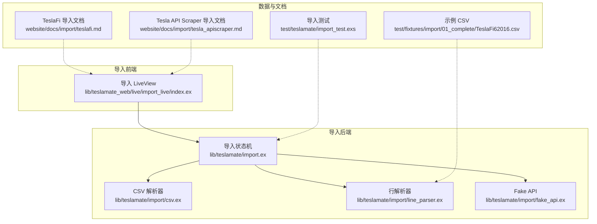
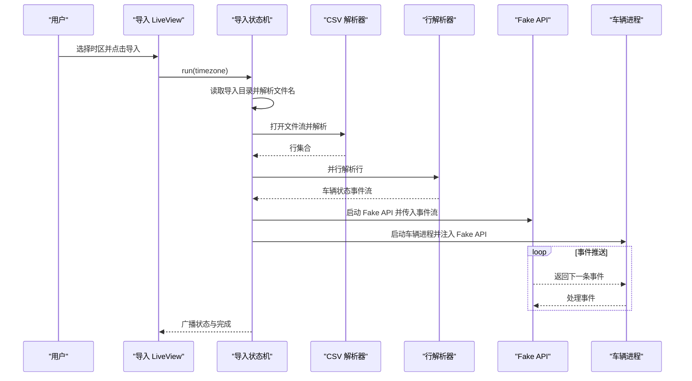
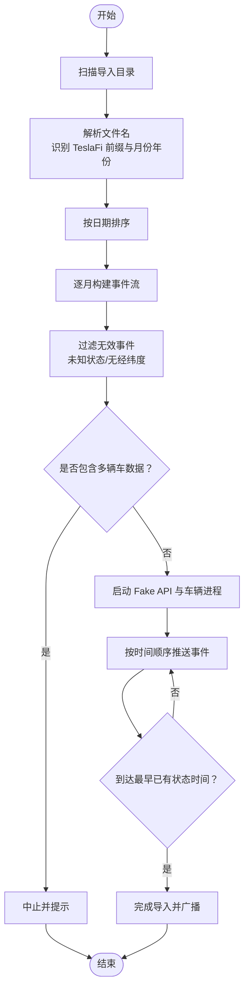
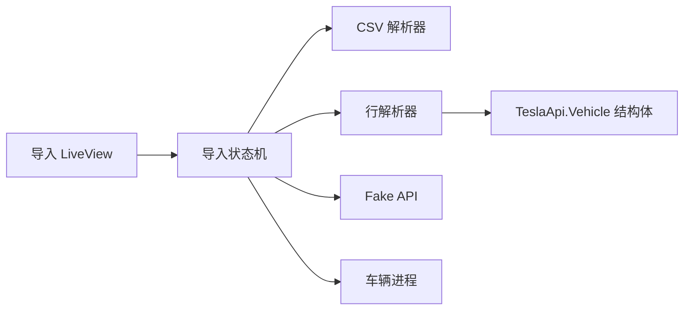

# 第三方数据源迁移

<cite>
**本文引用的文件**
- [lib/teslamate/import.ex](file://lib/teslamate/import.ex)
- [lib/teslamate/import/csv.ex](file://lib/teslamate/import/csv.ex)
- [lib/teslamate/import/fake_api.ex](file://lib/teslamate/import/fake_api.ex)
- [lib/teslamate/import/line_parser.ex](file://lib/teslamate/import/line_parser.ex)
- [lib/teslamate_web/live/import_live/index.ex](file://lib/teslamate_web/live/import_live/index.ex)
- [website/docs/import/teslafi.md](file://website/docs/import/teslafi.md)
- [website/docs/import/tesla_apiscraper.md](file://website/docs/import/tesla_apiscraper.md)
- [test/teslamate/import_test.exs](file://test/teslamate/import_test.exs)
- [test/fixtures/import/01_complete/TeslaFi62016.csv](file://test/fixtures/import/01_complete/TeslaFi62016.csv)
- [lib/teslamate/convert.ex](file://lib/teslamate/convert.ex)
</cite>

## 目录
1. [简介](#简介)
2. [项目结构](#项目结构)
3. [核心组件](#核心组件)
4. [架构总览](#架构总览)
5. [详细组件分析](#详细组件分析)
6. [依赖关系分析](#依赖关系分析)
7. [性能考量](#性能考量)
8. [故障排查指南](#故障排查指南)
9. [结论](#结论)
10. [附录](#附录)

## 简介
本指南面向希望将历史数据从 TeslaFi、Tesla API Scraper 等第三方数据源迁移到 TeslaMate 的用户。内容覆盖：
- 数据源导出格式差异与适配策略（字段映射、时间戳标准化、单位转换）
- 针对 TeslaFi CSV 的兼容性处理（文件命名识别、多车数据分离）
- 分步操作流程（文件准备、系统配置、导入执行、结果验证）
- 常见迁移问题与解决方案（重复数据、时间范围冲突、权限配置）
- 结合 fake_api.ex 的行为模拟，确保导入过程与 TeslaMate 车辆状态流一致
- 实际迁移案例的性能参考

## 项目结构
与导入迁移直接相关的模块与页面如下：
- 导入状态机与调度：lib/teslamate/import.ex
- CSV 解析器：lib/teslamate/import/csv.ex
- 行解析器（字段映射、时间戳与单位转换）：lib/teslamate/import/line_parser.ex
- 模拟 Tesla API（Fake API）：lib/teslamate/import/fake_api.ex
- 导入界面 LiveView：lib/teslamate_web/live/import_live/index.ex
- 官方文档（TeslaFi、Tesla API Scraper 导入）：website/docs/import/teslafi.md、website/docs/import/tesla_apiscraper.md
- 测试用例与示例 CSV：test/teslamate/import_test.exs、test/fixtures/import/01_complete/TeslaFi62016.csv



图表来源
- [lib/teslamate_web/live/import_live/index.ex](file://lib/teslamate_web/live/import_live/index.ex#L1-L81)
- [lib/teslamate/import.ex](file://lib/teslamate/import.ex#L1-L302)
- [lib/teslamate/import/csv.ex](file://lib/teslamate/import/csv.ex#L1-L31)
- [lib/teslamate/import/line_parser.ex](file://lib/teslamate/import/line_parser.ex#L1-L135)
- [lib/teslamate/import/fake_api.ex](file://lib/teslamate/import/fake_api.ex#L1-L179)
- [website/docs/import/teslafi.md](file://website/docs/import/teslafi.md#L1-L235)
- [website/docs/import/tesla_apiscraper.md](file://website/docs/import/tesla_apiscraper.md#L1-L70)
- [test/fixtures/import/01_complete/TeslaFi62016.csv](file://test/fixtures/import/01_complete/TeslaFi62016.csv#L1-L162)
- [test/teslamate/import_test.exs](file://test/teslamate/import_test.exs#L1-L569)

章节来源
- [lib/teslamate/import.ex](file://lib/teslamate/import.ex#L1-L302)
- [lib/teslamate/import/csv.ex](file://lib/teslamate/import/csv.ex#L1-L31)
- [lib/teslamate/import/line_parser.ex](file://lib/teslamate/import/line_parser.ex#L1-L135)
- [lib/teslamate/import/fake_api.ex](file://lib/teslamate/import/fake_api.ex#L1-L179)
- [lib/teslamate_web/live/import_live/index.ex](file://lib/teslamate_web/live/import_live/index.ex#L1-L81)
- [website/docs/import/teslafi.md](file://website/docs/import/teslafi.md#L1-L235)
- [website/docs/import/tesla_apiscraper.md](file://website/docs/import/tesla_apiscraper.md#L1-L70)
- [test/teslamate/import_test.exs](file://test/teslamate/import_test.exs#L1-L569)
- [test/fixtures/import/01_complete/TeslaFi62016.csv](file://test/fixtures/import/01_complete/TeslaFi62016.csv#L1-L162)

## 核心组件
- 导入状态机（GenStateMachine）：负责扫描导入目录、按月文件排序、创建事件流、启动车辆与 Fake API 进程、广播进度与完成状态。
- CSV 解析器：基于 NimbleCSV，支持自动检测分隔符、空内容处理与首行头解析。
- 行解析器：将 CSV 行映射到 TeslaApi.Vehicle 结构体，统一时间戳格式与时区，处理布尔值、空字符串转 nil、部分字段别名映射。
- Fake API：模拟 Tesla API 的 get_vehicle/get_vehicle_with_state 接口，按时间顺序返回车辆状态事件，支持按最早已有状态的时间点截断，避免重复导入。
- 导入界面 LiveView：提供选择时区、触发导入、查看状态的交互入口。

章节来源
- [lib/teslamate/import.ex](file://lib/teslamate/import.ex#L1-L302)
- [lib/teslamate/import/csv.ex](file://lib/teslamate/import/csv.ex#L1-L31)
- [lib/teslamate/import/line_parser.ex](file://lib/teslamate/import/line_parser.ex#L1-L135)
- [lib/teslamate/import/fake_api.ex](file://lib/teslamate/import/fake_api.ex#L1-L179)
- [lib/teslamate_web/live/import_live/index.ex](file://lib/teslamate_web/live/import_live/index.ex#L1-L81)

## 架构总览
导入流程从 LiveView 触发，导入状态机读取导入目录中的 CSV 文件，按月排序后逐月解析。解析过程中：
- CSV 解析器将每行转为键值映射；
- 行解析器将键值映射转换为 TeslaApi.Vehicle 结构体，并标准化时间戳与单位；
- Fake API 将事件按时间顺序推送，直到达到“最早已有状态”的时间点；
- 导入完成后，系统触发修复任务并更新当前状态记录。



图表来源
- [lib/teslamate_web/live/import_live/index.ex](file://lib/teslamate_web/live/import_live/index.ex#L1-L81)
- [lib/teslamate/import.ex](file://lib/teslamate/import.ex#L1-L302)
- [lib/teslamate/import/csv.ex](file://lib/teslamate/import/csv.ex#L1-L31)
- [lib/teslamate/import/line_parser.ex](file://lib/teslamate/import/line_parser.ex#L1-L135)
- [lib/teslamate/import/fake_api.ex](file://lib/teslamate/import/fake_api.ex#L1-L179)

## 详细组件分析

### 组件A：导入状态机（TeslaMate.Import）
- 功能要点
  - 目录扫描与文件名解析：识别 TeslaFi 前缀与月份年份组合，生成日期排序列表。
  - 事件流构建：逐月打开 CSV 文件流，解析为行，再并行解析为车辆状态事件。
  - 多车数据分离：若某月 CSV 包含多个 VIN/vehicle_id/eid，会拒绝导入并提示。
  - Fake API 与车辆进程：启动 Fake API 与车辆进程，按最早已有状态时间点截断导入。
  - 状态广播：通过 Phoenix PubSub 广播导入状态（文件完成标记、错误消息）。
- 关键行为
  - 文件名识别规则：支持 TeslaFi 前缀与单/双位月份格式。
  - 过滤无效事件：过滤未知状态与缺失经纬度的驾驶事件。
  - 错误处理：捕获文件错误与异常，进入错误状态并广播。



图表来源
- [lib/teslamate/import.ex](file://lib/teslamate/import.ex#L1-L302)

章节来源
- [lib/teslamate/import.ex](file://lib/teslamate/import.ex#L1-L302)

### 组件B：CSV 解析器（TeslaMate.Import.CSV）
- 功能要点
  - 自动检测分隔符与空内容，避免错误解析。
  - 将首行作为列头，后续行与列头 zip 成键值映射。
  - 忽略空行，保证解析稳定性。
- 兼容性
  - 支持多种分隔符与换行符，提升对不同导出工具的兼容性。

章节来源
- [lib/teslamate/import/csv.ex](file://lib/teslamate/import/csv.ex#L1-L31)

### 组件C：行解析器（TeslaMate.Import.LineParser）
- 字段映射与标准化
  - 时间戳：统一解析多种日期格式，应用所选时区，转换为毫秒级 Unix 时间戳。
  - 布尔值：将字符串 TRUE/False/true/false 等映射为布尔值；空字符串与 None 映射为 nil。
  - 数值：优先整数，其次浮点，否则保留原字符串。
  - 特殊字段：display_name、vehicle_name、state（waking/shutdown 映射为 online）、scheduled_charging_start_time 设为空。
  - 车辆标识：当 vehicle_id 缺失时，使用环境变量 TESLAFI_IMPORT_VEHICLE_ID 默认值。
- 单位与度量
  - 温度、距离、海拔等单位转换由 TeslaMate.Convert 提供函数支持，导入阶段不直接转换，但解析器会保留数值以便后续处理或数据库转换函数生效。

```mermaid
classDiagram
class LineParser {
+parse(line, tz)
-map_value(key, val)
-to_float(val)
-into_vehicle({key,val}, acc, tz)
}
class Convert {
+mph_to_kmh(x)
+miles_to_km(x,p)
+km_to_miles(x,p)
+m_to_ft(x)
+ft_to_m(x)
+celsius_to_fahrenheit(x,p)
}
LineParser --> Convert : "间接配合单位转换"
```

图表来源
- [lib/teslamate/import/line_parser.ex](file://lib/teslamate/import/line_parser.ex#L1-L135)
- [lib/teslamate/convert.ex](file://lib/teslamate/convert.ex#L1-L34)

章节来源
- [lib/teslamate/import/line_parser.ex](file://lib/teslamate/import/line_parser.ex#L1-L135)
- [lib/teslamate/convert.ex](file://lib/teslamate/convert.ex#L1-L34)

### 组件D：Fake API（TeslaMate.Import.FakeApi）
- 行为模拟
  - 提供 get_vehicle/get_vehicle_with_state 接口，按调用顺序返回事件。
  - 支持事件分块（Chunk）与最大索引跟踪，保证有序消费。
  - 当事件时间戳达到“最早已有状态”时间点时，通知导入完成。
- 与导入流程的协作
  - 导入状态机在启动车辆进程时注入 Fake API 名称，车辆进程通过 GenServer 调用接口获取事件，从而驱动车辆状态流。

章节来源
- [lib/teslamate/import/fake_api.ex](file://lib/teslamate/import/fake_api.ex#L1-L179)
- [lib/teslamate/import.ex](file://lib/teslamate/import.ex#L1-L302)

### 组件E：导入界面 LiveView（TeslaMateWeb.ImportLive.Index）
- 用户交互
  - 选择本地时区并触发导入。
  - 订阅导入状态变更，实时显示进度与完成状态。
  - 提供重新加载目录按钮，便于刷新新导入的 CSV 文件。

章节来源
- [lib/teslamate_web/live/import_live/index.ex](file://lib/teslamate_web/live/import_live/index.ex#L1-L81)

## 依赖关系分析
- 导入状态机依赖 CSV 解析器与行解析器进行数据预处理，依赖 Fake API 提供事件流，依赖车辆进程维持导入期间的状态一致性。
- 行解析器依赖 TeslaApi.Vehicle 结构体字段定义，确保映射到正确的子结构（charge_state、climate_state、drive_state、vehicle_config、vehicle_state）。
- LiveView 仅作为入口与状态展示，不直接参与数据处理。



图表来源
- [lib/teslamate/import.ex](file://lib/teslamate/import.ex#L1-L302)
- [lib/teslamate/import/csv.ex](file://lib/teslamate/import/csv.ex#L1-L31)
- [lib/teslamate/import/line_parser.ex](file://lib/teslamate/import/line_parser.ex#L1-L135)
- [lib/teslamate/import/fake_api.ex](file://lib/teslamate/import/fake_api.ex#L1-L179)
- [lib/teslamate_web/live/import_live/index.ex](file://lib/teslamate_web/live/import_live/index.ex#L1-L81)

## 性能考量
- 并行解析：行解析采用 Task.async_stream 并保持顺序，提高吞吐同时保证事件顺序。
- 分块推送：Fake API 使用分块与索引机制，避免一次性加载大量事件导致内存压力。
- 事件过滤：在导入早期过滤无效事件，减少后续处理成本。
- 时区处理：统一转换为毫秒级时间戳，避免重复转换开销。
- 测试参考：导入测试覆盖了完整数据集、时区切换、夏令时、重叠数据等场景，可作为性能基线参考。

章节来源
- [lib/teslamate/import.ex](file://lib/teslamate/import.ex#L1-L302)
- [lib/teslamate/import/fake_api.ex](file://lib/teslamate/import/fake_api.ex#L1-L179)
- [test/teslamate/import_test.exs](file://test/teslamate/import_test.exs#L1-L569)

## 故障排查指南
- 文件名不符合规范
  - 现象：导入状态机无法识别文件。
  - 处理：确保文件名为 TeslaFiMMYYYY.csv 或 TeslaFiMYYYY.csv 格式。
  - 参考：文件名解析逻辑与测试用例。
- 多车数据混杂
  - 现象：导入被中止并提示包含多辆车数据。
  - 处理：每个导入目录仅放置一辆车的数据；若需合并，请先拆分或清理。
  - 参考：导入状态机的多车检测逻辑。
- 重复数据与时间范围冲突
  - 现象：导入完成后，部分月份未导入或出现空状态。
  - 处理：导入会自动跳过与现有最早状态重叠的时间段；如需覆盖，请备份并清理历史数据。
  - 参考：导入状态机按最早已有状态时间点截断事件流。
- 时区与 DST 影响
  - 现象：导入后状态时间显示与预期不符。
  - 处理：在导入前选择正确时区；夏令时切换期间可能产生短暂不一致，系统会自动处理。
  - 参考：导入测试覆盖了夏令时与多时区场景。
- 地址与高程延迟
  - 现象：导入完成后地址与高程信息未立即显示。
  - 处理：系统会在导入后异步补全地址与高程，等待一段时间即可。
  - 参考：官方文档说明。

章节来源
- [lib/teslamate/import.ex](file://lib/teslamate/import.ex#L1-L302)
- [test/teslamate/import_test.exs](file://test/teslamate/import_test.exs#L1-L569)
- [website/docs/import/teslafi.md](file://website/docs/import/teslafi.md#L1-L235)

## 结论
通过导入状态机、CSV/行解析器与 Fake API 的协同工作，TeslaMate 能够稳定地从 TeslaFi、Tesla API Scraper 等第三方数据源导入历史数据。遵循本文提供的文件准备、系统配置、导入执行与验证步骤，并结合常见问题的排查建议，可高效完成迁移并获得一致的历史数据视图。

## 附录

### A. 从 TeslaFi 迁移步骤
- 准备数据
  - 在 TeslaFi 中导出按月 CSV（设置中选择下载 TeslaFi 数据），文件命名为 TeslaFiMMYYYY.csv 或 TeslaFiMYYYY.csv。
  - 将 CSV 放置在导入目录（默认 ./import，可通过 IMPORT_DIR 环境变量自定义）。
- 系统配置
  - 在 TeslaMate 中挂载导入目录（docker-compose 中添加卷映射）。
  - 设置 IMPORT_DIR 环境变量（可选）。
- 执行导入
  - 启动 TeslaMate 服务，打开导入界面，选择本地时区并点击导入。
  - 导入完成后清空导入目录并重启服务。
- 结果验证
  - 查看导入状态与进度；确认车辆信息、行程、充电、状态与更新记录。
  - 注意：地址与高程信息可能延迟出现。

章节来源
- [website/docs/import/teslafi.md](file://website/docs/import/teslafi.md#L1-L235)
- [lib/teslamate_web/live/import_live/index.ex](file://lib/teslamate_web/live/import_live/index.ex#L1-L81)
- [lib/teslamate/import.ex](file://lib/teslamate/import.ex#L1-L302)

### B. 从 Tesla API Scraper 迁移步骤
- 准备数据
  - 从 tesla-apiscraper 的 InfluxDB 数据导出 CSV（使用官方转换脚本）。
  - 获取车辆 ID（vehicle_id），用于生成 TeslaFi 兼容格式。
- 转换与导入
  - 使用转换脚本将导出的 CSV 转换为 TeslaFi 兼容格式。
  - 将转换后的 CSV 放入导入目录并执行 TeslaFi 导入流程。

章节来源
- [website/docs/import/tesla_apiscraper.md](file://website/docs/import/tesla_apiscraper.md#L1-L70)

### C. 字段映射与单位转换要点
- 字段映射
  - display_name、vehicle_name、state（waking/shutdown 映射为 online）、scheduled_charging_start_time 等字段有明确映射规则。
  - vehicle_id 缺失时使用环境变量 TESLAFI_IMPORT_VEHICLE_ID。
- 时间戳标准化
  - 行解析器支持多种日期格式，统一转换为毫秒级 Unix 时间戳并应用所选时区。
- 单位转换
  - 温度、距离、海拔等单位转换由 TeslaMate.Convert 提供函数，导入阶段保留原始数值以便后续处理。

章节来源
- [lib/teslamate/import/line_parser.ex](file://lib/teslamate/import/line_parser.ex#L1-L135)
- [lib/teslamate/convert.ex](file://lib/teslamate/convert.ex#L1-L34)
- [test/fixtures/import/01_complete/TeslaFi62016.csv](file://test/fixtures/import/01_complete/TeslaFi62016.csv#L1-L162)

### D. 示例 CSV 结构参考
- 示例 CSV 包含丰富的字段，如 Date、vehicle_id、vin、display_name、inside_temp、outside_temp、latitude、longitude、odometer 等，行解析器会将其映射到对应结构体字段。

章节来源
- [test/fixtures/import/01_complete/TeslaFi62016.csv](file://test/fixtures/import/01_complete/TeslaFi62016.csv#L1-L162)