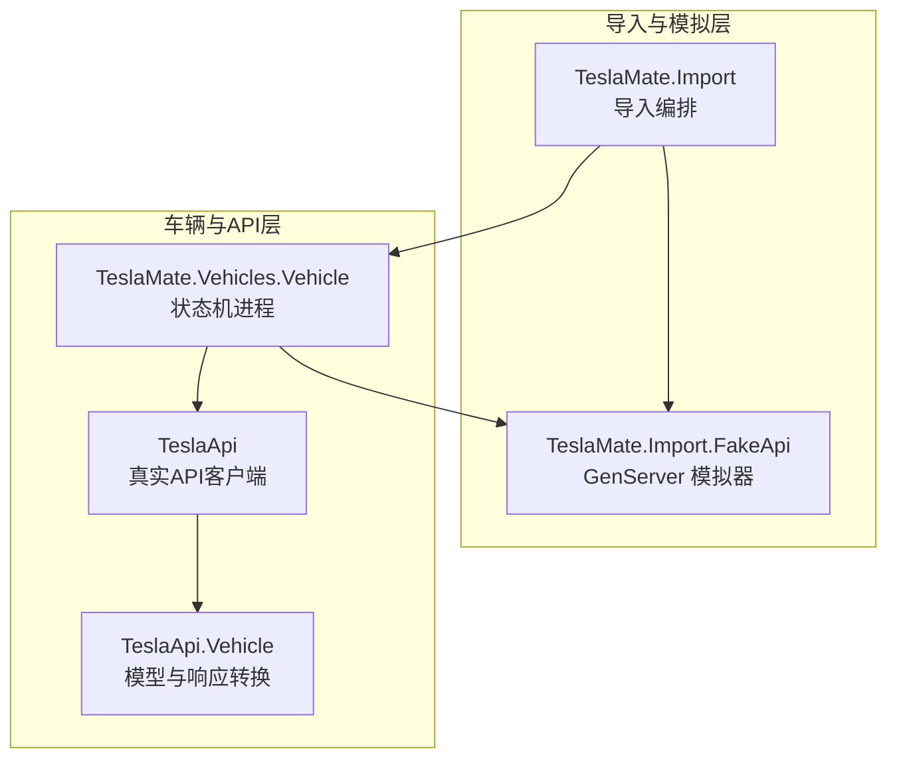
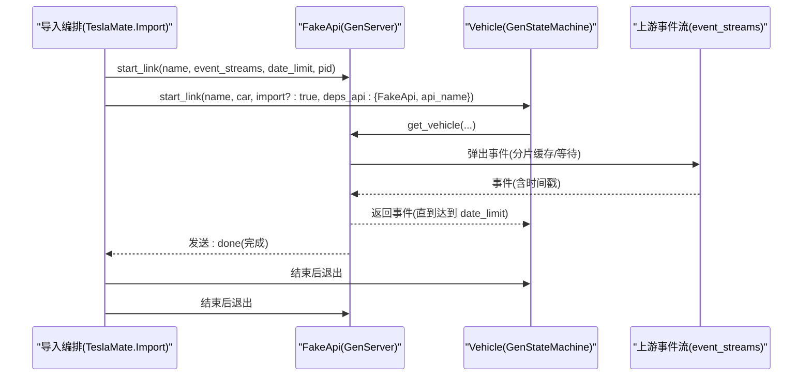
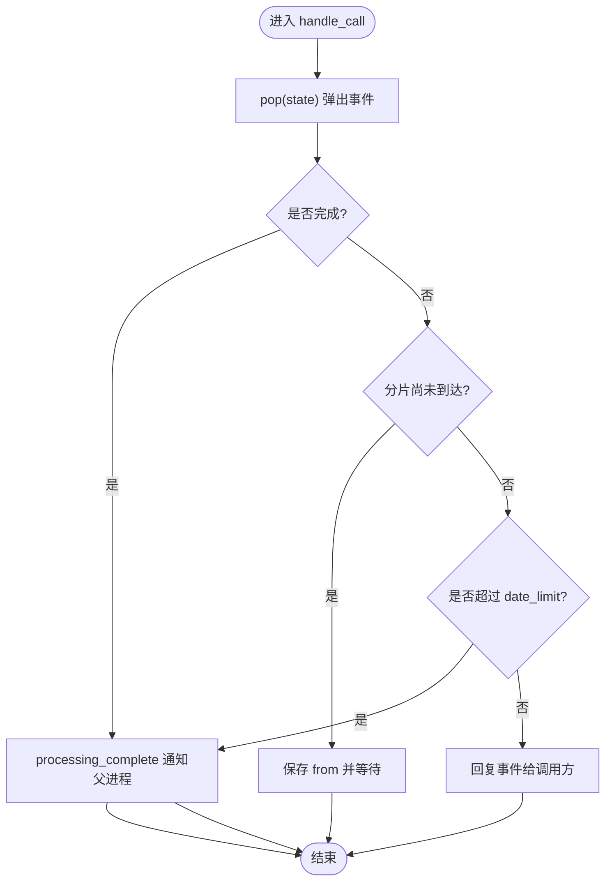
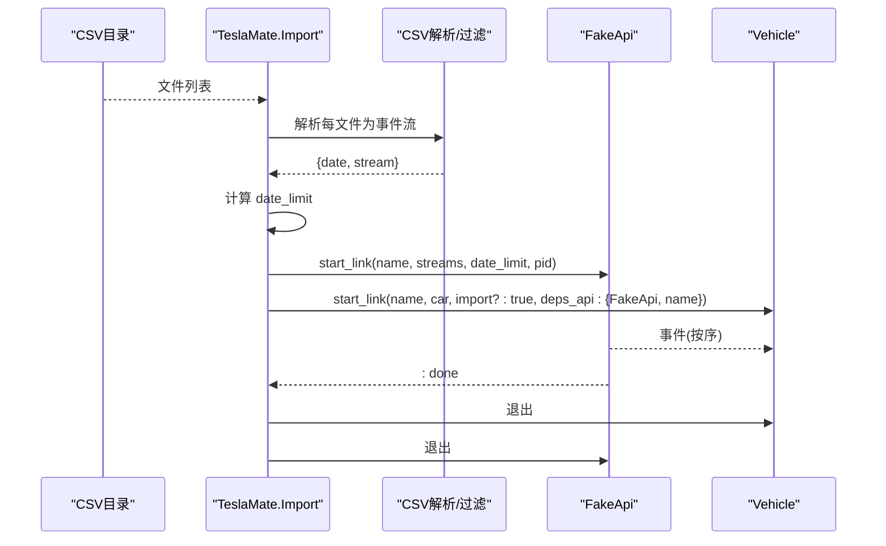
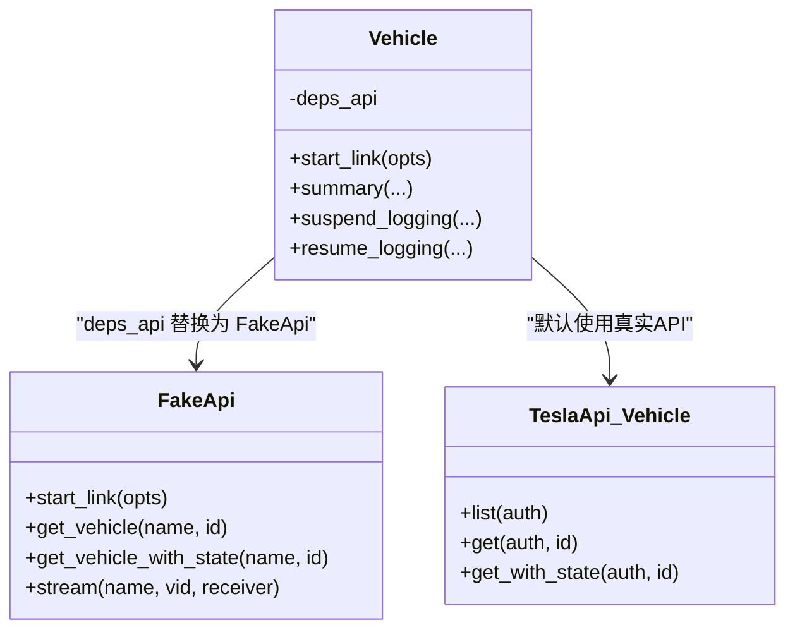
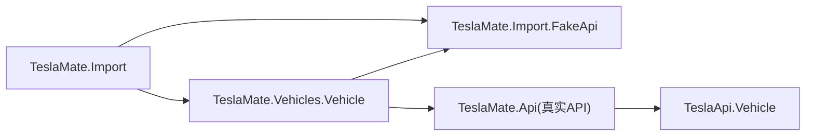

# 测试环境模拟

<cite>
**本文引用的文件**
- [lib/teslamate/import/fake_api.ex](file://lib/teslamate/import/fake_api.ex)
- [lib/teslamate/import.ex](file://lib/teslamate/import.ex)
- [lib/tesla_api/vehicle.ex](file://lib/tesla_api/vehicle.ex)
- [lib/tesla_api.ex](file://lib/tesla_api.ex)
- [lib/teslamate/vehicles/vehicle.ex](file://lib/teslamate/vehicles/vehicle.ex)
- [test/teslamate/import_test.exs](file://test/teslamate/import_test.exs)
- [test/teslamate/vehicles/vehicle/streaming_test.exs](file://test/teslamate/vehicles/vehicle/streaming_test.exs)
</cite>

## 目录
1. [简介](#简介)
2. [项目结构](#项目结构)
3. [核心组件](#核心组件)
4. [架构总览](#架构总览)
5. [详细组件分析](#详细组件分析)
6. [依赖关系分析](#依赖关系分析)
7. [性能考量](#性能考量)
8. [故障注入与边界测试指南](#故障注入与边界测试指南)
9. [结论](#结论)
10. [附录：使用示例与最佳实践](#附录使用示例与最佳实践)

## 简介
本文件面向开发与测试团队，系统化阐述 FakeApi 模块的设计目标与实现机制。FakeApi 作为 Tesla API 的模拟器，用于在数据导入与系统测试阶段提供可控的车辆状态流。它通过 GenServer 生命周期管理、事件队列分片与回放、以及基于时间戳的过滤策略，为 Vehicle 模块提供与真实 Tesla API 兼容的接口，从而实现无需修改业务代码即可切换到离线/可控数据源的目标。

## 项目结构
FakeApi 所在的关键路径与职责：
- 导入流程编排：TeslaMate.Import 负责扫描 CSV 文件、解析为事件流、启动 FakeApi 与 Vehicle 进程，并在完成后清理资源。
- 模拟器实现：TeslaMate.Import.FakeApi 是 GenServer，负责接收事件流、按分片缓存、按需弹出事件、支持日期上限过滤与“车辆变更”中断。
- 接口兼容：FakeApi 提供与真实 TeslaApi.Vehicle 类似的调用接口（如 get_vehicle、get_vehicle_with_state），以保证 Vehicle 可透明替换。
- 车辆进程：TeslaMate.Vehicles.Vehicle 使用 FakeApi 作为依赖，通过配置可无缝切换到真实 API 或 FakeApi。

图表来源
- [lib/teslamate/import.ex](file://lib/teslamate/import.ex#L120-L179)
- [lib/teslamate/import/fake_api.ex](file://lib/teslamate/import/fake_api.ex#L1-L179)
- [lib/teslamate/vehicles/vehicle.ex](file://lib/teslamate/vehicles/vehicle.ex#L113-L171)
- [lib/tesla_api.ex](file://lib/tesla_api.ex#L1-L18)
- [lib/tesla_api/vehicle.ex](file://lib/tesla_api/vehicle.ex#L1-L147)

章节来源
- [lib/teslamate/import.ex](file://lib/teslamate/import.ex#L120-L179)
- [lib/teslamate/import/fake_api.ex](file://lib/teslamate/import/fake_api.ex#L1-L179)
- [lib/teslamate/vehicles/vehicle.ex](file://lib/teslamate/vehicles/vehicle.ex#L113-L171)
- [lib/tesla_api.ex](file://lib/tesla_api.ex#L1-L18)
- [lib/tesla_api/vehicle.ex](file://lib/tesla_api/vehicle.ex#L1-L147)

## 核心组件
- FakeApi GenServer
  - 生命周期：start_link 初始化，接收 pid、event_streams、date_limit 等选项；内部维护事件队列、分片索引与当前块等状态。
  - 事件队列：事件以分片形式缓存，按顺序弹出；当上游未到达时，会等待或返回“尚未收到”的错误信号，避免阻塞。
  - 时间戳过滤：当事件时间戳达到 date_limit 时，停止继续推送，触发完成回调。
  - 中断机制：当检测到“车辆变更”（来自上游解析器）时，发送 abort 信号，重置内部状态并终止当前流。
  - 接口：提供 get_vehicle/get_vehicle_with_state 的同步调用，以及 stream 占位方法，满足 Vehicle 对 API 的依赖签名。

- TeslaMate.Import
  - 将 CSV 文件解析为事件流，过滤无效/不匹配事件，构建 event_streams。
  - 计算 date_limit（最早日志起始时间），用于限制回放范围。
  - 启动 FakeApi 与 Vehicle，设置 deps_api 为 {FakeApi, api_name}，使 Vehicle 内部调用统一指向 FakeApi。
  - 监听 FakeApi 的完成信号，结束后清理并触发修复任务。

- TeslaMate.Vehicles.Vehicle
  - 通过依赖注入的方式使用 API（默认使用 TeslaMate.Api，测试时可替换为 FakeApi）。
  - 在 streaming 模式下，接收来自 API 的流数据，驱动状态机推进；在非 streaming 模式下定期拉取状态。
  - 支持 suspend/resume、离线/更新/断连等场景下的行为切换。

章节来源
- [lib/teslamate/import/fake_api.ex](file://lib/teslamate/import/fake_api.ex#L1-L179)
- [lib/teslamate/import.ex](file://lib/teslamate/import.ex#L120-L179)
- [lib/teslamate/vehicles/vehicle.ex](file://lib/teslamate/vehicles/vehicle.ex#L113-L171)

## 架构总览
FakeApi 的工作流围绕“事件流注入—分片缓存—按序弹出—时间戳过滤—完成通知”展开。Vehicle 通过统一的 API 接口消费这些事件，从而在导入与测试场景中获得一致的行为。

图表来源
- [lib/teslamate/import.ex](file://lib/teslamate/import.ex#L133-L157)
- [lib/teslamate/import/fake_api.ex](file://lib/teslamate/import/fake_api.ex#L52-L107)
- [lib/teslamate/vehicles/vehicle.ex](file://lib/teslamate/vehicles/vehicle.ex#L113-L171)

## 详细组件分析

### FakeApi GenServer 设计与实现
- 状态结构
  - 维护父进程 pid、调用方 from、事件列表、事件分片表、当前块、事件流队列、date_limit。
- 生命周期与回调
  - init：解析并持久化传入的 pid、event_streams、date_limit（若为 DateTime 则转毫秒）。
  - handle_call：处理 get_vehicle/get_vehicle_with_state 请求，内部 pop 取事件；若上游未就绪则暂存 from 并等待；若达到 date_limit 或完成，则触发 processing_complete 并回复。
  - handle_info：接收事件分片与处理完成信号；当收到事件分片时，插入缓存并尝试弹出；当收到 processed_events 时更新最大分片索引；abort 清空内部状态。
- 事件弹出算法
  - 当事件队列为空且已无可用分片时，返回完成。
  - 若当前分片索引未就绪，返回“尚未收到”的错误信号，等待上游推进。
  - 若当前分片索引就绪，取出下一个事件并从队列移除。
  - 若达到 date_limit，立即结束并通知父进程。
- 分片与并发
  - 上游以流方式生成事件，FakeApi 将其切分为固定大小的块并以消息传递给自身，避免一次性占用内存。
  - 通过 spawn_link 子进程异步处理上游流，主进程只负责消息收发与状态更新。

图表来源
- [lib/teslamate/import/fake_api.ex](file://lib/teslamate/import/fake_api.ex#L52-L107)
- [lib/teslamate/import/fake_api.ex](file://lib/teslamate/import/fake_api.ex#L110-L179)

章节来源
- [lib/teslamate/import/fake_api.ex](file://lib/teslamate/import/fake_api.ex#L1-L179)

### 导入编排与事件注入
- 事件流构建
  - 读取目录下 CSV 文件，逐行解析为 TeslaApi.Vehicle 事件；过滤掉未知状态、缺失时间戳、不匹配 VIN/VID/EID 的事件；对在线事件要求经纬度有效。
  - 将每个文件的解析结果封装为 {date, stream}，最终形成 event_streams。
- 车辆识别与设置
  - 从事件流中找到包含 VIN/VID/EID 的第一条记录，创建/更新车辆信息，并设置 CarSettings（禁用 streaming、降低休眠间隔等）。
- FakeApi 启动与绑定
  - 计算 date_limit（最早日志起始时间），启动 FakeApi，并将 deps_api 设置为 {FakeApi, api_name}，使 Vehicle 内部调用统一指向 FakeApi。
- 完成与清理
  - 监听 FakeApi 的 :done 信号，结束 Vehicle 进程，写入完成状态并触发修复任务。

图表来源
- [lib/teslamate/import.ex](file://lib/teslamate/import.ex#L120-L179)
- [lib/teslamate/import.ex](file://lib/teslamate/import.ex#L218-L301)

章节来源
- [lib/teslamate/import.ex](file://lib/teslamate/import.ex#L120-L179)
- [lib/teslamate/import.ex](file://lib/teslamate/import.ex#L218-L301)

### 接口兼容性设计
- FakeApi 对外暴露的方法与 TeslaApi.Vehicle 类似，便于 Vehicle 透明切换：
  - get_vehicle(name, id)：同步请求获取车辆事件。
  - get_vehicle_with_state(name, id)：同步请求获取带状态的车辆事件。
  - stream(name, vid, receiver)：占位方法，导入模式下不使用真实流。
- Vehicle 内部通过依赖注入选择 API 实现，默认使用 TeslaMate.Api；测试时注入 FakeApi，即可完全复用现有逻辑。

图表来源
- [lib/tesla_api/vehicle.ex](file://lib/tesla_api/vehicle.ex#L1-L147)
- [lib/teslamate/import/fake_api.ex](file://lib/teslamate/import/fake_api.ex#L19-L35)
- [lib/teslamate/vehicles/vehicle.ex](file://lib/teslamate/vehicles/vehicle.ex#L113-L171)

章节来源
- [lib/teslamate/import/fake_api.ex](file://lib/teslamate/import/fake_api.ex#L19-L35)
- [lib/teslamate/vehicles/vehicle.ex](file://lib/teslamate/vehicles/vehicle.ex#L113-L171)
- [lib/tesla_api/vehicle.ex](file://lib/tesla_api/vehicle.ex#L1-L147)

## 依赖关系分析
- TeslaMate.Import 依赖
  - 导入 CSV、解析行、过滤事件、创建车辆、启动 FakeApi 与 Vehicle。
- FakeApi 依赖
  - 依赖 TeslaApi.Vehicle 类型结构，以便在事件中使用 drive_state.timestamp 等字段进行时间戳过滤。
- Vehicle 依赖
  - 通过 deps_api 注入 API 实现；在导入模式下注入 FakeApi，在运行模式下注入真实 TeslaMate.Api。

图表来源
- [lib/teslamate/import.ex](file://lib/teslamate/import.ex#L120-L179)
- [lib/teslamate/import/fake_api.ex](file://lib/teslamate/import/fake_api.ex#L1-L179)
- [lib/teslamate/vehicles/vehicle.ex](file://lib/teslamate/vehicles/vehicle.ex#L113-L171)
- [lib/tesla_api.ex](file://lib/tesla_api.ex#L1-L18)
- [lib/tesla_api/vehicle.ex](file://lib/tesla_api/vehicle.ex#L1-L147)

章节来源
- [lib/teslamate/import.ex](file://lib/teslamate/import.ex#L120-L179)
- [lib/teslamate/import/fake_api.ex](file://lib/teslamate/import/fake_api.ex#L1-L179)
- [lib/teslamate/vehicles/vehicle.ex](file://lib/teslamate/vehicles/vehicle.ex#L113-L171)
- [lib/tesla_api.ex](file://lib/tesla_api.ex#L1-L18)
- [lib/tesla_api/vehicle.ex](file://lib/tesla_api/vehicle.ex#L1-L147)

## 性能考量
- 分片回放
  - 将上游事件流切分为固定大小的块，避免一次性加载过多事件导致内存压力；通过消息传递逐步推进，提升吞吐与稳定性。
- 异步处理
  - 使用 spawn_link 异步处理上游流，主进程仅负责消息收发与状态更新，降低阻塞风险。
- 时间戳过滤
  - 在事件层面进行 date_limit 过滤，减少无效事件的处理与传输，缩短导入周期。
- 调度与间隔
  - 导入模式下禁用 streaming，降低网络与解析开销；Vehicle 的轮询间隔可按需调整，以平衡实时性与资源消耗。

[本节为通用指导，不直接分析具体文件]

## 故障注入与边界测试指南
以下示例均基于仓库中的测试与实现，展示如何在开发与测试场景中使用 FakeApi 进行故障注入、边界条件测试与性能基准测试。

- 故障注入：车辆变更检测
  - 当上游事件流中出现 VIN/VID/EID 不匹配的情况，导入器会抛出异常并触发 vehicle_changed，FakeApi 捕获后发送 abort，重置内部状态并终止当前流。
  - 测试验证：导入测试覆盖了“多车混入”场景，预期会检测到并中止处理。
  - 参考路径
    - [lib/teslamate/import.ex](file://lib/teslamate/import.ex#L239-L267)
    - [lib/teslamate/import/fake_api.ex](file://lib/teslamate/import/fake_api.ex#L130-L140)

- 边界条件：空事件块与未就绪分片
  - 当上游没有事件或分片尚未到达时，FakeApi 返回“尚未收到”的错误信号，调用方应等待或重试；当上游返回空块时，记录警告并跳过。
  - 参考路径
    - [lib/teslamate/import/fake_api.ex](file://lib/teslamate/import/fake_api.ex#L140-L149)

- 性能基准：事件回放速率与内存占用
  - 通过增大分片大小与批量处理，可评估 FakeApi 的吞吐能力；同时观察日志与完成信号频率，评估导入耗时。
  - 参考路径
    - [lib/teslamate/import.ex](file://lib/teslamate/import.ex#L120-L179)
    - [lib/teslamate/import/fake_api.ex](file://lib/teslamate/import/fake_api.ex#L120-L139)

- 流式场景兼容性验证
  - 在 streaming 模式下，Vehicle 会根据 API 返回的事件推进状态机；导入模式下，FakeApi 提供与真实 API 兼容的接口，确保逻辑一致。
  - 参考路径
    - [lib/teslamate/vehicles/vehicle.ex](file://lib/teslamate/vehicles/vehicle.ex#L440-L604)
    - [test/teslamate/vehicles/vehicle/streaming_test.exs](file://test/teslamate/vehicles/vehicle/streaming_test.exs#L47-L232)

章节来源
- [lib/teslamate/import.ex](file://lib/teslamate/import.ex#L239-L267)
- [lib/teslamate/import/fake_api.ex](file://lib/teslamate/import/fake_api.ex#L120-L149)
- [lib/teslamate/vehicles/vehicle.ex](file://lib/teslamate/vehicles/vehicle.ex#L440-L604)
- [test/teslamate/vehicles/vehicle/streaming_test.exs](file://test/teslamate/vehicles/vehicle/streaming_test.exs#L47-L232)

## 结论
FakeApi 通过 GenServer 生命周期管理、事件分片与回放、时间戳过滤与中断机制，实现了与真实 Tesla API 的接口兼容。结合 TeslaMate.Import 的事件注入与 Vehicle 的依赖注入，可在导入与测试场景中提供可控、可重复、可扩展的数据流，显著提升开发效率与质量保障能力。

[本节为总结，不直接分析具体文件]

## 附录：使用示例与最佳实践
- 开发与测试场景
  - 使用导入目录中的 CSV 文件作为 event_streams，启动 Import，FakeApi 会自动回放事件至 date_limit。
  - 在 streaming 场景下，Vehicle 会根据 API 返回的事件推进状态机；导入模式下，FakeApi 提供与真实 API 兼容的接口，无需修改业务代码。
- 最佳实践
  - 明确 date_limit 的计算来源（最早日志起始时间），确保回放范围可控。
  - 对上游事件进行严格过滤，避免无效/不匹配事件影响导入稳定性。
  - 在测试中利用“车辆变更”中断机制，快速定位数据源问题。
  - 关注空事件块与未就绪分片的处理，避免阻塞与资源浪费。

章节来源
- [lib/teslamate/import.ex](file://lib/teslamate/import.ex#L120-L179)
- [lib/teslamate/import/fake_api.ex](file://lib/teslamate/import/fake_api.ex#L1-L179)
- [lib/teslamate/vehicles/vehicle.ex](file://lib/teslamate/vehicles/vehicle.ex#L113-L171)