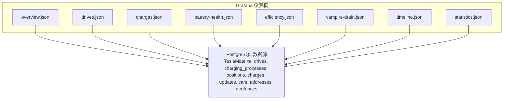
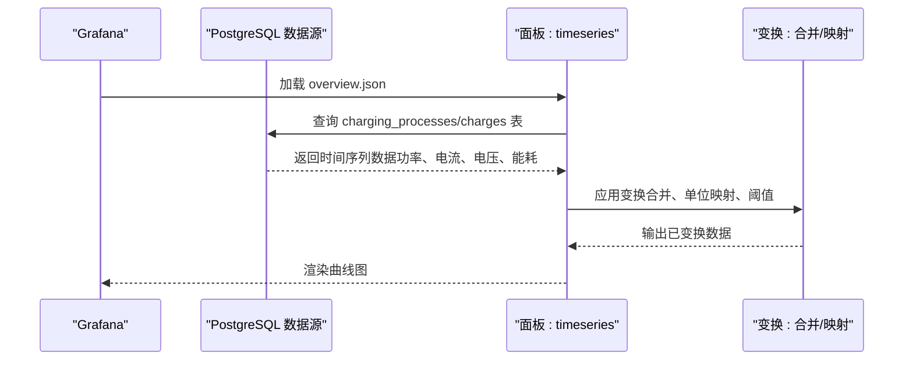
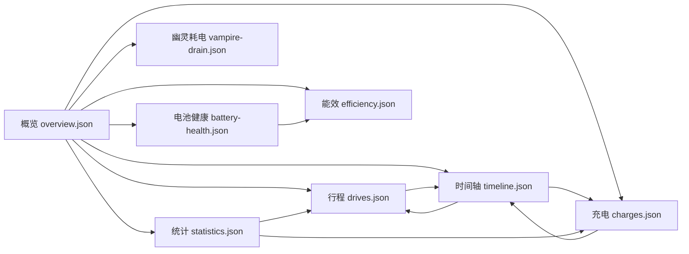

# 核心仪表板介绍

<cite>
**本文引用的文件**
- [overview.json](file://grafana/dashboards/overview.json)
- [drives.json](file://grafana/dashboards/drives.json)
- [charges.json](file://grafana/dashboards/charges.json)
- [battery-health.json](file://grafana/dashboards/battery-health.json)
- [efficiency.json](file://grafana/dashboards/efficiency.json)
- [vampire-drain.json](file://grafana/dashboards/vampire-drain.json)
- [timeline.json](file://grafana/dashboards/timeline.json)
- [statistics.json](file://grafana/dashboards/statistics.json)
</cite>

## 目录
1. [简介](#简介)
2. [项目结构](#项目结构)
3. [核心组件](#核心组件)
4. [架构总览](#架构总览)
5. [详细组件分析](#详细组件分析)
6. [依赖关系分析](#依赖关系分析)
7. [性能考量](#性能考量)
8. [故障排查指南](#故障排查指南)
9. [结论](#结论)
10. [附录](#附录)

## 简介
本文件系统性梳理 TeslaMate 预置的核心 Grafana 仪表板，覆盖车辆状态概览、行程分析、充电记录、电池健康趋势、能效计算、幽灵耗电监测、时间轴视图与统计聚合等关键面板。文档从数据来源、查询逻辑、可视化组件配置到使用案例进行深入解读，并给出各仪表板之间的数据关联与导航路径，帮助用户高效理解与修改这些 JSON 定义。

## 项目结构
核心仪表板位于 grafana/dashboards 目录下，按功能划分为多个独立的 JSON 文件，每个文件对应一个仪表板。这些仪表板通过 PostgreSQL 数据源查询 TeslaMate 的数据库表（如 drives、charging_processes、positions、charges、updates 等），并通过面板（stat、timeseries、table、gauge、piechart 等）呈现结果。

图表来源
- [overview.json](file://grafana/dashboards/overview.json#L1-L200)
- [drives.json](file://grafana/dashboards/drives.json#L1-L120)
- [charges.json](file://grafana/dashboards/charges.json#L1-L120)
- [battery-health.json](file://grafana/dashboards/battery-health.json#L1-L120)
- [efficiency.json](file://grafana/dashboards/efficiency.json#L1-L120)
- [vampire-drain.json](file://grafana/dashboards/vampire-drain.json#L1-L120)
- [timeline.json](file://grafana/dashboards/timeline.json#L1-L120)
- [statistics.json](file://grafana/dashboards/statistics.json#L1-L120)

章节来源
- [overview.json](file://grafana/dashboards/overview.json#L1-L200)
- [drives.json](file://grafana/dashboards/drives.json#L1-L120)
- [charges.json](file://grafana/dashboards/charges.json#L1-L120)
- [battery-health.json](file://grafana/dashboards/battery-health.json#L1-L120)
- [efficiency.json](file://grafana/dashboards/efficiency.json#L1-L120)
- [vampire-drain.json](file://grafana/dashboards/vampire-drain.json#L1-L120)
- [timeline.json](file://grafana/dashboards/timeline.json#L1-L120)
- [statistics.json](file://grafana/dashboards/statistics.json#L1-L120)

## 核心组件
- 概览仪表板（overview.json）
  - 车辆状态概览：电池电量、充电电压/功率、SOC、续航里程、固件版本、里程数、内外温度、充电详情曲线等。
  - 关键面板：电池电量仪表、充电电压/功率曲线、SOC 曲线、充电详情曲线、温度仪表、里程与固件版本等。
  - 数据来源：positions、charging_processes、charges、updates、cars、settings。
  - 查询要点：联合 positions 与 charging_processes 获取最新 SOC/范围；基于 $__timeFilter 过滤时间窗口；使用转换函数处理单位（km/mi、摄氏/华氏）。

- 行程仪表板（drives.json）
  - 行程概览与明细：总能耗、总时长、总距离、平均能耗、效率、速度、海拔变化、起终点地址/地理围栏链接等。
  - 关键面板：汇总统计（总能耗、总时长、总距离、平均能耗）、行程列表表格（起止时间、起终点、时长、距离、能耗、效率、温度、速度、海拔、能耗/km）。
  - 数据来源：drives、positions、addresses、geofences、cars。
  - 查询要点：基于 drives 计算 range_diff、distance、avg_speed、efficiency；支持按 geofence、位置文本过滤；支持“是否有效数据”标记。

- 充电仪表板（charges.json）
  - 充电记录与统计：总电量添加/使用、成本、平均充电速率、效率、类型（AC/DC）、温度、地点、时长等。
  - 关键面板：汇总统计（总电量、成本、平均每充）、充电列表表格（起止时间、地点、类型、时长、能耗、效率、温度、充电速率、SOC 起止）。
  - 数据来源：charging_processes、charges、positions、addresses、geofences、cars。
  - 查询要点：按 charging_processes 分组聚合；计算 charging_efficiency、range_added_per_hour；支持按 geofence、类型、成本、时长过滤。

- 电池健康仪表板（battery-health.json）
  - 电池容量与健康度：当前可用容量、最大容量、续航范围、估计衰减、存储能量、AC/DC 使用占比、充电统计等。
  - 关键面板：容量与范围统计、健康度仪表、存储能量仪表、AC/DC 能量使用饼图、充电统计、当前 SOC 仪表、容量随里程变化折线。
  - 数据来源：positions、charging_processes、charges、cars、settings。
  - 查询要点：基于 positions/charges 的 usable_battery_level 计算容量；估算衰减百分比；按月/周/日聚合容量中位数。

- 能效仪表板（efficiency.json）
  - 能效计算与对比：基于理想/标称范围的效率推导、不同效率口径的对比、效率分布统计等。
  - 关键面板：当前效率、理想效率分布、标称效率分布。
  - 数据来源：charging_processes、cars、settings。
  - 查询要点：基于 charge_energy_added 与 ideal/rated range 差值计算效率；按数量排序取前 N。

- 幽灵耗电仪表板（vampire-drain.json）
  - 停车期间的电量损失：时间段、时长、范围损失、能耗、平均功率、SOC 差、驻留比例等。
  - 关键面板：幽灵耗电列表（起止时间、时长、范围损失、能耗、平均功率、驻留比例、是否低温隐藏）。
  - 数据来源：drives、charging_processes、positions、states、cars、settings。
  - 查询要点：合并 drives 与 charging_processes 的结束/开始点，计算停车段；统计 states 中 asleep/offline 占比；按最小驻留时长过滤。

- 时间轴仪表板（timeline.json）
  - 事件时间线：驾驶、充电、停车、缺失、更新等事件的时间轴视图，支持筛选与跳转。
  - 关键面板：事件时间线表格（事件类型、起止时间、地点、时长、能耗、范围差、SoC 差、温度、里程、链接）。
  - 数据来源：drives、charging_processes、positions、addresses、geofences、updates、cars。
  - 查询要点：三路 UNION（Driving/Charging/Parking/Missing/Updating）；支持按 Action 与地址过滤；生成可点击的详情链接。

- 统计仪表板（statistics.json）
  - 周期维度统计：按 day/week/month/year 聚合，输出驾驶效率、能耗、成本、充电次数、里程、时间等指标。
  - 关键面板：周期统计表格（Period、Time driven、# of Drives、# of Charges、Driving Efficiency、Energy used、Costs、Distance、Consumption net/gross、Cost/kWh、Cost/100km、Consumption OH 等）。
  - 数据来源：drives、charging_processes、cars、positions。
  - 查询要点：按 $__timeFilter 与 date_trunc 聚合；支持高精度模式（基于 positions）与普通模式（基于 drives/charging_processes）切换。

章节来源
- [overview.json](file://grafana/dashboards/overview.json#L1-L200)
- [drives.json](file://grafana/dashboards/drives.json#L1-L200)
- [charges.json](file://grafana/dashboards/charges.json#L1-L200)
- [battery-health.json](file://grafana/dashboards/battery-health.json#L1-L200)
- [efficiency.json](file://grafana/dashboards/efficiency.json#L1-L200)
- [vampire-drain.json](file://grafana/dashboards/vampire-drain.json#L1-L200)
- [timeline.json](file://grafana/dashboards/timeline.json#L1-L200)
- [statistics.json](file://grafana/dashboards/statistics.json#L1-L200)

## 架构总览
以下序列图展示 overview 仪表板中“充电详情曲线”面板的数据流与面板渲染过程，体现多数据源与变换管线的协作。

图表来源
- [overview.json](file://grafana/dashboards/overview.json#L1386-L1477)

章节来源
- [overview.json](file://grafana/dashboards/overview.json#L1386-L1477)

## 详细组件分析

### 概览仪表板（overview.json）
- 面板布局与职责
  - 顶部行：按 car_id 重复显示，支持多车。
  - 左侧：电池电量、充电电压、充电功率仪表；右侧：SOC 曲线、充电详情曲线。
  - 中部：温度仪表、里程与固件版本、续航范围统计。
  - 右侧：充电详情曲线（功率、电流、电压、能耗）。
- 数据查询逻辑
  - 电池电量：从 positions 与 charging_processes 最新记录中取 battery_level，结合阈值配置进行颜色映射。
  - 充电详情：按时间窗口查询 charging_processes/charges，绘制功率、电流、电压、能耗。
  - 温度：最近 60 分钟内 positions 的 driver_temp_setting 与 inside_temp。
  - 里程/固件：positions 最新里程与 updates 最新版本号。
- 可视化组件
  - gauge：电池电量、充电功率、温度。
  - timeseries：SOC 曲线、充电详情曲线。
  - stat：总距离、续航范围、固件版本、里程。
- 使用建议
  - 通过 $__timeFilter 控制时间范围，结合 preferred_range 与 length_unit 自动适配单位。
  - 利用链接跳转到更细粒度的仪表板（如充电统计、里程、更新）。

章节来源
- [overview.json](file://grafana/dashboards/overview.json#L1-L200)
- [overview.json](file://grafana/dashboards/overview.json#L800-L1230)
- [overview.json](file://grafana/dashboards/overview.json#L1232-L1599)

### 行程仪表板（drives.json）
- 面板布局与职责
  - 上半部分：汇总统计（总能耗、总时长、总距离、平均能耗）。
  - 下半部分：行程列表表格（起止时间、起终点、时长、距离、能耗、效率、温度、速度、海拔、能耗/km）。
  - 附加：不完整行程提示与表格。
- 数据查询逻辑
  - 计算 range_diff、distance、avg_speed、efficiency（支持“按距离”与“坡度修正”两种口径）。
  - 支持按 geofence、位置文本、最小距离/速度过滤。
  - is_sufficiently_precise 标记用于区分数据质量。
- 可视化组件
  - stat：总距离、平均能耗、驾驶效率。
  - table：行程明细，含链接到详情仪表板。
- 使用案例
  - 识别高频驾驶路线：在行程列表中按“起终点”字段筛选，观察重复出现的地址组合。
  - 评估能耗表现：查看“能耗/km”列，定位高能耗区间并结合温度、海拔分析原因。

章节来源
- [drives.json](file://grafana/dashboards/drives.json#L1-L200)
- [drives.json](file://grafana/dashboards/drives.json#L800-L1440)

### 充电仪表板（charges.json）
- 面板布局与职责
  - 上半部分：汇总统计（总电量、成本、平均每充、充电效率）。
  - 下半部分：充电列表表格（起止时间、地点、类型、时长、能耗、效率、温度、充电速率、SOC 起止）。
  - 附加：不完整充电提示与表格。
- 数据查询逻辑
  - 聚合 charging_processes/charges，计算 charging_efficiency、range_added_per_hour、cost_per_kwh。
  - 支持按 geofence、类型（AC/DC）、成本、时长过滤。
- 可视化组件
  - stat：总电量、成本、平均每充、充电效率。
  - table：充电明细，含链接到充电详情仪表板。
- 使用案例
  - 对比 AC/DC 充电效率：筛选 charge_type，观察 charging_efficiency 与 cost_per_kwh。
  - 优化充电策略：结合 temperature、range_added_per_hour 与 cost 分析最佳充电时段与方式。

章节来源
- [charges.json](file://grafana/dashboards/charges.json#L1-L200)
- [charges.json](file://grafana/dashboards/charges.json#L800-L1335)

### 电池健康仪表板（battery-health.json）
- 面板布局与职责
  - 上半部分：容量与范围统计（当前可用容量、最大容量、续航范围、估计衰减、健康度）。
  - 中部：存储能量仪表、AC/DC 能量使用饼图、充电统计。
  - 下半部分：容量随里程变化折线（含中位数线）。
- 数据查询逻辑
  - 基于 positions/charges 的 usable_battery_level 计算容量与衰减。
  - 估算当前可用容量与最大容量，计算健康度百分比。
  - 按月/周/日聚合容量中位数，形成容量趋势。
- 可视化组件
  - stat：容量、范围、衰减、健康度、存储能量。
  - bargauge：当前 SOC、健康度。
  - piechart：AC/DC 能量使用占比。
  - table：充电统计。
  - timeseries：容量随里程变化。
- 使用案例
  - 跟踪长期电池衰减：观察容量趋势折线，结合里程数判断衰减速率。
  - 评估充电效率：结合充电统计与效率面板，定位异常衰减阶段。

章节来源
- [battery-health.json](file://grafana/dashboards/battery-health.json#L1-L200)
- [battery-health.json](file://grafana/dashboards/battery-health.json#L800-L1599)

### 能效仪表板（efficiency.json）
- 面板布局与职责
  - 当前效率展示、理想效率分布、标称效率分布。
- 数据查询逻辑
  - 基于 charging_processes 的 charge_energy_added 与 ideal/rated range 差值计算效率。
  - 按出现频次排序取前 N，辅助识别典型效率区间。
- 可视化组件
  - stat：当前效率。
  - table：效率分布与计数。
- 使用案例
  - 对比不同效率口径：比较 ideal 与 rated 效率差异，评估环境因素影响。
  - 识别异常：低效区间与特定温度/地点的关联分析。

章节来源
- [efficiency.json](file://grafana/dashboards/efficiency.json#L1-L200)
- [efficiency.json](file://grafana/dashboards/efficiency.json#L800-L1176)

### 幽灵耗电仪表板（vampire-drain.json）
- 面板布局与职责
  - 幽灵耗电列表：时间段、时长、范围损失、能耗、平均功率、驻留比例、是否低温隐藏。
- 数据查询逻辑
  - 合并 drives 与 charging_processes 的结束/开始点，计算停车段。
  - 统计 states 中 asleep/offline 占比作为驻留比例。
  - 按最小驻留时长过滤，避免短暂停留噪声。
- 可视化组件
  - table：幽灵耗电明细，含链接到详情仪表板。
- 使用案例
  - 识别异常耗电：筛选高能耗/高平均功率的停车段，检查外部温度与驻留时长。
  - 优化停车策略：在低温环境下减少长时间驻留，或启用预热/保温策略。

章节来源
- [vampire-drain.json](file://grafana/dashboards/vampire-drain.json#L1-L200)
- [vampire-drain.json](file://grafana/dashboards/vampire-drain.json#L200-L655)

### 时间轴仪表板（timeline.json）
- 面板布局与职责
  - 事件时间线：Driving、Charging、Parking、Missing、Updating 五类事件。
- 数据查询逻辑
  - 三路 UNION：Driving、Charging、Parking、Missing、Updating。
  - 支持按 Action 与地址过滤；生成可点击的详情链接。
- 可视化组件
  - table：事件时间线，含链接到详情仪表板。
- 使用案例
  - 追踪缺失事件：Missing 行为用于发现数据断档，结合 updates 事件定位软件更新窗口。
  - 观察事件连续性：从 Driving 到 Parking 再到 Charging 的完整链路。

章节来源
- [timeline.json](file://grafana/dashboards/timeline.json#L1-L200)
- [timeline.json](file://grafana/dashboards/timeline.json#L200-L759)

### 统计仪表板（statistics.json）
- 面板布局与职责
  - 周期维度统计：按 day/week/month/year 聚合，输出驾驶效率、能耗、成本、充电次数、里程、时间等指标。
- 数据查询逻辑
  - 多路查询合并：drives、charging_processes、drives/end events（positions）。
  - 支持高精度模式（基于 positions）与普通模式（基于 drives/charging_processes）切换。
  - 变换管线：合并、列转行、排序、计算派生指标（如 avg_cost_kwh、cost_per_100km、overhead_pct）。
- 可视化组件
  - table：周期统计，包含多种能耗与成本指标。
- 使用案例
  - 月度/年度趋势分析：观察 Driving Efficiency、Energy used、Costs 的变化趋势。
  - 成本控制：结合 avg_cost_kwh 与 cost_per_100km，评估不同周期的成本结构。

章节来源
- [statistics.json](file://grafana/dashboards/statistics.json#L1-L200)
- [statistics.json](file://grafana/dashboards/statistics.json#L800-L1251)

## 依赖关系分析
- 数据源依赖
  - 所有仪表板均依赖 PostgreSQL 数据源，查询 TeslaMate 的核心表（drives、charging_processes、positions、charges、updates、cars、addresses、geofences）。
- 面板间依赖
  - overview 与 drives/charges/battery-health：概览面板提供快速入口，明细面板提供深入分析。
  - timeline 串联 drives/charging_processes/parking/missing/updating，形成完整事件链。
  - statistics 与 drives/charging_processes：周期统计依赖 drives 与充电过程数据。
  - efficiency 与 battery-health：效率与健康度相互印证，共同反映电池状态。
- 变换与链接
  - 多个面板使用 transformations（合并、列转行、排序、计算字段）增强可读性。
  - 面板内大量使用链接跳转至详情仪表板（drive-details、charge-details、trip、charging-stats、drive-stats、mileage、updates 等）。

图表来源
- [overview.json](file://grafana/dashboards/overview.json#L1-L200)
- [drives.json](file://grafana/dashboards/drives.json#L1-L200)
- [charges.json](file://grafana/dashboards/charges.json#L1-L200)
- [battery-health.json](file://grafana/dashboards/battery-health.json#L1-L200)
- [efficiency.json](file://grafana/dashboards/efficiency.json#L1-L200)
- [vampire-drain.json](file://grafana/dashboards/vampire-drain.json#L1-L200)
- [timeline.json](file://grafana/dashboards/timeline.json#L1-L200)
- [statistics.json](file://grafana/dashboards/statistics.json#L1-L200)

章节来源
- [overview.json](file://grafana/dashboards/overview.json#L1-L200)
- [drives.json](file://grafana/dashboards/drives.json#L1-L200)
- [charges.json](file://grafana/dashboards/charges.json#L1-L200)
- [battery-health.json](file://grafana/dashboards/battery-health.json#L1-L200)
- [efficiency.json](file://grafana/dashboards/efficiency.json#L1-L200)
- [vampire-drain.json](file://grafana/dashboards/vampire-drain.json#L1-L200)
- [timeline.json](file://grafana/dashboards/timeline.json#L1-L200)
- [statistics.json](file://grafana/dashboards/statistics.json#L1-L200)

## 性能考量
- 查询复杂度
  - drives/charges/battery-health/statistics 等面板包含多路查询与复杂聚合，建议合理设置时间范围与过滤条件，避免全量扫描。
- 变换开销
  - statistics 的变换管线较为复杂（合并、列转行、多次 calculateField），在大数据量下可能较慢。可考虑关闭高精度模式或缩短时间范围。
- 单位转换
  - 多处使用 convert_km/convert_celsius 等转换函数，建议在模板变量中统一设置 length_unit/temp_unit，减少运行时计算。
- 图表渲染
  - timeline 与 battery-health 的 timeseries 面板数据量较大，建议分页或限制时间窗口，提升交互性能。

## 故障排查指南
- 不完整数据
  - drives.json 与 charges.json 提供“不完整数据”表格，用于定位 end_date 或 end_date 为空的记录，参考官方修复指南。
- 数据断档
  - timeline.json 的 Missing 行为用于发现数据断档，结合 updates 事件定位软件更新窗口。
- 单位与区域设置
  - 确认 settings 中的 unit_of_length、unit_of_temperature、preferred_range 设置正确，避免单位显示异常。
- 权限与连接
  - 确保 PostgreSQL 数据源连接正常，且具有对 TeslaMate 表的只读访问权限。

章节来源
- [drives.json](file://grafana/dashboards/drives.json#L1316-L1440)
- [charges.json](file://grafana/dashboards/charges.json#L1211-L1335)
- [timeline.json](file://grafana/dashboards/timeline.json#L1-L200)

## 结论
TeslaMate 的核心仪表板通过清晰的面板布局、严谨的数据查询与丰富的可视化组件，为用户提供从宏观到微观的全面洞察。概览面板提供快速入口，明细面板提供深入分析，统计面板则从周期维度揭示长期趋势。通过理解各面板的数据来源、查询逻辑与变换管线，用户可以灵活调整参数、优化性能，并基于实际业务场景定制更高效的分析流程。

## 附录
- 使用案例速览
  - 识别高频驾驶路线：在 drives.json 的行程列表中按起终点筛选，观察重复出现的地址组合。
  - 跟踪长期电池衰减：在 battery-health.json 查看容量趋势折线，结合里程数判断衰减速率。
  - 优化充电策略：在 charges.json 对比 AC/DC 充电效率与成本，选择最佳时段与方式。
  - 降低幽灵耗电：在 vampire-drain.json 识别高能耗停车段，优化驻留策略与环境温度管理。
  - 全面事件追踪：在 timeline.json 查看 Driving/Charging/Parking/Missing/Updating 的完整链路。
  - 周期趋势分析：在 statistics.json 观察 Driving Efficiency、Energy used、Costs 的变化趋势，制定成本控制策略。