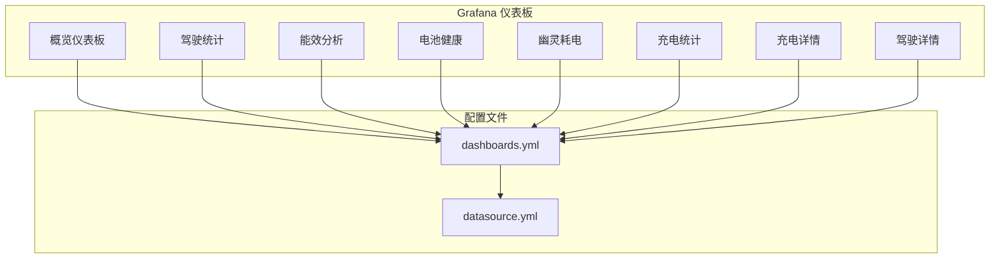
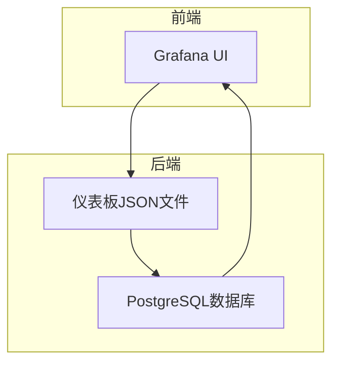
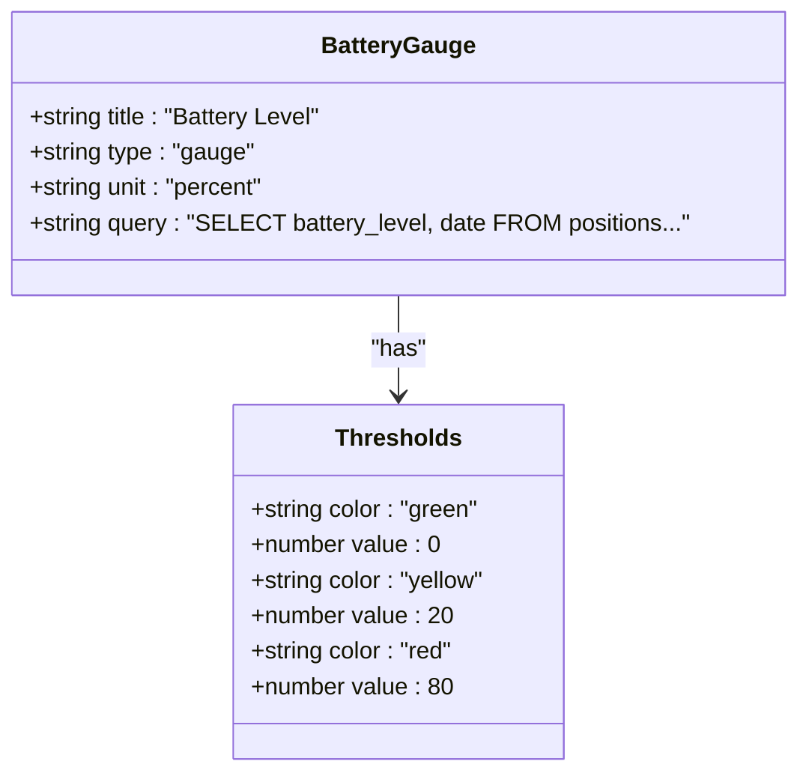
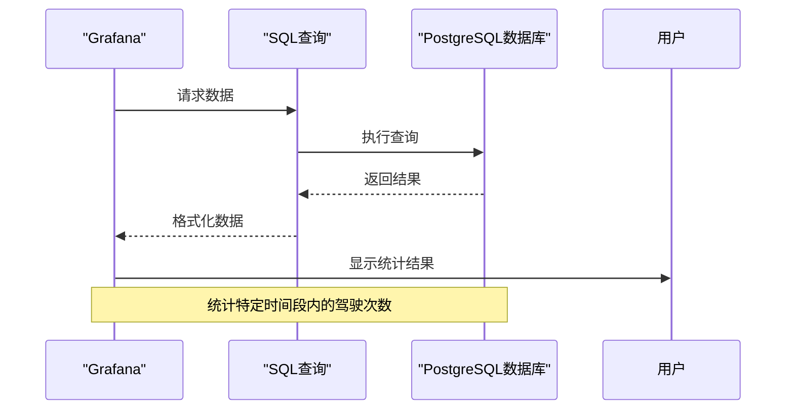
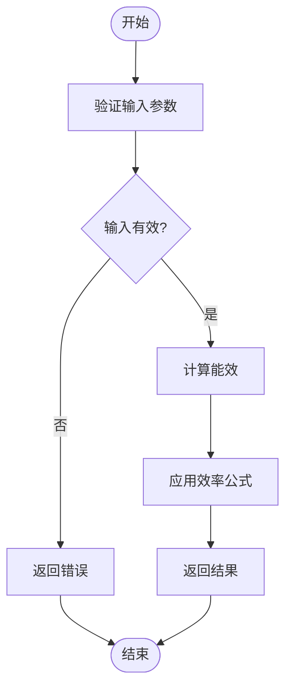
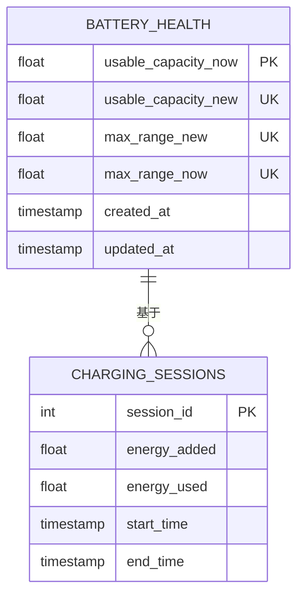
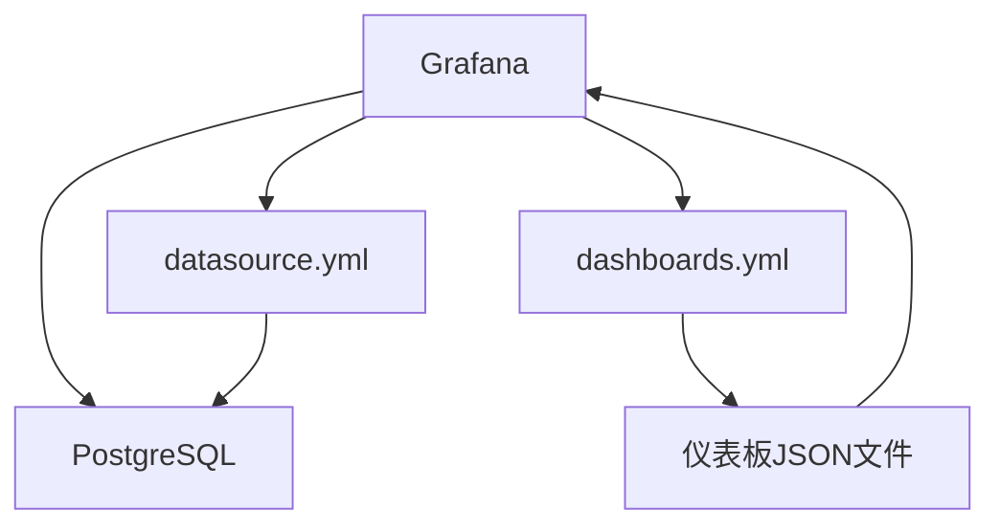

# 自定义仪表板

<cite>
**本文档引用的文件**   
- [overview.json](file://grafana/dashboards/overview.json)
- [drive-stats.json](file://grafana/dashboards/drive-stats.json)
- [efficiency.json](file://grafana/dashboards/efficiency.json)
- [battery-health.json](file://grafana/dashboards/battery-health.json)
- [vampire-drain.json](file://grafana/dashboards/vampire-drain.json)
- [charges.json](file://grafana/dashboards/charges.json)
- [charge-level.json](file://grafana/dashboards/charge-level.json)
- [charge-details.json](file://grafana/dashboards/internal/charge-details.json)
- [drive-details.json](file://grafana/dashboards/internal/drive-details.json)
- [dashboards.yml](file://grafana/dashboards.yml)
- [datasource.yml](file://grafana/datasource.yml)
</cite>

## 目录
1. [简介](#简介)
2. [项目结构](#项目结构)
3. [核心组件](#核心组件)
4. [架构概述](#架构概述)
5. [详细组件分析](#详细组件分析)
6. [依赖分析](#依赖分析)
7. [性能考虑](#性能考虑)
8. [故障排除指南](#故障排除指南)
9. [结论](#结论)

## 简介
本文档全面介绍TeslaMate提供的预置Grafana仪表板及其JSON配置结构。文档涵盖概览、驾驶、充电、电池健康、能效分析、幽灵耗电等核心视图，解释关键指标的计算逻辑，并指导用户如何基于现有模板创建自定义仪表板。

## 项目结构
TeslaMate项目的Grafana仪表板文件位于`grafana/dashboards/`目录下，包含多个预置仪表板JSON文件。这些文件通过`dashboards.yml`配置文件进行管理，并使用`datasource.yml`定义PostgreSQL数据源。仪表板文件按功能分类，包括常规仪表板、内部仪表板和报告仪表板。

**Diagram sources**
- [dashboards.yml](file://grafana/dashboards.yml)
- [datasource.yml](file://grafana/datasource.yml)

**Section sources**
- [dashboards.yml](file://grafana/dashboards.yml)
- [datasource.yml](file://grafana/datasource.yml)

## 核心组件
TeslaMate的Grafana仪表板系统由多个核心组件构成，包括预置仪表板、数据源配置和变量系统。这些组件共同工作，为用户提供全面的车辆数据分析功能。

**Section sources**
- [overview.json](file://grafana/dashboards/overview.json)
- [battery-health.json](file://grafana/dashboards/battery-health.json)
- [vampire-drain.json](file://grafana/dashboards/vampire-drain.json)

## 架构概述
TeslaMate的仪表板架构基于Grafana平台，使用PostgreSQL作为数据存储。系统通过预置的JSON仪表板文件展示车辆数据，这些文件包含面板配置、查询语句和可视化设置。

**Diagram sources**
- [overview.json](file://grafana/dashboards/overview.json)
- [datasource.yml](file://grafana/datasource.yml)

## 详细组件分析

### 概览仪表板分析
概览仪表板提供车辆的综合信息，包括电池电量、充电电压、充电功率和充电水平等关键指标。

#### 电池电量面板

**Diagram sources**
- [overview.json](file://grafana/dashboards/overview.json)

### 驾驶统计分析
驾驶统计仪表板提供驾驶相关的详细数据，包括驾驶次数、行驶距离和能量消耗等。

#### 驾驶次数统计

**Diagram sources**
- [drive-stats.json](file://grafana/dashboards/drive-stats.json)

### 能效分析
能效分析仪表板专注于车辆的能源效率，提供净消耗、总距离和温度对效率影响的详细分析。

#### 能效计算逻辑

**Diagram sources**
- [efficiency.json](file://grafana/dashboards/efficiency.json)

### 电池健康分析
电池健康仪表板提供电池容量、范围和健康状况的详细分析，帮助用户监控电池的长期性能。

#### 电池健康度量

**Diagram sources**
- [battery-health.json](file://grafana/dashboards/battery-health.json)

### 幽灵耗电分析
幽灵耗电仪表板专门用于分析车辆在停放期间的电量消耗，帮助用户识别潜在的电量流失问题。

#### 幽灵耗电检测流程

**Diagram sources**
- [vampire-drain.json](file://grafana/dashboards/vampire-drain.json)

## 依赖分析
TeslaMate的仪表板系统依赖于多个组件，包括Grafana、PostgreSQL数据库和特定的配置文件。

**Diagram sources**
- [dashboards.yml](file://grafana/dashboards.yml)
- [datasource.yml](file://grafana/datasource.yml)

**Section sources**
- [dashboards.yml](file://grafana/dashboards.yml)
- [datasource.yml](file://grafana/datasource.yml)

## 性能考虑
为了确保仪表板的性能，建议合理设置时间范围、使用适当的数据采样率，并避免过度复杂的查询。

## 故障排除指南
当遇到仪表板显示问题时，应检查数据源配置、查询语句和变量设置是否正确。

**Section sources**
- [datasource.yml](file://grafana/datasource.yml)
- [overview.json](file://grafana/dashboards/overview.json)

## 结论
TeslaMate提供的预置Grafana仪表板为用户提供了全面的车辆数据分析功能。通过理解这些仪表板的结构和配置，用户可以创建自定义的仪表板来满足特定的分析需求。