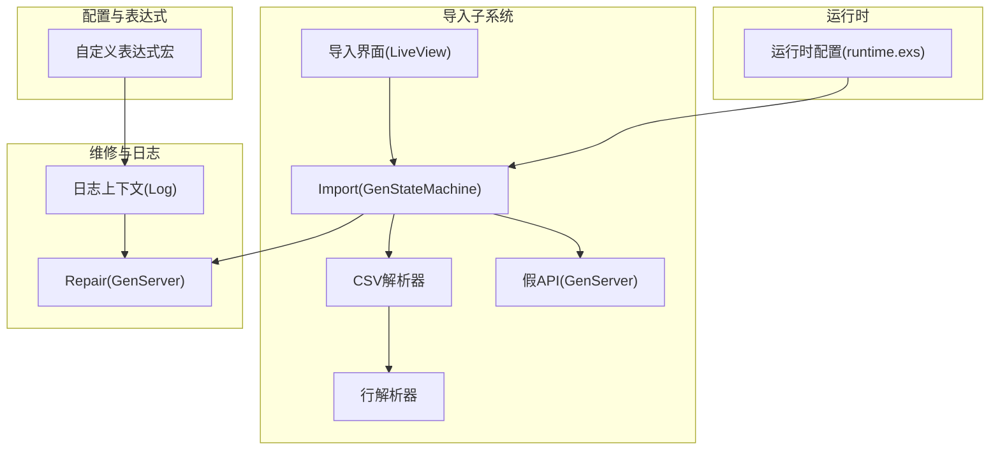
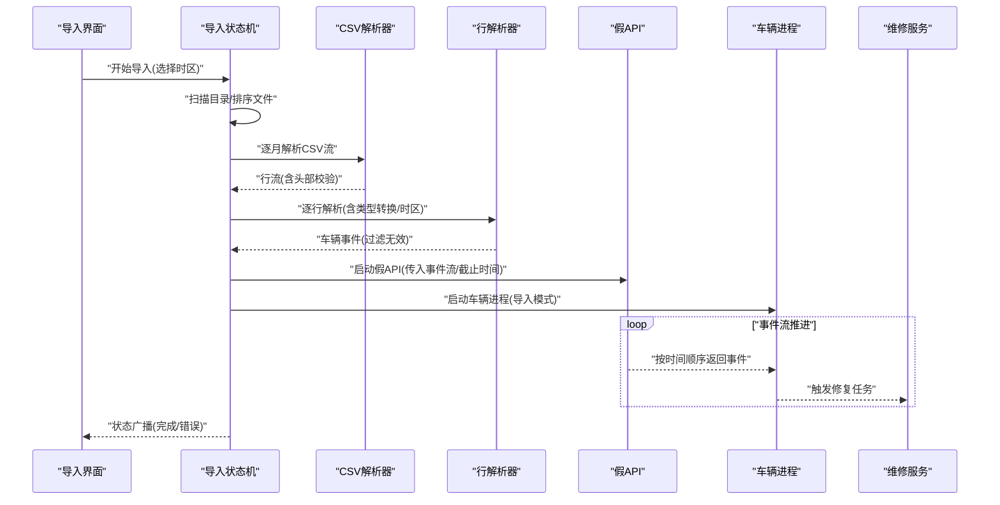
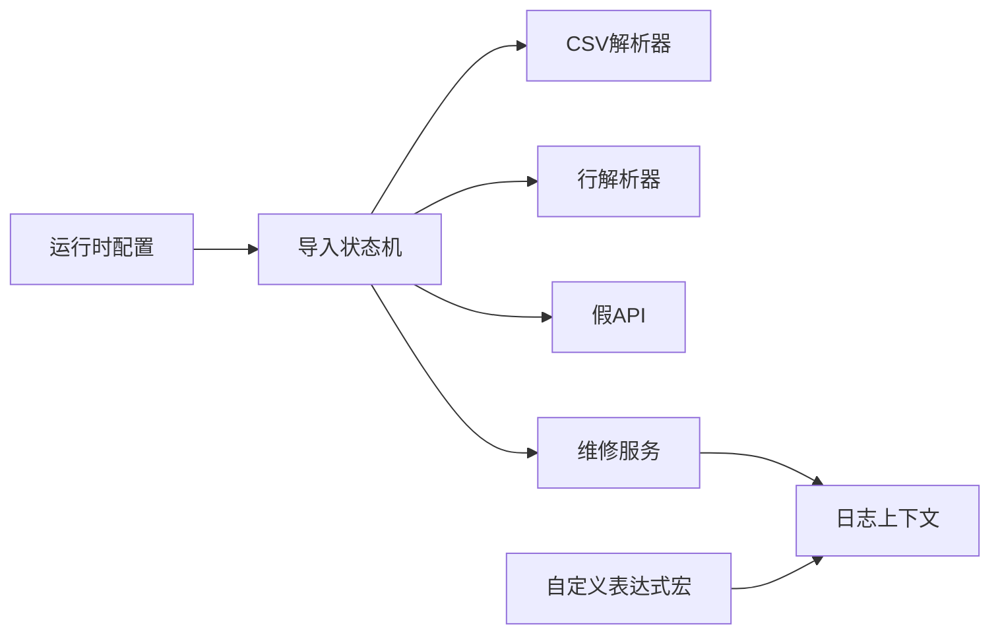

# 高级功能

<cite>
**本文引用的文件**
- [lib/teslamate/import.ex](file://lib/teslamate/import.ex)
- [lib/teslamate/import/csv.ex](file://lib/teslamate/import/csv.ex)
- [lib/teslamate/import/line_parser.ex](file://lib/teslamate/import/line_parser.ex)
- [lib/teslamate/import/fake_api.ex](file://lib/teslamate/import/fake_api.ex)
- [lib/teslamate/custom_expressions.ex](file://lib/teslamate/custom_expressions.ex)
- [lib/teslamate/repair.ex](file://lib/teslamate/repair.ex)
- [lib/teslamate/log.ex](file://lib/teslamate/log.ex)
- [lib/teslamate_web/live/import_live/index.ex](file://lib/teslamate_web/live/import_live/index.ex)
- [website/docs/import/teslafi.md](file://website/docs/import/teslafi.md)
- [website/docs/maintenance/manually_fixing_data.mdx](file://website/docs/maintenance/manually_fixing_data.mdx)
- [config/runtime.exs](file://config/runtime.exs)
- [test/teslamate/import_test.exs](file://test/teslamate/import_test.exs)
- [test/support/mocks/api.ex](file://test/support/mocks/api.ex)
</cite>

## 目录
1. [简介](#简介)
2. [项目结构](#项目结构)
3. [核心组件](#核心组件)
4. [架构总览](#架构总览)
5. [详细组件分析](#详细组件分析)
6. [依赖关系分析](#依赖关系分析)
7. [性能考量](#性能考量)
8. [故障排查指南](#故障排查指南)
9. [结论](#结论)
10. [附录](#附录)

## 简介
本高级功能文档聚焦于数据导入与自定义配置两大主题：
- 数据导入：CSV文件导入流程、文件格式要求、解析规则与错误处理；从TeslaFi等外部数据源迁移数据；测试环境中的假API实现及其用途；导入后数据修复与手动调整建议。
- 自定义配置：高级配置技巧，包括自定义计算字段与数据转换规则，以满足报表与分析需求。

## 项目结构
围绕导入与配置的关键模块分布如下：
- 导入子系统：导入状态机、CSV解析器、行解析器、假API服务、导入界面。
- 配置与表达式：自定义Ecto查询表达式宏，支持在查询层进行条件判断、时长计算、数值四舍五入、地理围栏判定与距离计算。
- 维修与日志：导入完成后触发的地址补全与状态修复逻辑，以及日志上下文中的状态管理与位置处理。
- 运行时配置：导入目录检测与选择、MQTT、数据库连接、网络绑定等运行时参数。
- 文档与测试：导入TeslaFi的使用说明、手动修复数据的操作指引、导入行为的单元测试与假API模拟。

图表来源
- [lib/teslamate/import.ex](file://lib/teslamate/import.ex#L1-L302)
- [lib/teslamate/import/csv.ex](file://lib/teslamate/import/csv.ex#L1-L31)
- [lib/teslamate/import/line_parser.ex](file://lib/teslamate/import/line_parser.ex#L1-L135)
- [lib/teslamate/import/fake_api.ex](file://lib/teslamate/import/fake_api.ex#L1-L179)
- [lib/teslamate/custom_expressions.ex](file://lib/teslamate/custom_expressions.ex#L1-L93)
- [lib/teslamate/repair.ex](file://lib/teslamate/repair.ex#L1-L153)
- [lib/teslamate/log.ex](file://lib/teslamate/log.ex#L1-L200)
- [config/runtime.exs](file://config/runtime.exs#L1-L190)

章节来源
- [lib/teslamate/import.ex](file://lib/teslamate/import.ex#L1-L302)
- [lib/teslamate_web/live/import_live/index.ex](file://lib/teslamate_web/live/import_live/index.ex#L1-L81)
- [config/runtime.exs](file://config/runtime.exs#L1-L190)

## 核心组件
- 导入状态机（Import）：负责扫描导入目录、按月文件排序、创建事件流、创建车辆记录、启动假API与车辆进程、广播状态、处理完成与错误事件。
- CSV解析器（CSV）：基于NimbleCSV定义分隔符与转义规则，读取首两行以判断分隔符与内容有效性，生成键值映射行流。
- 行解析器（LineParser）：将CSV行映射到TeslaApi.Vehicle各子状态结构，统一时间戳、布尔值、整数/浮点转换，并处理日期格式与时区转换。
- 假API（FakeApi）：作为导入期间的“车辆API”代理，按时间顺序产出事件，支持分块缓存、延迟拉取、截止时间控制与异常传播。
- 自定义表达式（CustomExpressions）：提供Ecto查询层的条件表达式、时长计算、空值处理、数值四舍五入、地理围栏判定与距离计算宏。
- 维修（Repair）：导入完成后周期性或显式触发，为缺失地址的行程与充电过程补全地址，同时处理地理编码失败与熔断保护。
- 日志上下文（Log）：提供状态起止、当前状态、位置插入、海拔查询等能力，配合导入流程完成状态完整性与数据修复。

章节来源
- [lib/teslamate/import.ex](file://lib/teslamate/import.ex#L1-L302)
- [lib/teslamate/import/csv.ex](file://lib/teslamate/import/csv.ex#L1-L31)
- [lib/teslamate/import/line_parser.ex](file://lib/teslamate/import/line_parser.ex#L1-L135)
- [lib/teslamate/import/fake_api.ex](file://lib/teslamate/import/fake_api.ex#L1-L179)
- [lib/teslamate/custom_expressions.ex](file://lib/teslamate/custom_expressions.ex#L1-L93)
- [lib/teslamate/repair.ex](file://lib/teslamate/repair.ex#L1-L153)
- [lib/teslamate/log.ex](file://lib/teslamate/log.ex#L1-L200)

## 架构总览
导入流程由前端界面触发，导入状态机扫描指定目录下的CSV文件（支持TeslaFi命名约定），逐月解析并过滤无效行，通过假API以事件流形式驱动车辆进程，最终完成状态切换与数据修复。

图表来源
- [lib/teslamate_web/live/import_live/index.ex](file://lib/teslamate_web/live/import_live/index.ex#L1-L81)
- [lib/teslamate/import.ex](file://lib/teslamate/import.ex#L1-L302)
- [lib/teslamate/import/csv.ex](file://lib/teslamate/import/csv.ex#L1-L31)
- [lib/teslamate/import/line_parser.ex](file://lib/teslamate/import/line_parser.ex#L1-L135)
- [lib/teslamate/import/fake_api.ex](file://lib/teslamate/import/fake_api.ex#L1-L179)
- [lib/teslamate/repair.ex](file://lib/teslamate/repair.ex#L1-L153)

## 详细组件分析

### CSV数据导入流程与规则
- 文件格式与命名
  - 支持标准TeslaFi命名：TeslaFi<月><年>.csv 或 <月><年>.csv（两位月/四位年）。
  - 导入目录可通过环境变量配置，默认路径为“import”，运行时会自动检测该目录是否存在且包含有效文件名。
- 分隔符与内容校验
  - 使用NimbleCSV解析，若首两行仅包含一个字段则视为不支持的分隔符；无内容或仅有表头则标记为无内容错误。
- 解析与过滤
  - 按行构建键值映射，再映射到TeslaApi.Vehicle的各状态结构。
  - 过滤掉未知状态、缺少经纬度的在线驾驶事件，以及跨车数据（当发现VIN/VID/EID不一致时抛出异常并终止）。
- 时间与时区
  - 行解析器支持多种日期格式，解析后按所选时区转换为毫秒时间戳。
  - 导入状态机在启动时接收用户选择的时区，用于正确转换原始本地时间。
- 错误处理
  - 文件系统错误、解析异常、跨车数据、无效地理位置等均会被捕获并上报为错误状态。
  - 导入完成后会触发修复任务，尝试补全缺失地址与状态。

章节来源
- [lib/teslamate/import/csv.ex](file://lib/teslamate/import/csv.ex#L1-L31)
- [lib/teslamate/import/line_parser.ex](file://lib/teslamate/import/line_parser.ex#L1-L135)
- [lib/teslamate/import.ex](file://lib/teslamate/import.ex#L1-L302)
- [config/runtime.exs](file://config/runtime.exs#L180-L188)
- [website/docs/import/teslafi.md](file://website/docs/import/teslafi.md#L201-L235)

### 从TeslaFi迁移数据
- 准备工作
  - 在TeslaFi导出单辆车的CSV（按月），文件命名为TeslaFi<月><年>.csv。
  - 将CSV放入导入目录（默认./import），或通过环境变量自定义路径。
- 执行导入
  - 启动服务并在管理界面选择本地时区后开始导入；导入可能耗时较长，取决于数据量。
  - 导入完成后清空导入目录并重启服务，避免重复导入。
- 注意事项
  - 若存在与现有数据重叠的时间段，仅导入早于已有数据的部分。
  - 若CSV缺少车辆ID，将默认使用1；可通过环境变量覆盖。
  - 地址与高程信息会在导入后逐步补全，可能需要一段时间才可见。

章节来源
- [website/docs/import/teslafi.md](file://website/docs/import/teslafi.md#L1-L235)

### 测试环境中的假API实现
- 目的
  - 在测试中模拟车辆API行为，按事件序列返回数据，便于验证导入流程与状态机行为。
- 实现要点
  - 提供GenServer接口，支持获取车辆与状态、订阅流等调用。
  - 事件按时间顺序返回，支持延迟队列与截止时间控制。
  - 可通过Mock在测试中注入事件序列，验证导入状态变化与错误分支。

章节来源
- [test/support/mocks/api.ex](file://test/support/mocks/api.ex#L1-L56)
- [test/teslamate/import_test.exs](file://test/teslamate/import_test.exs#L1-L569)

### 数据修复与手动调整
- 自动修复
  - 导入完成后触发修复服务，为缺失地址的行程与充电过程补全地址；对地理编码失败采用熔断策略，避免频繁失败影响性能。
- 手动修复
  - 可通过命令行或数据库直接删除/关闭不正确的行程或充电过程。
  - 可通过维护脚本或SQL清理特定车辆或数据集。
  - 如需重建索引，可执行数据库REINDEX以缓解索引膨胀导致的性能问题。

章节来源
- [lib/teslamate/repair.ex](file://lib/teslamate/repair.ex#L1-L153)
- [lib/teslamate/log.ex](file://lib/teslamate/log.ex#L1-L200)
- [website/docs/maintenance/manually_fixing_data.mdx](file://website/docs/maintenance/manually_fixing_data.mdx#L1-L216)

### 高级配置技巧：自定义计算字段与数据转换规则
- 自定义表达式宏
  - 条件表达式：在查询中根据条件返回不同结果。
  - 时长计算：计算两个时间戳之间的分钟数。
  - 空值处理：对NULL进行安全处理。
  - 数值四舍五入：对浮点数按精度四舍五入。
  - 地理围栏判定：判断位置是否在给定围栏内。
  - 距离计算：计算两点间地球表面距离。
- 使用场景
  - 在Grafana仪表盘中通过“计算字段”进行二次加工，例如能耗成本、里程成本、超支比例等。
  - 在查询层直接进行聚合与转换，减少应用层负担。

章节来源
- [lib/teslamate/custom_expressions.ex](file://lib/teslamate/custom_expressions.ex#L1-L93)

## 依赖关系分析
- 导入状态机依赖CSV解析器与行解析器，通过事件流驱动假API与车辆进程。
- 假API依赖事件流与截止时间，向车辆进程提供有序事件。
- 维修服务依赖日志上下文与地理编码服务，用于地址补全。
- 运行时配置决定导入目录、网络绑定、MQTT与数据库连接等全局参数。

图表来源
- [lib/teslamate/import.ex](file://lib/teslamate/import.ex#L1-L302)
- [lib/teslamate/import/csv.ex](file://lib/teslamate/import/csv.ex#L1-L31)
- [lib/teslamate/import/line_parser.ex](file://lib/teslamate/import/line_parser.ex#L1-L135)
- [lib/teslamate/import/fake_api.ex](file://lib/teslamate/import/fake_api.ex#L1-L179)
- [lib/teslamate/repair.ex](file://lib/teslamate/repair.ex#L1-L153)
- [lib/teslamate/log.ex](file://lib/teslamate/log.ex#L1-L200)
- [lib/teslamate/custom_expressions.ex](file://lib/teslamate/custom_expressions.ex#L1-L93)
- [config/runtime.exs](file://config/runtime.exs#L1-L190)

## 性能考量
- 导入性能
  - 大批量CSV解析与事件流推进可能占用CPU与内存，建议在低负载时段执行。
  - 导入完成后触发的修复任务会进行地理编码，建议合理设置熔断与重试策略。
- 数据库性能
  - 导入与删除操作可能导致索引膨胀，必要时执行REINDEX以恢复性能。
- 网络与外部服务
  - 地理编码服务存在失败风险，应启用熔断与降级策略，避免阻塞主流程。

[本节为通用建议，无需列出具体文件来源]

## 故障排查指南
- 导入状态异常
  - 检查导入目录是否存在有效文件名；确认时区选择正确；查看导入状态广播消息。
- 跨车数据冲突
  - 当CSV包含多辆车数据时会报错并终止，请确保仅导入单辆车数据。
- 地理位置无效
  - 行解析器会忽略无效经纬度；导入完成后可通过修复服务补全地址。
- 地理编码失败
  - 修复服务对失败进行熔断保护，稍后重试；可在网络稳定后再触发修复。
- 手动修复
  - 使用提供的命令或SQL删除/关闭不正确记录；必要时清理车辆或重建索引。

章节来源
- [lib/teslamate/import.ex](file://lib/teslamate/import.ex#L1-L302)
- [lib/teslamate/repair.ex](file://lib/teslamate/repair.ex#L1-L153)
- [website/docs/maintenance/manually_fixing_data.mdx](file://website/docs/maintenance/manually_fixing_data.mdx#L1-L216)

## 结论
本高级功能文档梳理了从TeslaFi导入CSV数据的完整流程、解析规则与错误处理机制，并介绍了测试环境中的假API实现、导入后的自动与手动修复方案，以及通过自定义表达式在查询层实现复杂计算与转换的技巧。结合运行时配置与性能优化建议，可帮助用户在生产环境中稳定、高效地完成数据迁移与分析。

[本节为总结性内容，无需列出具体文件来源]

## 附录
- 导入目录与环境变量
  - 默认导入目录为“import”，可通过环境变量自定义；运行时会自动检测并进入导入模式。
- 导入界面交互
  - 用户在界面选择时区后启动导入，状态通过Phoenix PubSub广播，实时更新进度与完成状态。

章节来源
- [config/runtime.exs](file://config/runtime.exs#L180-L188)
- [lib/teslamate_web/live/import_live/index.ex](file://lib/teslamate_web/live/import_live/index.ex#L1-L81)